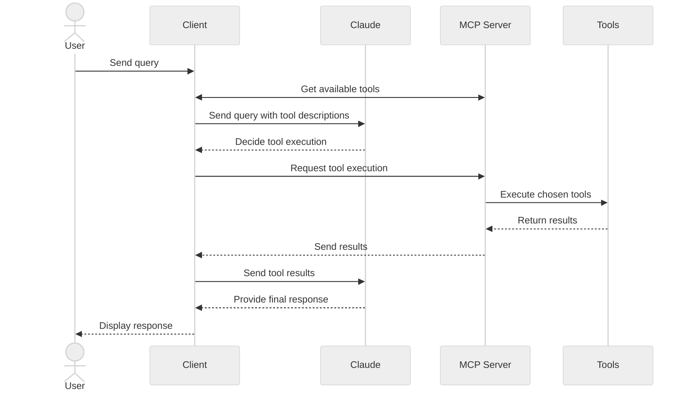

In this tutorial, you'll learn how to build an LLM-powered chatbot client that connects to MCP servers.

Before you begin, it helps to have gone through our [Build an MCP Server](/docs/develop/build-server) tutorial so you can understand how clients and servers communicate.

<Tabs>
<Tab title="Python">

[You can find the complete code for this tutorial here.](https://github.com/modelcontextprotocol/quickstart-resources/tree/main/mcp-client-python)

## System Requirements

Before starting, ensure your system meets these requirements:

- Mac or Windows computer
- Latest Python version installed
- Latest version of `uv` installed

## Setting Up Your Environment

First, create a new Python project with `uv`:

<CodeGroup>

```bash macOS/Linux
# Create project directory
uv init mcp-client
cd mcp-client

# Create virtual environment
uv venv

# Activate virtual environment
source .venv/bin/activate

# Install required packages
uv add mcp anthropic python-dotenv

# Remove boilerplate files
rm main.py

# Create our main file
touch client.py
```

```powershell Windows
# Create project directory
uv init mcp-client
cd mcp-client

# Create virtual environment
uv venv

# Activate virtual environment
.venv\Scripts\activate

# Install required packages
uv add mcp anthropic python-dotenv

# Remove boilerplate files
del main.py

# Create our main file
new-item client.py
```

</CodeGroup>

## Setting Up Your API Key

You'll need an Anthropic API key from the [Anthropic Console](https://console.anthropic.com/settings/keys).

Create a `.env` file to store it:

```bash
echo "ANTHROPIC_API_KEY=your-api-key-goes-here" > .env
```

Add `.env` to your `.gitignore`:

```bash
echo ".env" >> .gitignore
```

<Warning>

Make sure you keep your `ANTHROPIC_API_KEY` secure!

</Warning>

## Creating the Client

### Basic Client Structure

First, let's set up our imports and create the basic client class:

```python
import asyncio
from typing import Optional
from contextlib import AsyncExitStack

from mcp import ClientSession, StdioServerParameters
from mcp.client.stdio import stdio_client

from anthropic import Anthropic
from dotenv import load_dotenv

load_dotenv()  # load environment variables from .env

class MCPClient:
    def __init__(self):
        # Initialize session and client objects
        self.session: Optional[ClientSession] = None
        self.exit_stack = AsyncExitStack()
        self.anthropic = Anthropic()
    # methods will go here
```

### Server Connection Management

Next, we'll implement the method to connect to an MCP server:

```python
async def connect_to_server(self, server_script_path: str):
    """Connect to an MCP server

    Args:
        server_script_path: Path to the server script (.py or .js)
    """
    is_python = server_script_path.endswith('.py')
    is_js = server_script_path.endswith('.js')
    if not (is_python or is_js):
        raise ValueError("Server script must be a .py or .js file")

    command = "python" if is_python else "node"
    server_params = StdioServerParameters(
        command=command,
        args=[server_script_path],
        env=None
    )

    stdio_transport = await self.exit_stack.enter_async_context(stdio_client(server_params))
    self.stdio, self.write = stdio_transport
    self.session = await self.exit_stack.enter_async_context(ClientSession(self.stdio, self.write))

    await self.session.initialize()

    # List available tools
    response = await self.session.list_tools()
    tools = response.tools
    print("\nConnected to server with tools:", [tool.name for tool in tools])
```

### Query Processing Logic

Now let's add the core functionality for processing queries and handling tool calls:

```python
async def process_query(self, query: str) -> str:
    """Process a query using Claude and available tools"""
    messages = [
        {
            "role": "user",
            "content": query
        }
    ]

    response = await self.session.list_tools()
    available_tools = [{
        "name": tool.name,
        "description": tool.description,
        "input_schema": tool.inputSchema
    } for tool in response.tools]

    # Initial Claude API call
    response = self.anthropic.messages.create(
        model="claude-sonnet-4-20250514",
        max_tokens=1000,
        messages=messages,
        tools=available_tools
    )

    # Process response and handle tool calls
    final_text = []

    assistant_message_content = []
    for content in response.content:
        if content.type == 'text':
            final_text.append(content.text)
            assistant_message_content.append(content)
        elif content.type == 'tool_use':
            tool_name = content.name
            tool_args = content.input

            # Execute tool call
            result = await self.session.call_tool(tool_name, tool_args)
            final_text.append(f"[Calling tool {tool_name} with args {tool_args}]")

            assistant_message_content.append(content)
            messages.append({
                "role": "assistant",
                "content": assistant_message_content
            })
            messages.append({
                "role": "user",
                "content": [
                    {
                        "type": "tool_result",
                        "tool_use_id": content.id,
                        "content": result.content
                    }
                ]
            })

            # Get next response from Claude
            response = self.anthropic.messages.create(
                model="claude-sonnet-4-20250514",
                max_tokens=1000,
                messages=messages,
                tools=available_tools
            )

            final_text.append(response.content[0].text)

    return "\n".join(final_text)
```

### Interactive Chat Interface

Now we'll add the chat loop and cleanup functionality:

```python
async def chat_loop(self):
    """Run an interactive chat loop"""
    print("\nMCP Client Started!")
    print("Type your queries or 'quit' to exit.")

    while True:
        try:
            query = input("\nQuery: ").strip()

            if query.lower() == 'quit':
                break

            response = await self.process_query(query)
            print("\n" + response)

        except Exception as e:
            print(f"\nError: {str(e)}")

async def cleanup(self):
    """Clean up resources"""
    await self.exit_stack.aclose()
```

### Main Entry Point

Finally, we'll add the main execution logic:

```python
async def main():
    if len(sys.argv) < 2:
        print("Usage: python client.py <path_to_server_script>")
        sys.exit(1)

    client = MCPClient()
    try:
        await client.connect_to_server(sys.argv[1])
        await client.chat_loop()
    finally:
        await client.cleanup()

if __name__ == "__main__":
    import sys
    asyncio.run(main())
```

You can find the complete `client.py` file [here](https://github.com/modelcontextprotocol/quickstart-resources/blob/main/mcp-client-python/client.py).

## Key Components Explained

### 1. Client Initialization

- The `MCPClient` class initializes with session management and API clients
- Uses `AsyncExitStack` for proper resource management
- Configures the Anthropic client for Claude interactions

### 2. Server Connection

- Supports both Python and Node.js servers
- Validates server script type
- Sets up proper communication channels
- Initializes the session and lists available tools

### 3. Query Processing

- Maintains conversation context
- Handles Claude's responses and tool calls
- Manages the message flow between Claude and tools
- Combines results into a coherent response

### 4. Interactive Interface

- Provides a simple command-line interface
- Handles user input and displays responses
- Includes basic error handling
- Allows graceful exit

### 5. Resource Management

- Proper cleanup of resources
- Error handling for connection issues
- Graceful shutdown procedures

## Common Customization Points

1. **Tool Handling**
   - Modify `process_query()` to handle specific tool types
   - Add custom error handling for tool calls
   - Implement tool-specific response formatting

2. **Response Processing**
   - Customize how tool results are formatted
   - Add response filtering or transformation
   - Implement custom logging

3. **User Interface**
   - Add a GUI or web interface
   - Implement rich console output
   - Add command history or auto-completion

## Running the Client

To run your client with any MCP server:

```bash
uv run client.py path/to/server.py # python server
uv run client.py path/to/build/index.js # node server
```

<Note>

If you're continuing [the weather tutorial from the server quickstart](https://github.com/modelcontextprotocol/quickstart-resources/tree/main/weather-server-python), your command might look something like this: `python client.py .../quickstart-resources/weather-server-python/weather.py`

</Note>

The client will:

1. Connect to the specified server
2. List available tools
3. Start an interactive chat session where you can:
   - Enter queries
   - See tool executions
   - Get responses from Claude

Here's an example of what it should look like if connected to the weather server from the server quickstart:

<Frame>
  
</Frame>

## How It Works

When you submit a query:

1. The client gets the list of available tools from the server
2. Your query is sent to Claude along with tool descriptions
3. Claude decides which tools (if any) to use
4. The client executes any requested tool calls through the server
5. Results are sent back to Claude
6. Claude provides a natural language response
7. The response is displayed to you

## Best practices

1. **Error Handling**
   - Always wrap tool calls in try-catch blocks
   - Provide meaningful error messages
   - Gracefully handle connection issues

2. **Resource Management**
   - Use `AsyncExitStack` for proper cleanup
   - Close connections when done
   - Handle server disconnections

3. **Security**
   - Store API keys securely in `.env`
   - Validate server responses
   - Be cautious with tool permissions

4. **Tool Names**
   - Tool names can be validated according to the format specified [here](/specification/draft/server/tools#tool-names)
   - If a tool name conforms to the specified format, it should not fail validation by an MCP client

## Troubleshooting

### Server Path Issues

- Double-check the path to your server script is correct
- Use the absolute path if the relative path isn't working
- For Windows users, make sure to use forward slashes (/) or escaped backslashes (\\) in the path
- Verify the server file has the correct extension (.py for Python or .js for Node.js)

Example of correct path usage:

```bash
# Relative path
uv run client.py ./server/weather.py

# Absolute path
uv run client.py /Users/username/projects/mcp-server/weather.py

# Windows path (either format works)
uv run client.py C:/projects/mcp-server/weather.py
uv run client.py C:\\projects\\mcp-server\\weather.py
```

### Response Timing

- The first response might take up to 30 seconds to return
- This is normal and happens while:
  - The server initializes
  - Claude processes the query
  - Tools are being executed
- Subsequent responses are typically faster
- Don't interrupt the process during this initial waiting period

### Common Error Messages

If you see:

- `FileNotFoundError`: Check your server path
- `Connection refused`: Ensure the server is running and the path is correct
- `Tool execution failed`: Verify the tool's required environment variables are set
- `Timeout error`: Consider increasing the timeout in your client configuration

</Tab>

<Tab title="TypeScript">

[You can find the complete code for this tutorial here.](https://github.com/modelcontextprotocol/quickstart-resources/tree/main/mcp-client-typescript)

## System Requirements

Before starting, ensure your system meets these requirements:

- Mac or Windows computer
- Node.js 17 or higher installed
- Latest version of `npm` installed
- Anthropic API key (Claude)

## Setting Up Your Environment

First, let's create and set up our project:

<CodeGroup>

```bash macOS/Linux
# Create project directory
mkdir mcp-client-typescript
cd mcp-client-typescript

# Initialize npm project
npm init -y

# Install dependencies
npm install @anthropic-ai/sdk @modelcontextprotocol/sdk dotenv

# Install dev dependencies
npm install -D @types/node typescript

# Create source file
touch index.ts
```

```powershell Windows
# Create project directory
md mcp-client-typescript
cd mcp-client-typescript

# Initialize npm project
npm init -y

# Install dependencies
npm install @anthropic-ai/sdk @modelcontextprotocol/sdk dotenv

# Install dev dependencies
npm install -D @types/node typescript

# Create source file
new-item index.ts
```

</CodeGroup>

Update your `package.json` to set `type: "module"` and a build script:

```json package.json
{
  "type": "module",
  "scripts": {
    "build": "tsc && chmod 755 build/index.js"
  }
}
```

Create a `tsconfig.json` in the root of your project:

```json tsconfig.json
{
  "compilerOptions": {
    "target": "ES2022",
    "module": "Node16",
    "moduleResolution": "Node16",
    "outDir": "./build",
    "rootDir": "./",
    "strict": true,
    "esModuleInterop": true,
    "skipLibCheck": true,
    "forceConsistentCasingInFileNames": true
  },
  "include": ["index.ts"],
  "exclude": ["node_modules"]
}
```

## Setting Up Your API Key

You'll need an Anthropic API key from the [Anthropic Console](https://console.anthropic.com/settings/keys).

Create a `.env` file to store it:

```bash
echo "ANTHROPIC_API_KEY=<your key here>" > .env
```

Add `.env` to your `.gitignore`:

```bash
echo ".env" >> .gitignore
```

<Warning>

Make sure you keep your `ANTHROPIC_API_KEY` secure!

</Warning>

## Creating the Client

### Basic Client Structure

First, let's set up our imports and create the basic client class in `index.ts`:

```typescript
import { Anthropic } from "@anthropic-ai/sdk";
import {
  MessageParam,
  Tool,
} from "@anthropic-ai/sdk/resources/messages/messages.mjs";
import { Client } from "@modelcontextprotocol/sdk/client/index.js";
import { StdioClientTransport } from "@modelcontextprotocol/sdk/client/stdio.js";
import readline from "readline/promises";
import dotenv from "dotenv";

dotenv.config();

const ANTHROPIC_API_KEY = process.env.ANTHROPIC_API_KEY;
if (!ANTHROPIC_API_KEY) {
  throw new Error("ANTHROPIC_API_KEY is not set");
}

class MCPClient {
  private mcp: Client;
  private anthropic: Anthropic;
  private transport: StdioClientTransport | null = null;
  private tools: Tool[] = [];

  constructor() {
    this.anthropic = new Anthropic({
      apiKey: ANTHROPIC_API_KEY,
    });
    this.mcp = new Client({ name: "mcp-client-cli", version: "1.0.0" });
  }
  // methods will go here
}
```

### Server Connection Management

Next, we'll implement the method to connect to an MCP server:

```typescript
async connectToServer(serverScriptPath: string) {
  try {
    const isJs = serverScriptPath.endsWith(".js");
    const isPy = serverScriptPath.endsWith(".py");
    if (!isJs && !isPy) {
      throw new Error("Server script must be a .js or .py file");
    }
    const command = isPy
      ? process.platform === "win32"
        ? "python"
        : "python3"
      : process.execPath;

    this.transport = new StdioClientTransport({
      command,
      args: [serverScriptPath],
    });
    await this.mcp.connect(this.transport);

    const toolsResult = await this.mcp.listTools();
    this.tools = toolsResult.tools.map((tool) => {
      return {
        name: tool.name,
        description: tool.description,
        input_schema: tool.inputSchema,
      };
    });
    console.log(
      "Connected to server with tools:",
      this.tools.map(({ name }) => name)
    );
  } catch (e) {
    console.log("Failed to connect to MCP server: ", e);
    throw e;
  }
}
```

### Query Processing Logic

Now let's add the core functionality for processing queries and handling tool calls:

```typescript
async processQuery(query: string) {
  const messages: MessageParam[] = [
    {
      role: "user",
      content: query,
    },
  ];

  const response = await this.anthropic.messages.create({
    model: "claude-sonnet-4-20250514",
    max_tokens: 1000,
    messages,
    tools: this.tools,
  });

  const finalText = [];

  for (const content of response.content) {
    if (content.type === "text") {
      finalText.push(content.text);
    } else if (content.type === "tool_use") {
      const toolName = content.name;
      const toolArgs = content.input as { [x: string]: unknown } | undefined;

      const result = await this.mcp.callTool({
        name: toolName,
        arguments: toolArgs,
      });
      finalText.push(
        `[Calling tool ${toolName} with args ${JSON.stringify(toolArgs)}]`
      );

      messages.push({
        role: "user",
        content: result.content as string,
      });

      const response = await this.anthropic.messages.create({
        model: "claude-sonnet-4-20250514",
        max_tokens: 1000,
        messages,
      });

      finalText.push(
        response.content[0].type === "text" ? response.content[0].text : ""
      );
    }
  }

  return finalText.join("\n");
}
```

### Interactive Chat Interface

Now we'll add the chat loop and cleanup functionality:

```typescript
async chatLoop() {
  const rl = readline.createInterface({
    input: process.stdin,
    output: process.stdout,
  });

  try {
    console.log("\nMCP Client Started!");
    console.log("Type your queries or 'quit' to exit.");

    while (true) {
      const message = await rl.question("\nQuery: ");
      if (message.toLowerCase() === "quit") {
        break;
      }
      const response = await this.processQuery(message);
      console.log("\n" + response);
    }
  } finally {
    rl.close();
  }
}

async cleanup() {
  await this.mcp.close();
}
```

### Main Entry Point

Finally, we'll add the main execution logic:

```typescript
async function main() {
  if (process.argv.length < 3) {
    console.log("Usage: node index.ts <path_to_server_script>");
    return;
  }
  const mcpClient = new MCPClient();
  try {
    await mcpClient.connectToServer(process.argv[2]);
    await mcpClient.chatLoop();
  } catch (e) {
    console.error("Error:", e);
    await mcpClient.cleanup();
    process.exit(1);
  } finally {
    await mcpClient.cleanup();
    process.exit(0);
  }
}

main();
```

## Running the Client

To run your client with any MCP server:

```bash
# Build TypeScript
npm run build

# Run the client
node build/index.js path/to/server.py # python server
node build/index.js path/to/build/index.js # node server
```

<Note>

If you're continuing [the weather tutorial from the server quickstart](https://github.com/modelcontextprotocol/quickstart-resources/tree/main/weather-server-typescript), your command might look something like this: `node build/index.js .../quickstart-resources/weather-server-typescript/build/index.js`

</Note>

**The client will:**

1. Connect to the specified server
2. List available tools
3. Start an interactive chat session where you can:
   - Enter queries
   - See tool executions
   - Get responses from Claude

## How It Works

When you submit a query:

1. The client gets the list of available tools from the server
2. Your query is sent to Claude along with tool descriptions
3. Claude decides which tools (if any) to use
4. The client executes any requested tool calls through the server
5. Results are sent back to Claude
6. Claude provides a natural language response
7. The response is displayed to you

## Best practices

1. **Error Handling**
   - Use TypeScript's type system for better error detection
   - Wrap tool calls in try-catch blocks
   - Provide meaningful error messages
   - Gracefully handle connection issues

2. **Security**
   - Store API keys securely in `.env`
   - Validate server responses
   - Be cautious with tool permissions

## Troubleshooting

### Server Path Issues

- Double-check the path to your server script is correct
- Use the absolute path if the relative path isn't working
- For Windows users, make sure to use forward slashes (/) or escaped backslashes (\\) in the path
- Verify the server file has the correct extension (.js for Node.js or .py for Python)

Example of correct path usage:

```bash
# Relative path
node build/index.js ./server/build/index.js

# Absolute path
node build/index.js /Users/username/projects/mcp-server/build/index.js

# Windows path (either format works)
node build/index.js C:/projects/mcp-server/build/index.js
node build/index.js C:\\projects\\mcp-server\\build\\index.js
```

### Response Timing

- The first response might take up to 30 seconds to return
- This is normal and happens while:
  - The server initializes
  - Claude processes the query
  - Tools are being executed
- Subsequent responses are typically faster
- Don't interrupt the process during this initial waiting period

### Common Error Messages

If you see:

- `Error: Cannot find module`: Check your build folder and ensure TypeScript compilation succeeded
- `Connection refused`: Ensure the server is running and the path is correct
- `Tool execution failed`: Verify the tool's required environment variables are set
- `ANTHROPIC_API_KEY is not set`: Check your .env file and environment variables
- `TypeError`: Ensure you're using the correct types for tool arguments
- `BadRequestError`: Ensure you have enough credits to access the Anthropic API

</Tab>

<Tab title="Java">

<Note>

This is a quickstart demo based on Spring AI MCP auto-configuration and boot starters.
To learn how to create sync and async MCP Clients manually, consult the [Java SDK Client](https://java.sdk.modelcontextprotocol.io/) documentation

</Note>

This example demonstrates how to build an interactive chatbot that combines Spring AI's Model Context Protocol (MCP) with the [Brave Search MCP Server](https://github.com/modelcontextprotocol/servers-archived/tree/main/src/brave-search). The application creates a conversational interface powered by Anthropic's Claude AI model that can perform internet searches through Brave Search, enabling natural language interactions with real-time web data.
[You can find the complete code for this tutorial here.](https://github.com/spring-projects/spring-ai-examples/tree/main/model-context-protocol/web-search/brave-chatbot)

## System Requirements

Before starting, ensure your system meets these requirements:

- Java 17 or higher
- Maven 3.6+
- npx package manager
- Anthropic API key (Claude)
- Brave Search API key

## Setting Up Your Environment

1. Install npx (Node Package eXecute):
   First, make sure to install [npm](https://docs.npmjs.com/downloading-and-installing-node-js-and-npm)
   and then run:

   ```bash
   npm install -g npx
   ```

2. Clone the repository:

   ```bash
   git clone https://github.com/spring-projects/spring-ai-examples.git
   cd model-context-protocol/web-search/brave-chatbot
   ```

3. Set up your API keys:

   ```bash
   export ANTHROPIC_API_KEY='your-anthropic-api-key-here'
   export BRAVE_API_KEY='your-brave-api-key-here'
   ```

4. Build the application:

   ```bash
   ./mvnw clean install
   ```

5. Run the application using Maven:
   ```bash
   ./mvnw spring-boot:run
   ```

<Warning>

Make sure you keep your `ANTHROPIC_API_KEY` and `BRAVE_API_KEY` keys secure!

</Warning>

## How it Works

The application integrates Spring AI with the Brave Search MCP server through several components:

### MCP Client Configuration

1. Required dependencies in pom.xml:

```xml
<dependency>
    <groupId>org.springframework.ai</groupId>
    <artifactId>spring-ai-starter-mcp-client</artifactId>
</dependency>
<dependency>
    <groupId>org.springframework.ai</groupId>
    <artifactId>spring-ai-starter-model-anthropic</artifactId>
</dependency>
```

2. Application properties (application.yml):

```yml
spring:
  ai:
    mcp:
      client:
        enabled: true
        name: brave-search-client
        version: 1.0.0
        type: SYNC
        request-timeout: 20s
        stdio:
          root-change-notification: true
          servers-configuration: classpath:/mcp-servers-config.json
        toolcallback:
          enabled: true
    anthropic:
      api-key: ${ANTHROPIC_API_KEY}
```

This activates the `spring-ai-starter-mcp-client` to create one or more `McpClient`s based on the provided server configuration.
The `spring.ai.mcp.client.toolcallback.enabled=true` property enables the tool callback mechanism, that automatically registers all MCP tool as spring ai tools.
It is disabled by default.

3. MCP Server Configuration (`mcp-servers-config.json`):

```json
{
  "mcpServers": {
    "brave-search": {
      "command": "npx",
      "args": ["-y", "@modelcontextprotocol/server-brave-search"],
      "env": {
        "BRAVE_API_KEY": "<PUT YOUR BRAVE API KEY>"
      }
    }
  }
}
```

### Chat Implementation

The chatbot is implemented using Spring AI's ChatClient with MCP tool integration:

```java
var chatClient = chatClientBuilder
    .defaultSystem("You are useful assistant, expert in AI and Java.")
    .defaultToolCallbacks((Object[]) mcpToolAdapter.toolCallbacks())
    .defaultAdvisors(new MessageChatMemoryAdvisor(new InMemoryChatMemory()))
    .build();
```

Key features:

- Uses Claude AI model for natural language understanding
- Integrates Brave Search through MCP for real-time web search capabilities
- Maintains conversation memory using InMemoryChatMemory
- Runs as an interactive command-line application

### Build and run

```bash
./mvnw clean install
java -jar ./target/ai-mcp-brave-chatbot-0.0.1-SNAPSHOT.jar
```

or

```bash
./mvnw spring-boot:run
```

The application will start an interactive chat session where you can ask questions. The chatbot will use Brave Search when it needs to find information from the internet to answer your queries.

The chatbot can:

- Answer questions using its built-in knowledge
- Perform web searches when needed using Brave Search
- Remember context from previous messages in the conversation
- Combine information from multiple sources to provide comprehensive answers

### Advanced Configuration

The MCP client supports additional configuration options:

- Client customization through `McpSyncClientCustomizer` or `McpAsyncClientCustomizer`
- Multiple clients with multiple transport types: `STDIO` and `SSE` (Server-Sent Events)
- Integration with Spring AI's tool execution framework
- Automatic client initialization and lifecycle management

For WebFlux-based applications, you can use the WebFlux starter instead:

```xml
<dependency>
    <groupId>org.springframework.ai</groupId>
    <artifactId>spring-ai-mcp-client-webflux-spring-boot-starter</artifactId>
</dependency>
```

This provides similar functionality but uses a WebFlux-based SSE transport implementation, recommended for production deployments.

</Tab>

<Tab title="Kotlin">

[You can find the complete code for this tutorial here.](https://github.com/modelcontextprotocol/kotlin-sdk/tree/main/samples/kotlin-mcp-client)

## System Requirements

Before starting, ensure your system meets these requirements:

- JDK 11 or higher
- Anthropic API key (Claude)

## Setting up your environment

First, let's install `java` and `gradle` if you haven't already.
You can download `java` from [official Oracle JDK website](https://www.oracle.com/java/technologies/downloads/).
Verify your `java` installation:

```bash
java --version
```

Now, let's create and set up your project:

<CodeGroup>

```bash macOS/Linux
# Create a new directory for our project
mkdir kotlin-mcp-client
cd kotlin-mcp-client

# Initialize a new kotlin project
gradle init
```

```powershell Windows
# Create a new directory for our project
md kotlin-mcp-client
cd kotlin-mcp-client
# Initialize a new kotlin project
gradle init
```

</CodeGroup>

After running `gradle init`, select **Application** as the project type, **Kotlin** as the programming language.

Alternatively, you can create a Kotlin application using the [IntelliJ IDEA project wizard](https://kotlinlang.org/docs/jvm-get-started.html).

After creating the project, replace the contents of your `build.gradle.kts` with:

```kotlin build.gradle.kts
// Check latest versions at https://github.com/modelcontextprotocol/kotlin-sdk/releases
val mcpVersion = "0.9.0"
val ktorVersion = "3.2.3"
val anthropicVersion = "2.15.0"
val slf4jVersion = "2.0.17"

plugins {
    kotlin("jvm") version "2.3.20"
    id("com.gradleup.shadow") version "8.3.9"
    application
}

application {
    mainClass.set("MainKt")
}

dependencies {
    implementation("io.modelcontextprotocol:kotlin-sdk:$mcpVersion")
    implementation("io.ktor:ktor-client-cio:$ktorVersion")
    implementation("com.anthropic:anthropic-java:$anthropicVersion")
    implementation("org.slf4j:slf4j-simple:$slf4jVersion")
}
```

Verify that everything is set up correctly:

```bash
./gradlew build
```

## Setting up your API key

You'll need an Anthropic API key from the [Anthropic Console](https://console.anthropic.com/settings/keys).

Set up your API key:

```bash
export ANTHROPIC_API_KEY='your-anthropic-api-key-here'
```

<Warning>

Make sure you keep your `ANTHROPIC_API_KEY` secure!

</Warning>

## Creating the Client

### Basic Client Structure

First, let's create the basic client class:

```kotlin
class MCPClient(apiKey: String) : AutoCloseable {
    private val anthropic = AnthropicOkHttpClient.builder()
        .apiKey(apiKey)
        .build()

  private val mcp: Client = Client(
        clientInfo = Implementation(name = "mcp-client-cli", version = "1.0.0")
  )
    private var serverProcess: Process? = null
    private lateinit var tools: List<ToolUnion>

    // methods will go here

    override fun close() {
        runBlocking {
            mcp.close()
        }
        serverProcess?.destroy()
        anthropic.close()
    }
}
```

### Server connection management

Next, we'll implement the method to connect to an MCP server:

```kotlin
suspend fun connectToServer(serverScriptPath: String) {
    val command = buildList {
        when (serverScriptPath.substringAfterLast(".")) {
            "js" -> add("node")
            "py" -> add(if (System.getProperty("os.name").lowercase().contains("win")) "python" else "python3")
            "jar" -> addAll(listOf("java", "-jar"))
            else -> throw IllegalArgumentException("Server script must be a .js, .py or .jar file")
        }
        add(serverScriptPath)
    }

    val process = ProcessBuilder(command).start()
    serverProcess = process

    val transport = StdioClientTransport(
        input = process.inputStream.asSource().buffered(),
        output = process.outputStream.asSink().buffered(),
    )

    mcp.connect(transport)

    val toolsResult = mcp.listTools()
    tools = toolsResult.tools.map { tool ->
        ToolUnion.ofTool(
            Tool.builder()
                .name(tool.name)
                .description(tool.description ?: "")
                .inputSchema(
                    Tool.InputSchema.builder()
                        .type(JsonValue.from(tool.inputSchema.type))
                        .properties(tool.inputSchema.properties?.toJsonValue() ?: EmptyJsonObject.toJsonValue())
                        .putAdditionalProperty("required", JsonValue.from(tool.inputSchema.required))
                        .build(),
                )
                .build(),
        )
    }
    println("Connected to server with tools: ${tools.joinToString(", ") { it.tool().get().name() }}")
}
```

<Accordion title="JsonObject.toJsonValue() helper">

This helper converts a kotlinx.serialization `JsonObject` to an Anthropic SDK `JsonValue` using Jackson:

```kotlin
private fun JsonObject.toJsonValue(): JsonValue {
    val mapper = ObjectMapper()
    val node = mapper.readTree(this.toString())
    return JsonValue.fromJsonNode(node)
}
```

</Accordion>

### Query processing logic

Now let's add the core functionality for processing queries and handling tool calls:

```kotlin
suspend fun processQuery(query: String): String {
    val messages = mutableListOf(
        MessageParam.builder()
            .role(MessageParam.Role.USER)
            .content(query)
            .build(),
    )

    val response = anthropic.messages().create(
        MessageCreateParams.builder()
            .model("claude-sonnet-4-20250514")
            .maxTokens(1024)
            .messages(messages)
            .tools(tools)
            .build(),
    )

    val finalText = mutableListOf<String>()
    response.content().forEach { content ->
        when {
            content.isText() -> finalText.add(content.text().get().text())

            content.isToolUse() -> {
                val toolName = content.toolUse().get().name()
                val toolArgs =
                    content.toolUse().get()._input().convert(object : TypeReference<Map<String, JsonValue>>() {})

                val result = mcp.callTool(
                    name = toolName,
                    arguments = toolArgs ?: emptyMap(),
                )
                finalText.add("[Calling tool $toolName with args $toolArgs]")

                messages.add(
                    MessageParam.builder()
                        .role(MessageParam.Role.USER)
                        .content(
                            result.content
                                .filterIsInstance<TextContent>()
                                .joinToString("\n") { it.text }
                        )
                        .build(),
                )

                val aiResponse = anthropic.messages().create(
                    MessageCreateParams.builder()
                        .model("claude-sonnet-4-20250514")
                        .maxTokens(1024)
                        .messages(messages)
                        .build(),
                )

                finalText.add(aiResponse.content().first().text().get().text())
            }
        }
    }

    return finalText.joinToString("\n")
}
```

### Interactive chat

We'll add the chat loop:

```kotlin
suspend fun chatLoop() {
    println("\nMCP Client Started!")
    println("Type your queries or 'quit' to exit.")

    while (true) {
        print("\nQuery: ")
        val message = readlnOrNull() ?: break
        if (message.trim().lowercase() == "quit") break

        try {
            val response = processQuery(message)
            println("\n$response")
        } catch (e: Exception) {
            println("\nError: ${e.message}")
        }
    }
}
```

### Main entry point

Finally, we'll add the main execution function:

```kotlin
fun main(args: Array<String>) = runBlocking {
    require(args.isNotEmpty()) { "Usage: java -jar <path> <path_to_server_script>" }

    val apiKey = System.getenv("ANTHROPIC_API_KEY")
    require(!apiKey.isNullOrBlank()) { "ANTHROPIC_API_KEY environment variable is not set" }

    val client = MCPClient(apiKey)
    client.use {
        client.connectToServer(args.first())
        client.chatLoop()
    }
}
```

## Running the client

To run your client with any MCP server:

```bash
./gradlew build

# Run the client
java -jar build/libs/kotlin-mcp-client-0.1.0-all.jar path/to/server.jar # JVM server
java -jar build/libs/kotlin-mcp-client-0.1.0-all.jar path/to/server.py  # Python server
java -jar build/libs/kotlin-mcp-client-0.1.0-all.jar path/to/build/index.js # Node server
```

Alternatively, you can run directly with Gradle:

```bash
./gradlew run --args="path/to/server.jar"
```

<Note>

If you're continuing the weather tutorial from the server quickstart, your command might look something like this: `java -jar build/libs/kotlin-mcp-client-0.1.0-all.jar .../samples/weather-stdio-server/build/libs/weather-stdio-server-0.1.0-all.jar`

</Note>

**The client will:**

1. Connect to the specified server
2. List available tools
3. Start an interactive chat session where you can:
   - Enter queries
   - See tool executions
   - Get responses from Claude

## How it works

Here's a high-level workflow schema:



When you submit a query:

1. The client gets the list of available tools from the server
2. Your query is sent to Claude along with tool descriptions
3. Claude decides which tools (if any) to use
4. The client executes any requested tool calls through the server
5. Results are sent back to Claude
6. Claude provides a natural language response
7. The response is displayed to you

## Best practices

1. **Error Handling**
   - Leverage Kotlin's type system to model errors explicitly
   - Wrap external tool and API calls in `try-catch` blocks when exceptions are possible
   - Provide clear and meaningful error messages
   - Handle network timeouts and connection issues gracefully

2. **Security**
   - Store API keys and secrets securely in `local.properties`, environment variables, or secret managers
   - Validate all external responses to avoid unexpected or unsafe data usage
   - Be cautious with permissions and trust boundaries when using tools

3. **Environment**
   - Set `ANTHROPIC_API_KEY` through environment variables rather than hardcoding
   - Use `.env` files with appropriate `.gitignore` rules for local development

## Troubleshooting

### Server Path Issues

- Double-check the path to your server script is correct
- Use the absolute path if the relative path isn't working
- For Windows users, make sure to use forward slashes (/) or escaped backslashes (\\) in the path
- Make sure that the required runtime is installed (java for Java, npm for Node.js, or uv for Python)
- Verify the server file has the correct extension (.jar for Java, .js for Node.js or .py for Python)

Example of correct path usage:

```bash
# Relative path
java -jar build/libs/client.jar ./server/build/libs/server.jar

# Absolute path
java -jar build/libs/client.jar /Users/username/projects/mcp-server/build/libs/server.jar

# Windows path (either format works)
java -jar build/libs/client.jar C:/projects/mcp-server/build/libs/server.jar
java -jar build/libs/client.jar C:\\projects\\mcp-server\\build\\libs\\server.jar
```

### Build Issues

- Use `./gradlew build` or `./gradlew shadowJar` (not `./gradlew jar`) to create the shadow JAR with all dependencies
- If you get JDK version errors, ensure your installed JDK version matches or exceeds the `jvmToolchain` setting in `build.gradle.kts`

### Response Timing

- The first response might take up to 30 seconds to return
- This is normal and happens while:
  - The server initializes
  - Claude processes the query
  - Tools are being executed
- Subsequent responses are typically faster
- Don't interrupt the process during this initial waiting period

### Common Error Messages

If you see:

- `Connection refused`: Ensure the server is running and the path is correct
- `Tool execution failed`: Verify the tool's required environment variables are set
- `ANTHROPIC_API_KEY is not set`: Check your environment variables

</Tab>

<Tab title="C#">

[You can find the complete code for this tutorial here.](https://github.com/modelcontextprotocol/csharp-sdk/tree/main/samples/QuickstartClient)

## System Requirements

Before starting, ensure your system meets these requirements:

- .NET 8.0 or higher
- Anthropic API key (Claude)
- Windows, Linux, or macOS

## Setting up your environment

First, create a new .NET project:

```bash
dotnet new console -n QuickstartClient
cd QuickstartClient
```

Then, add the required dependencies to your project:

```bash
dotnet add package ModelContextProtocol --prerelease
dotnet add package Anthropic.SDK
dotnet add package Microsoft.Extensions.Hosting
dotnet add package Microsoft.Extensions.AI
```

## Setting up your API key

You'll need an Anthropic API key from the [Anthropic Console](https://console.anthropic.com/settings/keys).

```bash
dotnet user-secrets init
dotnet user-secrets set "ANTHROPIC_API_KEY" "<your key here>"
```

## Creating the Client

### Basic Client Structure

First, let's setup the basic client class in the file `Program.cs`:

```csharp
using Anthropic.SDK;
using Microsoft.Extensions.AI;
using Microsoft.Extensions.Configuration;
using Microsoft.Extensions.Hosting;
using ModelContextProtocol.Client;
using ModelContextProtocol.Protocol.Transport;

var builder = Host.CreateApplicationBuilder(args);

builder.Configuration
    .AddEnvironmentVariables()
    .AddUserSecrets<Program>();
```

This creates the beginnings of a .NET console application that can read the API key from user secrets.

Next, we'll setup the MCP Client:

```csharp
var (command, arguments) = GetCommandAndArguments(args);

var clientTransport = new StdioClientTransport(new()
{
    Name = "Demo Server",
    Command = command,
    Arguments = arguments,
});

await using var mcpClient = await McpClient.CreateAsync(clientTransport);

var tools = await mcpClient.ListToolsAsync();
foreach (var tool in tools)
{
    Console.WriteLine($"Connected to server with tools: {tool.Name}");
}
```

Add this function at the end of the `Program.cs` file:

```csharp
static (string command, string[] arguments) GetCommandAndArguments(string[] args)
{
    return args switch
    {
        [var script] when script.EndsWith(".py") => ("python", args),
        [var script] when script.EndsWith(".js") => ("node", args),
        [var script] when Directory.Exists(script) || (File.Exists(script) && script.EndsWith(".csproj")) => ("dotnet", ["run", "--project", script, "--no-build"]),
        _ => throw new NotSupportedException("An unsupported server script was provided. Supported scripts are .py, .js, or .csproj")
    };
}
```

This creates an MCP client that will connect to a server that is provided as a command line argument. It then lists the available tools from the connected server.

### Query processing logic

Now let's add the core functionality for processing queries and handling tool calls:

```csharp
using var anthropicClient = new AnthropicClient(new APIAuthentication(builder.Configuration["ANTHROPIC_API_KEY"]))
    .Messages
    .AsBuilder()
    .UseFunctionInvocation()
    .Build();

var options = new ChatOptions
{
    MaxOutputTokens = 1000,
    ModelId = "claude-sonnet-4-20250514",
    Tools = [.. tools]
};

Console.ForegroundColor = ConsoleColor.Green;
Console.WriteLine("MCP Client Started!");
Console.ResetColor();

PromptForInput();
while(Console.ReadLine() is string query && !"exit".Equals(query, StringComparison.OrdinalIgnoreCase))
{
    if (string.IsNullOrWhiteSpace(query))
    {
        PromptForInput();
        continue;
    }

    await foreach (var message in anthropicClient.GetStreamingResponseAsync(query, options))
    {
        Console.Write(message);
    }
    Console.WriteLine();

    PromptForInput();
}

static void PromptForInput()
{
    Console.WriteLine("Enter a command (or 'exit' to quit):");
    Console.ForegroundColor = ConsoleColor.Cyan;
    Console.Write("> ");
    Console.ResetColor();
}
```

## Key Components Explained

### 1. Client Initialization

- The client is initialized using `McpClient.CreateAsync()`, which sets up the transport type and command to run the server.

### 2. Server Connection

- Supports Python, Node.js, and .NET servers.
- The server is started using the command specified in the arguments.
- Configures to use stdio for communication with the server.
- Initializes the session and available tools.

### 3. Query Processing

- Leverages [Microsoft.Extensions.AI](https://learn.microsoft.com/dotnet/ai/ai-extensions) for the chat client.
- Configures the `IChatClient` to use automatic tool (function) invocation.
- The client reads user input and sends it to the server.
- The server processes the query and returns a response.
- The response is displayed to the user.

## Running the Client

To run your client with any MCP server:

```bash
dotnet run -- path/to/server.csproj # dotnet server
dotnet run -- path/to/server.py # python server
dotnet run -- path/to/server.js # node server
```

<Note>

If you're continuing the weather tutorial from the server quickstart, your command might look something like this: `dotnet run -- path/to/QuickstartWeatherServer`.

</Note>

The client will:

1. Connect to the specified server
2. List available tools
3. Start an interactive chat session where you can:
   - Enter queries
   - See tool executions
   - Get responses from Claude
4. Exit the session when done

Here's an example of what it should look like if connected to the weather server quickstart:

<Frame>
  
</Frame>

</Tab>

<Tab title="Ruby">

[You can find the complete code for this tutorial here.](https://github.com/modelcontextprotocol/quickstart-resources/tree/main/mcp-client-ruby)

## System Requirements

Before starting, ensure your system meets these requirements:

- Mac or Windows computer
- Ruby 3.2.0 or higher installed (required by the [Anthropic SDK](https://github.com/anthropics/anthropic-sdk-ruby))
- Anthropic API key (Claude)

## Setting Up Your Environment

First, create a new Ruby project:

<CodeGroup>

```bash macOS/Linux
# Create project directory
mkdir mcp-client
cd mcp-client

# Create a Gemfile
bundle init

# Add required dependencies
bundle add anthropic base64 dotenv mcp

# Create our main file
touch client.rb
```

```powershell Windows
# Create project directory
mkdir mcp-client
cd mcp-client

# Create a Gemfile
bundle init

# Add required dependencies
bundle add anthropic base64 dotenv mcp

# Create our main file
new-item client.rb
```

</CodeGroup>

## Setting Up Your API Key

You'll need an Anthropic API key from the [Anthropic Console](https://console.anthropic.com/settings/keys).

Create a `.env` file to store it:

```bash
echo "ANTHROPIC_API_KEY=your-api-key-goes-here" > .env
```

Add `.env` to your `.gitignore`:

```bash
echo ".env" >> .gitignore
```

<Warning>

Make sure you keep your `ANTHROPIC_API_KEY` secure!

</Warning>

## Creating the Client

### Basic Client Structure

First, let's set up our requires and create the basic client class:

```ruby
require "anthropic"
require "dotenv/load"
require "json"
require "mcp"

class MCPClient
  ANTHROPIC_MODEL = "claude-sonnet-4-20250514"

  def initialize
    @mcp_client = nil
    @transport = nil
    @anthropic_client = nil
  end

  # methods will go here
end
```

### Server Connection Management

Next, we'll implement the method to connect to an MCP server:

```ruby
def connect_to_server(server_script_path)
  command = case File.extname(server_script_path)
  when ".rb"
    "ruby"
  when ".py"
    "python3"
  when ".js"
    "node"
  else
    raise ArgumentError, "Server script must be a .rb, .py, or .js file."
  end

  @transport = MCP::Client::Stdio.new(command: command, args: [server_script_path])
  @mcp_client = MCP::Client.new(transport: @transport)
  @mcp_client.connect

  tool_names = @mcp_client.tools.map(&:name)
  puts "\nConnected to server with tools: #{tool_names}"
end
```

### Query Processing Logic

Now let's add the core functionality for processing queries and handling tool calls:

```ruby
private

def process_query(query)
  messages = [{ role: "user", content: query }]

  available_tools = @mcp_client.tools.map do |tool|
    { name: tool.name, description: tool.description, input_schema: tool.input_schema }
  end

  # Initial Claude API call.
  response = chat(messages, tools: available_tools)

  # Process response and handle tool calls.
  if response.content.any?(Anthropic::Models::ToolUseBlock)
    assistant_content = response.content.filter_map do |content_block|
      case content_block
      when Anthropic::Models::TextBlock
        { type: "text", text: content_block.text }
      when Anthropic::Models::ToolUseBlock
        { type: "tool_use", id: content_block.id, name: content_block.name, input: content_block.input }
      end
    end
    messages << { role: "assistant", content: assistant_content }
  end

  response.content.each_with_object([]) do |content, response_parts|
    case content
    when Anthropic::Models::TextBlock
      response_parts << content.text
    when Anthropic::Models::ToolUseBlock
      # Execute tool call via MCP.
      result = @mcp_client.call_tool(name: content.name, arguments: content.input)
      response_parts << "[Calling tool #{content.name} with args #{content.input.to_json}]"

      tool_result_content = result.dig("result", "content")
      result_text = if tool_result_content.is_a?(Array)
        tool_result_content.filter_map { |content_item| content_item["text"] }.join("\n")
      else
        tool_result_content.to_s
      end

      messages << {
        role: "user",
        content: [{
          type: "tool_result",
          tool_use_id: content.id,
          content: result_text
        }]
      }

      # Get next response from Claude.
      response = chat(messages)

      response.content.each do |content_block|
        response_parts << content_block.text if content_block.is_a?(Anthropic::Models::TextBlock)
      end
    end
  end.join("\n")
end

def chat(messages, tools: nil)
  params = { model: ANTHROPIC_MODEL, max_tokens: 1000, messages: messages }
  params[:tools] = tools if tools

  anthropic_client.messages.create(**params)
end

def anthropic_client
  @anthropic_client ||= Anthropic::Client.new(api_key: ENV["ANTHROPIC_API_KEY"])
end
```

### Interactive Chat Interface

Now we'll add the chat loop and cleanup functionality:

```ruby
def chat_loop
  puts <<~MESSAGE
    MCP Client Started!
    Type your queries or 'quit' to exit.
  MESSAGE

  loop do
    print "\nQuery: "
    line = $stdin.gets
    break if line.nil?

    query = line.chomp.strip
    break if query.downcase == "quit"
    next if query.empty?

    begin
      response = process_query(query)
      puts "\n#{response}"
    rescue => e
      puts "\nError: #{e.message}"
    end
  end
end

def cleanup
  @transport&.close
end
```

### Main Entry Point

Finally, we'll add the main execution logic:

```ruby
if ARGV.empty?
  puts "Usage: ruby client.rb <path_to_server_script>"
  exit 1
end

client = MCPClient.new

begin
  client.connect_to_server(ARGV[0])

  api_key = ENV["ANTHROPIC_API_KEY"]
  if api_key.nil? || api_key.empty?
    puts <<~MESSAGE
      No ANTHROPIC_API_KEY found. To query these tools with Claude, set your API key:
        export ANTHROPIC_API_KEY=your-api-key-here
    MESSAGE
    exit
  end

  client.chat_loop
rescue => e
  puts "Error: #{e.message}"
  exit 1
ensure
  client.cleanup
end
```

You can find the complete `client.rb` file [here](https://github.com/modelcontextprotocol/quickstart-resources/blob/main/mcp-client-ruby/client.rb).

## Key Components Explained

### 1. Client Initialization

- The `MCPClient` class initializes with nil references for lazy setup
- The Anthropic client is lazily initialized via the `anthropic_client` method
- Uses `dotenv` to load environment variables from `.env`

### 2. Server Connection

- Supports Ruby, Python, and Node.js servers
- Uses `File.extname` to determine the server script type
- Uses `MCP::Client::Stdio` for stdio transport
- Initializes the MCP client and lists available tools

### 3. Query Processing

- Maps MCP tools to Anthropic tool format (`name`, `description`, `input_schema`)
- Uses `Anthropic::Models::TextBlock` and `Anthropic::Models::ToolUseBlock` for pattern matching
- Builds assistant content once before iterating tool calls
- Executes tool calls via `@mcp_client.call_tool`
- Uses `chat` helper method to wrap Anthropic API calls
- Extracts tool result content with `result.dig("result", "content")`
- Passes tool results back to Claude for a final response

### 4. Interactive Interface

- Provides a simple command-line interface
- Handles user input and displays responses
- Skips empty queries
- Includes basic error handling

### 5. Resource Management

- Proper cleanup of the transport via `begin`...`ensure`
- Top-level `rescue` for error handling
- API key validation after server connection

## Running the Client

To run your client with any MCP server:

```bash
bundle exec ruby client.rb path/to/server.rb # ruby server
bundle exec ruby client.rb path/to/server.py # python server
bundle exec ruby client.rb path/to/build/index.js # node server
```

<Note>

If you're continuing [the weather tutorial from the server quickstart](https://github.com/modelcontextprotocol/quickstart-resources/tree/main/weather-server-ruby), your command might look something like this: `bundle exec ruby client.rb /path/to/weather-server-ruby/weather.rb`

</Note>

The client will:

1. Connect to the specified server
2. List available tools
3. Start an interactive chat session where you can:
   - Enter queries
   - See tool executions
   - Get responses from Claude

## How It Works

When you submit a query:

1. The client gets the list of available tools from the server
2. Your query is sent to Claude along with tool descriptions
3. Claude decides which tools (if any) to use
4. The client executes any requested tool calls through the server
5. Results are sent back to Claude
6. Claude provides a natural language response
7. The response is displayed to you

## Best practices

1. **Error Handling**
   - Wrap tool calls in `begin`...`rescue` blocks
   - Provide meaningful error messages
   - Gracefully handle connection issues

2. **Resource Management**
   - Always close the transport when done
   - Use `begin`...`ensure` for proper cleanup
   - Handle server disconnections

3. **Security**
   - Store API keys securely in `.env`
   - Validate server responses
   - Be cautious with tool permissions

4. **Tool Names**
   - Tool names can be validated according to the format specified [here](/specification/draft/server/tools#tool-names)
   - If a tool name conforms to the specified format, it should not fail validation by an MCP client

## Troubleshooting

### Server Path Issues

- Double-check the path to your server script is correct
- Use the absolute path if the relative path isn't working
- For Windows users, make sure to use forward slashes (/) or escaped backslashes (\\) in the path
- Verify the server file has the correct extension (.py for Python, .js for Node.js, or .rb for Ruby)

Example of correct path usage:

```bash
# Relative path
bundle exec ruby client.rb ./server/weather.rb

# Absolute path
bundle exec ruby client.rb /Users/username/projects/mcp-server/weather.rb

# Windows path (either format works)
bundle exec ruby client.rb C:/projects/mcp-server/weather.rb
bundle exec ruby client.rb C:\\projects\\mcp-server\\weather.rb
```

### Response Timing

- The first response might take up to 30 seconds to return
- This is normal and happens while:
  - The server initializes
  - Claude processes the query
  - Tools are being executed
- Subsequent responses are typically faster
- Don't interrupt the process during this initial waiting period

### Common Error Messages

If you see:

- `Errno::ENOENT`: Check your server path and ensure the command (`ruby`, `python3`, `node`) is available
- `Connection refused`: Ensure the server is running and the path is correct
- `Tool execution failed`: Verify the tool's required environment variables are set
- `Anthropic::Errors::AuthenticationError`: Check your `.env` file has a valid `ANTHROPIC_API_KEY`

</Tab>

<Tab title="Rust">

[You can find the complete code for this tutorial here.](https://github.com/modelcontextprotocol/quickstart-resources/tree/main/mcp-client-rust)

## System Requirements

Before starting, ensure your Linux system meets these requirements:

- Latest stable version of [Rust and Cargo](https://www.rust-lang.org/tools/install)
- Anthropic API key (Claude)
- A Python, Node.js, or executable MCP server to connect to

## Setting Up Your Environment

First, create a new Rust project:

```bash
cargo new mcp-client-rust
cd mcp-client-rust
```

Replace the contents of `Cargo.toml` with the following:

```toml Cargo.toml
[package]
name = "mcp-client-rust"
version = "0.1.0"
edition = "2024"

[dependencies]
anyhow = "1.0.100"
genai = "0.4.2"
rmcp = { version = "0.8.0", features = ["server", "client", "transport-io", "transport-child-process"] }
tokio = { version = "1.47.1", features = ["full"] }
tracing = "0.1.41"
tracing-subscriber = { version = "0.3", features = ["env-filter"] }
serde_json = "1.0.128"
dotenvy = "0.15.7"
reqwest = "0.12.23"
```

The [`rmcp`](https://github.com/modelcontextprotocol/rust-sdk) crate provides the Rust MCP SDK and child-process transport. This example uses the [`genai`](https://github.com/jeremychone/rust-genai) crate to send requests to Claude and represent tools in the model request.

## Setting Up Your API Key

You'll need an Anthropic API key from the [Anthropic Console](https://console.anthropic.com/settings/keys).

Create a `.env` file to store it:

```bash
echo "ANTHROPIC_API_KEY=your-api-key-goes-here" > .env
```

Add `.env` to your `.gitignore`:

```bash
echo ".env" >> .gitignore
```

<Warning>

Make sure you keep your `ANTHROPIC_API_KEY` secure!

</Warning>

## Creating the Client

Open `src/main.rs` and replace its contents as you work through the following sections.

### Imports and Client Structure

First, add the imports, model constant, and basic client structure:

```rust
use anyhow::{Context, Result, bail};
use genai::Client;
use genai::chat::{
    ChatMessage, ChatRequest, ChatResponse, ContentPart, Tool as GenaiTool, ToolResponse,
};
use rmcp::model::{CallToolRequestParam, Tool as McpTool};
use rmcp::service::{RoleClient, RunningService, ServiceExt};
use rmcp::transport::TokioChildProcess;
use serde_json::Value;
use tokio::io::{self, AsyncBufReadExt, BufReader};
use tokio::process::Command;

const MODEL_ANTHROPIC: &str = "claude-sonnet-4-20250514";

struct MCPClient {
    anthropic: Client,
    session: Option<RunningService<RoleClient, ()>>,
    tools: Vec<GenaiTool>,
}
```

The client keeps the model API client, the active MCP session, and the tools advertised by the connected server.

### Client Initialization

Next, initialize the model client and start without an MCP session or tools:

```rust
impl MCPClient {
    fn new() -> Result<Self> {
        Ok(MCPClient {
            anthropic: Client::default(),
            session: None,
            tools: Vec::new(),
        })
    }

    // Additional methods will go here.
}
```

`genai::Client::default()` reads the `ANTHROPIC_API_KEY` environment variable when it sends a request.

### Server Connection Management

Add this method inside the `impl MCPClient` block:

```rust
async fn connect_to_server(&mut self, server_args: &[String]) -> Result<()> {
    if self.session.is_some() {
        bail!("Client is already connected to a server");
    }

    let mut command = Command::new(&server_args[0]);
    command.args(&server_args[1..]);

    let process = TokioChildProcess::new(command)
        .with_context(|| format!("Failed to spawn server process for {:?}", server_args))?;

    let session = ().serve(process).await?;

    let rmcp_tools = session
        .list_all_tools()
        .await
        .context("Unable to list tools from server")?;

    let tool_names: Vec<String> = rmcp_tools
        .iter()
        .map(|tool| tool.name.to_string())
        .collect();

    println!("Connected to server with tools: {tool_names:?}");

    self.tools = convert_tools(&rmcp_tools);
    self.session = Some(session);
    Ok(())
}
```

This method:

1. Starts the server as a child process using the command and arguments supplied on the command line
2. Establishes an MCP session over stdio
3. Lists all tools advertised by the server
4. Converts those tools into the format used in model requests

### Converting MCP Tools

Add this function outside the `impl MCPClient` block:

```rust
fn convert_tools(tools: &[McpTool]) -> Vec<GenaiTool> {
    tools
        .iter()
        .map(|tool| GenaiTool {
            name: tool.name.to_string(),
            description: tool.description.as_deref().map(str::to_string),
            schema: Some(Value::Object(tool.input_schema.as_ref().clone())),
            config: None,
        })
        .collect()
}
```

MCP and model APIs describe tools with similar information but different Rust types. `convert_tools` maps each MCP tool's name, description, and input schema into a `genai` tool definition.

### Sending Model Requests

Add this helper method inside `impl MCPClient`:

```rust
async fn request_model(&self, chat_req: &ChatRequest) -> Result<ChatResponse> {
    let response = self
        .anthropic
        .exec_chat(MODEL_ANTHROPIC, chat_req.clone(), None)
        .await
        .context("Anthropic chat request failed")?;

    Ok(response)
}
```

This keeps model request handling in one place and adds useful context if the API request fails.

### Query Processing Logic

Now add the core query-processing method inside `impl MCPClient`:

```rust
async fn process_query(&mut self, query: &str) -> Result<String> {
    let session = self
        .session
        .as_ref()
        .context("Client is not connected to any server")?;

    let mut messages = vec![ChatMessage::user(query)];
    let mut final_text = Vec::new();

    // Initial Claude API call with tools
    let mut chat_req = ChatRequest::new(messages.clone()).with_tools(self.tools.clone());
    let mut chat_rsp = self.request_model(&chat_req).await?;

    // Process response content - collect text and handle tool calls
    for text in chat_rsp.texts() {
        final_text.push(text.to_string());
    }

    let tool_calls = chat_rsp.tool_calls();
    if !tool_calls.is_empty() {
        // Append assistant's response to message history
        messages.push(ChatMessage::assistant(chat_rsp.content.clone()));

        // Execute each tool call and collect responses
        let mut tool_results = Vec::new();
        for tool_call in tool_calls {
            // Add information about the tool call to final text
            let tool_args_str = serde_json::to_string(&tool_call.fn_arguments)
                .unwrap_or_else(|_| "{}".to_string());

            final_text.push(format!(
                "[Calling tool {} with args {}]",
                tool_call.fn_name, tool_args_str
            ));

            // Query the MCP server
            let tool_result = session
                .call_tool(CallToolRequestParam {
                    name: tool_call.fn_name.clone().into(),
                    arguments: tool_call.fn_arguments.as_object().cloned(),
                })
                .await
                .with_context(|| format!("Tool call {} failed", tool_call.fn_name))?;

            let payload = serde_json::to_string(&tool_result)
                .context("Failed to serialize tool result")?;

            tool_results.push(ContentPart::ToolResponse(ToolResponse::new(
                tool_call.call_id.clone(),
                payload,
            )));
        }

        // Append tool responses to message history
        messages.push(ChatMessage::user(tool_results));

        // Build the next request and query model
        chat_req = ChatRequest::new(messages.clone());
        chat_rsp = self.request_model(&chat_req).await?;

        // Collect text from response
        for text in chat_rsp.texts() {
            final_text.push(text.to_string());
        }
    }

    Ok(final_text.join("\n"))
}
```

The method first sends the user's query and available tools to Claude. When Claude requests tools, the client executes each request through the MCP session, sends the results back to Claude, and collects the final text response.

### Interactive Chat Interface

Add the interactive terminal loop inside `impl MCPClient`:

```rust
async fn chat_loop(&mut self) -> Result<()> {
    println!("\nMCP Client Started!");
    println!("Type your queries or 'quit' to exit.");

    let mut stdin = BufReader::new(io::stdin());
    let mut input = String::new();

    loop {
        print!("\nQuery: ");
        std::io::Write::flush(&mut std::io::stdout())?;

        input.clear();
        if stdin.read_line(&mut input).await? == 0 {
            break; // EOF
        }

        let query = input.trim();
        if query.eq_ignore_ascii_case("quit") {
            break;
        }
        if query.is_empty() {
            continue;
        }

        match self.process_query(query).await {
            Ok(response) => println!("\n{}", response),
            Err(err) => println!("\nError: {}", err),
        }
    }

    Ok(())
}
```

The loop accepts queries until the user types `quit` or closes standard input. Query errors are printed without terminating the client.

### Cleanup

Add this method inside `impl MCPClient` to stop the MCP session and child process:

```rust
async fn cleanup(&mut self) -> Result<()> {
    if let Some(session) = self.session.take() {
        let _ = session.cancel().await;
    }
    Ok(())
}
```

### Main Entry Point

Finally, add the asynchronous entry point outside the `impl MCPClient` block:

```rust
#[tokio::main]
async fn main() -> Result<()> {
    dotenvy::dotenv().context("Failed to load env file")?;

    let mut args = std::env::args();
    let _ = args.next();
    let server_args: Vec<String> = args.collect();

    if server_args.is_empty() {
        eprintln!("Usage: cargo run -- <server_script_or_binary> [args...]");
        std::process::exit(1);
    }

    let mut client = MCPClient::new()?;

    let result = async {
        client.connect_to_server(&server_args).await?;
        client.chat_loop().await
    }
    .await;

    let cleanup_result = client.cleanup().await;

    result?;
    cleanup_result?;

    Ok(())
}
```

The entry point loads `.env`, treats all remaining command-line arguments as the server command, connects the client, starts the chat loop, and ensures cleanup runs before exiting.

### Verify the Complete File

Before running the client, confirm the items in `src/main.rs` are placed at the correct scope:

- `new`, `connect_to_server`, `process_query`, `request_model`, `chat_loop`, and `cleanup` are methods inside the single `impl MCPClient` block.
- `main` and `convert_tools` are functions outside the `impl MCPClient` block.

Rust does not require these items to appear in a particular order, but methods and free functions must be placed in the correct scope. Compare your file with the [complete `src/main.rs` example](https://github.com/modelcontextprotocol/quickstart-resources/blob/main/mcp-client-rust/src/main.rs), then check that it compiles:

```bash
cargo fmt --check
cargo check
```

## Running the Client

Use `cargo run --` followed by the command you would normally use to start the MCP server:

```bash
# Python server
cargo run -- python path/to/server.py

# Node.js server
cargo run -- node path/to/build/index.js

# Executable server
cargo run -- path/to/server-binary
```

Running bare `cargo run` without a server command prints the usage message and exits.

<Note>

If you're continuing [the weather tutorial from the server quickstart](https://github.com/modelcontextprotocol/quickstart-resources/tree/main/weather-server-rust), build the server first and then run a command similar to: `cargo run -- ../weather-server-rust/target/debug/weather`

</Note>

The client will:

1. Start and connect to the specified MCP server
2. List the tools available from that server
3. Start an interactive chat session where you can:
   - Enter queries
   - See tool executions
   - Get responses from Claude

## How It Works

When you submit a query:

1. The client sends your query and the server's available tools to Claude
2. Claude decides which tools, if any, to use
3. The client executes requested tools through the MCP session
4. Tool results are sent back to Claude
5. Claude provides a natural language response
6. The response is displayed in the terminal

## Best Practices

1. **Error Handling**
   - Add context to errors at process, MCP, model API, and serialization boundaries
   - Report individual query errors without terminating the interactive session
   - Validate server commands before running them

2. **Resource Management**
   - Always cancel the MCP session during cleanup
   - Ensure cleanup runs even when connection or chat-loop operations fail
   - Avoid starting a second server while a session is active

3. **Security**
   - Store API keys securely in `.env`
   - Review the tools exposed by a server before allowing model-driven calls
   - Connect only to servers and executable commands you trust

## Troubleshooting

### Server Command Issues

The arguments after `cargo run --` must form a complete command. Interpreted server scripts need their runtime:

```bash
# Correct
cargo run -- python ./server/weather.py
cargo run -- node ./server/build/index.js

# Incorrect: a Python script is not necessarily executable by itself
cargo run -- ./server/weather.py
```

If a command cannot be found, use its absolute path or verify it is available in your `PATH`.

### Environment File Issues

If you see `Failed to load env file`, ensure `.env` exists in the directory where you run the client.

If the model request reports a missing API key, confirm that `.env` contains:

```text
ANTHROPIC_API_KEY=your-api-key-goes-here
```

### Tool and Response Errors

- `Unable to list tools from server`: Verify the server starts successfully and communicates over stdio
- `Tool call ... failed`: Verify the server tool's required arguments and environment variables
- `Failed to serialize tool result`: Inspect the server's response for unsupported or malformed content

</Tab>

</Tabs>

## Next steps

<CardGroup cols={2}>
  <Card title="Example servers" icon="grid" href="/examples">
    Check out our gallery of official MCP servers and implementations
  </Card>
</CardGroup>
