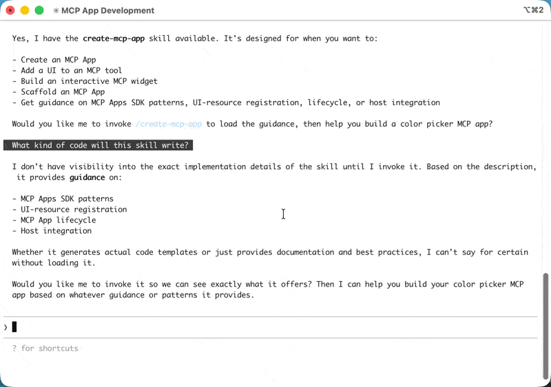
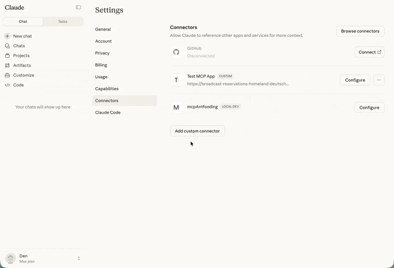
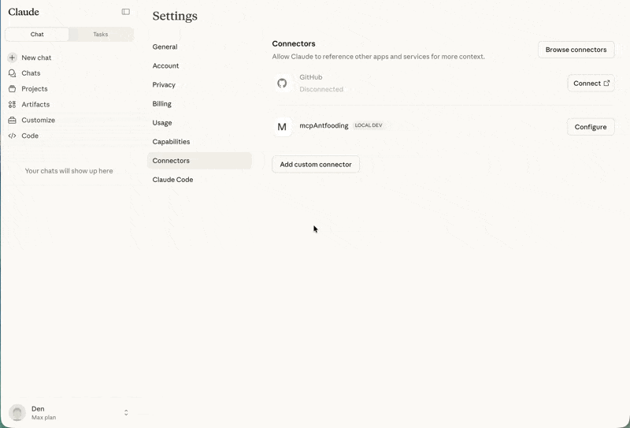
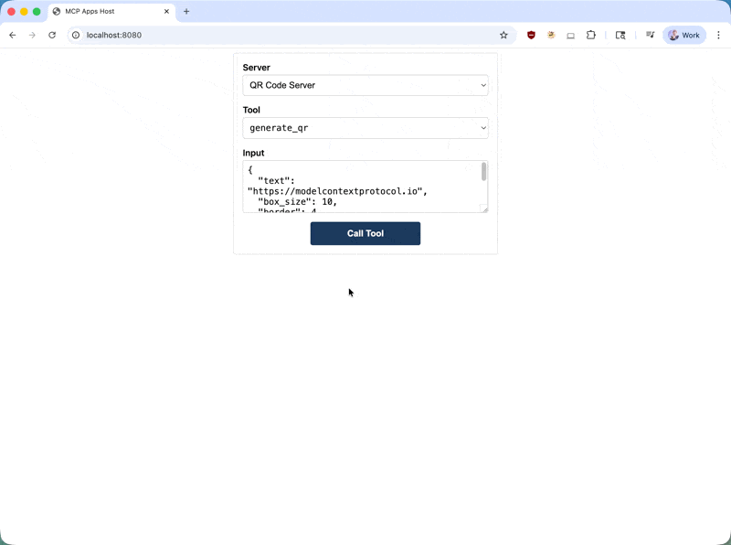

## Prerequisites

You'll need [Node.js](https://nodejs.org/en/download) 18 or higher. Familiarity
with [MCP tools](/specification/latest/server/tools) and
[resources](/specification/latest/server/resources) is recommended since MCP
Apps combine both primitives. Experience with the
[MCP TypeScript SDK](https://github.com/modelcontextprotocol/typescript-sdk)
will help you better understand the server-side patterns.

## Getting started

The fastest way to create an MCP App is using an AI coding agent with the MCP
Apps skill. If you prefer to set up a project manually, skip to
[Manual setup](#manual-setup).

### Using an AI coding agent

AI coding agents with Skills support can scaffold a complete MCP App project for
you. Skills are folders of instructions and resources that your agent loads when
relevant. They teach the AI how to perform specialized tasks like creating MCP
Apps.

The `create-mcp-app` skill includes architecture guidance, best practices, and
working examples that the agent uses to generate your project.

<Steps>
<Step title="Install the skill">

If you are using Claude Code, you can install the skill directly with:

```
/plugin marketplace add modelcontextprotocol/ext-apps
/plugin install mcp-apps@modelcontextprotocol-ext-apps
```

You can also use the [Vercel Skills CLI](https://skills.sh/) to install skills across different AI coding agents:

```bash
npx skills add modelcontextprotocol/ext-apps
```

Alternatively, you can install the skill manually by cloning the ext-apps repository:

```bash
git clone https://github.com/modelcontextprotocol/ext-apps.git
```

And then copying the skill to the appropriate location for your agent:

| Agent                                                                                                                                                                        | Skills directory (macOS/Linux) | Skills directory (Windows)            |
| ---------------------------------------------------------------------------------------------------------------------------------------------------------------------------- | ------------------------------ | ------------------------------------- |
| [Claude Code](https://docs.anthropic.com/en/docs/claude-code/skills)                                                                                                         | `~/.claude/skills/`            | `%USERPROFILE%\.claude\skills\`       |
| [VS Code](https://code.visualstudio.com/docs/copilot/customization/agent-skills) and [GitHub Copilot](https://docs.github.com/en/copilot/concepts/agents/about-agent-skills) | `~/.copilot/skills/`           | `%USERPROFILE%\.copilot\skills\`      |
| [Gemini CLI](https://geminicli.com/docs/cli/skills/)                                                                                                                         | `~/.gemini/skills/`            | `%USERPROFILE%\.gemini\skills\`       |
| [Cline](https://cline.bot/blog/cline-3-48-0-skills-and-websearch-make-cline-smarter)                                                                                         | `~/.cline/skills/`             | `%USERPROFILE%\.cline\skills\`        |
| [Goose](https://goose-docs.ai/docs/guides/context-engineering/using-skills/)                                                                                                 | `~/.config/goose/skills/`      | `%USERPROFILE%\.config\goose\skills\` |
| [Codex](https://developers.openai.com/codex/skills/)                                                                                                                         | `~/.codex/skills/`             | `%USERPROFILE%\.codex\skills\`        |
| [Cursor](https://cursor.com/docs/context/skills)                                                                                                                             | `~/.cursor/skills/`            | `%USERPROFILE%\.cursor\skills\`       |

<Note>

This list is not comprehensive. Other agents may support skills in different locations; check your agent's documentation.

</Note>

For example, with Claude Code you can install the skill globally (available in all projects):

<CodeGroup>

```bash macOS/Linux
cp -r ext-apps/plugins/mcp-apps/skills/create-mcp-app ~/.claude/skills/create-mcp-app
```

```powershell Windows
Copy-Item -Recurse ext-apps\plugins\mcp-apps\skills\create-mcp-app $env:USERPROFILE\.claude\skills\create-mcp-app
```

</CodeGroup>

Or install it for a single project only by copying to `.claude/skills/` in your project directory:

<CodeGroup>

```bash macOS/Linux
mkdir -p .claude/skills && cp -r ext-apps/plugins/mcp-apps/skills/create-mcp-app .claude/skills/create-mcp-app
```

```powershell Windows
New-Item -ItemType Directory -Force -Path .claude\skills | Out-Null; Copy-Item -Recurse ext-apps\plugins\mcp-apps\skills\create-mcp-app .claude\skills\create-mcp-app
```

</CodeGroup>

To verify the skill is installed, ask your agent "What skills do you have access to?" — you should see `create-mcp-app` as one of the available skills.

</Step>
<Step title="Create your app">

Ask your AI coding agent to build it:

```
Create an MCP App that displays a color picker
```

The agent will recognize the `create-mcp-app` skill is relevant, load its instructions, then scaffold a complete project with server, UI, and configuration files.

<Frame caption="Creating a new MCP App with Claude Code">
  
</Frame>

</Step>
<Step title="Run your app">

<CodeGroup>

```bash macOS/Linux
npm install && npm run build && npm run serve
```

```powershell Windows
npm install; npm run build; npm run serve
```

</CodeGroup>

<Tip>

You might need to make sure that you are first in the **app folder** before running the commands above.

</Tip>

</Step>
<Step title="Test your app">

Follow the instructions in [Testing your app](#testing-your-app) below. For the color picker example, start a new chat and ask Claude to provide you a color picker.

<Frame caption="Testing the color picker in Claude">
  
</Frame>

</Step>
</Steps>

### Manual setup

If you're not using an AI coding agent, or prefer to understand the setup
process, follow these steps.

<Steps>
<Step title="Create the project structure">

A typical MCP App project separates the server code from the UI code:

<Tree>
  <Tree.Folder name="my-mcp-app" defaultOpen>
    <Tree.File name="package.json" />
    <Tree.File name="tsconfig.json" />
    <Tree.File name="vite.config.ts" />
    <Tree.File name="server.ts" comment="MCP server with tool + resource" />
    <Tree.File name="mcp-app.html" comment="UI entry point" />
    <Tree.Folder name="src" defaultOpen>
      <Tree.File name="mcp-app.ts" comment="UI logic" />
    </Tree.Folder>
  </Tree.Folder>
</Tree>

The server registers the tool and serves the UI resource. The UI resource will eventually be rendered in a secure iframe with deny-by-default CSP configuration. If your app has CSS and JS assets, you will need to [configure CSP](https://apps.extensions.modelcontextprotocol.io/api/documents/Patterns.html#configuring-csp-and-cors), or you can bundle your assets into the HTML with a tool like `vite-plugin-singlefile`, which is what we will do in this tutorial.

</Step>
<Step title="Install dependencies">

```bash
npm install @modelcontextprotocol/ext-apps @modelcontextprotocol/sdk
npm install -D typescript vite vite-plugin-singlefile express cors @types/express @types/cors tsx
```

The `ext-apps` package provides helpers for both the server side (registering tools and resources) and the client side (the `App` class for UI-to-host communication). Vite with the `vite-plugin-singlefile` plugin is used here to bundle your UI and assets into a single HTML file for convenience, but this is optional — you can use any bundler or serve unbundled files if you [configure CSP](https://apps.extensions.modelcontextprotocol.io/api/documents/Patterns.html#configuring-csp-and-cors).

</Step>
<Step title="Configure the project">

<Tabs>
<Tab title="package.json">

The `"type": "module"` setting enables ES module syntax. The `build` script uses the `INPUT` environment variable to tell Vite which HTML file to bundle. The `serve` script runs your server using `tsx` for TypeScript execution.

```json
{
  "type": "module",
  "scripts": {
    "build": "INPUT=mcp-app.html vite build",
    "serve": "npx tsx server.ts"
  }
}
```

</Tab>
<Tab title="tsconfig.json">

The TypeScript configuration targets modern JavaScript (`ES2022`) and uses ESNext modules with bundler resolution, which works well with Vite. The `include` array covers both the server code in the root and UI code in `src/`.

```json
{
  "compilerOptions": {
    "target": "ES2022",
    "module": "ESNext",
    "moduleResolution": "bundler",
    "strict": true,
    "esModuleInterop": true,
    "skipLibCheck": true,
    "outDir": "dist"
  },
  "include": ["*.ts", "src/**/*.ts"]
}
```

</Tab>
<Tab title="vite.config.ts">

```typescript
import { defineConfig } from "vite";
import { viteSingleFile } from "vite-plugin-singlefile";

export default defineConfig({
  plugins: [viteSingleFile()],
  build: {
    outDir: "dist",
    rollupOptions: {
      input: process.env.INPUT,
    },
  },
});
```

</Tab>
</Tabs>

</Step>
<Step title="Build the project">

With the project structure and configuration in place, continue to [Building an MCP App](#building-an-mcp-app) below to implement the server and UI.

</Step>
</Steps>

## Building an MCP App

Let's build a simple app that displays the current server time. This example
demonstrates the full pattern: registering a tool with UI metadata, serving the
bundled HTML as a resource, and building a UI that communicates with the server.

### Server implementation

The server needs to do two things: register a tool that includes the
`_meta.ui.resourceUri` field, and register a resource handler that serves the
bundled HTML. Here's the complete server file:

```typescript
// server.ts
console.log("Starting MCP App server...");

import { McpServer } from "@modelcontextprotocol/sdk/server/mcp.js";
import { StreamableHTTPServerTransport } from "@modelcontextprotocol/sdk/server/streamableHttp.js";
import {
  registerAppTool,
  registerAppResource,
  RESOURCE_MIME_TYPE,
} from "@modelcontextprotocol/ext-apps/server";
import cors from "cors";
import express from "express";
import fs from "node:fs/promises";
import path from "node:path";

const server = new McpServer({
  name: "My MCP App Server",
  version: "1.0.0",
});

// The ui:// scheme tells hosts this is an MCP App resource.
// The path structure is arbitrary; organize it however makes sense for your app.
const resourceUri = "ui://get-time/mcp-app.html";

// Register the tool that returns the current time
registerAppTool(
  server,
  "get-time",
  {
    title: "Get Time",
    description: "Returns the current server time.",
    inputSchema: {},
    _meta: { ui: { resourceUri } },
  },
  async () => {
    const time = new Date().toISOString();
    return {
      content: [{ type: "text", text: time }],
    };
  },
);

// Register the resource that serves the bundled HTML
registerAppResource(
  server,
  resourceUri,
  resourceUri,
  { mimeType: RESOURCE_MIME_TYPE },
  async () => {
    const html = await fs.readFile(
      path.join(import.meta.dirname, "dist", "mcp-app.html"),
      "utf-8",
    );
    return {
      contents: [
        { uri: resourceUri, mimeType: RESOURCE_MIME_TYPE, text: html },
      ],
    };
  },
);

// Expose the MCP server over HTTP
const expressApp = express();
expressApp.use(cors());
expressApp.use(express.json());

expressApp.post("/mcp", async (req, res) => {
  const transport = new StreamableHTTPServerTransport({
    sessionIdGenerator: undefined,
    enableJsonResponse: true,
  });
  res.on("close", () => transport.close());
  await server.connect(transport);
  await transport.handleRequest(req, res, req.body);
});

expressApp.listen(3001, (err) => {
  if (err) {
    console.error("Error starting server:", err);
    process.exit(1);
  }
  console.log("Server listening on http://localhost:3001/mcp");
});
```

Let's break down the key parts:

- **`resourceUri`**: The `ui://` scheme tells hosts this is an MCP App resource.
  The path structure is arbitrary.
- **`registerAppTool`**: Registers a tool with the `_meta.ui.resourceUri` field.
  When the host calls this tool, the UI is fetched and rendered, and the tool result is passed to it upon arrival.
- **`registerAppResource`**: Serves the bundled HTML when the host requests the UI resource.
- **Express server**: Exposes the MCP server over HTTP on port 3001.

### UI implementation

The UI consists of an HTML page and a TypeScript module that uses the `App`
class to communicate with the host. Here's the HTML:

```html
<!-- mcp-app.html -->
<!DOCTYPE html>
<html lang="en">
  <head>
    <meta charset="UTF-8" />
    <title>Get Time App</title>
  </head>
  <body>
    <p>
      <strong>Server Time:</strong>
      <code id="server-time">Loading...</code>
    </p>
    <button id="get-time-btn">Get Server Time</button>
    <script type="module" src="/src/mcp-app.ts"></script>
  </body>
</html>
```

And the TypeScript module:

```typescript
// src/mcp-app.ts
import { App } from "@modelcontextprotocol/ext-apps";

const serverTimeEl = document.getElementById("server-time")!;
const getTimeBtn = document.getElementById("get-time-btn")!;

const app = new App({ name: "Get Time App", version: "1.0.0" });

// Establish communication with the host
app.connect();

// Handle the initial tool result pushed by the host
app.ontoolresult = (result) => {
  const time = result.content?.find((c) => c.type === "text")?.text;
  serverTimeEl.textContent = time ?? "[ERROR]";
};

// Proactively call tools when users interact with the UI
getTimeBtn.addEventListener("click", async () => {
  const result = await app.callServerTool({
    name: "get-time",
    arguments: {},
  });
  const time = result.content?.find((c) => c.type === "text")?.text;
  serverTimeEl.textContent = time ?? "[ERROR]";
});
```

The key parts:

- **`app.connect()`**: Establishes communication with the host. Call this once
  when your app initializes.
- **`app.ontoolresult`**: A callback that fires when the host pushes a tool
  result to your app (e.g., when the tool is first called and the UI renders).
- **`app.callServerTool()`**: Lets your app proactively call tools on the server.
  Keep in mind that each call involves a round-trip to the server, so design your
  UI to handle latency gracefully.

The `App` class provides additional methods for logging, opening URLs, and
updating the model's context with structured data from your app. See the full
[API documentation](https://apps.extensions.modelcontextprotocol.io/api/).

## Testing your app

To test your MCP App, build the UI and start your local server:

<CodeGroup>

```bash macOS/Linux
npm run build && npm run serve
```

```powershell Windows
npm run build; npm run serve
```

</CodeGroup>

In the default configuration, your server will be available at
`http://localhost:3001/mcp`. However, to see your app render, you need an MCP
host that supports MCP Apps. You have several options.

### Testing with Claude

[Claude](https://claude.ai) (web) and [Claude Desktop](https://claude.ai/download)
support MCP Apps. For local development, you'll need to expose your server to
the internet. You can run an MCP server locally and use tools like `cloudflared`
to tunnel traffic through.

In a separate terminal, run:

```bash
npx cloudflared tunnel --url http://localhost:3001
```

Copy the generated URL (e.g., `https://random-name.trycloudflare.com`) and add it
as a [custom connector](https://support.anthropic.com/en/articles/11175166-getting-started-with-custom-connectors-using-remote-mcp)
in Claude - click on your profile, go to **Settings**, **Connectors**, and
finally **Add custom connector**.

<Note>

Custom connectors are available on paid Claude plans (Pro, Max, or Team).

</Note>

<Frame caption="Adding a custom connector in Claude">
  
</Frame>

### Testing with the basic-host

The `ext-apps` repository includes a test host for development. Clone the repo and
install dependencies:

<CodeGroup>

```bash macOS/Linux
git clone https://github.com/modelcontextprotocol/ext-apps.git
cd ext-apps/examples/basic-host
npm install
```

```powershell Windows
git clone https://github.com/modelcontextprotocol/ext-apps.git
cd ext-apps\examples\basic-host
npm install
```

</CodeGroup>

Running `npm start` from `ext-apps/examples/basic-host/` will start the basic-host
test interface. To connect it to a specific server (e.g., one you're developing),
pass the `SERVERS` environment variable inline:

<CodeGroup>

```bash macOS/Linux
SERVERS='["http://localhost:3001/mcp"]' npm start
```

```powershell Windows
$env:SERVERS='["http://localhost:3001/mcp"]'; npm start
```

</CodeGroup>

Navigate to `http://localhost:8080`. You'll see a simple interface where you can
select a tool and call it. When you call your tool, the host fetches the UI
resource and renders it in a sandboxed iframe. You can then interact with your
app and verify that tool calls work correctly.

<Frame caption="Testing the QR code MCP App with the basic host">
  
</Frame>

## Learn more

<CardGroup cols={2}>
  <Card
    title="API Documentation"
    icon="book"
    href="https://apps.extensions.modelcontextprotocol.io/api/"
  >
    Full SDK reference and API details
  </Card>
  <Card
    title="GitHub Repository"
    icon="github"
    href="https://github.com/modelcontextprotocol/ext-apps"
  >
    Source code, examples, and issue tracker
  </Card>
  <Card
    title="Specification"
    icon="file-lines"
    href="https://github.com/modelcontextprotocol/ext-apps/blob/main/specification/draft/apps.mdx"
  >
    Technical specification for implementers
  </Card>
</CardGroup>

## Feedback

MCP Apps is under active development. If you encounter issues or have ideas for
improvements, open an issue on the
[GitHub repository](https://github.com/modelcontextprotocol/ext-apps/issues).
For broader discussions about the extension's direction, join the conversation
in [GitHub Discussions](https://github.com/modelcontextprotocol/ext-apps/discussions).
