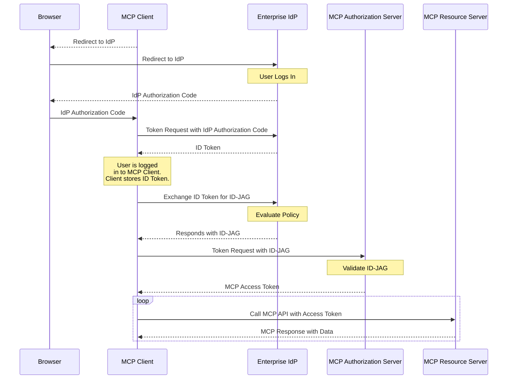

The Enterprise-Managed Authorization extension (`io.modelcontextprotocol/enterprise-managed-authorization`) enables organizations to control MCP server access centrally through their existing identity provider (IdP). Instead of each employee authorizing each MCP server individually, the organization's IT or security team manages access policies in one place.

<Card
  title="Specification"
  icon="file-lines"
  href="https://github.com/modelcontextprotocol/ext-auth/blob/main/specification/stable/enterprise-managed-authorization.mdx"
>
  Full technical specification for the Enterprise-Managed Authorization
  extension.
</Card>

## What it is

In a standard MCP deployment, each user independently authorizes an MCP client to access each MCP server. For consumer applications, this user-driven model is ideal — it gives individuals control over what accesses their data.

In enterprise environments, this model creates friction and security gaps:

- Employees shouldn't need to understand the authorization details of every MCP server their organization uses
- Security teams can't enforce consistent access policies if each user authorizes independently
- Onboarding new employees requires them to manually authorize dozens of services
- Offboarding requires revoking access across every service individually

Enterprise-Managed Authorization solves this by introducing the organization's IdP as the authoritative decision-maker. The IdP (such as Okta, Azure AD, or a corporate SSO system) controls which MCP servers employees can access, and under what conditions. Employees authenticate with their corporate identity — the same credentials they use for email, Slack, and other work tools — and the IdP grants or denies MCP server access based on organizational policy.

## When to use it

Use Enterprise-Managed Authorization when:

- **Deploying MCP in a corporate environment** where IT manages access to all business applications
- **Enforcing organizational access policies** — you need to ensure only authorized employees access specific MCP servers
- **Centralizing access control** — you want to add or revoke access to MCP servers from a single admin console
- **Meeting compliance requirements** — your organization needs an auditable authorization trail for all MCP server access
- **Simplifying employee experience** — employees should access MCP tools with their existing corporate SSO credentials, without per-service authorization flows

## How it works

The extension establishes a delegated authorization flow where the enterprise IdP acts as an intermediary between the MCP client and the MCP server. The MCP Client requests a special type of token from the enterprise IdP called an Identity Assertion JWT Authorization Grant, or ID-JAG. The MCP Client then exchanges the ID-JAG for an access token from the MCP server's Authorization Server:



Key aspects of the flow:

1. **Centralized policy**: The enterprise IdP maintains a registry of approved MCP servers and the access policies for each. Administrators configure these in their existing identity management tools.

2. **Single sign-on**: Employees authenticate with their corporate credentials once. The IdP issues tokens that grant access to approved MCP servers without additional per-server authorization prompts.

3. **Policy enforcement**: The IdP evaluates access policies (group membership, role assignments, conditional access rules) before issuing tokens. Employees who lack authorization receive an appropriate error — the MCP client never receives a token for unauthorized servers.

4. **Centralized revocation**: Revoking an employee's access to MCP servers happens at the IdP level, taking effect immediately across all MCP clients. No per-client, per-server revocation needed.

## Implementation guide

### For MCP clients

To support Enterprise-Managed Authorization, your client must:

1. **Declare support** in the `initialize` request:

```json
{
  "capabilities": {
    "extensions": {
      "io.modelcontextprotocol/enterprise-managed-authorization": {}
    }
  }
}
```

2. **Support SSO** — users should authenticate to the MCP Client using the enterprise IdP. Save the Identity Assertion (either an OpenID ID Token or SAML assertion) issued during login for later use.

3. **Handle ID-JAGs** — when the server indicates that enterprise-managed auth is required, request an ID-JAG token from the enterprise IdP's authorization endpoint using the previously obtained Identity Assertion. Exchange this ID-JAG for an access token from the MCP Authorization Server. Do not redirect the user to the MCP Authorization Server's authorization endpoint.

4. **Support organization configuration** — allow administrators to configure the enterprise IdP's endpoints, typically via organization-level settings rather than per-user settings.

5. **Respect token scopes** — tokens issued by enterprise IdPs may have scope restrictions that differ from standard MCP authorization. Handle scope errors gracefully.

### For MCP servers

To require enterprise-managed authorization:

1. **Declare the extension** in your server's authorization metadata, indicating that clients must use the enterprise-managed flow.

2. **Integrate with IdP admin APIs** (optional) — publish your server's resource descriptor so enterprise administrators can configure access policies in their IdP admin console.

### For MCP Authorization Servers

1. **Validate ID-JAGs** issued by the enterprise IdP. This typically means validating JWT signatures against the IdP's JWKS endpoint and checking the token's audience, issuer, and expiration.

2. **Map IdP claims to permissions** — ID-JAG tokens carry claims (scope and resource information) that your server uses to determine who the employee is and what the employee can access. Define your authorization logic based on these claims.

3. **Handle Account Linking** - ID-JAG tokens will always contain a subject claim and may additionally contain an email claim that can be used to link the enterprise identity to an existing account in your system. Use the subject claim as the primary stable identifier for the user, and fall back to the email claim for matching against pre-existing accounts that were created before enterprise-managed authorization was configured.

## Client support

<Note>

Support for this extension varies by client. Extensions are opt-in and never active by default.

</Note>

Check the [client matrix](/extensions/client-matrix) for current implementation status across MCP clients. Enterprise-Managed Authorization typically requires client-level support from the organization's IT team in addition to the MCP client application.

## Related resources

<CardGroup cols={2}>
  <Card
    title="ext-auth repository"
    icon="github"
    href="https://github.com/modelcontextprotocol/ext-auth"
  >
    Source code and reference implementations
  </Card>
  <Card
    title="Full specification"
    icon="file-lines"
    href="https://github.com/modelcontextprotocol/ext-auth/blob/main/specification/stable/enterprise-managed-authorization.mdx"
  >
    Technical specification with normative requirements
  </Card>
  <Card
    title="SEP-990"
    icon="file-lines"
    href="/seps/990-enable-enterprise-idp-policy-controls-during-mcp-o"
  >
    Original proposal: Enable Enterprise IdP Policy Controls
  </Card>
  <Card
    title="MCP Authorization"
    icon="lock"
    href="/specification/latest/basic/authorization"
  >
    Core MCP authorization specification
  </Card>
</CardGroup>
