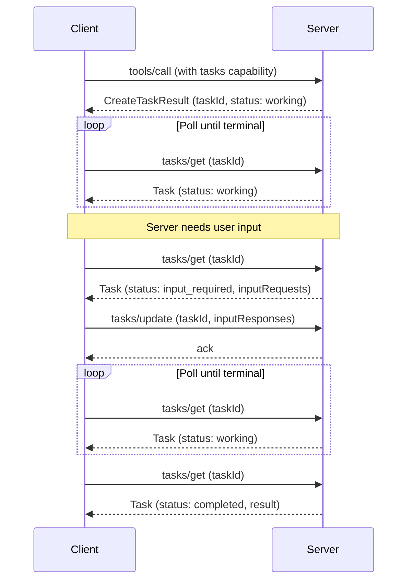

The [experimental-ext-tasks repository](https://github.com/modelcontextprotocol/experimental-ext-tasks) contains the full specification and documentation for MCP Tasks.

<Card
  title="modelcontextprotocol/ext-tasks"
  icon="github"
  href="https://github.com/modelcontextprotocol/ext-tasks"
>
  Full specification and documentation for MCP Tasks.
</Card>

Not every tool call returns instantly. Some operations — CI pipelines, batch
processing, human approvals — take seconds, minutes, or longer. MCP Tasks let
servers return a durable handle instead of blocking, so clients can poll for
progress, provide input when needed, and retrieve the final result after
reconnecting.

## Why not just block?

You could hold the connection open until the work finishes. Tasks solve
problems that blocking cannot:

- **No long-lived connections.** Blocking ties up a connection for the duration
  of the operation. Many clients and transport intermediaries impose timeouts
  that make this impractical beyond a few seconds.
- **Crash resilience.** A task ID is a durable handle. If the client
  disconnects or restarts, it can resume polling with the same ID.
- **Progress visibility.** Tasks carry status metadata (`working`,
  `input_required`, `completed`, `failed`, `cancelled`) and optional status
  messages, giving clients visibility into progress.
- **Mid-flight interaction.** When a task needs input (e.g., an elicitation for
  user confirmation), it moves to `input_required` and surfaces the request.
  The client responds via `tasks/update` — no second connection or unsolicited
  server-to-client messages required.
- **Server-directed.** The server decides per-request whether to create a task.
  Clients opt in once via the extension capability and handle whichever result
  shape arrives. No per-tool warmup or per-request flag.

## How Tasks work

Tasks extend the standard request flow. When a server decides a request will be
long-running, it returns a task handle instead of the final result. The client
polls for completion.

1. **Capability negotiation.** The client includes
   `io.modelcontextprotocol/tasks` in its per-request capabilities. The server
   advertises the same extension in its own `server/discover` capabilities.

2. **Task creation.** In response to a supported request, the server returns a
   `CreateTaskResult` (identified by `resultType: "task"`) containing a `taskId`,
   initial status, TTL, and suggested polling interval. The task is durably
   created before the response is sent.

3. **Polling.** The client calls `tasks/get` with the `taskId`. The response
   carries the current status and, for terminal states, the final result or
   error.

4. **Mid-flight input.** If the task moves to `input_required`, the `tasks/get`
   response includes an `inputRequests` map with elicitations or other server
   requests. The client fulfills these via `tasks/update`.

5. **Completion.** When the status reaches `completed`, the `result` field
   contains what the original request would have returned synchronously. If the
   status is `failed`, the `error` field contains the JSON-RPC error.

6. **Cancellation.** The client can send `tasks/cancel` at any time.
   Cancellation is cooperative — the server acknowledges the intent but is not
   obligated to stop the work.



## When to use Tasks

Tasks are a good fit when your use case involves:

**Long-running operations.** CI pipelines, batch data processing, or model
training jobs that take minutes or hours.

**Human-in-the-loop workflows.** Approval gates, review steps, or any operation
that pauses for user confirmation. The task moves to `input_required` and the
client presents the request.

**External job systems.** If your server wraps an API that already uses job IDs
(cloud deployments, async APIs, queued work), return a task when you create the
job and resolve it when the job completes.

**Unreliable connections.** Mobile clients, intermittent networks, or
environments where connections drop. Task IDs survive disconnects.

**Batch processing.** Operations that process many items (bulk imports, mass
updates) where partial progress is meaningful. Status messages report progress.

## Task lifecycle

| Status           | Meaning                                                                    |
| ---------------- | -------------------------------------------------------------------------- |
| `working`        | The operation is in progress.                                              |
| `input_required` | The server needs client input before continuing. See `inputRequests`.      |
| `completed`      | The operation finished. The `result` field contains the final output.      |
| `failed`         | A JSON-RPC error occurred during execution. The `error` field has details. |
| `cancelled`      | The operation was cancelled (not always honored).                          |

`completed`, `failed`, and `cancelled` are terminal — once reached, the task's
state does not change.

## Notifications

Servers can push status updates via `notifications/tasks`. Clients opt
into these through the `subscriptions/listen` mechanism. Each notification
carries the full task state, eliminating the need for an extra `tasks/get`
round-trip.

Polling is the default. If a server supports notifications, clients can rely on
them instead of polling.

## Implementation guide

### For MCP clients

To consume task-augmented responses, your client must:

<Steps>
<Step title="Declare support">

Include the extension in per-request capabilities:

```json
{
  "params": {
    "_meta": {
      "io.modelcontextprotocol/clientCapabilities": {
        "extensions": {
          "io.modelcontextprotocol/tasks": {}
        }
      }
    }
  }
}
```

</Step>
<Step title="Handle polymorphic results">

When issuing a supported request (e.g., `tools/call`), be prepared to receive
either the standard result or a `CreateTaskResult` with `resultType: "task"`.

</Step>
<Step title="Poll for completion">

Call `tasks/get` with the returned `taskId`, respecting the `pollIntervalMs`
value. Continue polling until the task reaches a terminal status (`completed`,
`failed`, or `cancelled`).

</Step>
<Step title="Handle input requests">

If the task status is `input_required`, read the `inputRequests` map, present
the requests to the user or model, and submit responses via `tasks/update`.

</Step>
<Step title="Persist task IDs">

Store task IDs durably so polling can resume after a client crash or restart.

</Step>
</Steps>

### For MCP servers

To return tasks from your server:

<Steps>
<Step title="Advertise support">

Include the extension in your `server/discover` capabilities:

```json
{
  "capabilities": {
    "extensions": {
      "io.modelcontextprotocol/tasks": {}
    }
  }
}
```

</Step>
<Step title="Check client capabilities">

Before returning a `CreateTaskResult`, verify that the client included the
extension in its per-request capabilities. Never return a task to a client that
did not declare support.

</Step>
<Step title="Return CreateTaskResult">

When a request will be long-running, respond with `resultType: "task"` and a
`Task` object containing a unique `taskId`, initial status, `ttlMs`, and
`pollIntervalMs`. The task must be durably created before sending the response.

</Step>
<Step title="Serve tasks/get">

Return the current task state on each poll. For terminal states, include the
`result` (on `completed`) or `error` (on `failed`) field.

</Step>
<Step title="Handle tasks/update">

Accept `inputResponses` keyed to outstanding `inputRequests`. Acknowledge with
an empty result. Ignore responses for unknown or already-satisfied keys.

</Step>
<Step title="Handle tasks/cancel">

Acknowledge cancellation requests with an empty result. Honor them when
possible, but cancellation is cooperative — the task may still reach a
non-`cancelled` terminal status.

</Step>
</Steps>

## Client support

<Note>

MCP Tasks is an extension to the [core MCP specification](/specification/latest). Host
support varies by client.

</Note>

See the [client matrix](/extensions/client-matrix) for extension support across
clients. Task support requires explicit opt-in from both client and server.

## Specification

The Tasks extension is specified in the [experimental-ext-tasks repository](https://github.com/modelcontextprotocol/experimental-ext-tasks). It uses the standard MCP [extension negotiation](/extensions/overview#negotiation) mechanism: clients and servers declare support in the `extensions` field of their capabilities during initialization.
