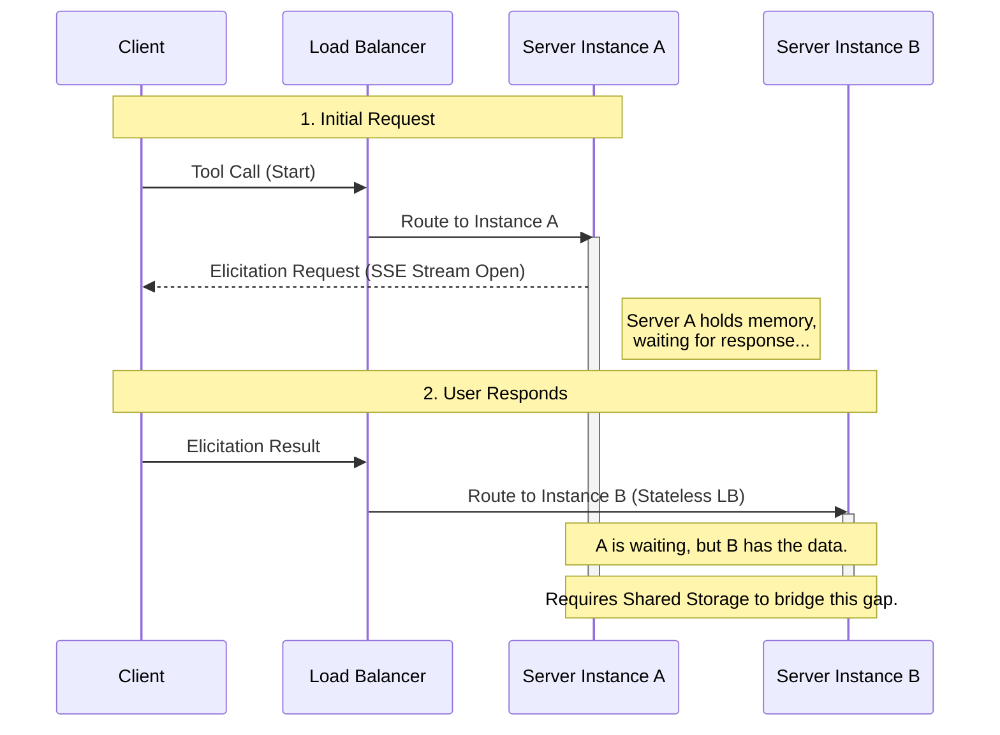
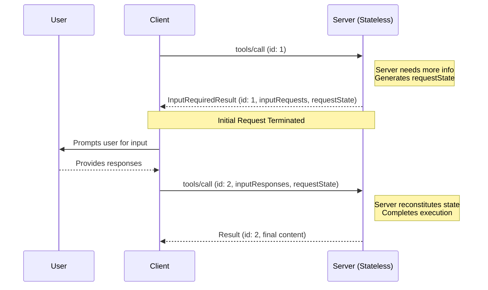
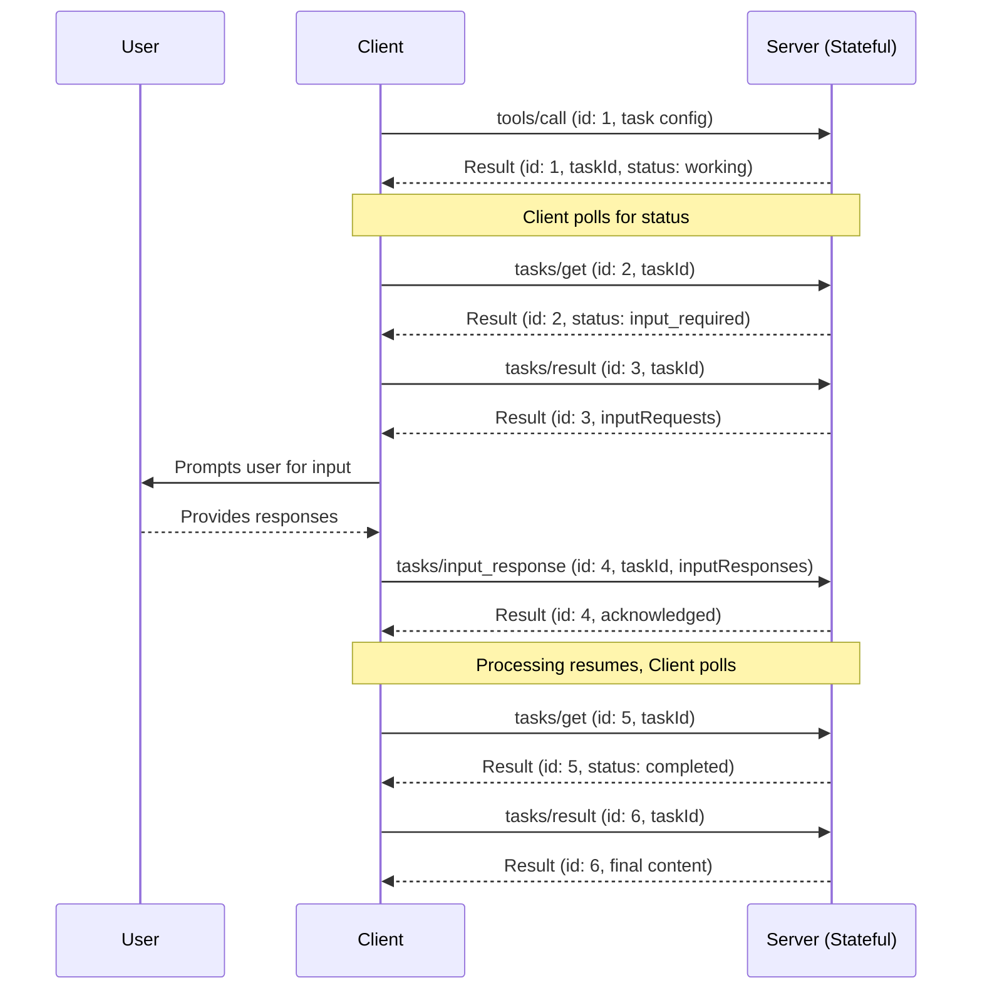

<div className="flex items-center gap-2 mb-4">
  <Badge color="green" shape="pill">
    Final
  </Badge>
  <Badge color="gray" shape="pill">
    Standards Track
  </Badge>
</div>

| Field         | Value                                                                                                                     |
| ------------- | ------------------------------------------------------------------------------------------------------------------------- |
| **SEP**       | 2322                                                                                                                      |
| **Title**     | Multi Round-Trip Requests                                                                                                 |
| **Status**    | Final                                                                                                                     |
| **Type**      | Standards Track                                                                                                           |
| **Created**   | 2026-02-03                                                                                                                |
| **Author(s)** | Mark D. Roth ([@markdroth](https://github.com/markdroth)), Caitie McCaffrey ([@CaitieM20](https://github.com/CaitieM20)), |
| **Sponsor**   | Caitie McCaffrey ([@CaitieM20](https://github.com/CaitieM20))                                                             |
| **PR**        | [#2322](https://github.com/modelcontextprotocol/modelcontextprotocol/pull/2322)                                           |

---

## Abstract

This proposal specifies a simple way to handle server-initiated requests
in the context of a client-initiated request (e.g., an elicitation
request in the context of a tool call) without requiring a shared
storage layer shared across server instances or statefulness in
load balancing, which will significantly reduce the cost of operating
MCP servers at scale in the common case. It also reduces the HTTP
transport's dependence on SSE streams, which cause problems in a lot of
environments that cannot support long-lived connections.

This proposed way of handling server-initiated requests will replace the current approach of sending server-initiated requests. This is a breaking change.

This SEP also specifies the subset of client requests that a server can
send a server-initiated request on. This is a reduced scope compared to the current spec and is also a breaking change.

Making a breaking change here is necessary since adoption of server-initiated request features like Elicitation, Sampling and ListRoots is very low or blocked for many Remote MCP servers or Server Hosted Clients due to the operational complextity of supporting the SSE streams and server-side state.

## Motivation

Note: This SEP is intended to provide a generic mechanism for handling
any server-initiated request in the context of any client-initiated
request. For clarity, throughout this document, we will specifically
discuss tool calls as a proxy for any client-initiated request, but it
should be read as applying equally to (e.g.) resource or prompt
requests; similarly, we will discuss elicitation requests as a proxy for
any server-initiated request, but it should be read as applying equally
to (e.g.) sampling requests.

We start with the observation that there are two types of MCP tools:

1. **Ephemeral**: No state is accumulated on the server side.
   - If server needs more info to process the tool call, it can start from
     scratch when it gets that additional info.
   - Examples: weather app, accessing email
2. **Persistent**: State is accumulated on the server side.
   - Server may generate a large amount of state before requesting more
     info from the client, and it may need to pick up that state to
     continue processing after it receives the info from the client.
   - Server may need to continue processing in the background while
     waiting for more info from the client, in which case server-side
     state is needed to track that ongoing processing.
   - Examples: accessing an agent, spinning up a VM and needing user
     interaction to manipulate the VM

The vast majority of MCP tools will be ephemeral, and it is extremely
common for tools to be deployed in a horizontally scaled, load balanced
service, so we need to optimize for this case.

Today, if a tool needs to send an elicitation request in order to make
progress, the workflow works like this:

1. Client sends tool call request. For this example, let's assume that
   the load balancers happen to send this request to server instance A.
2. Server A opens an SSE stream and sends the elicitation request on that
   stream.
3. Client sends the elicitation response as a separate request, for which
   the load balancers will choose a server instance completely
   independently of the one they chose in step 1. In this example,
   let's assume that the load balancers happen to send this request to
   server instance B.
4. Server A must somehow discover the elicitation response delivered to
   server B.
5. Server A then sends the tool call result on the SSE stream opened in
   step 2.



The difficult part here is step 4, which requires some sort of
statefulness on the server side. The main way to solve this problem
today is to have a storage layer shared across all server instances, so
that multiple server instances can match up the elicitation response
on one server instance with the original ongoing tool call on a
different server instance.

There are two main approaches that can be used to solve this problem today:

- **Persistent Storage Layer Shared Across Server Instances**: Servers can
  deploy and manage a persistent storage layer (e.g., PostgreSQL, Redis,
  DynamoDB), which allow multiple server instances to match up the
  elicitation response on one server instance with the original ongoing
  tool call on a different server instance. This approach has a number
  of drawbacks:
  - The persistent storage layer is **extremely expensive**, especially for
    ephemeral tools that may not already have such a layer (e.g., a weather
    tool).
  - The persistent storage layer imposes significant reliability concerns:
    it becomes a critical dependency and therefore a potential single
    point of failure. To avoid that, it must provide high availability,
    replication, and backup mechanisms.
  - The persistent storage layer becomes a bottleneck, limiting horizontal
    scalability. Geographic distribution requires either expensive
    global replication or sticky routing.
  - The persistent storage layer also imposes significant operational
    complexity. In horizontally scaled deployments, it requires
    distributed locking or consensus protocols. It also requires special
    garbage collection logic to determine when shared can be cleaned up,
    which requires careful trade-offs: cleaning up state too aggressively
    can reduce storage costs but limit how long users have to respond,
    whereas cleaning up less aggressively accommodates slow users but
    increases storage costs.
  - This approach requires special behavior in the tool implementation to
    integrate with the persistent storage layer. The MCP SDKs today do
    not have any special hooks for this sort of storage layer integration,
    which means that it's very hard to write in-line code via the SDKs.
- **Statefulness in Load Balancing**: With the use of cookies, it is
  possible for the load balancing layer to ensure that the elicitation
  request in step 3 is delivered to the same server instance that the
  original request was delivered to in step 1. This approach, while
  often cheaper than a persistent storage layer, has the following
  drawbacks:
  - It requires special configuration and behavior in the load
    balancers, which is often difficult to manage.
  - It breaks normal load balancing models, resulting in uneven load
    distribution, thus increasing the cost of running the service.
  - It requires special behavior in clients to propagate the cookies
    used for statefulness.
  - It requires the tool implementation to match up the elicitation
    request with the ongoing tool call. (The MCP SDKs have some code to
    handle this, but it's still a very strange pattern in the HTTP
    world.)
  - It is not fault tolerant. If the server instance goes down, all
    state is lost, and the tool call would need to start over from
    scratch. (This doesn't necessarily matter for ephemeral tools,
    but it is an issue for persistent tools.)

Also, both of these approaches rely on the use of an SSE stream, which
causes problems in environments that cannot support long-lived
connections. They also require an instance of the tool to stay in memory
in a particular server instance indefinitely. This is particularly
problematic for elicitation requests specifically, since the result may
not come from the user for an unbounded amount of time (e.g., it could
be days or months, or maybe even never).

The goal of this SEP is to propose a simpler way to handle the pattern
of server-initiated requests within the context of a client-initiated
request. Specifically, we need to make it cheaper to support this pattern
in the common case of an ephemeral tool in a horizontally scaled, load
balanced deployment. This means that we need a solution that does not
depend on an SSE stream and does not require either a persistent storage
layer or stateful load balancing, which in turn means that we need to
avoid dependencies between requests: servers must be able to process
each individual request using no information other than what is present
in that individual request.

Note that while the goal here is to optimize the common case of ephemeral
tools, we do want to continue to support persistent tools, which generally
already require a persistent storage layer.

## Specification

This SEP proposes a new mechanism for handling server requests in the
context of a client request. This new mechanism will have a slightly
different workflow for ephemeral tools and persistent tools, the latter
of which will leverage Tasks. However, both workflows will use the same
data structures.

### Schema Changes

First, we introduce the notion of `InputRequests`, which represents
a set of one or more server-initiated request to be sent to the client,
and `InputResponses`, which represents the client's responses to
those requests. Both requests and responses are stored in a map with
string keys. For `InputRequests`, the map values are server-initiated
requests (e.g., elicitation or sampling requests), whereas for `InputResponses`, the map values are the responses to those requests. Here's
how that would look in the typescript MCP schema:

```typescript
export type InputRequest =
  CreateMessageRequest | ElicitRequest | ListRootsRequest;

export interface InputRequests {
  [key: string]: InputRequest;
}

export type InputResponse =
  CreateMessageResult | ElicitResult | ListRootsResult;

export interface InputResponses {
  [key: string]: InputResponse;
}
```

The keys are assigned by the server when issuing the requests. The client
will send the response for each request using the corresponding key.
For example, a server might send the following input requests:

```json5
"inputRequests": {
  // Elicitation request.
  "github_login": {
    "method": "elicitation/create",
    "params": {
      "mode": "form",
      "message": "Please provide your GitHub username",
      "requestedSchema": {
        "type": "object",
        "properties": {
          "name": {
            "type": "string"
          }
        },
        "required": ["name"]
      }
    }
  },
  // Sampling request.
  "capital_of_france" : {
    "method": "sampling/createMessage",
    "params": {
      "messages": [
        {
          "role": "user",
          "content": {
            "type": "text",
            "text": "What is the capital of France?"
          }
        }
      ],
      "modelPreferences": {
        "hints": [
          {
            "name": "claude-3-sonnet"
          }
        ],
        "intelligencePriority": 0.8,
        "speedPriority": 0.5
      },
      "systemPrompt": "You are a helpful assistant.",
      "maxTokens": 100
    }
  }
}
```

The client would then send the responses in the following form:

```json5
"inputResponses": {
  // Elicitation response (ElicitResult).
  "github_login": {
    "action": "accept",
    "content": {
      "name": "octocat"
    }
  },
  // Sampling response (CreateMessageResult).
  "capital_of_france": {
    "role": "assistant",
    "content": {
      "type": "text",
      "text": "The capital of France is Paris."
    },
    "model": "claude-3-sonnet-20240307",
    "stopReason": "endTurn"
  }
}
```

The schema looks like this:

```typescript
export interface InputRequiredResult extends Result {
  // Requests issued by the server that must be complete before the
  // client can retry the original request.
  inputRequests?: InputRequests;
  // Request state to be passed back to the server when the client
  // retries the original request.
  // Note: The client must treat this as an opaque blob; it must not
  // interpret it in any way.
  requestState?: string;
}

// RequestParams type that includes input responses and request state.
// These parameters may be included in any client-initiated request.
export interface InputResponseRequestParams extends RequestParams {
  // New field to carry the responses for the server's requests from the
  // InputRequiredResult message. For each key in the response's inputRequests
  // field, the same key must appear here with the associated response.
  inputResponses?: InputResponses;
  // Request state passed back to the server from the client.
  requestState?: string;
}
```

Since this change creates a polymorphic response for method calls like `tools/call`, we are introducing a new field to `Result` which indicate the `ResultType`. The client should parse this field to determine the type of the `Result` contained in the message. If this field is not provided, the Client should assume a `ResultType` of `"complete"` for backwards compatibility.

Extensions **MAY** add additional `ResultType` values. The set of supported `ResultType` values **MUST** be created from the set defined in the core protocol and include any additional values of supported extensions that are advertised via capabilities.

The Client **SHOULD** treat unrecognized values as invalid protocol responses.

The schema change will look like this:

```typescript
/**
 * Common result fields.
 *
 * @category Common Types
 */
export interface Result {
  _meta?: MetaObject;
  // New field to indicate the type of the result, which allows the client to determine how to parse the result object. If no resultType is specified "complete" should be assumed.
  resultType: ResultType;
  [key: string]: unknown;
}

export type ResultType =
  | "complete" // the request completed successfully and the result contains the final content.
  | "input_required" // the request is incomplete and the result contains an {@link InputRequiredResult} object
  | string; // open to extensions
```

We anticipate this field will be useful for future extensibility, as it allows us to introduce new types of results and can also apply to `tasks` as well.

These types will be used in two different workflows, one for ephemeral
tools and another for persistent tools.

### Server-Initiated Request Support for Client Requests

Many `ClientRequest` don't have clear use cases where a Server would need to
request more information from the Client. This SEP builds upon [SEP-2260](https://modelcontextprotocol.io/seps/2260-Require-Server-requests-to-be-associated-with-Client-requests) and further restricts when a Server can send a Server-Initiated Request to the Client.

Servers MAY send `InputRequiredResult` responses on the following Client Requests:

| ClientRequest           | ServerResult           | InputRequiredResult Supported |
| ----------------------- | ---------------------- | ----------------------------- |
| `GetPromptRequest`      | `GetPromptResult`      | Yes                           |
| `ReadResourceRequest`   | `ReadResourceResult`   | Yes                           |
| `CallToolRequest`       | `CallToolResult`       | Yes                           |
| `GetTaskPayloadRequest` | `GetTaskPayloadResult` | Yes                           |

Servers MUST NOT send `InputRequiredResult` responses on any other Client Requests. The below table represents what `ClientRequest`s this excludes at the writing of this SEP.

| ClientRequest                  | InputRequiredResult Supported |
| ------------------------------ | ----------------------------- |
| `PingRequest`                  | No                            |
| `InitializeRequest`            | No                            |
| `CompleteRequest`              | No                            |
| `SetLevelRequest`              | No                            |
| `ListPromptsRequest`           | No                            |
| `ListResourcesRequest`         | No                            |
| `ListResourceTemplatesRequest` | No                            |
| `SubscribeRequest`             | No                            |
| `UnsubscribeRequest`           | No                            |
| `ListToolsRequest`             | No                            |
| `GetTaskRequest`               | No                            |
| `ListTasksRequest`             | No                            |
| `CancelTaskRequest`            | No                            |
| `TaskInputResponseRequest`     | No                            |

### Ephemeral Tool Workflow

For the ephemeral use case, in addition to input requests, we introduce
the concept of request state. In cases where the server needs more
information, the request state is sent to the client which echoes back
the state to the server, allowing the server to remain stateless.

We will adopt the following workflow for ephemeral tools:

1. Client sends tool call request.
2. Server sends back a single response indicating that the request is
   incomplete. The response may include input requests that the client
   must complete. It may also include some request state that the client
   must return back to the server. This response terminates the original
   request. It will normally be sent as a single response, not on an
   SSE stream, although for now (this may change in a future SEP) it is
   also legal to send this response on an SSE stream following (e.g.)
   progress notifications. If this incomplete response is sent on an
   SSE stream, it must be the last message on the SSE stream, just as if
   it were a normal response.
3. Client sends a new tool call request, completely independent of the
   original one. This new tool call includes responses to the input
   requests from step 2. It also includes the request state specified by
   the server in step 2.
4. Server sends back a CallToolResponse.



Note that the requests in steps 1 and 3 are completely independent: the
server that processes the request in step 3 does not need any
information that is not directly present in the request. To support this decoupling the JsonRPC Id MUST be different between the requests sent in step 1 and step 3.

Note that both the "inputRequests" and "requestState" fields affect
only the client's next retry of the original request. They will not
be used for any other request that the client may be sending in parallel
(e.g., a tool list or even another tool call).

<details>
<summary>Click to expand Example Flow for Ephemeral Tools</summary>
<b>Example Flow for Ephemeral Tools</b>

Note: This is a contrived example, just to illustrate the flow.

1. The client sends the initial call tool request:

```json
{
  "jsonrpc": "2.0",
  "id": 2,
  "method": "tools/call",
  "params": {
    "name": "get_weather",
    "arguments": {
      "location": "New York"
    }
  }
}
```

2. The server responds with an incomplete response, indicating that the
   client needs to respond to an elicitation request in order for the tool
   call to complete, and including request state to be passed back:

```json
{
  "jsonrpc": "2.0",
  "id": 2,
  "result": {
    "resultType": "input_required",
    "inputRequests": {
      "github_login": {
        "method": "elicitation/create",
        "params": {
          "mode": "form",
          "message": "Please provide your GitHub username",
          "requestedSchema": {
            "type": "object",
            "properties": {
              "name": {
                "type": "string"
              }
            },
            "required": ["name"]
          }
        }
      }
    },
    "requestState": "foo"
  }
}
```

3. The client then retries the original tool call, this time including the
   responses to the input server request and the request state:

```json
{
  "jsonrpc": "2.0",
  "id": 3,
  "method": "tools/call",
  "params": {
    "name": "get_weather",
    "arguments": {
      "location": "New York"
    },
    "inputResponses": {
      "github_login": {
        "action": "accept",
        "content": {
          "name": "octocat"
        }
      }
    },
    "requestState": "foo"
  }
}
```

4. Finally, the server completes the tool call:

```json
{
  "jsonrpc": "2.0",
  "id": 3,
  "result": {
    "resultType": "complete",
    "content": [
      {
        "type": "text",
        "text": "Current weather in New York:\nTemperature: 72°F\nConditions: Partly cloudy"
      }
    ],
    "isError": false
  }
}
```

</details>

#### Real-World Example for Ephemeral Workflow

This example demonstrates how `requestState` enables a multi-round-trip
elicitation flow driven by [Azure DevOps custom
rules](https://learn.microsoft.com/en-us/azure/devops/organizations/settings/work/custom-rules?view=azure-devops).
The scenario involves an `update_work_item` tool that transitions a Bug
work item to "Resolved." ADO custom rules require specific fields when
certain state transitions occur, and the server uses iterative
elicitation to gather them — accumulating context in `requestState`
across rounds so that the final update can be executed without any
server-side storage.

<details>
<summary>Click to expand ADO Custom Rules Example</summary>

**Background — ADO Custom Rules in effect:**

- _Rule 1:_ When State changes to "Resolved" → require the "Resolution"
  field (e.g., Fixed, Won't Fix, Duplicate, By Design).
- _Rule 2:_ When Resolution is "Duplicate" → require the "Duplicate Of"
  field (a link to the original work item).

##### Round 1 — Tool call triggers state change, server elicits Resolution

1. The client invokes the `update_work_item` tool to resolve Bug #4522:

```json
{
  "jsonrpc": "2.0",
  "id": 1,
  "method": "tools/call",
  "params": {
    "name": "update_work_item",
    "arguments": {
      "workItemId": 4522,
      "fields": { "System.State": "Resolved" }
    }
  }
}
```

2. The server recognizes that setting State to "Resolved" triggers
   Rule 1, which requires a Resolution value. Rather than failing the
   call, the server returns an incomplete response with an elicitation
   request. No `requestState` is needed yet, since the original tool
   call arguments will be re-sent on retry:

```json
{
  "jsonrpc": "2.0",
  "id": 1,
  "result": {
    "resultType": "input_required",
    "inputRequests": {
      "resolution": {
        "method": "elicitation/create",
        "params": {
          "message": "Resolving Bug #4522 requires a resolution. How was this bug resolved?",
          "requestedSchema": {
            "type": "object",
            "properties": {
              "resolution": {
                "type": "string",
                "enum": ["Fixed", "Won't Fix", "Duplicate", "By Design"],
                "description": "Resolution type for this bug"
              }
            },
            "required": ["resolution"]
          }
        }
      }
    }
  }
}
```

3. The user selects "Duplicate". The client retries the original tool
   call with the elicitation response:

```json
{
  "jsonrpc": "2.0",
  "id": 2,
  "method": "tools/call",
  "params": {
    "name": "update_work_item",
    "arguments": {
      "workItemId": 4522,
      "fields": { "System.State": "Resolved" }
    },
    "inputResponses": {
      "resolution": {
        "action": "accept",
        "content": { "resolution": "Duplicate" }
      }
    }
  }
}
```

##### Round 2 — Resolution triggers another rule, server elicits Duplicate Of

4. The server merges the user's response and sees that Resolution =
   "Duplicate" triggers Rule 2, requiring a "Duplicate Of" link. It
   returns another incomplete response, this time encoding the
   already-gathered resolution in `requestState` so it is available
   regardless of which server instance handles the next retry:

```json
{
  "jsonrpc": "2.0",
  "id": 2,
  "result": {
    "resultType": "input_required",
    "inputRequests": {
      "duplicate_of": {
        "method": "elicitation/create",
        "params": {
          "message": "Since this is a duplicate, which work item is the original?",
          "requestedSchema": {
            "type": "object",
            "properties": {
              "duplicateOfId": {
                "type": "number",
                "description": "Work item ID of the original bug"
              }
            },
            "required": ["duplicateOfId"]
          }
        }
      }
    },
    "requestState": "eyJyZXNvbHV0aW9uIjoiRHVwbGljYXRlIn0..."
  }
}
```

5. The user provides the original work item ID. The client retries the
   tool call, echoing back the `requestState` and including the new
   elicitation response:

```json
{
  "jsonrpc": "2.0",
  "id": 3,
  "method": "tools/call",
  "params": {
    "name": "update_work_item",
    "arguments": {
      "workItemId": 4522,
      "fields": { "System.State": "Resolved" }
    },
    "inputResponses": {
      "duplicate_of": {
        "action": "accept",
        "content": { "duplicateOfId": 4301 }
      }
    },
    "requestState": "eyJyZXNvbHV0aW9uIjoiRHVwbGljYXRlIn0..."
  }
}
```

##### Final — Server completes the update

6. The server decodes the `requestState` (which contains the
   resolution), reads the `inputResponses` (which contains the
   duplicate ID), and now has all required fields. It completes the
   tool call:

```json
{
  "jsonrpc": "2.0",
  "id": 3,
  "result": {
    "resultType": "complete",
    "content": [
      {
        "type": "text",
        "text": "Bug #4522 resolved as Duplicate of Bug #4301. State set to Resolved and duplicate link created."
      }
    ],
    "isError": false
  }
}
```

**Key takeaway:** Across both elicitation rounds, the server held no
in-memory or persisted state. The `requestState` field carried the
accumulated context through the client, and any server instance could
have handled any individual round.

</details>

#### Use Cases for Request State

The "requestState" mechanism provides a mechanism for doing multiple
round trips on the same logical request. There are two main use-cases
for this.

##### Use Case 1: Rolling Upgrades

Let's say that you are doing a rolling upgrade of your horizontally
scaled server instances to deploy a new version of a tool implementation.
The old version had two input requests with keys "github_login" and
"google_login". However, in the new version of the tool implementation,
it still uses the "github_login" input request, but it replaces the
"google_login" input request with a new "microsoft_login" input request.

If the first request goes to an old version of the server but the second
attempt (that includes the input responses) goes to a new version
of the server, then the server will see the result for "github_login",
which it needs, but it won't see the result for "microsoft_login".
(It will also see the result for "google_login", but it no longer needs
that, so it doesn't matter.) At this point, the server needs to send a
new input request for "microsoft_login", but it also doesn't want
to lose the answer that it's already gotten for "github_login", so it
would use the kind of state proposed in 1685 to retain that information
without having to store the state on the server side.

The workflow here would look like this:

1. Client sends tool call request that hits a server instance running
   the old version.
2. Server sends back an incomplete response indicating the input
   requests for "github_login" and "google_login".
3. Client sends a new tool call request that includes the responses to
   the input requests for "github_login" and "google_login". This
   time it hits a server instance running the new version.
4. Server sends back another incomplete response indicating the
   input request for "microsoft_login", which the client has not
   already provided. However, the response also includes request state
   containing the already-provided "github_login" response, so that the
   client does not need to prompt the user for the same information a
   second time.
5. Client sends a third tool call request that includes the response to
   the "microsoft_login" input request as well as echoing back the
   request state provided by the server in step 4.
6. Server now sees the "github_login" info in the request state and the
   "microsoft_login" state in the input responses, so the request
   now contains everything the server needs to perform the tool call and
   send back a complete response.

##### Use Case 2: Load Shedding

Let's say that you have an MCP server instance that is processing a bunch
of tool calls and notices that it's too heavily loaded, so it wants to
move one of the ongoing tool calls to a different server instance.
However, it has already done a significant amount of processing on that
tool call, so it does not want to simply fail the call and have the
client start over from scratch on another server instance; instead, it
wants to preserve the state it has already accumulated, so that
whichever server instance resumes processing can pick up from where the
original server instance left off. This can be accomplished by sending
an incomplete request that contains request state but does not contain
any input requests.

The workflow here would look like this:

1. Client sends the original request, which the load balancers route
   to server instance A.
2. Server instance A does a bunch of computation before deciding that it
   needs to shed load. It sends an incomplete response with its
   accumulated state in the `requestState` field but without the
   `inputRequests` field.
3. Client retries the request with the `requestState` field attached.
   The load balancers route this request to server instance B.
4. Server instance B starts from the state it sees in the `requestState`
   field, thus picking up the computation from where server instance A
   left off, and eventually returning a complete response.

#### Protocol Requirements for Ephemeral Workflow

1. **Server Behavior:**
   - Servers MAY respond to any client-initiated request with a
     `InputRequiredResult`. This message MAY be sent either
     as a standalone response or as the final message on an SSE stream,
     although implementations are encouraged to prefer the former.
     If using an SSE stream, servers MUST NOT send any message on the
     stream after the incomplete response message.
   - The `InputRequiredResult` MAY include an
     `inputRequests` field.
   - The `InputRequiredResult` MAY include a
     `requestState` field. If specified, this field is an opaque
     string that is meaningful only to the server. Servers are free to
     encode the state in any format (e.g., plain JSON, base64-encoded
     JSON, encrypted JWT, serialized binary, etc.).
   - If a request contains a `requestState` field, servers MUST always
     validate that state, as the client is an untrusted intermediary.
     If tampering is a concern, servers SHOULD encrypt the `requestState`
     field using an encryption algorithm of their choice (e.g., they can
     use AES-GCM or a signed JWT) to ensure both confidentiality and
     integrity. Note that there is also a risk of replaying/hijacking
     attacks, where an authenticated attacker resends state that was
     originally sent to a different user. Therefore, if the request
     state contains any data that is specific to the original user, the
     server MUST use some mechanism to cryptographically bind the data
     to the original user and MUST verify that the `requestState` data
     sent by the client is associated with the currently authenticated
     user. Servers using plaintext state MUST treat the decoded
     values as untrusted input and validate them the same way they would
     validate any client-supplied data.

2. **Client Behavior:**
   - If a client receives an `InputRequiredResult` message,
     if the message contains the `inputRequests` field, then the client
     MUST construct the requested input before retrying the original
     request. In contrast, if the message does _not_ contain the
     `inputRequests` field, then the client MAY retry the original
     request immediately.
   - If a client receives a `InputRequiredResult` message
     that contains the `requestState` field, it MUST echo back the
     exact value of that field when retrying the original request.
     Clients MUST NOT inspect, parse, modify, or make any assumptions
     about the `requestState` contents. If the `InputRequiredResult` does
     not contain a `requestState` field, the client MUST NOT include one
     in the retry.

### Persistent Tool Workflow

The persistent tool workflow will leverage Tasks. [`Tasks`](https://modelcontextprotocol.io/specification/draft/basic/utilities/tasks) already provide a mechanism to indicate that more information is needed to complete the request. The `input_required` Task Status allows the server to indicate that additional information is needed to complete processing the task.

The workflow for `Tasks` is as follows:

1. Server sets Task Status to `input_required`. The server can pause
   processing the request at this point.
2. Client retrieves the Task Status by calling `tasks/get` and sees that more information is needed.
3. Client calls `tasks/result`
4. Server returns the `InputRequests` object.
5. Client calls `tasks/input_response` request that includes an `InputResponses` object along with `Task` metadata field.
6. Server resumes processing sets TaskStatus back to `working`.



Since `Tasks` are likely longer running, have state associated with them, and are likely more costly to compute, the request for more information does not end the originally requested operation (e.g., the tool call). Instead, the server can resume processing once the necessary information is provided.

To align with MRTR semantics, the server will respond to the `tasks/result` request with a `InputRequests` object. Both of these will have the same JsonRPC `id`. When the client responds with a `InputResponses` object this is a new client request with a new JSONRPC `id` and therefore needs a new method name. We propose `tasks/input_response`.

The above workflow and below example do not leverage any of the optional Task Status Notifications although this SEP does not preclude their use.

<details>
<summary>Click to expand Example Flow for Persistent Tools</summary>

The below example walks through the entire Task Message flow for a Echo Tool which can request additional information from the client via Elicitation.

1. <b>Client Request</b> to invoke EchoTool.

```json
{
  "jsonrpc": "2.0",
  "id": 1,
  "method": "tools/call",
  "params": {
    "name": "echo",
    "task": {
      "ttl": 60000
    }
  }
}
```

2. <b>Server Response</b> with a `Task`

```json
{
  "id": 1,
  "jsonrpc": "2.0",
  "result": {
    "task": {
      "taskId": "echo_dc792e24-01b5-4c0a-abcb-0559848ca3c5",
      "status": "working",
      "statusMessage": "Task has been created for echo tool invocation.",
      "createdAt": "2026-01-27T03:32:48.3148180Z",
      "lastUpdatedAt": "2026-01-27T03:32:48.3148180Z",
      "ttl": 60000,
      "pollInterval": 100
    }
  }
}
```

3. <b>Client Request</b> periodically checks the status of the `Task` using
   `tasks/get`.

```json
{
  "jsonrpc": "2.0",
  "id": 2,
  "method": "tasks/get",
  "params": {
    "taskId": "echo_dc792e24-01b5-4c0a-abcb-0559848ca3c5"
  }
}
```

4. <b>Server Response</b> with Task status `input_required`

```json
{
  "id": 2,
  "jsonrpc": "2.0",
  "result": {
    "taskId": "echo_dc792e24-01b5-4c0a-abcb-0559848ca3c5",
    "status": "input_required",
    "statusMessage": "Input Required to Proceed call tasks/result",
    "createdAt": "2026-01-27T03:38:07.7534643Z",
    "lastUpdatedAt": "2026-01-27T03:38:07.7534643Z",
    "ttl": 60000,
    "pollInterval": 100
  }
}
```

5. <b>Client Request</b> sends message `tasks/result` to discover what input is
   required to proceed.

```json
{
  "jsonrpc": "2.0",
  "id": 3,
  "method": "tasks/result",
  "params": {
    "taskId": "echo_dc792e24-01b5-4c0a-abcb-0559848ca3c5"
  }
}
```

6. <b>Server Response</b> returns `inputRequests` to request additional input

```json
{
  "id": 3,
  "jsonrpc": "2.0",
  "result": {
    "resultType": "input_required",
    "inputRequests": {
      "echo_input": {
        "method": "elicitation/create",
        "params": {
          "mode": "form",
          "message": "Please provide the input string to echo back",
          "requestedSchema": {
            "type": "object",
            "properties": {
              "input": { "type": "string" }
            },
            "required": ["input"]
          }
        }
      }
    }
  },
  "_meta": {
    "io.modelcontextprotocol/related-task": {
      "taskId": "echo_dc792e24-01b5-4c0a-abcb-0559848ca3c5"
    }
  }
}
```

7. <b>Client Request</b> presents the Elicitation to the user and collects the
   input, then sends message to the server.

```json
{
  "jsonrpc": "2.0",
  "id": 4,
  "method": "tasks/input_response",
  "params": {
    "inputResponses": {
      "echo_input": {
        "action": "accept",
        "content": {
          "input": "Hello World!"
        }
      }
    },
    "_meta": {
      "io.modelcontextprotocol/related-task": {
        "taskId": "echo_dc792e24-01b5-4c0a-abcb-0559848ca3c5"
      }
    }
  }
}
```

8. <b>Server Response</b> Server should acknowledge the receipt of the
   'tasks/input_response' message by sending a 'JSONRPCResponse'. If the message
   was successfully received a `JSONRPCResultResponse` is sent including the
   `taskId`. If an error occurs, a `JSONRPCErrorResponse` is sent. The server
   can now proceed to complete the `Task` using the provided input, and the
   `Task` status changes to `Working`.

```json
{
  "id": 4,
  "jsonrpc": "2.0",
  "result": {
    "_meta": {
      "io.modelcontextprotocol/related-task": {
        "taskId": "echo_dc792e24-01b5-4c0a-abcb-0559848ca3c5"
      }
    }
  }
}
```

9. <b>Client Request</b> continues to poll the input status using `tasks/get`
   until server responds with Task Status of `Completed`

```json
{
  "jsonrpc": "2.0",
  "id": 5,
  "method": "tasks/get",
  "params": {
    "taskId": "echo_dc792e24-01b5-4c0a-abcb-0559848ca3c5"
  }
}
```

10. <b>Server Response</b> with Task status `completed`

```json
{
  "id": 5,
  "jsonrpc": "2.0",
  "result": {
    "taskId": "echo_dc792e24-01b5-4c0a-abcb-0559848ca3c5",
    "status": "completed",
    "statusMessage": "Task has been completed successfully, call tasks/result",
    "createdAt": "2026-01-27T03:38:07.7534643Z",
    "lastUpdatedAt": "2026-01-27T03:38:08.1234567Z",
    "ttl": 60000,
    "pollInterval": 100
  }
}
```

11. <b>Client Request</b> calls `tasks/result` to get the final result of the
    `Task` from the server.

```json
{
  "id": 6,
  "jsonrpc": "2.0",
  "method": "tasks/result",
  "params": {
    "taskId": "echo_dc792e24-01b5-4c0a-abcb-0559848ca3c5"
  }
}
```

12. <b>Server Response</b> with the final result of the `Task`

```json
{
  "id": 6,
  "jsonrpc": "2.0",
  "result": {
    "resultType": "complete",
    "isError": false,
    "content": [
      {
        "type": "text",
        "text": "Echo: Hello World!"
      }
    ],
    "_meta": {
      "io.modelcontextprotocol/related-task": {
        "taskId": "echo_dc792e24-01b5-4c0a-abcb-0559848ca3c5"
      }
    }
  }
}
```

</details>

#### Protocol Requirements for Persistent Workflow

1. **Server Behavior:**
   - Servers MAY respond to `tasks/get` by indicating that the task
     is in state `input_required`.
   - Servers MUST include an `inputRequests` field in the
     `tasks/result` response when the task is in state `input_required`.

2. **Client Behavior:**
   - When `tasks/get` shows state `input_required`, clients MUST call
     `tasks/result` to get the input requests. Clients SHOULD construct the results of those requests, and then call `tasks/input_response` with the input responses to provide the required input for the task.
   - Clients MAY choose not to fulfill the input requests, in which case they can cancel the task.

### Interactions Between Ephemeral and Persistent Workflows

If a tool implementation needs the client to respond to a set of
input requests before it can even start processing but then later
needs to do persistent processing, it can start using the ephemeral
workflow and then switch to the persistent workflow by creating a task
at that point. This avoids the need for the server to store state until
it actually has the information needed to start processing the request.
This workflow would look like this:

1. Client sends tool call request with task metadata.
2. Server sends back `inputRequests` response indicating that more information is needed to process the request. This terminates the original request.
3. Client sends a new tool call request, completely independent of the
   original one, which includes the `inputResponses` object along with the task metadata.
4. Server sends back a task ID, indicating that it will be processing the
   request in the background. All subsequent interaction will be done
   via the Tasks API.

Note that the opposite is not true: Once a tool implementation returns a
task, it has committed to storing state on the server side for the
duration of the task, and there is no way to transition back to the
ephemeral model. All subsequent interactions must be performed via the
Tasks API.

### Guidance for Error Handling

This section provides implementation guidance for error handling in scenarios where the client provides unexpected or malformed data in the `inputResponses` object.

As with any received request, the server SHOULD validate the data provided by the client is a valid `inputResponses` object and that the information inside can be correctly parsed. Protocol errors, like malformed JSON, invalid schema, or internal server errors which prevent the processing of the request should return a `JSONRPCErrorResponse` with an appropriate error code and message.

If additional parameters are provided in the `inputResponses` object The server SHOULD treat these as optional parameters. Therefore it SHOULD ignore any unexpected information in the `inputResponses` object that it does not recognize or need.

The client may also fail to send all the information requested in previous `inputRequests`. If the missing information requested is necessary for the server to process the request, then it SHOULD respond with a new `InputRequiredResult`.

We discussed having a specific application level error code returned, however the client may not have enough information to recover in all scenarios. Therefore, we decided to rely on the existing mechanics of requesting more input via `InputRequiredResult` to ensure a client can always recover by having the server request the necessary information again.

Malicious clients could intentionally send incorrect information in the `inputResponses` object, and generate load on the server by causing it to repeatedly request the same information. However, this is not a new concern introduced by this workflow, since malicious clients could already generate load by sending malformed requests. Server implementors can use standard techniques like rate limiting and throttling to protect themselves from such attacks.

In the ephemeral workflow, this would look like the following:

1. The client retries the original tool call, this time including the `inputResponses` object, but the response is missing required information that the server needs to process the request.

```json
{
  "jsonrpc": "2.0",
  "id": 3,
  "method": "tools/call",
  "params": {
    "name": "get_weather",
    "arguments": {
      "location": "New York"
    },
    "inputResponses": {
      "not_requested_info": {
        "action": "accept",
        "content": {
          "not_requested_param_name": "Information the server did not request"
        }
      }
    }
  }
}
```

2. The server responds with an incomplete response, indicating that the client needs to respond to an elicitation request in order for the tool call to complete, and including request state to be passed back:

```json
{
  "jsonrpc": "2.0",
  "id": 2,
  "result": {
    "resultType": "input_required",
    "inputRequests": {
      "github_login": {
        "method": "elicitation/create",
        "params": {
          "mode": "form",
          "message": "Please provide your GitHub username",
          "requestedSchema": {
            "type": "object",
            "properties": {
              "name": {
                "type": "string"
              }
            },
            "required": ["name"]
          }
        }
      }
    }
  }
}
```

2. The Server responds wit an incomplete response, indicating that the client needs to provide missing information for the request to succeed.

In the persistent workflow, this would look like the following:
Step 7 from above: <b>Client Request</b> The client mistakenly or maliciously sends unexpected, but well-formed data to the server in response to the input request.

```json
{
  "jsonrpc": "2.0",
  "id": 4,
  "method": "tasks/input_response",
  "params": {
    "inputResponses": {
      "echo_input": {
        "action": "accept",
        "content": {
          "not_requested_parameter": "Information the server did not request."
        }
      }
    },
    "_meta": {
      "io.modelcontextprotocol/related-task": {
        "taskId": "echo_dc792e24-01b5-4c0a-abcb-0559848ca3c5"
      }
    }
  }
}
```

Step 8 from above. <b>Server Response</b> Server acknowledges the receipt of the response by sending a `JSONRPCResultResponse`. However, since the response is missing required information, the server does not proceed with processing the taks and leaves the Task status as `input_required`. The next time the client calls `tasks/result`, the server responds with a new `inputRequest` requesting the necessary information again.

```json
{
  "id": 4,
  "jsonrpc": "2.0",
  "result": {
    "_meta": {
      "io.modelcontextprotocol/related-task": {
        "taskId": "echo_dc792e24-01b5-4c0a-abcb-0559848ca3c5"
      }
    }
  }
}
```

## Rationale

We considered a bidirectional stream approach to replace SSE streams.
However, that approach would have made the wire protocol more
complicated (e.g., it would have required HTTP/2 or HTTP/3). Also, it
would not have eliminated problems for environments that cannot support
long-lived connections, nor would it have addressed fault tolerance
issues.

There was discussion about whether the input requests should be a
map or just a single object, possibly leveraging some field inside of
the requests (e.g., the elicitation ID) to differentiate between them.
We decided that the map makes sense, since it structurally guarantees
the uniqueness of keys, which will avoid the need for explicit checks in
SDKs and applications to avoid conflicts.

In the persistent workflow, we considered including the input requests
directly in the `tasks/get` response, rather than requiring the client
to see the `input_required` status and then call `tasks/result` to get
the input requests. We decided to keep those two things separate in
deference to implementations that use separate infrastructure for task
state and for the actual tool implementation; the idea is that the
`tasks/get` call should have a consistent latency profile, regardless of
what the task state actually is. We recognize that this requires an
extra round-trip to the server, but we can optimize this in the future
if becomes a problem.

## Backward Compatibility

Today many sdks support elicitation via an in-line but async fashion which waits for
the elicitation response before sending the tool call response on the original SSE stream, this works for MCP Servers that are a single-process or can ensure sticky routing of requests.

```python
def my_tool():
  do_work()
  await elicit_more_info()
  do_more_work()
  return tool_result
```

SDKs MAY continue to support this style of elicitation for existing tools and for backwards compatibility, however, they SHOULD mark this pattern as legacy/deprecated.

Moving forward examples and SDKs need to support the new style of elicitation where the code can not assume the same process is handling both tool calls. This programming model is less appealing, however it ensures that MCP Servers can go from a single process Stdio MCP server to a multi-process remote MCP Server without major rewrites, and ensures we have a single recommended way to do elicitation moving forward.

```python
def my_tool(request):
  if(request.requestState):
      state = decode(request.requestState)
  if(request.inputResponses):
      additionalInfo = decode(request.inputResponses)

  do_work(state, additionalInfo)
  if(more_info_needed):
    return IncompleteResponse();
  else
    do_more_work()
    return tool_result
```

Other options considered here were to have two separate programming models that developers could choose between based on their MCP Server deployment single-process or multi-process to continue to support the await semantics, however this would have added complexity to the developer experience, and would have made it more difficult for developers to switch between single-process and multi-process deployments.

## Security Implications

Because `requestState` passes through the client, malicious or
compromised clients could attempt to modify it to alter server behavior,
bypass authorization checks, or corrupt server logic. To mitigate this,
we require servers to validate this state as described in the protocol
requirements above.

## Reference Implementation

TBD

### Acknowledgments

Thanks to Luca Chang (@LucaButBoring) for his valuable input on how to
integrate input requests into Tasks.
