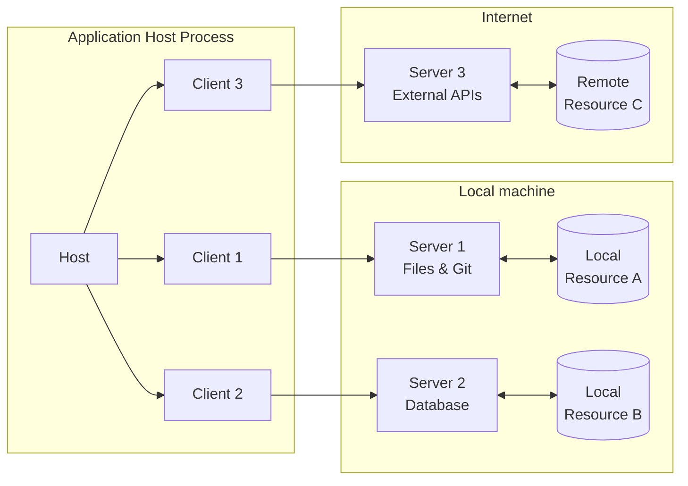
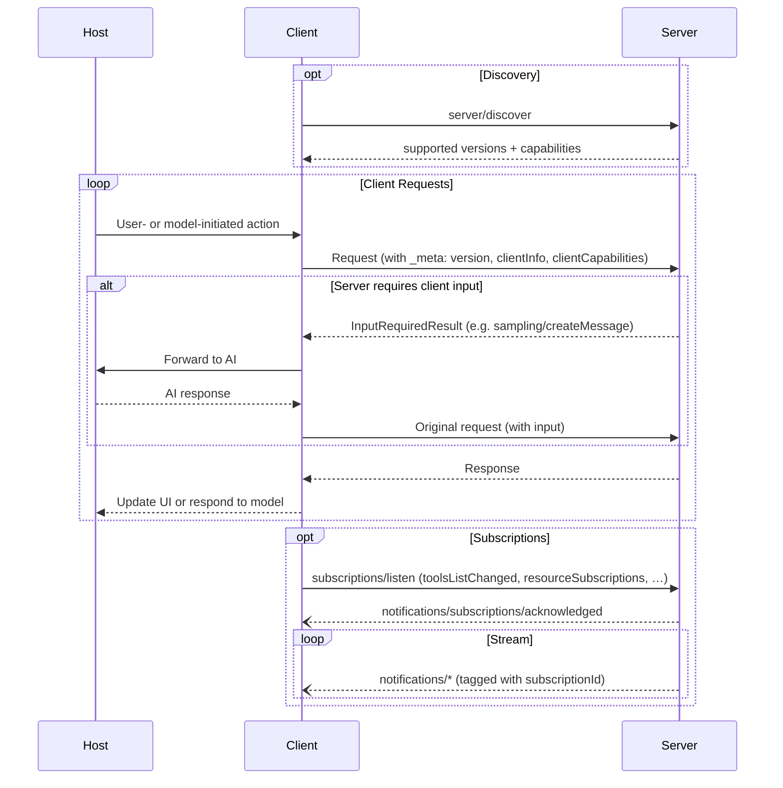

The Model Context Protocol (MCP) follows a client-host-server architecture where each
host can run multiple client instances. MCP is a stateless protocol: every request is
self-contained and carries its own protocol version, client identity, and capabilities.
This architecture enables users to integrate AI capabilities across applications while
maintaining clear security boundaries and isolating concerns. Built on JSON-RPC, MCP
provides a protocol focused on context exchange and sampling coordination between
clients and servers.

## Core Components

### Host

The host process acts as the container and coordinator:

- Creates and manages multiple client instances
- Controls client connection permissions and lifecycle
- Enforces security policies and consent requirements
- Handles user authorization decisions
- Coordinates AI/LLM integration and sampling
- Manages context aggregation across clients

### Clients

Each client is created by the host and communicates with exactly one server:

- Communicates with exactly one server
- Attaches protocol version and capabilities to every request
- Routes protocol messages bidirectionally
- Manages subscriptions and notifications
- Maintains security boundaries between servers

A host application creates and manages multiple clients, with each client having a 1:1
relationship with a particular server.

### Servers

Servers provide specialized context and capabilities:

- Expose resources, tools and prompts via MCP primitives
- Operate independently with focused responsibilities
- Request client input (sampling, elicitation, roots) via `InputRequiredResult` within a reply
- Must respect security constraints
- Can be local processes or remote services

## Design Principles

MCP is built on several key design principles that inform its architecture and
implementation:

1. **Servers should be extremely easy to build**
   - Host applications handle complex orchestration responsibilities
   - Servers focus on specific, well-defined capabilities
   - Simple interfaces minimize implementation overhead
   - Clear separation enables maintainable code

2. **Servers should be highly composable**
   - Each server provides focused functionality in isolation
   - Multiple servers can be combined seamlessly
   - Shared protocol enables interoperability
   - Modular design supports extensibility

3. **Servers should not be able to read the whole conversation, nor "see into" other
   servers**
   - Servers receive only necessary contextual information
   - Full conversation history stays with the host
   - Each server maintains isolation
   - Cross-server interactions are controlled by the host
   - Host process enforces security boundaries

4. **Features can be added to servers and clients progressively**
   - Core protocol provides minimal required functionality
   - Additional capabilities can be negotiated as needed
   - Servers and clients evolve independently
   - Protocol designed for future extensibility
   - Backwards compatibility is maintained

## Capability Negotiation

The Model Context Protocol uses a capability-based negotiation system where clients and
servers declare their supported features on each request. Clients include their
capabilities in `_meta.io.modelcontextprotocol/clientCapabilities` on every request.
Servers advertise their capabilities in response to
[`server/discover`](/specification/draft/server/discover), which clients may call before
any other request for up-front capability discovery.

- Servers declare capabilities like tool support, resource subscriptions, and prompt
  templates
- Clients declare capabilities like sampling support and elicitation handling
- Both parties must respect declared capabilities throughout the interaction
- Additional capabilities can be negotiated through extensions to the protocol

Each capability unlocks specific protocol features on a per-request basis. For example:

- Implemented [server features](/specification/draft/server) must be advertised in the
  server's capabilities
- Receiving resource update notifications requires opening a
  [`subscriptions/listen`](/specification/draft/basic/patterns/subscriptions) stream
  with the desired resource URIs
- [Tool](/specification/draft/server/tools) invocation requires the server to declare tool capabilities

This capability negotiation ensures clients and servers have a clear understanding of
supported functionality while maintaining protocol extensibility.
