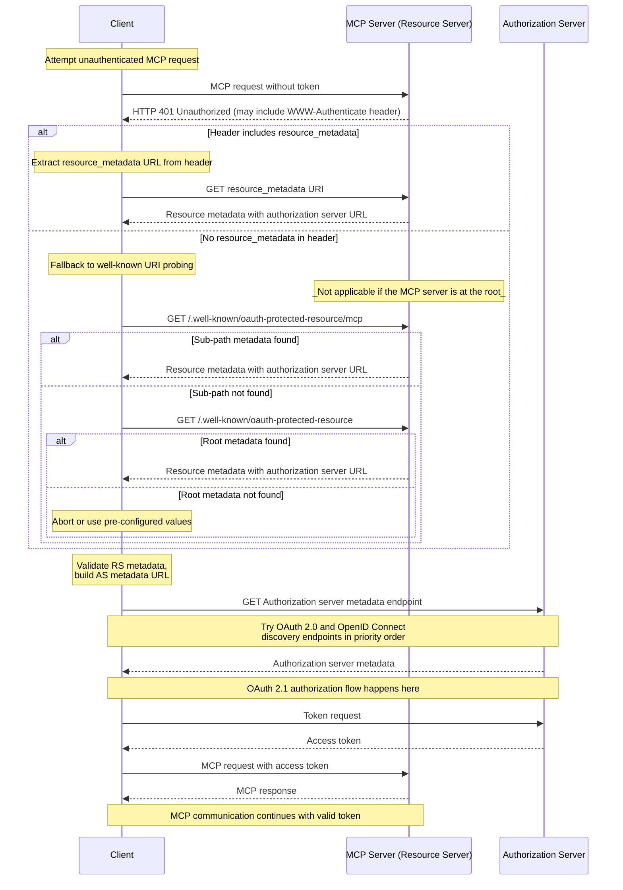

This document describes the mechanisms by which MCP servers advertise their associated
authorization servers to MCP clients, as well as the discovery process through which MCP
clients can determine authorization server endpoints and supported capabilities.

## Authorization Server Location

MCP servers **MUST** implement the OAuth 2.0 Protected Resource Metadata ([RFC9728](https://datatracker.ietf.org/doc/html/rfc9728))
specification to indicate the locations of authorization servers. The Protected Resource Metadata document returned by the MCP server **MUST** include
the `authorization_servers` field containing at least one authorization server.

The specific use of `authorization_servers` is beyond the scope of this specification; implementers should consult
OAuth 2.0 Protected Resource Metadata ([RFC9728](https://datatracker.ietf.org/doc/html/rfc9728)) for
guidance on implementation details.

Implementors should note that Protected Resource Metadata documents
can define multiple authorization servers. The responsibility for
selecting which authorization server to use lies with the MCP client,
following the guidelines specified in
[RFC9728 Section 7.6 "Authorization Servers"](https://datatracker.ietf.org/doc/html/rfc9728#name-authorization-servers).

When multiple authorization servers are listed in `authorization_servers`, each is an
independent OAuth 2.0 authorization server. Consistent with
[RFC 6749 Section 2.2](https://datatracker.ietf.org/doc/html/rfc6749#section-2.2), client
identifiers are unique to the authorization server that issued them. Clients **MUST** maintain
separate registration state (client credentials, tokens) per authorization server and
**MUST NOT** assume that credentials valid for one authorization server will be accepted by
another. See
[Authorization Server Binding](/specification/draft/basic/authorization/client-registration#authorization-server-binding)
for the requirements on associating client credentials with the authorization server that issued them.

## Protected Resource Metadata Discovery Requirements

MCP servers **MUST** implement one of the following discovery mechanisms to provide authorization server location information to MCP clients:

1. **WWW-Authenticate Header**: Include the resource metadata URL in the `WWW-Authenticate` HTTP header under `resource_metadata` when returning `401 Unauthorized` responses, as described in [RFC9728 Section 5.1](https://datatracker.ietf.org/doc/html/rfc9728#name-www-authenticate-response).

2. **Well-Known URI**: Serve metadata at a well-known URI as specified in [RFC9728](https://datatracker.ietf.org/doc/html/rfc9728). This can be either:
   - At the path of the server's MCP endpoint: `https://example.com/public/mcp` could host metadata at `https://example.com/.well-known/oauth-protected-resource/public/mcp`
   - At the root: `https://example.com/.well-known/oauth-protected-resource`

MCP clients **MUST** support both discovery mechanisms and use the resource metadata URL from the parsed `WWW-Authenticate` headers when present; otherwise, they **MUST** fall back to constructing and requesting the well-known URIs in the order listed above.

MCP clients **MUST** be able to parse `WWW-Authenticate` headers and respond appropriately to `HTTP 401 Unauthorized` responses from the MCP server.

Servers can also include a `scope` parameter in the `WWW-Authenticate` challenge to indicate the
scopes required for accessing the resource; the scope semantics and the associated client behavior
are defined in the [Scope Selection Strategy](/specification/draft/basic/authorization#scope-selection-strategy) section.

## Authorization Server Metadata Discovery

MCP uses the default `oauth-authorization-server` well-known URI
suffix defined in
[RFC 8414 Section 3.1](https://datatracker.ietf.org/doc/html/rfc8414#section-3.1)
for authorization server metadata discovery. MCP does not define
an application-specific well-known URI suffix.

To handle different issuer URL formats and ensure
interoperability with both OAuth 2.0 Authorization Server
Metadata and OpenID Connect Discovery 1.0 specifications, MCP
clients **MUST** attempt multiple well-known endpoints when
discovering authorization server metadata.

The discovery approach is based on
[RFC 8414 Section 3.1 "Authorization Server Metadata Request"](https://datatracker.ietf.org/doc/html/rfc8414#section-3.1)
for OAuth 2.0 Authorization Server Metadata discovery and
[RFC 8414 Section 5 "Compatibility Notes"](https://datatracker.ietf.org/doc/html/rfc8414#section-5)
for OpenID Connect Discovery 1.0 interoperability.

For issuer URLs with path components
(e.g., `https://auth.example.com/tenant1`), clients **MUST**
try endpoints in the following priority order:

1. OAuth 2.0 Authorization Server Metadata with path insertion:
   `https://auth.example.com/.well-known/oauth-authorization-server/tenant1`
2. OpenID Connect Discovery 1.0 with path insertion:
   `https://auth.example.com/.well-known/openid-configuration/tenant1`
3. OpenID Connect Discovery 1.0 path appending:
   `https://auth.example.com/tenant1/.well-known/openid-configuration`

For issuer URLs without path components
(e.g., `https://auth.example.com`), clients **MUST** try:

1. OAuth 2.0 Authorization Server Metadata:
   `https://auth.example.com/.well-known/oauth-authorization-server`
2. OpenID Connect Discovery 1.0:
   `https://auth.example.com/.well-known/openid-configuration`

After retrieving a metadata document, MCP clients **MUST** validate it as required by [RFC8414 Section 3.3](https://datatracker.ietf.org/doc/html/rfc8414#section-3.3) or [OpenID Connect Discovery Section 4.3](https://openid.net/specs/openid-connect-discovery-1_0.html#ProviderConfigurationValidation): the `issuer` value in the document **MUST** be identical to the issuer identifier used to construct the well-known URL. If they differ, the client **MUST NOT** use the metadata. For example, a document fetched from `https://attacker.example/.well-known/oauth-authorization-server` that contains `"issuer": "https://honest.example"` **MUST** be rejected.

## Sequence Diagram

The following diagram outlines an example flow:

