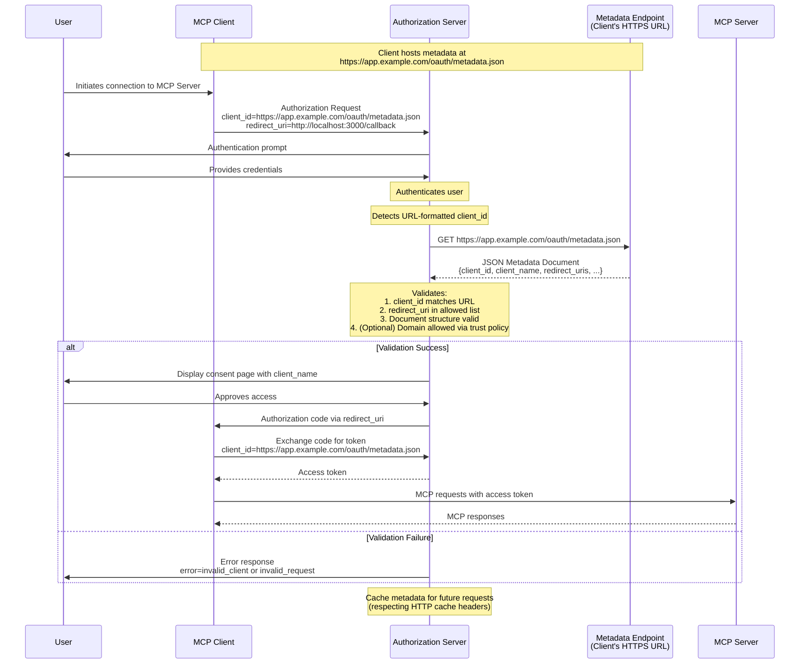

<div id="enable-section-numbers" />

MCP supports three client registration mechanisms. Choose based on your scenario:

- **[Client ID Metadata Documents](#client-id-metadata-documents)**: When client and server have no prior relationship (most common)
- **[Pre-registration](#pre-registration)**: When client and server have an existing relationship
- **[Dynamic Client Registration](#dynamic-client-registration)**: For backwards compatibility or specific requirements

Clients supporting all options **SHOULD** use the following priority order:

1. Use pre-registered client information for the server if the client has it available
2. Use Client ID Metadata Documents if the Authorization Server indicates that it supports them (via `client_id_metadata_document_supported` in OAuth Authorization Server Metadata)
3. Use Dynamic Client Registration as a fallback if the Authorization Server supports it (via `registration_endpoint` in OAuth Authorization Server Metadata)
4. Prompt the user to enter the client information if no other option is available

## Client ID Metadata Documents

MCP clients and authorization servers **SHOULD** support OAuth Client ID Metadata Documents as specified in
[OAuth Client ID Metadata Document](https://datatracker.ietf.org/doc/html/draft-ietf-oauth-client-id-metadata-document-00)
for client registration.

This approach enables clients to use HTTPS URLs as client identifiers, where the URL points to a JSON document
containing client metadata. This addresses the common MCP scenario where servers and clients have
no pre-existing relationship.

### Implementation Requirements

MCP implementations supporting Client ID Metadata Documents **MUST** follow the requirements specified in
[OAuth Client ID Metadata Document](https://datatracker.ietf.org/doc/html/draft-ietf-oauth-client-id-metadata-document-00).
Key requirements include:

**For MCP Clients:**

- Clients **MUST** host their metadata document at an HTTPS URL following RFC requirements
- The `client_id` URL **MUST** use the "https" scheme and contain a path component, e.g. `https://example.com/client.json`
- The metadata document **MUST** include at least the following properties: `client_id`, `client_name`, `redirect_uris`
- Clients **MUST** ensure the `client_id` value in the metadata matches the document URL exactly
- Clients **MAY** use `private_key_jwt` for client authentication (e.g., for requests to the token endpoint) with appropriate JWKS configuration as described in [Section 6.2 of Client ID Metadata Document](https://www.ietf.org/archive/id/draft-ietf-oauth-client-id-metadata-document-00.html#section-6.2)

**For Authorization Servers:**

- **SHOULD** fetch metadata documents when encountering URL-formatted client_ids
- **MUST** validate that the fetched document's `client_id` matches the URL exactly
- **SHOULD** cache metadata respecting HTTP cache headers
- **MUST** validate redirect URIs presented in an authorization request against those in the metadata document
- **MUST** validate the document structure is valid JSON and contains required fields
- **SHOULD** follow the security considerations in [Section 6 of Client ID Metadata Document](https://www.ietf.org/archive/id/draft-ietf-oauth-client-id-metadata-document-00.html#section-6) and in [Client ID Metadata Document Security](/specification/draft/basic/authorization/security-considerations#client-id-metadata-document-security)

### Example Metadata Document

```json
{
  "client_id": "https://app.example.com/oauth/client-metadata.json",
  "client_name": "Example MCP Client",
  "client_uri": "https://app.example.com",
  "logo_uri": "https://app.example.com/logo.png",
  "redirect_uris": [
    "http://127.0.0.1:3000/callback",
    "http://localhost:3000/callback"
  ],
  "grant_types": ["authorization_code"],
  "response_types": ["code"],
  "token_endpoint_auth_method": "none"
}
```

### Client ID Metadata Documents Flow

The following diagram illustrates the complete flow when using Client ID Metadata Documents:



### Advertising CIMD Support

Authorization servers advertise that they support clients using Client ID Metadata Documents by including the following property in their OAuth Authorization Server metadata:

```json
{
  "client_id_metadata_document_supported": true
}
```

MCP clients **SHOULD** check for this capability and **MAY** fall back to
[Dynamic Client Registration](#dynamic-client-registration)
or [pre-registration](#pre-registration) if unavailable.

## Pre-registration

MCP clients **SHOULD** support an option for static client credentials such as those supplied by a pre-registration flow. This could be:

1. Hardcode a client ID (and, if applicable, client credentials) specifically for the MCP client to use when
   interacting with that authorization server, or
2. Present a UI to users that allows them to enter these details, after registering an
   OAuth client themselves (e.g., through a configuration interface hosted by the
   server).

## Dynamic Client Registration

<Warning>
  Dynamic Client Registration is deprecated. New implementations should use
  [Client ID Metadata Documents](#client-id-metadata-documents) instead. This
  option remains available for backwards compatibility with authorization
  servers that do not support Client ID Metadata Documents.
</Warning>

MCP clients and authorization servers **MAY** support the
OAuth 2.0 Dynamic Client Registration Protocol [RFC7591](https://datatracker.ietf.org/doc/html/rfc7591)
to allow MCP clients to obtain OAuth client IDs without user interaction.
This option is included for backwards compatibility with earlier versions of the MCP authorization spec.

### Application Type and Redirect URI Constraints

When authorization servers support OpenID Connect (OIDC) and
Dynamic Client Registration, they may enforce additional
constraints on redirect URIs based on the `application_type`
parameter as defined in
[OpenID Connect Dynamic Client Registration 1.0](https://openid.net/specs/openid-connect-registration-1_0.html).

MCP clients **MUST** specify an appropriate `application_type`
during Dynamic Client Registration. Omitting it defaults to
`"web"` under OIDC, which can conflict with native-style redirect
URIs; non-OIDC servers safely ignore the parameter.

- **Native applications** (desktop applications, mobile apps,
  CLI tools, and locally-hosted web applications accessed via
  `localhost`) **SHOULD** use `application_type: "native"`
- **Web applications** (remote browser-based applications
  served from a non-local host) **SHOULD** use
  `application_type: "web"`

MCP clients **MUST** be prepared to handle registration
failures due to redirect URI constraints when authorization
servers implement OIDC. When a registration request is rejected,
clients **SHOULD** surface a meaningful error to the user or
developer. Clients **MAY** retry registration with an adjusted
`application_type` or with redirect URIs that conform to the
authorization server's requirements for the given application
type.

## Authorization Server Binding

Clients that use pre-registered credentials, or persist client credentials obtained via Dynamic Client
Registration, **MUST** associate those
credentials with the specific authorization server that issued them,
keyed by the authorization server's `issuer` identifier. When the
authorization server changes (detected via updated
[protected resource metadata](/specification/draft/basic/authorization/authorization-server-discovery#authorization-server-location)),
clients **MUST NOT** reuse client credentials
from a different authorization server and **MUST** re-register
with the new authorization server.

Pre-registered credentials are inherently specific to a particular
authorization server. If the authorization server indicated by
protected resource metadata no longer matches the one the
credentials were registered with, clients **SHOULD** surface an
error rather than silently attempting to use mismatched credentials.

Client IDs based on Client ID Metadata Documents are portable
across authorization servers, since they are self-hosted HTTPS URLs
resolved by the authorization server on demand. No re-registration
is needed when the authorization server changes.
