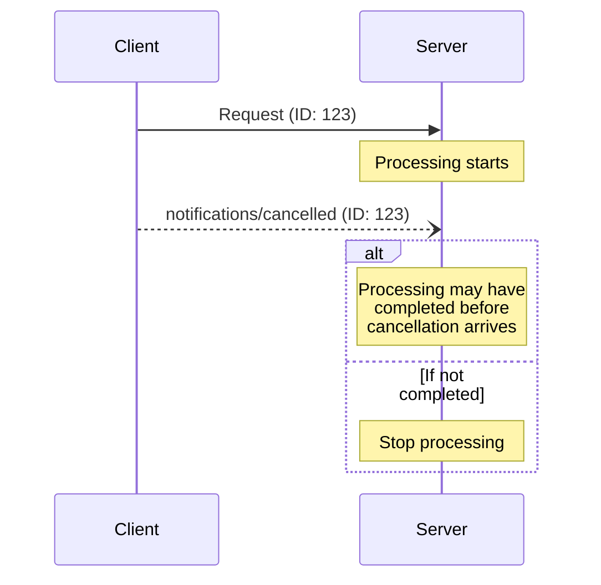

<div id="enable-section-numbers" />

The Model Context Protocol (MCP) supports optional cancellation of in-progress requests
through notification messages. A client **SHOULD** send a cancellation notification
to indicate that a request it previously issued should be terminated.

A server **MUST** send `notifications/cancelled`
referencing a `subscriptions/listen` request ID when it tears down that subscription
stream (see [Subscriptions][subscriptions]). Servers **MUST NOT** send
`notifications/cancelled` for any other purpose.

## Cancellation Flow

When a client wants to cancel an in-progress request, it sends a `notifications/cancelled`
notification containing:

- The ID of the request to cancel
- An optional reason string that can be logged or displayed

```json
{
  "jsonrpc": "2.0",
  "method": "notifications/cancelled",
  "params": {
    "requestId": "123",
    "reason": "User requested cancellation"
  }
}
```

## Transport-Specific Cancellation

How a client signals cancellation depends on the transport:

- **Streamable HTTP**: Closing the SSE response stream is the cancellation signal.
  The server **MUST** treat a client disconnect as cancellation of that request. No
  `notifications/cancelled` message is required or expected.
- **stdio**: There is no per-request stream to close. The client **MUST** send a
  `notifications/cancelled` notification referencing the request ID.

## Timeouts

Implementations **SHOULD** establish timeouts for all sent requests, to prevent hung
connections and resource exhaustion. When the request has not received a success or error
response within the timeout period, the sender **SHOULD** cancel the request and stop
waiting for a response. As described in
[Transport-Specific Cancellation](#transport-specific-cancellation), this means:

- **Streamable HTTP**: closing the response stream for the request, which constitutes
  cancellation.
- **stdio**: sending a `notifications/cancelled` notification referencing the request ID.

SDKs and other middleware **SHOULD** allow these timeouts to be configured on a
per-request basis.

Implementations **MAY** choose to reset the timeout clock when receiving a
[progress notification](/specification/draft/basic/patterns/progress) corresponding to
the request, as this implies that work is actually happening. However, implementations
**SHOULD** always enforce a maximum timeout, regardless of progress notifications, to
limit the impact of a misbehaving client or server.

## Behavior Requirements

1. Cancellation notifications **MUST** only reference requests that:
   - Were previously issued by the client
   - Are believed to still be in-progress
1. Server-sent cancellation notifications **MUST** reference a
   `subscriptions/listen` request, to terminate that subscription stream
1. Servers receiving cancellation notifications **SHOULD**:
   - Stop processing the cancelled request
   - Free associated resources
   - Not send a response for the cancelled request
1. Servers **MAY** ignore cancellation notifications if:
   - The referenced request is unknown
   - Processing has already completed
   - The request cannot be cancelled
1. The client **SHOULD** ignore any response to the cancelled request that arrives
   afterward

## Timing Considerations

Due to network latency, cancellation notifications may arrive after request processing
has completed, and potentially after a response has already been sent.

Both parties **MUST** handle these race conditions gracefully:



## Implementation Notes

- Both parties **SHOULD** log cancellation reasons for debugging
- Application UIs **SHOULD** indicate when cancellation is requested

## Error Handling

Invalid cancellation notifications **SHOULD** be ignored:

- Unknown request IDs
- Already completed requests
- Malformed notifications

This maintains the "fire and forget" nature of notifications while allowing for race
conditions in asynchronous communication.

[subscriptions]: /specification/draft/basic/patterns/subscriptions
