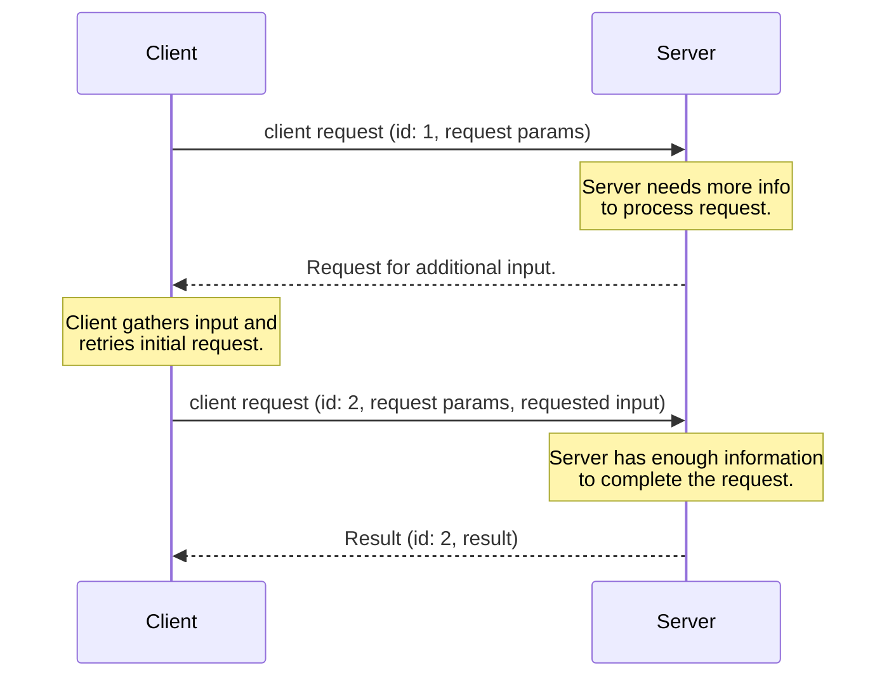
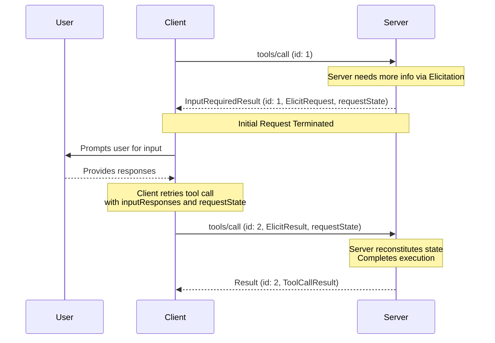

<div id="enable-section-numbers" />

<Note>
  Multi Round-Trip Requests (MRTR) was introduced in this version of the MCP
  specification. This replaces the previous approach of sending server-initiated
  requests. Servers **MUST** send server-to-client requests (such as
  `roots/list`, `sampling/createMessage`, or `elicitation/create`) using the
  MRTR pattern. The previous pattern of server-initiated requests is no longer
  supported. This is a breaking change.
</Note>

## Multi Round-Trip Requests

The Model Context Protocol (MCP) defines several ways for servers to request additional information
from users during the processing of client requests (such as
`roots/list`, `sampling/createMessage`, or `elicitation/create`). The **multi round-trip requests** pattern
provides a standardized way to handle these server-requests without requiring a shared storage layer across
server instances or requiring stateful load balancing.

The high level flow functions as follows:

1. Client sends an initial request to the server with the parameters needed to perform the operation.
1. Server determines that additional information is required to fulfill the request and responds requesting more information.
1. Client gathers the requested information from the user or other sources, then retries the original request including the additional requested information.
1. Server determines it has sufficient information to complete the operation, and responds with the final result.



### Core Types

This flow is implemented in MCP using the following Types.

#### InputRequests

An [`InputRequests`](/specification/draft/schema#inputrequests) object is a map of server-client requests.
Keys are server-assigned string identifiers;
values are request objects (e.g., [`ElicitRequest`](/specification/draft/schema#elicitrequest), [`CreateMessageRequest`](/specification/draft/schema#createmessagerequest), or [`ListRootsRequest`](/specification/draft/schema#listrootsrequest)).

```json
{
  "github_login": {
    "method": "elicitation/create",
    "params": {
      "mode": "form",
      "message": "Please provide your GitHub username",
      "requestedSchema": {
        "type": "object",
        "properties": {
          "name": { "type": "string" }
        },
        "required": ["name"]
      }
    }
  },
  "capital_of_france": {
    "method": "sampling/createMessage",
    "params": {
      "messages": [
        {
          "role": "user",
          "content": {
            "type": "text",
            "text": "What is the capital of France?"
          }
        }
      ],
      "systemPrompt": "You are a helpful assistant.",
      "maxTokens": 100
    }
  }
}
```

#### InputResponses

An [`InputResponses`](/specification/draft/schema#inputresponses) object is a map of client responses to the server requests.
Keys correspond to the keys in the `InputRequests` map; values are the client's result for each request (e.g., [`ElicitResult`](/specification/draft/schema#elicitresult), [`CreateMessageResult`](/specification/draft/schema#createmessageresult), or [`ListRootsResult`](/specification/draft/schema#listrootsresult)).

```json
{
  "github_login": {
    "action": "accept",
    "content": {
      "name": "octocat"
    }
  },
  "capital_of_france": {
    "role": "assistant",
    "content": {
      "type": "text",
      "text": "The capital of France is Paris."
    },
    "model": "claude-3-sonnet-20240307",
    "stopReason": "endTurn"
  }
}
```

#### InputRequiredResult

An [`InputRequiredResult`](/specification/draft/schema#inputrequiredresult) is a type of [`Result`](/specification/draft/basic#responses),
indicating that additional input is needed before the request can be completed.

- `inputRequests` _(optional)_: An [`InputRequests`](/specification/draft/schema#inputrequests) map of server-initiated requests that the client must fulfill.
- `requestState` _(optional)_: An opaque string meaningful only to the server. Clients **MUST NOT** inspect, parse, modify, or make any assumptions about its contents.

```json
{
  "jsonrpc": "2.0",
  "id": 1,
  "result": {
    "resultType": "input_required",
    "inputRequests": {
      // Elicitation request.
      "github_login": {
        "method": "elicitation/create",
        "params": {
          "mode": "form",
          "message": "Please provide your GitHub username",
          "requestedSchema": {
            "type": "object",
            "properties": {
              "name": { "type": "string" }
            },
            "required": ["name"]
          }
        }
      },
      // Sampling request.
      "capital_of_france": {
        "method": "sampling/createMessage",
        "params": {
          "messages": [
            {
              "role": "user",
              "content": {
                "type": "text",
                "text": "What is the capital of France?"
              }
            }
          ],
          "modelPreferences": {
            "hints": [{ "name": "claude-3-sonnet" }],
            "intelligencePriority": 0.8,
            "speedPriority": 0.5
          },
          "systemPrompt": "You are a helpful assistant.",
          "maxTokens": 100
        }
      }
    },
    "requestState": "AEAD-protected blob"
  }
}
```

### Supported Requests

Servers **MAY** send `InputRequiredResult` responses on the following client requests:

| Client Request                                                              | Supports InputRequiredResult |
| --------------------------------------------------------------------------- | ---------------------------- |
| [`prompts/get`](/specification/draft/server/prompts#getting-a-prompt)       | Yes                          |
| [`resources/read`](/specification/draft/server/resources#reading-resources) | Yes                          |
| [`tools/call`](/specification/draft/server/tools#calling-tools)             | Yes                          |

Servers **MUST NOT** send `InputRequiredResult` responses on any other client requests.

### Basic Workflow

The basic workflow describes how a server can request additional input from the client as part of a client-server request.
In this example we use `tools/call` as the client request, but the same pattern applies to any of the supported requests listed above.

Notably, it allows servers to request additional information without maintaining any server-side state.
The server encodes any needed context into the `requestState` field, which the client echoes back on retry.



Note that the requests in each step are completely independent: the server processing the retry does not need any information beyond
what is directly present in the retry request.

#### Server Requirements (Basic Workflow)

1. Servers **MAY** respond to any [supported client request](#supported-requests) with an `InputRequiredResult`.
1. The `InputRequiredResult` **MAY** include an `inputRequests` field.
   - `inputRequests` keys are server assigned identifiers and **MUST** be unique within the scope of the request.
   - `inputRequests` values are request objects that **MUST** be one of [`ElicitRequest`](/specification/draft/schema#elicitrequest), [`CreateMessageRequest`](/specification/draft/schema#createmessagerequest), or [`ListRootsRequest`](/specification/draft/schema#listrootsrequest)

1. The `InputRequiredResult` **MAY** include a `requestState` field. If specified, this field is an opaque string meaningful only to the server. Servers are free to encode the state in any format (e.g. base64-encoded JSON, encrypted JWT, serialized binary).
1. If a client request contains a `requestState` field, servers **MUST** treat `requestState` as an attacker-controlled input. If `requestState` influences authorization, resource access, or business logic, servers **MUST** protect its integrity (e.g. HMAC or AEAD)
   and **MUST** reject state that fails verification. Integrity protection **MAY** be omitted only when tampering can cause nothing worse than request failure.
1. To prevent replay, servers **SHOULD** include the following inside the integrity-protected `requestState` payload and verify each on receipt:
   - the authenticated principal, rejecting state presented by a different principal.
   - a short expiry (TTL), rejecting state presented after it lapses;
   - an identifier for the originating request, e.g. the method name and a digest of its salient parameters, rejecting state presented on a request that does not match.
     <Warning>
       Note that these measures bound the replay window and prevent cross-user
       and cross-request reuse, but do not by themselves guarantee single-use.
       Servers for which a given `requestState` must be consumed at most once
       (e.g., one-time redemptions) **MUST** enforce that invariant server-side.
     </Warning>

1. Servers **MUST** include at least one of `inputRequests` or `requestState` in every `InputRequiredResult` response.
1. Servers **MUST NOT** send an `inputRequests` that the client has not declared support for in its capabilities. For example, if a client does not declare support for `elicitation`, the server **MUST NOT** include any `elicitation/create` requests in the `inputRequests` field.
1. Servers **MUST NOT** assume that clients will fulfill the `inputRequests` or retry the original request. Servers **MAY** choose to return an `InputRequiredResult` on multiple attempts at the same request if they want to repeatedly prompt the user for information until they have what they need to complete the request.

#### Client Requirements (Basic Workflow)

1. If a client receives an `InputRequiredResult` that contains the `inputRequests` field, the client **MUST** construct the requested
   inputs before retrying the original request. If the `InputRequiredResult` does _not_ contain the `inputRequests` field,
   the client **MAY** retry the original request immediately.
1. If an `InputRequiredResult` contains the `requestState` field, the client **MUST** echo back the exact value of that field when retrying the original request.
   Clients **MUST NOT** inspect, parse, modify, or make any assumptions about the `requestState` contents. If the `InputRequiredResult` does not contain a `requestState` field, the client **MUST NOT** include one in the retry.
1. The JSON-RPC `id` **MUST** be different between the initial request and the retry, as they are independent requests.
1. Both the `inputRequests` and `requestState` fields affect only the client's retry of the original request. They **MUST NOT** be used for any other request that the client may be sending in parallel.

### Error Handling

Servers **SHOULD** validate that the data provided by the client is a valid `InputResponses` object and that the information inside can be correctly parsed.
Protocol errors (malformed JSON, invalid schema, internal server errors) **SHOULD** return a JSON-RPC error response with an appropriate error code and message.

If additional, unexpected parameters are provided in the `InputResponses` object, the server **SHOULD** ignore any information it does not recognize or need.

If the client fails to send all the information requested in a previous `InputRequests`, and the missing information is necessary for the server to process the request,
the server **SHOULD** respond with a new `InputRequiredResult` requesting the missing information again, rather than returning an error.

### Security Considerations

Because `requestState` passes through the client, malicious or compromised clients could attempt to modify it to alter server behavior,
bypass authorization checks, or corrupt server logic. Servers **MUST** validate request state as described in the [server requirements](#server-requirements-basic-workflow) above.
