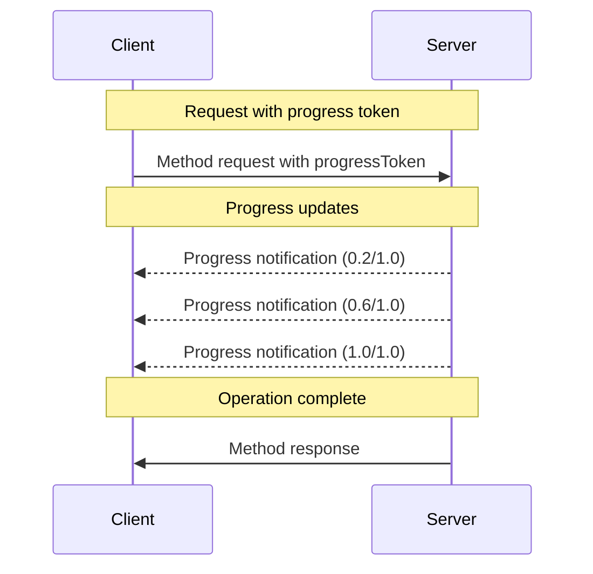

<div id="enable-section-numbers" />

The Model Context Protocol (MCP) supports optional progress tracking for long-running
operations through notification messages. The server **MAY** send progress notifications
to report the status of requests the client has issued.

## Progress Flow

When a client wants to _receive_ progress updates for a request, it includes a
`progressToken` in the request metadata.

- Progress tokens **MUST** be a string or integer value
- Progress tokens can be chosen by the client using any means, but **MUST** be unique
  across all active requests.

```json
{
  "jsonrpc": "2.0",
  "id": 1,
  "method": "some_method",
  "params": {
    "_meta": {
      "progressToken": "abc123"
    }
  }
}
```

The server **MAY** then send progress notifications containing:

- The original progress token
- The current progress value so far
- An optional "total" value
- An optional "message" value

```json
{
  "jsonrpc": "2.0",
  "method": "notifications/progress",
  "params": {
    "progressToken": "abc123",
    "progress": 50,
    "total": 100,
    "message": "Reticulating splines..."
  }
}
```

- The `progress` value **MUST** increase with each notification, even if the total is
  unknown.
- The `progress` and the `total` values **MAY** be floating point.
- The `message` field **SHOULD** provide relevant human readable progress information.

## Behavior Requirements

1. Progress notifications **MUST** only reference tokens that:
   - Were provided in an active request
   - Are associated with an in-progress operation

2. Servers receiving a request with a progress token **MAY**:
   - Choose not to send any progress notifications
   - Send notifications at whatever frequency they deem appropriate
   - Omit the total value if unknown



## Implementation Notes

- Clients and servers **SHOULD** track active progress tokens
- Both parties **SHOULD** implement rate limiting to prevent flooding
- Progress notifications **MUST** stop after completion
