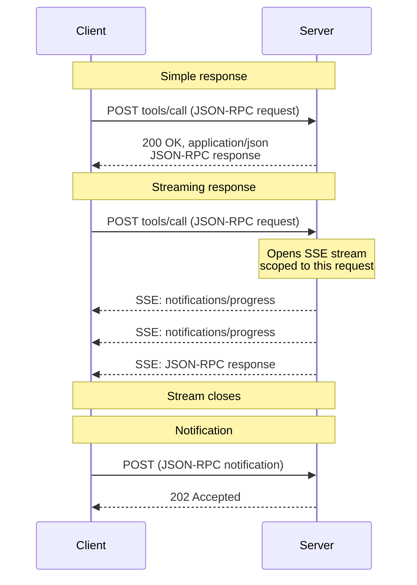
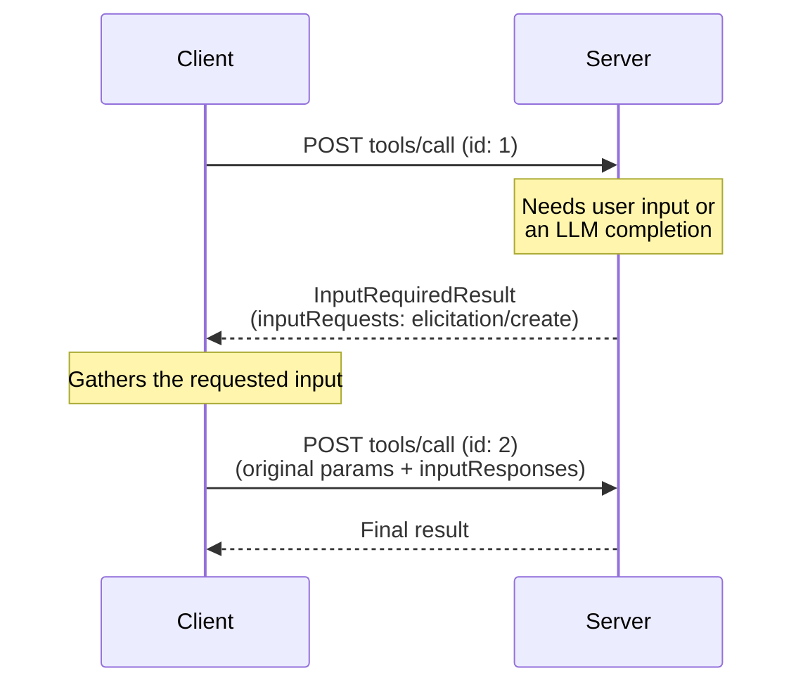
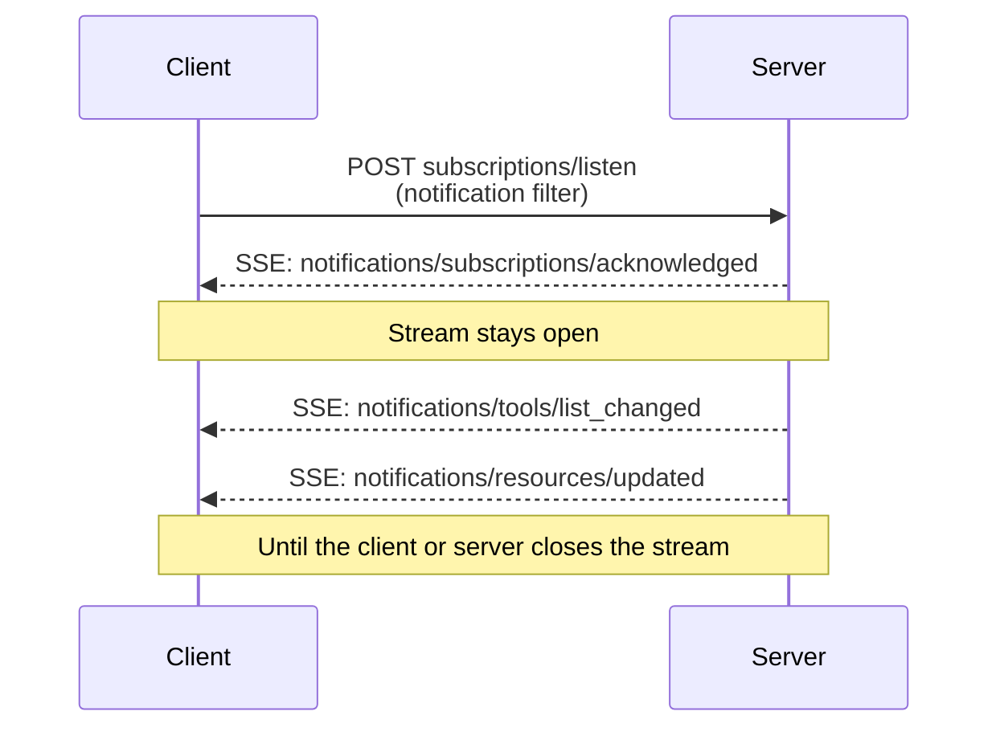

<div id="enable-section-numbers" />

<Info>

Streamable HTTP was introduced in protocol version 2025-03-26 as a replacement
for the [HTTP+SSE transport][http-sse] from protocol version 2024-11-05.

</Info>

<Info>

Revision 2026-07-28 changed the behavior of Streamable HTTP. Clients must
ensure they handle backwards compatibility correctly. Changes included:

- Removal of the GET stream endpoint.
- Removal of protocol-level sessions.

See the [changelog](/specification/draft/changelog) and
[Backward Compatibility](#backward-compatibility) below.

</Info>

In the **Streamable HTTP** transport, the server operates as an independent
process that can handle multiple client connections. At a glance:

- The server exposes a single HTTP endpoint (the **MCP endpoint**) that
  accepts POST.
- The client sends every JSON-RPC request or notification as its own HTTP
  POST.
- The server answers each request with either a single JSON object or a
  [Server-Sent Events][sse] (SSE) stream scoped to that request, carrying
  request-related notifications followed by the final response.
- Server-to-client interactions (sampling, elicitation, roots) are embedded
  in results as input requests per
  [Multi Round-Trip Requests (MRTR)][mrtr] ([SEP-2322][sep-2322]).
- Long-lived change notifications (such as list changes and resource updates)
  are delivered on the response stream of a
  [`subscriptions/listen`][subscriptions-listen] request.

See [Message Flow](#message-flow) for sequence diagrams of these
interactions.

The server **MUST** provide a single HTTP endpoint path (hereafter referred to
as the **MCP endpoint**) that supports POST. For example, this could be a URL
like `https://example.com/mcp`.

[http-sse]: /specification/2024-11-05/basic/transports#http-with-sse
[sse]: https://en.wikipedia.org/wiki/Server-sent_events

## Security & Endpoint

When implementing Streamable HTTP transport:

1. Servers **MUST** validate the `Origin` header on all incoming connections
   to prevent DNS rebinding attacks.
   - If the `Origin` header is present and invalid, servers **MUST** respond
     with HTTP 403 Forbidden. The HTTP response body **MAY** comprise a
     JSON-RPC _error response_ that has no `id`.
2. When running locally, servers **SHOULD** bind only to localhost
   (127.0.0.1) rather than all network interfaces (0.0.0.0).
3. Servers **SHOULD** implement proper authentication for all connections.

Without these protections, attackers could use DNS rebinding to interact with
local MCP servers from remote websites.

## Sending Messages

Every JSON-RPC message sent from the client **MUST** be a new HTTP POST
request to the MCP endpoint.

1. The client **MUST** use HTTP POST to send JSON-RPC messages.
2. The client **MUST** include an `Accept` header listing both
   `application/json` and `text/event-stream` as supported content types.
3. The client **MUST** include the [request metadata headers](#request-metadata)
   on each POST request.
4. The body of the HTTP POST **MUST** be a single JSON-RPC _request_ or
   _notification_. The client **MUST NOT** send JSON-RPC _responses_.
5. If the body is a JSON-RPC _notification_:
   - If the server accepts it, the server **MUST** return HTTP status code
     `202 Accepted` with no body.
   - If the server cannot accept it, it **MUST** return an HTTP error status
     code (e.g., `400 Bad Request`). The HTTP response body **MAY** comprise
     a JSON-RPC _error response_ that has no `id`.
6. If the body is a JSON-RPC _request_, the server **MUST** return either
   `Content-Type: application/json` (a single JSON object) or
   `Content-Type: text/event-stream` (an SSE response stream). The client
   **MUST** support both.

<Note>

This revision of the core protocol defines no client-to-server
_notifications_ over Streamable HTTP. The only client-sent notification in
the core protocol, `notifications/cancelled`, is used only on the
[stdio](/specification/draft/basic/transports/stdio) transport; on
Streamable HTTP, closing the SSE response stream is itself the cancellation
signal and no `notifications/cancelled` message is expected (see
[Cancellation][cancellation]). The notification rules above describe the
transport mechanics for a notification POST; header requirements for
notification POSTs are not defined by this revision.

</Note>

## Receiving Messages

When the server returns an SSE response stream
(`Content-Type: text/event-stream`):

- The server **MAY** send JSON-RPC _notifications_ — for example,
  [`notifications/progress`][notifications-progress]
  or [`notifications/message`][notifications-message] —
  before the final response. These notifications **MUST** relate to the
  originating client request.
- The server **MUST NOT** send independent JSON-RPC _requests_ on this stream.
  Server-to-client interactions (sampling, elicitation, list-roots) are
  embedded as input requests inside an
  [`InputRequiredResult`][input-required-result] per
  [MRTR][mrtr] ([SEP-2322][sep-2322]), not delivered as separate requests on
  this or any other stream. This is a change from Streamable HTTP in protocol
  versions `2025-03-26` through `2025-11-25`, where servers could send such
  requests on SSE streams.
- The final JSON-RPC _response_ **SHOULD** terminate the stream.

Long-lived notification streams are obtained by sending a
[`subscriptions/listen`][subscriptions-listen]
request. The server's response is itself an SSE stream that stays open and
delivers the change notifications the client opted in to (such as
`notifications/tools/list_changed` or `notifications/resources/updated`).
Request-scoped notifications like `notifications/progress` and
`notifications/message` are **not** delivered on the listen stream — they
flow only on the response stream of the request they relate to.

When initiating an SSE stream, servers **SHOULD** include the
`X-Accel-Buffering: no` header in the HTTP response. This instructs reverse
proxies (such as nginx) to disable response buffering, ensuring that SSE
events are delivered to clients immediately rather than being held in a
buffer. Without this header, proxies may accumulate messages before sending
them to the client, introducing unwanted latency and potentially breaking the
real-time nature of SSE communication.

<Note>

For long-lived streams — in particular the
[`subscriptions/listen`][subscriptions-listen] response stream — servers are
encouraged to periodically emit an SSE comment line (a line beginning with a
colon, e.g. `:\r\n`) as a keep-alive. This keeps the connection from being
closed by intermediaries or client idle timeouts during quiet periods when no
notifications are flowing. Per the [SSE specification][sse], any line beginning
with a colon is a comment that carries no event data; clients must ignore such
lines and must not treat them as malformed input.

</Note>

Resumable SSE streams via `Last-Event-ID` are not supported.

[notifications-progress]: /specification/draft/basic/patterns/progress
[notifications-message]: /specification/draft/server/utilities/logging
[input-required-result]: /specification/draft/schema#inputrequiredresult
[mrtr]: /specification/draft/basic/patterns/mrtr
[sep-2322]: /seps/2322-MRTR
[subscriptions-listen]: /specification/draft/basic/patterns/subscriptions

## Message Flow

The following diagrams illustrate the message flows on a single MCP endpoint.

**Requests and responses.** Each request is its own POST; the server chooses
per request whether to respond with a single JSON object or an SSE stream:



**Server-to-client interactions (MRTR).** When the server needs input from
the client — sampling, elicitation, or roots — it does not send its own
JSON-RPC request. It returns an
[`InputRequiredResult`][input-required-result] containing `inputRequests`,
and the client retries the original request with the matching
`inputResponses` (see [Multi Round-Trip Requests][mrtr]):



**Change notifications.** Clients that want server-initiated change
notifications open a long-lived stream with
[`subscriptions/listen`][subscriptions-listen]; the response stream stays
open and carries only the notification types the client opted in to:



## Cancellation

Closing the SSE response stream **MUST** be treated by the server as
cancellation of that request. Because each request has its own response
stream, the transport-level disconnect is unambiguous. The server **SHOULD**
stop work on the cancelled request as soon as practical and **MUST NOT** send
any further messages for it. See
[Cancellation][cancellation] for the full rules.

[cancellation]: /specification/draft/basic/patterns/cancellation

## Request Metadata

The Streamable HTTP transport mirrors selected JSON-RPC body fields into HTTP
headers so that intermediaries (load balancers, gateways, observability
tooling) can route and inspect requests without parsing the body.

### Protocol Version Header

Every POST request to the MCP endpoint **MUST** include an
`MCP-Protocol-Version` header.

For example: `MCP-Protocol-Version: 2026-07-28`

The header value **MUST** match the
`io.modelcontextprotocol/protocolVersion` field carried in the request body's
`_meta`. If the values do not match, the server **MUST** reject the request
with `400 Bad Request` and a `HeaderMismatch` JSON-RPC error
(see [Server Validation](#server-validation)).

If the server does not implement the requested protocol version (whether the
version is unknown to the server, or is a known version the server has chosen
not to support), it **MUST** respond with `400 Bad Request` and an
[`UnsupportedProtocolVersionError`][unsupported-version]
listing its supported versions. See
[Versioning: Protocol Version Negotiation][lifecycle-version]
for the negotiation flow.

If the server does not implement the requested RPC method, it **MUST** respond
with `404 Not Found` and a JSON-RPC error with code `-32601`
(`Method not found`). The JSON-RPC error body distinguishes this case from a
`404` returned by a legacy [HTTP+SSE][http-sse] server that does not host the
modern MCP endpoint (see [Backward Compatibility](#backward-compatibility)).

A server that supports clients implementing protocol versions earlier than
`2025-06-18` (which did not define the `MCP-Protocol-Version` header) **MAY**
treat a request that omits the header as protocol version `2025-03-26`. A
server that does not support such clients **MUST** reject a request without
the header per [Server Validation](#server-validation).

[unsupported-version]: /specification/draft/schema#unsupportedprotocolversionerror
[lifecycle-version]: /specification/draft/basic/versioning#protocol-version-negotiation

### Standard Request Headers

| Header Name  | Source Field                  | Required For                                           |
| ------------ | ----------------------------- | ------------------------------------------------------ |
| `Mcp-Method` | `method`                      | All requests                                           |
| `Mcp-Name`   | `params.name` or `params.uri` | `tools/call`, `resources/read`, `prompts/get` requests |

These headers are **REQUIRED** for compliance.

If the `Mcp-Name` source value cannot be safely represented as a plain ASCII
header value, clients **MUST** encode it using the Base64 sentinel format
described in [Value Encoding](#value-encoding).

**`tools/call` request:**

```http
POST /mcp HTTP/1.1
Content-Type: application/json
MCP-Protocol-Version: 2026-07-28
Mcp-Method: tools/call
Mcp-Name: get_weather

{
  "jsonrpc": "2.0",
  "id": 1,
  "method": "tools/call",
  "params": {
    "name": "get_weather",
    "arguments": {
      "location": "Seattle, WA"
    },
    "_meta": {
      "io.modelcontextprotocol/protocolVersion": "2026-07-28",
      "io.modelcontextprotocol/clientInfo": {
        "name": "ExampleClient",
        "version": "1.0.0"
      },
      "io.modelcontextprotocol/clientCapabilities": {}
    }
  }
}
```

**`resources/read` request:**

```http
POST /mcp HTTP/1.1
Content-Type: application/json
MCP-Protocol-Version: 2026-07-28
Mcp-Method: resources/read
Mcp-Name: file:///projects/myapp/config.json

{
  "jsonrpc": "2.0",
  "id": 2,
  "method": "resources/read",
  "params": {
    "uri": "file:///projects/myapp/config.json",
    "_meta": {
      "io.modelcontextprotocol/protocolVersion": "2026-07-28",
      "io.modelcontextprotocol/clientInfo": {
        "name": "ExampleClient",
        "version": "1.0.0"
      },
      "io.modelcontextprotocol/clientCapabilities": {}
    }
  }
}
```

### Custom Headers from Tool Parameters

MCP servers **MAY** designate specific tool parameters to be mirrored into
HTTP headers using an `x-mcp-header` extension property in the parameter's
schema within the tool's `inputSchema`. See
[Tool Definitions][tool-definitions] for
details on how to annotate tool parameters.

While the use of `x-mcp-header` is optional for servers, clients **MUST**
support this feature. When a server's tool definition includes
`x-mcp-header` annotations, conforming clients **MUST** mirror the
designated parameter values into HTTP headers.

[tool-definitions]: /specification/draft/server/tools#x-mcp-header

#### Schema Extension

The `x-mcp-header` property specifies the name portion used to construct
the header name `Mcp-Param-{name}`.

**Constraints on `x-mcp-header` values**:

- **MUST NOT** be empty
- **MUST** match HTTP field-name token syntax (`1*tchar`, [RFC 9110 Section 5.1](https://datatracker.ietf.org/doc/html/rfc9110#section-5.1))
- **MUST NOT** contain control characters, including carriage return (CR, `\r`)
  or line feed (LF, `\n`)
- **MUST** be case-insensitively unique among all `x-mcp-header` values in
  the `inputSchema`
- **MUST** only be applied to parameters with primitive types (integer,
  string, boolean). Parameters with type `number` are not permitted.
  Integer values **MUST** be within the safe range for JavaScript
  (−2<sup>53</sup>+1 to 2<sup>53</sup>−1)
- **MUST** only be applied to properties that are _statically reachable_
  from the schema root: reachable via a chain consisting solely of
  `properties` keys. The chain **MUST NOT** pass through `items` (or any
  other array keyword), composition keywords (`oneOf`, `anyOf`, `allOf`,
  `not`), conditional keywords (`if`/`then`/`else`), or `$ref`. Nested
  object properties are permitted as long as every step in the chain is a
  `properties` key. An `x-mcp-header` annotation anywhere else makes the
  annotation — and thus the tool definition — invalid.

Header extraction is defined as reading the instance value at the exact
property path of the annotated property (the chain of `properties` keys
leading to it). If no value is present at that path in the call arguments,
the header is omitted.

Clients using the Streamable HTTP transport **MUST** reject tool definitions
where any `x-mcp-header` value violates these constraints. Rejection means
the client **MUST** exclude the invalid tool from the result of `tools/list`.
Clients **SHOULD** log a warning when rejecting a tool definition, including
the tool name and the reason for rejection. This ensures that a single
malformed tool definition does not prevent other valid tools from being used.
Clients using other transports (e.g., stdio) **MAY** ignore `x-mcp-header`
annotations entirely.

**Example tool definition:**

```json
{
  "name": "execute_sql",
  "description": "Execute SQL on Google Cloud Spanner",
  "inputSchema": {
    "type": "object",
    "properties": {
      "region": {
        "type": "string",
        "description": "The region to execute the query in",
        "x-mcp-header": "Region"
      },
      "query": {
        "type": "string",
        "description": "The SQL query to execute"
      }
    },
    "required": ["region", "query"]
  }
}
```

**Resulting HTTP request:**

```http
POST /mcp HTTP/1.1
Content-Type: application/json
MCP-Protocol-Version: 2026-07-28
Mcp-Method: tools/call
Mcp-Name: execute_sql
Mcp-Param-Region: us-west1

{
  "jsonrpc": "2.0",
  "id": 1,
  "method": "tools/call",
  "params": {
    "_meta": {
      "io.modelcontextprotocol/protocolVersion": "2026-07-28",
      "io.modelcontextprotocol/clientInfo": {
        "name": "ExampleClient",
        "version": "1.0.0"
      },
      "io.modelcontextprotocol/clientCapabilities": {}
    },
    "name": "execute_sql",
    "arguments": {
      "region": "us-west1",
      "query": "SELECT * FROM users"
    }
  }
}
```

#### Value Encoding

Clients **MUST** encode parameter values before including them in HTTP
headers to ensure safe transmission and prevent injection attacks.

**Type conversion**: Convert the parameter value to its string representation:

- `string`: Use the value as-is
- `integer`: Convert to decimal string representation (e.g., `42`, `-7`)
- `boolean`: Convert to lowercase `"true"` or `"false"`

Per [RFC 9110][rfc9110-values],
HTTP header field values must consist of visible ASCII characters
(0x21-0x7E), space (0x20), and horizontal tab (0x09). When a value cannot
be safely represented as a plain ASCII header value (e.g., it contains
non-ASCII characters, control characters, or has leading/trailing
whitespace), clients **MUST** use Base64 encoding of the UTF-8
representation with the following format:

```text
Mcp-Param-{Name}: =?base64?{Base64EncodedValue}?=
```

The same encoding rule applies to the `Mcp-Name` header value. Tool and
prompt names are only **SHOULD**-constrained to header-safe characters, so a
name (or resource URI) outside the safe set is carried as:

```text
Mcp-Name: =?base64?{Base64EncodedValue}?=
```

The prefix `=?base64?` and suffix `?=` indicate that the value is
Base64-encoded. These markers are case-sensitive and **MUST** appear exactly
as shown (lowercase). Servers and intermediaries that need to inspect these
values **MUST** decode them accordingly. In particular, servers **MUST**
decode an encoded `Mcp-Name` or `Mcp-Param-{Name}` value before comparing it
to the corresponding request body value during
[Server Validation](#server-validation).

To avoid ambiguity, clients **MUST** also Base64-encode any plain-ASCII
value that matches the sentinel pattern (i.e., starts with `=?base64?`
and ends with `?=`).

**Encoding examples:**

| Original Value         | Reason                   | Encoded Header Value                                  |
| ---------------------- | ------------------------ | ----------------------------------------------------- |
| `"us-west1"`           | Plain ASCII              | `Mcp-Param-Region: us-west1`                          |
| `"Hello, 世界"`        | Contains non-ASCII       | `Mcp-Param-Greeting: =?base64?SGVsbG8sIOS4lueVjA==?=` |
| `" padded "`           | Leading/trailing spaces  | `Mcp-Param-Text: =?base64?IHBhZGRlZCA=?=`             |
| `"line1\nline2"`       | Contains newline         | `Mcp-Param-Text: =?base64?bGluZTEKbGluZTI=?=`         |
| `"=?base64?literal?="` | Matches sentinel pattern | `Mcp-Param-Val: =?base64?PT9iYXNlNjQ/bGl0ZXJhbD89?=`  |

[rfc9110-values]: https://datatracker.ietf.org/doc/html/rfc9110#name-field-values

#### Client Behavior

When constructing a `tools/call` request via HTTP transport, the client
**MUST**:

1. Extract the values for any standard headers from the request body (e.g.,
   `method`, `params.name`, `params.uri`).
2. Append the `Mcp-Method` header and, if applicable, `Mcp-Name` header to
   the request.
3. Inspect the tool's `inputSchema` for properties marked with
   `x-mcp-header` and extract the value at each annotated property's exact
   property path, omitting the header when no value is present (see
   [Schema Extension](#schema-extension)).
4. Encode the values according to the [Value Encoding](#value-encoding)
   rules.
5. Append a `Mcp-Param-{Name}: {Value}` header to the request.

<Note>

Clients **MUST** construct `Mcp-Param-*` headers using the most recently
obtained `inputSchema` for the tool. A client that has never obtained the
tool's `inputSchema` **SHOULD** send the request without `Mcp-Param-*`
headers. If the server rejects the request because required `Mcp-Param-*`
headers are missing or do not match the body, the client **SHOULD** call
`tools/list` to obtain the current `inputSchema`, then retry the original
request with the appropriate headers. Clients **MAY** pre-load tool
definitions via other means (e.g., from a previous session or
configuration) to enable header emission without a prior `tools/list`
call.

</Note>

#### Server Behavior for Custom Headers

Intermediate servers that do not recognize an `Mcp-Param-{Name}` header
**MUST** forward it and otherwise ignore it, as required by the
[HTTP Semantics RFC][http-semantics].

Servers **MUST** reject requests with a recognized `Mcp-Param-{Name}` header
that contains invalid characters (see [Value Encoding](#value-encoding)).

Any server that processes the message body **MUST** validate that encoded
header values, after decoding if Base64-encoded, match the corresponding
values in the request body. Servers **MUST** reject requests with a
`400 Bad Request` HTTP status and JSON-RPC error code `-32020`
(`HeaderMismatch`) if any validation fails.

| Scenario                                 | Client Behavior                | Server Behavior                          |
| ---------------------------------------- | ------------------------------ | ---------------------------------------- |
| Parameter value provided                 | Client MUST include the header | Server MUST validate header matches body |
| Parameter value is `null`                | Client MUST omit the header    | Server MUST NOT expect the header        |
| Parameter not in arguments               | Client MUST omit the header    | Server MUST NOT expect the header        |
| Client omits header but value is in body | Non-conforming client          | Server MUST reject the request           |

[http-semantics]: https://www.rfc-editor.org/rfc/rfc9110.html#name-field-names

### Case Sensitivity

Header names (called "field names" in
[RFC 9110][rfc9110-names])
are case-insensitive. Clients and servers **MUST** use case-insensitive
comparisons for header names. Header _values_ (such as method names) are
case-sensitive.

[rfc9110-names]: https://datatracker.ietf.org/doc/html/rfc9110#name-field-names

### Server Validation

Servers that process the request body **MUST** reject requests where the
values specified in the headers do not match the corresponding values in the
request body. This prevents potential security vulnerabilities when
different components in the network rely on different sources of truth
(e.g., a load balancer routing on the header value while the MCP server
executes based on the body value).

<Note>

When validating integer parameter values, servers **SHOULD** compare the
header value and the body value numerically rather than as strings (e.g.,
`42.0` and `42` are considered equal).

</Note>

When rejecting a request due to header validation failure, servers **MUST**
return HTTP status `400 Bad Request` and **MUST** include a JSON-RPC error
response using the following error code:

| Code     | Name                                                                | Description                                                                                                            |
| -------- | ------------------------------------------------------------------- | ---------------------------------------------------------------------------------------------------------------------- |
| `-32020` | [`HeaderMismatch`](/specification/draft/schema#headermismatcherror) | The HTTP headers do not match the corresponding values in the request body, or required headers are missing/malformed. |

This error code is allocated from the sub-range the MCP specification
reserves for protocol-defined errors. See
[Error Codes](/specification/draft/basic/index#error-codes).

**Example error response:**

```json
{
  "jsonrpc": "2.0",
  "id": 1,
  "error": {
    "code": -32020,
    "message": "Header mismatch: Mcp-Name header value 'foo' does not match body value 'bar'"
  }
}
```

Validation failure conditions include:

- A required standard header (`MCP-Protocol-Version`, `Mcp-Method`,
  `Mcp-Name`) is missing.
- A header value does not match the corresponding request body value.
  For headers that permit the Base64 sentinel encoding (`Mcp-Name` and
  `Mcp-Param-{Name}`), servers **MUST** decode encoded values (see
  [Value Encoding](#value-encoding)) before comparing them to the body value.
- A header value contains invalid characters.

<Note>

Intermediaries **MUST** return an appropriate HTTP error status (e.g.,
`400 Bad Request`) for validation failures but are not required to return
a JSON-RPC error response.

</Note>

<Note>

Intermediaries that enforce policy based on mirrored headers (e.g., routing
or rate-limiting by tenant) **SHOULD** verify that the `MCP-Protocol-Version`
header indicates a version that requires header–body validation. If the
version is older or the header is absent, the intermediary **SHOULD** reject
the request rather than trusting unvalidated header values.

</Note>

## Backward Compatibility

A client that supports both modern (per-request-metadata) MCP versions and a
legacy version that requires an `initialize` handshake **MAY** detect which
era the server implements by attempting a modern request first. On
`400 Bad Request`, the client **SHOULD** inspect the response body before
falling back: modern servers also use `400` for
[`UnsupportedProtocolVersionError`][unsupported-version],
`MissingRequiredClientCapabilityError`, and header-validation failures.

- If the body contains a recognized modern JSON-RPC error, the server speaks
  a modern version of MCP — retry using the advertised `supported` versions
  or correct the request, rather than falling back.
- If the body is empty or is not a recognized modern JSON-RPC error, fall
  back to `initialize` and continue with the legacy version for subsequent
  requests.

See [Versioning: Backward Compatibility][lifecycle-compat] for the era model
and a compatibility matrix for implementors.

### Earlier Streamable HTTP Revisions

Protocol versions `2025-03-26` through [`2025-11-25`](/specification/2025-11-25/basic/transports)
also used the Streamable HTTP transport, but in a different shape: servers could assign a session via
the `Mcp-Session-Id` header (terminated with HTTP DELETE), clients could open
a standalone SSE stream with HTTP GET to receive server-initiated messages,
servers could send JSON-RPC _requests_ on SSE streams, and streams were
resumable via `Last-Event-ID`. None of these mechanisms are part of this
revision.

A server that supports only this revision and receives such traffic from an
older client **SHOULD** respond as follows:

- HTTP GET or DELETE to the MCP endpoint: respond with
  `405 Method Not Allowed`.
- An `Mcp-Session-Id` header on a request: ignore it, and do not mint or echo
  session IDs.
- A `Last-Event-ID` header: ignore it; streams are not resumable.

Servers and clients that need to interoperate with counterparts speaking
those protocol versions implement the behavior described in the corresponding
revision (for example,
[2025-11-25: Streamable HTTP](/specification/2025-11-25/basic/transports#streamable-http)),
in addition to the version-negotiation fallback described above.

### HTTP+SSE Transport (2024-11-05)

<Warning>
  **Deprecated**: The [HTTP+SSE transport][http-sse] from protocol version
  2024-11-05 has been deprecated since protocol version `2025-03-26` and is
  classified as Deprecated under the [feature lifecycle
  policy](/community/feature-lifecycle#deprecating-a-feature)
  ([SEP-2596](https://github.com/modelcontextprotocol/modelcontextprotocol/pull/2596)).
  New implementations **SHOULD NOT** adopt it; existing implementations
  **SHOULD** migrate to [Streamable
  HTTP](/specification/draft/basic/transports/streamable-http). It is eligible
  for removal in a future revision; see the [deprecated features
  registry](/specification/draft/deprecated).
</Warning>

Clients and servers can maintain backward compatibility with the
deprecated [HTTP+SSE transport][http-sse] (from
protocol version 2024-11-05) as follows:

**Servers** wanting to support older clients should:

- Continue to host both the SSE and POST endpoints of the old transport,
  alongside the new "MCP endpoint" defined for the Streamable HTTP transport.
  - It is also possible to combine the old POST endpoint and the new MCP
    endpoint, but this may introduce unneeded complexity.

**Clients** wanting to support older servers should:

1. Accept an MCP server URL from the user, which may point to either a server
   using the old transport or the new transport.
2. Attempt to POST a request to the server URL, with an `Accept` header as
   defined above:
   - If it succeeds, the client can assume this is a server supporting the
     new Streamable HTTP transport.
   - If it fails with HTTP status code `400 Bad Request`, `404 Not Found`,
     or `405 Method Not Allowed` **and** the response body is not a
     recognized modern JSON-RPC error (a modern server returns one for
     unsupported version, unknown method, or header-validation failure):
     - Issue a GET request to the server URL, expecting that this will open
       an SSE stream and return an `endpoint` event as the first event.
     - When the `endpoint` event arrives, the client can assume this is a
       server running the old HTTP+SSE transport, and should use that
       transport for all subsequent communication.

[lifecycle-compat]: /specification/draft/basic/versioning#backward-compatibility-with-initialization-based-versions
