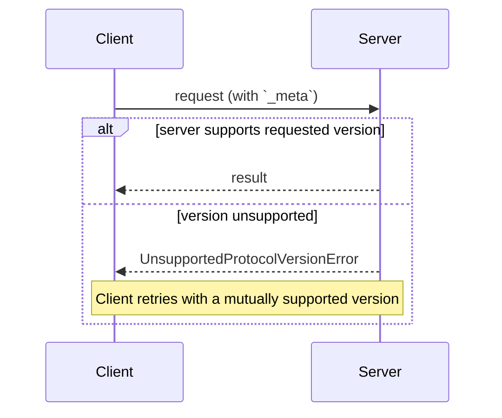

<div id="enable-section-numbers" />

This page defines how a client and server agree on what they are speaking:
the protocol version, declared on every request; optional extensions,
negotiated through capabilities; and interoperability with earlier,
handshake-based protocol revisions.

There is no negotiation handshake. Every request carries its protocol
version, and the server accepts or rejects each request independently:



## Terminology

This page uses the following terms for interoperability across protocol
revisions:

- **Modern**: protocol versions that convey version, identity, and
  capabilities as per-request metadata (revision `2026-07-28` and later).
- **Legacy**: protocol versions that establish a session with an
  `initialize` handshake (`2025-11-25` and earlier).
- **Dual-era**: an implementation that supports both modern and legacy
  versions.

## Protocol Version Negotiation

Every request declares the protocol version it is using in its
[`_meta`](/specification/draft/basic/index#meta) field. On HTTP, this is
also carried in the
[`MCP-Protocol-Version` header](/specification/draft/basic/transports/streamable-http#protocol-version-header).

If the server does not implement the requested version (whether the version
is unknown to the server, or is a known version the server has chosen not to
support), it **MUST** respond with an
[`UnsupportedProtocolVersionError`](/specification/draft/schema#unsupportedprotocolversionerror)
listing the versions it does support:

```json
{
  "jsonrpc": "2.0",
  "id": 1,
  "error": {
    "code": -32022,
    "message": "Unsupported protocol version",
    "data": {
      "supported": ["2026-07-28", "2025-11-25"],
      "requested": "1900-01-01"
    }
  }
}
```

The client **SHOULD** select a mutually supported version from the `supported`
list and retry the request, or surface an error to the user if no compatible
version exists.

Servers **MUST** implement
[`server/discover`](/specification/draft/server/discover). Clients
**MAY** call it before sending any other requests to learn the server's
supported versions up front, but are not required to: a client is free to
invoke any RPC inline and handle `UnsupportedProtocolVersionError` if its
preferred version is not supported.

## Extension Negotiation

Clients and servers can negotiate support for optional
[extensions](/docs/extensions/overview) beyond the core protocol. Extensions
are advertised in the `extensions` field of capabilities, which is a map of
extension identifiers to per-extension settings objects. Extension identifiers
**MUST** follow the [`_meta` key naming rules](/specification/draft/basic/index#meta),
with a mandatory prefix.

The following is an example of a client that advertises the
[MCP Apps extension](/extensions/apps/overview) identified as `io.modelcontextprotocol/ui`:

```json
{
  "capabilities": {
    "roots": {},
    "extensions": {
      "io.modelcontextprotocol/ui": {
        "mimeTypes": ["text/html;profile=mcp-app"]
      }
    }
  }
}
```

An example of [Tasks extension](/extensions/tasks/overview) identified as `io.modelcontextprotocol/tasks`:

```json
{
  "capabilities": {
    "tools": {},
    "extensions": {
      "io.modelcontextprotocol/tasks": {}
    }
  }
}
```

Each extension specifies the schema of its settings object; an empty object
indicates support with no additional settings.

If one party supports an extension but the other does not, the supporting
party **MUST** either revert to core protocol behavior or reject the request
with an appropriate error. Extensions **SHOULD** document their expected
fallback behavior.

## Backward Compatibility with Initialization-Based Versions

A server that wishes to support both [legacy](#terminology) clients (which
expect an `initialize` handshake) and [modern](#terminology) clients (which
use per-request metadata) **MAY** implement both behaviors.

A client that needs to interoperate with both kinds of servers detects the
server's era with transport-specific mechanics, specified in the binding
pages:

- [stdio](/specification/draft/basic/transports/stdio#backward-compatibility):
  probe with `server/discover` and fall back on any error that is not a
  recognized modern error.
- [Streamable HTTP](/specification/draft/basic/transports/streamable-http#backward-compatibility):
  attempt a modern request and inspect the body of a `400 Bad Request`
  before falling back.

In both cases, a recognized modern JSON-RPC error (such as
[`UnsupportedProtocolVersionError`](/specification/draft/schema#unsupportedprotocolversionerror))
identifies a modern server: the client retries with a supported version
rather than falling back. Anything else identifies a legacy server.

The era determination is a property of the server, not of an individual
request. Clients **SHOULD** cache the result for the lifetime of the server
process (stdio) or origin (HTTP), and **MAY** persist it across restarts of
the same server configuration, re-probing if the cached assumption later
fails.

A server that supports only [modern](#terminology) versions **SHOULD** name
the protocol versions it supports in any error it returns to an `initialize`
request, on any transport: legacy clients have no fall-forward mechanism, and
this message may be the only diagnostic they can surface to users.

### Compatibility Matrix

The following matrix summarizes the expected outcome of every combination of
client and server era:

| Client   | Server   | Outcome                                                                                                                                                                                                                                                                                                                                                                                                                                                                                                                                |
| -------- | -------- | -------------------------------------------------------------------------------------------------------------------------------------------------------------------------------------------------------------------------------------------------------------------------------------------------------------------------------------------------------------------------------------------------------------------------------------------------------------------------------------------------------------------------------------- |
| Modern   | Modern   | Works. `server/discover` is optional; version mismatches surface as `UnsupportedProtocolVersionError` and the client retries with a mutually supported version.                                                                                                                                                                                                                                                                                                                                                                        |
| Modern   | Legacy   | Fails. The server may reject the request with an implementation-defined error, stay silent, or even process an era-ambiguous method under legacy semantics. On stdio, clients **SHOULD** send `server/discover` first to fail deterministically; the client then surfaces an actionable error to the user.                                                                                                                                                                                                                             |
| Dual-era | Modern   | Works. The stdio probe returns a `DiscoverResult` (or `UnsupportedProtocolVersionError`); on HTTP, the first modern request succeeds or returns a modern error. The client stays modern.                                                                                                                                                                                                                                                                                                                                               |
| Dual-era | Legacy   | Works. stdio: the probe returns a non-modern error or times out, and the client falls back to `initialize`. HTTP: the modern request returns a `4xx` without a recognized modern error body, and the client falls back to `initialize` (and possibly further to the deprecated HTTP+SSE transport).                                                                                                                                                                                                                                    |
| Legacy   | Modern   | Fails. stdio: the server rejects `initialize` with a JSON-RPC error; the exact code is implementation-defined (`initialize` is an unknown method and the request also lacks the required `_meta` fields). HTTP: the request is missing the required headers and is rejected per [server validation](/specification/draft/basic/transports/streamable-http#server-validation) with `400 Bad Request` (a client on the deprecated HTTP+SSE transport fails at its opening `GET` instead). Legacy clients have no fall-forward mechanism. |
| Legacy   | Dual-era | Works. The server answers `initialize` and serves the client according to the negotiated legacy revision.                                                                                                                                                                                                                                                                                                                                                                                                                              |
| Legacy   | Legacy   | Works according to the legacy revision; out of scope for this document.                                                                                                                                                                                                                                                                                                                                                                                                                                                                |

A dual-era **server** selects its behavior from how the client opens:

- A request carrying modern per-request `_meta` is served statelessly
  according to this revision.
- An `initialize` request selects legacy semantics, scoped to the stdio
  process (stdio) or the session (HTTP), as specified by the negotiated
  legacy protocol version.

A dual-era server **MAY** serve both eras concurrently on the same endpoint
or process.
