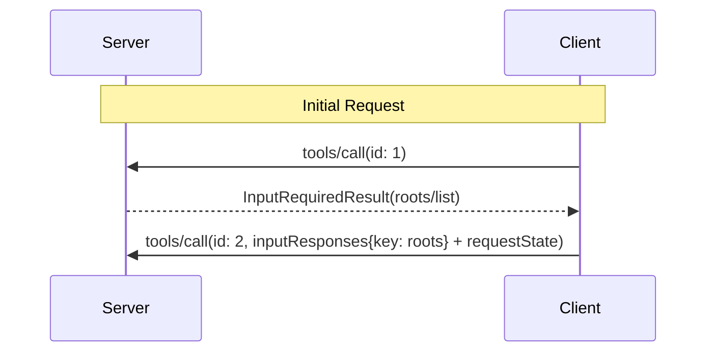

<div id="enable-section-numbers" />

<Warning>
  **Deprecated**: The Roots feature is deprecated as of protocol version
  `2026-07-28`
  ([SEP-2577](https://github.com/modelcontextprotocol/modelcontextprotocol/pull/2577)).
  Under the [feature lifecycle policy](/community/feature-lifecycle), it remains
  in the specification for at least twelve months after this revision's release
  before it becomes eligible for removal. New implementations **SHOULD NOT**
  adopt it; existing implementations **SHOULD** migrate to passing directories
  or files via tool parameters, resource URIs, or server configuration. See the
  [deprecated features registry](/specification/draft/deprecated).
</Warning>

The Model Context Protocol (MCP) provides a standardized way for clients to expose
filesystem "roots" to servers. Roots inform servers about the directories and files the
client considers relevant, so that servers can focus their operations accordingly. They
are informational guidance rather than an access-control mechanism. The protocol does
not enforce that servers stay within roots. Servers can request the list of roots from
supporting clients.

## User Interaction Model

Roots in MCP are typically exposed through workspace or project configuration interfaces.

For example, implementations could offer a workspace/project picker that allows users to
select directories and files the server should have access to. This can be combined with
automatic workspace detection from version control systems or project files.

However, implementations are free to expose roots through any interface pattern that
suits their needs&mdash;the protocol itself does not mandate any specific user
interaction model.

## Capabilities

Clients that support roots **MUST** declare the `roots` capability in
`_meta.io.modelcontextprotocol/clientCapabilities` on each request:

```json
{
  "_meta": {
    "io.modelcontextprotocol/clientCapabilities": {
      "roots": {}
    }
  }
}
```

## Protocol Messages

### Listing Roots

To retrieve roots during the processing of a client request, servers send an `InputRequiredResult`
containing a `roots/list` request:

**Input request (delivered inside [`InputRequiredResult.inputRequests`](/specification/draft/basic/patterns/mrtr#inputrequests)):**

```json
{
  "method": "roots/list"
}
```

**Client result (returned inside `inputResponses` on the retried request):**

```json
{
  "roots": [
    {
      "uri": "file:///home/user/projects/myproject",
      "name": "My Project"
    }
  ]
}
```

## Message Flow



## Data Types

### Root

A root definition includes:

- `uri`: Unique identifier for the root. This **MUST** be a `file://` URI in the current
  specification.
- `name`: Optional human-readable name for display purposes.

Example roots for different use cases:

#### Project Directory

```json
{
  "uri": "file:///home/user/projects/myproject",
  "name": "My Project"
}
```

#### Multiple Repositories

```json
[
  {
    "uri": "file:///home/user/repos/frontend",
    "name": "Frontend Repository"
  },
  {
    "uri": "file:///home/user/repos/backend",
    "name": "Backend Repository"
  }
]
```

## Error Handling

If an error occurs, the client does not need to replay the initial call with an error message
as the server is not waiting for a response with the `InputRequiredResult` pattern.

## Security Considerations

1. Clients **MUST**:
   - Only expose roots with appropriate permissions
   - Validate all root URIs to prevent path traversal
   - Implement proper access controls
   - Monitor root accessibility

2. Servers **SHOULD**:
   - Handle cases where roots become unavailable
   - Respect root boundaries during operations
   - Validate all paths against provided roots

## Implementation Guidelines

1. Clients **SHOULD**:
   - Prompt users for consent before exposing roots to servers
   - Provide clear user interfaces for root management
   - Validate root accessibility before exposing
   - Monitor for root changes

2. Servers **SHOULD**:
   - Check for roots capability before usage
   - Respect root boundaries in operations
   - Cache root information appropriately
