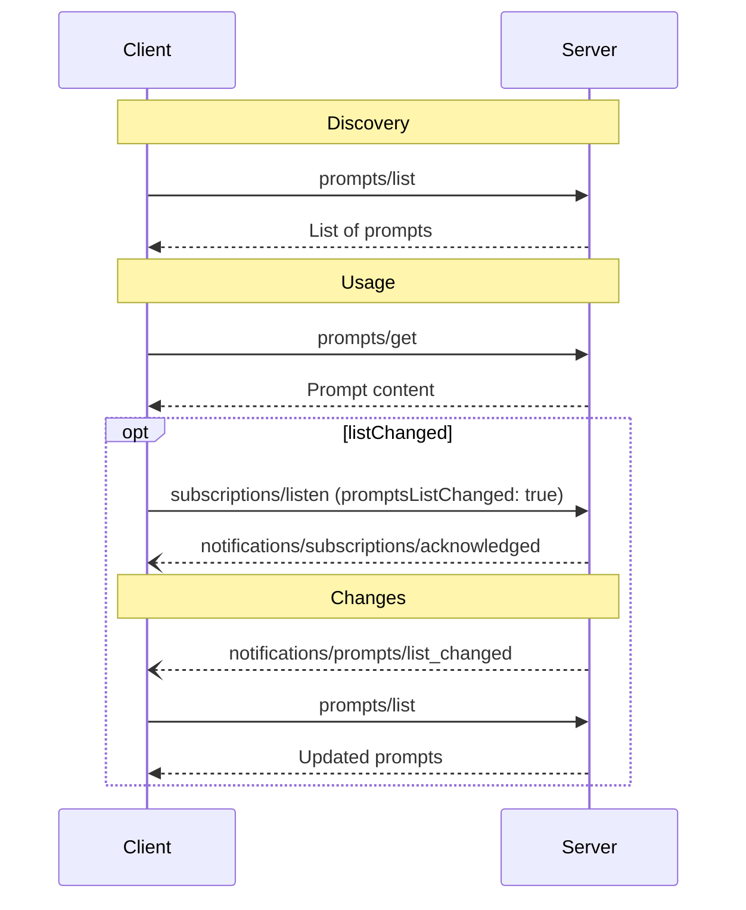

<div id="enable-section-numbers" />

The Model Context Protocol (MCP) provides a standardized way for servers to expose prompt
templates to clients. Prompts allow servers to provide structured messages and
instructions for interacting with language models. Clients can discover available
prompts, retrieve their contents, and provide arguments to customize them.

<Note>
  For brevity, the request examples on this page omit the required `_meta`
  request metadata (`io.modelcontextprotocol/protocolVersion`,
  `io.modelcontextprotocol/clientInfo`, and
  `io.modelcontextprotocol/clientCapabilities`). Every request **MUST** include
  these fields; see [`_meta`](/specification/draft/basic/index#meta).
</Note>

## User Interaction Model

Prompts are designed to be **user-controlled**, meaning they are exposed from servers to
clients with the intention of the user being able to explicitly select them for use.
This refers to who decides when the prompt is used, not who authors its content. Prompt
content is defined by the server.

Typically, prompts would be triggered through user-initiated commands in the user
interface, which allows users to naturally discover and invoke available prompts.

For example, as slash commands:


However, implementors are free to expose prompts through any interface pattern that suits
their needs&mdash;the protocol itself does not mandate any specific user interaction
model.

## Capabilities

Servers that support prompts **MUST** declare the `prompts` capability in their
[`DiscoverResult`](/specification/draft/schema#discoverresult):

```json
{
  "capabilities": {
    "prompts": {
      "listChanged": true
    }
  }
}
```

`listChanged` indicates whether the server will emit notifications when the list of
available prompts changes.

Servers that declare the `prompts` capability **MUST** respond to `prompts/list` requests
with the set of prompts currently available to the requesting client. This set **MAY** be
empty and **MAY** change over time (see
[List Changed Notification](#list-changed-notification)), but **MUST NOT** vary
per-connection or as a side effect of other requests on the connection. The set
**MAY** vary by the authorization presented on the request — for example, returning
only the prompts the caller's granted scopes permit — since credentials are
per-request input, not connection state.

## Protocol Messages

### Listing Prompts

To retrieve available prompts, clients send a `prompts/list` request. This operation
supports [pagination](/specification/draft/server/utilities/pagination) and [caching](/specification/draft/server/utilities/caching).

**Request:**

```json
{
  "jsonrpc": "2.0",
  "id": 1,
  "method": "prompts/list",
  "params": {
    "cursor": "optional-cursor-value"
  }
}
```

**Response:**

```json
{
  "jsonrpc": "2.0",
  "id": 1,
  "result": {
    "resultType": "complete",
    "prompts": [
      {
        "name": "code_review",
        "title": "Request Code Review",
        "description": "Asks the LLM to analyze code quality and suggest improvements",
        "arguments": [
          {
            "name": "code",
            "description": "The code to review",
            "required": true
          }
        ],
        "icons": [
          {
            "src": "https://example.com/review-icon.svg",
            "mimeType": "image/svg+xml",
            "sizes": ["any"]
          }
        ]
      }
    ],
    "nextCursor": "next-page-cursor",
    "ttlMs": 600000,
    "cacheScope": "public"
  }
}
```

### Getting a Prompt

To retrieve a specific prompt, clients send a `prompts/get` request. Arguments may be
auto-completed through [the completion API](/specification/draft/server/utilities/completion).

**Request:**

```json
{
  "jsonrpc": "2.0",
  "id": 2,
  "method": "prompts/get",
  "params": {
    "name": "code_review",
    "arguments": {
      "code": "def hello():\n    print('world')"
    }
  }
}
```

**Response:**

```json
{
  "jsonrpc": "2.0",
  "id": 2,
  "result": {
    "resultType": "complete",
    "description": "Code review prompt",
    "messages": [
      {
        "role": "user",
        "content": {
          "type": "text",
          "text": "Please review this Python code:\ndef hello():\n    print('world')"
        }
      }
    ]
  }
}
```

Servers **MAY** also respond to `prompts/get` with an [`InputRequiredResult`](/specification/draft/basic/patterns/mrtr#inputrequiredresult) to indicate that additional input is needed before the prompt can be resolved. This follows the [multi round-trip requests](/specification/draft/basic/patterns/mrtr#multi-round-trip-requests) mechanism. When retrying the request, clients include `inputResponses` and, if provided by the server, `requestState` in the request parameters.

### List Changed Notification

When the list of available prompts changes, servers that declared the `listChanged`
capability **SHOULD** send a notification to clients that have opened a
[`subscriptions/listen`](/specification/draft/basic/patterns/subscriptions) stream with
`promptsListChanged: true`:

```json
{
  "jsonrpc": "2.0",
  "method": "notifications/prompts/list_changed"
}
```

## Message Flow



## Data Types

### Prompt

A prompt definition includes:

- `name`: Unique identifier for the prompt
- `title`: Optional human-readable name of the prompt for display purposes.
- `description`: Optional human-readable description
- `icons`: Optional array of icons for display in user interfaces
- `arguments`: Optional list of arguments for customization

### PromptMessage

Messages in a prompt can contain:

- `role`: Either "user" or "assistant" to indicate the speaker
- `content`: One of the following content types:

<Note>
  All content types in prompt messages support optional
  [annotations](/specification/draft/server/resources#annotations) for metadata
  about audience, priority, and modification times.
</Note>

#### Text Content

Text content represents plain text messages:

```json
{
  "type": "text",
  "text": "The text content of the message"
}
```

This is the most common content type used for natural language interactions.

#### Image Content

Image content allows including visual information in messages:

```json
{
  "type": "image",
  "data": "base64-encoded-image-data",
  "mimeType": "image/png"
}
```

The image data **MUST** be base64-encoded and include a valid MIME type. This enables
multi-modal interactions where visual context is important.

#### Audio Content

Audio content allows including audio information in messages:

```json
{
  "type": "audio",
  "data": "base64-encoded-audio-data",
  "mimeType": "audio/wav"
}
```

The audio data MUST be base64-encoded and include a valid MIME type. This enables
multi-modal interactions where audio context is important.

#### Resource Links

Prompt messages **MAY** include links to
[Resources](/specification/draft/server/resources), to provide additional context or
data without embedding the resource contents directly. In this case, the prompt message
returns a URI that can be fetched by the client:

```json
{
  "type": "resource_link",
  "uri": "file:///project/src/main.rs",
  "name": "main.rs",
  "description": "Primary application entry point",
  "mimeType": "text/x-rust"
}
```

Resource links support the same [Resource annotations](/specification/draft/server/resources#annotations)
as regular resources to help clients understand how to use them.

#### Embedded Resources

Embedded resources allow referencing server-side resources directly in messages:

```json
{
  "type": "resource",
  "resource": {
    "uri": "resource://example",
    "mimeType": "text/plain",
    "text": "Resource content"
  }
}
```

Resources can contain either text or binary (blob) data and **MUST** include:

- A valid resource URI
- The appropriate MIME type
- Either text content or base64-encoded blob data

Embedded resources enable prompts to seamlessly incorporate server-managed content like
documentation, code samples, or other reference materials directly into the conversation
flow.

## Error Handling

Servers **SHOULD** return standard JSON-RPC errors for common failure cases:

- Invalid prompt name: `-32602` (Invalid params)
- Missing required arguments: `-32602` (Invalid params)
- Internal errors: `-32603` (Internal error)

## Implementation Considerations

1. Servers **SHOULD** validate prompt arguments before processing
2. Clients **SHOULD** handle pagination for large prompt lists
3. Both parties **SHOULD** respect capability negotiation

## Security

Implementations **MUST** carefully validate all prompt inputs and outputs to prevent
injection attacks or unauthorized access to resources.
