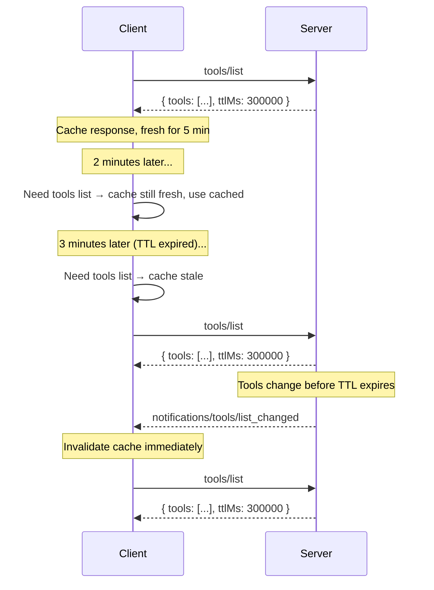

<div id="enable-section-numbers" />

The Model Context Protocol (MCP) supports caching for some results. This allows clients to cache responses and reduce unnecessary re-fetching.
Caching is complementary to [change notifications](#interaction-with-notifications)&mdash;both
mechanisms can coexist.

## Cacheable Results

Servers MUST include caching hints on results with `resultType: "complete"` returned by
the following operations:

- `server/discover`
- `tools/list`
- `prompts/list`
- `resources/list`
- `resources/templates/list`
- `resources/read`

Interim results with `resultType: "input_required"` (see
[multi round-trip requests](/specification/draft/basic/patterns/mrtr)) are not cacheable
and carry no caching hints.

## Cache Key

A cached response is identified by the request method together with the request
parameters that affect the result (for example, the `uri` for `resources/read`, or the
`cursor` for paginated list requests). Clients **MUST NOT** serve a cached response for
a request whose method or parameters differ from the request that produced it.

Results produced by retrying a request through the
[multi round-trip requests](/specification/draft/basic/patterns/mrtr) mechanism&mdash;that
is, requests carrying `inputResponses` or `requestState`&mdash;**MUST NOT** be cached,
as they depend on inputs that are not part of the cache key.

## Cacheable Model

Cacheable Results in MCP use two fields to provide caching hints to clients:

- The <b>Time-to-live (TTL) Field</b>,`ttlMs`, is an integer value in milliseconds specifying how long the client MAY consider the result fresh.
- The <b>Cache Scope Field</b>,`cacheScope`, indicates the intended scope of the cached response, either `"public"` or `"private"`.

### Time-to-Live (TTL) Field

The `ttlMs` field is a hint from the server indicating how long, in
milliseconds, the client MAY consider the result fresh. Semantics are
analogous to HTTP `Cache-Control: max-age`.

- If `ttlMs` is `0`, the response **SHOULD** be considered immediately stale. The client
  MAY re-fetch every time the result is needed.
- If `ttlMs` is positive, the client **SHOULD** consider the result fresh for that many
  milliseconds after receiving the response.
- If `ttlMs` is absent, clients **SHOULD** assume a default of `0` (immediately stale)
  and rely on their own caching heuristics or notifications. This should only occur in older server versions.
- If `ttlMs` is negative, clients **SHOULD** ignore it and treat it as `0`.

Servers **MUST** provide a `ttlMs` value that is `>= 0`.

<Note>
  TTL is a **freshness hint**, not a guarantee. Servers MAY change the
  underlying data before the TTL expires. The TTL tells the client how long it
  can reasonably avoid re-fetching, not how long the data is guaranteed to
  remain unchanged.
</Note>

#### Freshness Calculation

A client records the local time at which the response was received (`t_received`). The
response is considered **fresh** while:

```
now < t_received + ttlMs
```

Once the TTL expires, the response is **stale** and the client **SHOULD** re-fetch on
next access.

Clients **SHOULD NOT** treat TTL as a polling interval that triggers automatic background
refetches. The TTL is a freshness hint: the client checks freshness when it needs the
data, and re-fetches only if stale. Implementations that do choose to poll **MUST**
apply jitter and backoff.

Clients **MAY** re-fetch before the TTL expires if they have reason to believe the data
has changed (e.g., receiving an unexpected error on a tool call indicating the method was
not found or the parameters were invalid).

Clients **MAY** serve stale responses if errors occur during re-fetching (e.g., network
issues, server downtime).

### Cache Scope Field

The `cacheScope` field controls who may cache a response, analogous to HTTP
`Cache-Control: public` vs `Cache-Control: private`.

| Value       | Meaning                                                                                                                                                                                                                                                                           |
| ----------- | --------------------------------------------------------------------------------------------------------------------------------------------------------------------------------------------------------------------------------------------------------------------------------- |
| `"public"`  | The response does not contain user-specific data. Any client, shared gateway, or caching proxy **MAY** store and serve the cached response to any user.                                                                                                                           |
| `"private"` | The response contains private data that is not meant to be shared between callers. Cached responses **MAY** be reused for the same authorization context. Caches **MUST NOT** be shared across authorization contexts (e.g. a different access token requires a different cache). |

#### Choosing a Cache Scope

- **`"public"`** is appropriate for lists of tools, prompts, and resource templates when
  they are identical for all users.
- **`"private"`** is appropriate for `resources/read` results that depend on the
  authenticated user, or for filtered list results that vary per user.

## Interaction with Notifications

TTL and server-push notifications are complementary:

- A server **MAY** provide `ttlMs` without advertising `listChanged: true` in its
  capabilities. In this case, the client relies entirely on TTL-based freshness.
- A server **MAY** advertise `listChanged: true` **and** provide `ttlMs`. In this case,
  the client can use the TTL to avoid unnecessary refetches between notifications, and
  the notification acts as an immediate invalidation signal.

When a relevant notification is received while a cached response is still fresh, the
notification **invalidates** the cached response and it should be considered immediately stale.



## Interaction with Pagination

When a list result is [paginated](/specification/draft/server/utilities/pagination), each
page is an independently cacheable response&mdash;consistent with how HTTP
`Cache-Control` treats paginated resources.

- Each page response carries its own `ttlMs` value. The freshness clock for each page
  starts at the time that page was received.
- Servers **MAY** return different `ttlMs` values on different pages (e.g., a longer TTL
  for early pages of a stable list, a shorter TTL for the final page).
- When a cached page expires, the client **SHOULD** re-fetch that page using its cursor.
- There is no cross-page consistency guarantee. If the underlying data changes between
  page fetches, clients may observe duplicates or gaps.
- Clients that require a consistent snapshot of the full list **SHOULD** re-fetch from
  the beginning (without a cursor).
- If a cursor becomes invalid (e.g., the server returns an error for a previously valid
  cursor), the client **SHOULD** discard all cached pages and re-fetch from the
  beginning.

Servers **MUST** apply the same `cacheScope` to all response pages for a given list
request. For example, if the first page of a `tools/list` response has
`cacheScope: "private"`, all subsequent pages for that request **MUST** also be
`"private"`.

## Security Considerations

A `cacheScope` of `"public"` indicates that the response does not contain user-specific data and can be safely shared. Servers MUST be aware that responses with a `"public"` `cacheScope` may be shared between callers even if the Result is coming from an authenticated endpoint. For example, the Result from an authenticated `tools/list` call with a `"public"` `cacheScope` may be cached by a client and may be shared outside of the initial requests authorization context. (i.e. different access tokens can leverage the same cache).

Server implementors:

- should ensure that the `cacheScope` correctly reflects the intended visibility of the primitive.
- MUST apply appropriate per-primitive access controls, and MUST NOT rely on
  `cacheScope` alone to prevent unauthorized access to primitives.
