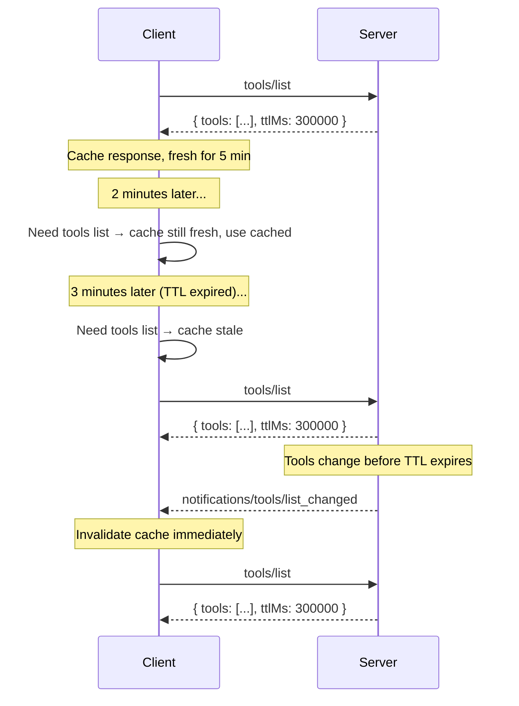

# SEP-2549: TTL for List Results

- **Status**: Final
- **Type**: Standards Track
- **Created**: 2026-04-09
- **Author(s)**: Caitie McCaffrey (@CaitieM20)
- **Sponsor**: @CaitieM20
- **PR**: https://github.com/modelcontextprotocol/specification/pull/2549

## Abstract

This SEP proposes adding fields to support caching result objects returned by `tools/list`, `prompts/list`, `resources/list`, `resources/read`, and `resources/templates/list`. Two fields will be added `ttlMs` and `cacheScope`. The TTL tells clients how long the response may be considered fresh before re-fetching. This allows clients to cache feature lists and reduce reliance on server-push notifications while remaining fully backward compatible. The `cacheScope` field controls who may cache a response. TTL supplements rather than replaces the existing notification mechanism — both can coexist.

## Motivation

Today, MCP clients discover server features by invoking methods on the server. These calls return the current set of features. To learn about changes, clients rely on push notifications from the server. The below table maps the Server Method to Notification Type.

| Server Methods             | Notification Type                      |
| -------------------------- | -------------------------------------- |
| `tools/list`               | `notifications/tools/list_changed`     |
| `prompts/list`             | `notifications/prompts/list_changed`   |
| `resources/list`           | `notifications/resources/list_changed` |
| `resources/templates/list` | `notifications/resources/list_changed` |
| `resources/read`           | `notifications/resources/updated`      |

This approach has several limitations:

1. **HTTP-based transports require SSE Streams**: Many clients and servers have challenges supporting long lived SSE streams which are necessary for notifications. The goal is to make SSE streams an optional optimization, but support protocol functionality without them. A TTL allows clients to poll on a predictable schedule without relying on server-push notifications.

2. **Implementation complexity**: Both clients and servers must implement notification subscription and delivery infrastructure. Many simple servers have feature lists that change infrequently (or never), yet must still support the notification machinery if they want clients to stay current.

3. **No freshness signal**: Even clients that can receive notifications have no indication of how "stable" a list is. A server whose tool list changes once a day and one whose list changes every second look identical to the client — both simply send notifications when changes occur. A TTL provides an explicit freshness hint.

4. **Alignment with web standards**: HTTP caching (`Cache-Control: max-age`) and DNS TTLs have long demonstrated that time-based freshness hints are a simple, well-understood mechanism for reducing unnecessary refetches. MCP can benefit from the same pattern.

Adding a TTL field to list responses solves all of these problems with a minimal, backward-compatible protocol change.

## Specification

### New interface: `CacheableResult`

A new `CacheableResult` interface is introduced as a standalone type extending `Result`. It owns the `ttlMs` and `cacheScope` fields.

#### Schema change (TypeScript)

```typescript
/**
 * A result that supports a time-to-live (TTL) hint for client-side caching.
 *
 * @internal
 */
export interface CacheableResult extends Result {
  /**
   * A hint from the server indicating how long (in milliseconds) the
   * client MAY cache this response before re-fetching. Semantics are
   * analogous to HTTP Cache-Control max-age.
   *
   * - If 0, The response SHOULD be considered immediately stale, The client
   *   MAY re-fetch every time the result is needed.
   * - If positive, the client SHOULD consider the result fresh for this many
   *   milliseconds after receiving the response.
   */
  ttlMs: number & { readonly minimum: 0 };

  /**
   * Indicates the intended scope of the cached response, analogous to HTTP
   * Cache-Control: public vs Cache-Control: private.
   *
   * - "public": Any client or intermediary (e.g., shared gateway, proxy)
   *   MAY cache the response and serve it to any user.
   * - "private": Only the requesting user's client MAY cache the response.
   *   Shared caches (e.g., multi-tenant gateways) MUST NOT serve a cached
   *   copy to a different user.
   *
   * Defaults to "public" if absent.
   */
  cacheScope: "public" | "private";
}
```

### Semantics

A TTL is a freshness estimate, not a guarantee. Servers MAY change the underlying list before the TTL expires; servers that do so and have advertised listChanged SHOULD send the corresponding notification.

Servers MUST provide a `ttlMs` on `Results` returned by `tools/list`, `prompts/list`, `resources/list`, `resources/read`, and `resources/templates/list`.

`ttlMs` MUST be >= 0. If a server returns a negative value, clients SHOULD ignore it and treat it as 0 (immediately stale).

| Condition                                          | Client behavior                                                                                               |
| -------------------------------------------------- | ------------------------------------------------------------------------------------------------------------- |
| `ttlMs` = 0                                        | The response SHOULD be considered immediately stale, The Client MAY re-fetch every time the result is needed. |
| `ttlMs` > 0                                        | Client SHOULD consider the response fresh for `ttlMs` milliseconds from receipt.                              |
| Relevant notification received while TTL is active | The notification invalidates the cached response. Client SHOULD re-fetch regardless of remaining TTL.         |
| `cacheScope` = `"public"`                          | Any client or shared intermediary (gateway, proxy) MAY cache and serve the response to any user.              |
| `cacheScope` = `"private"`                         | Only the requesting user's client MAY cache. Shared caches MUST NOT serve a cached copy to a different user.  |

#### Freshness calculation

A client records the local time at which the response was received (`t_received`). The response is considered **fresh** while `now < t_received + ttlMs`. Once the TTL expires the response is **stale** and the client SHOULD re-fetch on next access.

Clients SHOULD NOT treat TTL as a polling interval that triggers automatic background refetches. The TTL is a **freshness hint**: the client checks freshness when it needs the list, and re-fetches only if stale. Implementations that do choose to poll SHOULD apply jitter and backoff.

Clients MAY re-fetch if they have reason to believe the data has changed, even if the TTL has not yet expired. Examples include receiving an unexpected error on a tool call indicating that the the method was not found or the parameters were invalid.

Clients MAY serve stale responses if errors occur in re-fetching results(e.g., network issues, server downtime). The TTL is a hint for how long the client can safely rely on the data, but real-world conditions may require flexibility.

### Cache scope

The `cacheScope` field controls who may cache a response:

- **`"public"`**: The response does not contain user-specific data. Any client, shared gateway, or caching proxy MAY store and serve the cached response to any user. This is appropriate for lists of tools, prompts, and resource templates that are identical for all users.
- **`"private"`**: The response contains user-specific data. Only the requesting user's client MAY cache it. Shared caches (e.g., multi-tenant API gateways) MUST NOT serve a `"private"` cached response to a different user. This is appropriate for `resources/read` results that depend on the authenticated user, or for filtered list results that vary per user.

This design mirrors HTTP `Cache-Control: public` vs `Cache-Control: private`, applying the same well-understood semantics at the MCP protocol level.

### Interaction with notifications

TTL and server-push notifications are complementary:

- A server MAY provide `ttlMs` without advertising `listChanged: true` in its capabilities. In this case the client relies entirely on TTL.
- A server MAY advertise `listChanged: true` **and** provide `ttlMs`. In this case the client can use the TTL to avoid unnecessary refetches between notifications, and the notification acts as an immediate invalidation signal.



### Interaction with pagination

When a list result is paginated (includes `nextCursor`), each page is an independently cacheable response — consistent with how HTTP `Cache-Control` treats paginated resources. Specifically:

- Each page response carries its own `ttlMs` value. The freshness clock for each page starts at the time that page was received.
- Servers MAY return different `ttlMs` values on different pages (e.g., a longer TTL for early pages of a stable list, a shorter TTL for the final page).
- There is no cross-page consistency guarantee. If the underlying data changes between page fetches, clients may observe duplicates or gaps — the same trade-off that applies to HTTP paginated APIs.
- Clients that require a consistent snapshot of the full list SHOULD re-fetch from the beginning (without a cursor).
- If a cursor becomes invalid (e.g., the server returns an error for a previously valid cursor), the client SHOULD discard all cached pages and re-fetch from the beginning.

Servers MUST apply the same cacheScope to all response pages for a given list request. For example, if the first page of a `tools/list` response has `cacheScope: "private"`, all subsequent pages for that request MUST also be treated as `"private"`.

### Error handling

- If `ttlMs` is present but is a negative integer, the client SHOULD ignore it and behave as if it were 0 (immediately stale).

## Rationale

### Why not replace `list_changed` notifications?

Notifications provide immediate invalidation which is valuable for long-lived connections. TTL provides a complementary mechanism optimized for stateless transports and for reducing unnecessary polling. Both mechanisms serve different use cases and coexist naturally.

### Why integer milliseconds for TTL?

We chose integer milliseconds over seconds as we want one unit for ttl across the MCP protocol. Tasks has uses cases for sub-second TTLs, and using milliseconds allows for a consistent representation across all TTLs in MCP.

Many existing systems use integer seconds for TTLs, but some (e.g., gRPC retry pushback) use milliseconds. The key is to choose a single, consistent unit for all TTLs in MCP. Integer milliseconds provides the necessary precision while remaining simple to implement and understand.

| System                        | Mechanism             | Notes                                                            |
| ----------------------------- | --------------------- | ---------------------------------------------------------------- |
| HTTP `Cache-Control: max-age` | Integer seconds       | The most widely deployed freshness hint in web infrastructure    |
| DNS TTL                       | Integer seconds       | Controls how long resolvers cache DNS records                    |
| GraphQL `@cacheControl`       | `maxAge` integer secs | Per-field cache hints in GraphQL responses                       |
| gRPC `grpc-retry-pushback-ms` | Milliseconds          | Server-provided retry hint (different use case, similar pattern) |

### Why not use HTTP caching directly?

MCP is transport-agnostic. While HTTP-based transports could theoretically use `Cache-Control` headers, MCP also operates over stdio, and supports pluggable transports where HTTP headers may not be available. Embedding the TTL in the JSON response body ensures it works uniformly across all transports.

## Backward Compatibility

- Existing servers that do not provide it continue to work unchanged. If a `ttlMs` field is missing, clients SHOULD assume a default ttlMs of 0 (immediately stale) and rely on their own caching heuristincs or notifications, which is the current behavior.
- Existing clients that do not understand the field will ignore it, as MCP result objects permit additional properties via `[key: string]: unknown` on the `Result` base type.
- `cacheScope` is required because there is no safe default for older servers. The server must explicitly declare the intended cache scope to prevent unintended caching of user-specific data.
- No existing fields or behaviors are modified or removed.
- No capability negotiation is required.
- SDK Maintainers can choose to add defaults for ttl and cacheScope in their SDKs to simplify adoption, but this is not required for compliance.

## Reference Implementation

_No reference implementation yet._

---

## Security Implications

A misconfigured or malicious serer could set an excessively long TTL, causing clients to cache stale data for longer than desired. However, since the TTL is a hint and clients can choose to ignore it or re-fetch if they suspect changes, the security risk is minimal. Clients should be designed to handle unexpected TTL values gracefully.
