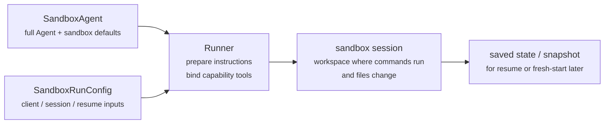
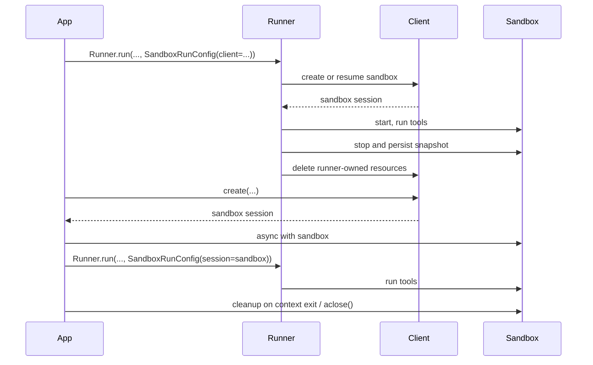

---
search:
  exclude: true
---
# 概念

!!! warning "ベータ機能"

    サンドボックスエージェントはベータ版です。一般提供までに API の詳細、デフォルト、サポートされる機能が変更される可能性があります。また、今後さらに高度な機能が追加される予定です。

最新のエージェントは、ファイルシステム上の実際のファイルを操作できる場合に最も効果を発揮します。**サンドボックスエージェント**は、特化したツールやシェルコマンドを使用して、大規模なドキュメントセットの検索や操作、ファイルの編集、成果物の生成、コマンドの実行を行えます。サンドボックスは、エージェントがユーザーに代わって作業するために利用できる永続的なワークスペースをモデルに提供します。Agents SDK のサンドボックスエージェントを使用すると、サンドボックス環境と組み合わせたエージェントを簡単に実行できます。また、適切なファイルをファイルシステム上に配置し、サンドボックスをオーケストレーションすることで、大規模なタスクの開始、停止、再開を容易に行えます。

エージェントが必要とするデータを中心にワークスペースを定義します。GitHub リポジトリ、ローカルのファイルやディレクトリ、合成タスクファイル、S3 や Azure Blob Storage などのリモートファイルシステム、および提供するその他のサンドボックス入力から開始できます。

<div class="sandbox-harness-image" markdown="1">


</div>

`SandboxAgent` も引き続き `Agent` です。`instructions`、`prompt`、`tools`、`handoffs`、`mcp_servers`、`model_settings`、`output_type`、ガードレール、フックなど、通常のエージェントインターフェースを維持し、通常の `Runner` API を通じて実行されます。異なるのは実行境界です。

- `SandboxAgent` はエージェント自体を定義します。通常のエージェント設定に加えて、`default_manifest`、`base_instructions`、`run_as` などのサンドボックス固有のデフォルト、およびファイルシステムツール、シェルアクセス、スキル、メモリ、コンパクションなどの機能を含みます。
- `Manifest` は、ファイル、リポジトリ、マウント、環境など、新しいサンドボックスワークスペースの初期内容とレイアウトを宣言します。
- サンドボックスセッションは、コマンドが実行され、ファイルが変更される稼働中の分離環境です。
- [`SandboxRunConfig`][agents.run_config.SandboxRunConfig] は、サンドボックスセッションを直接注入する、シリアライズされたサンドボックスセッション状態から再接続する、サンドボックスクライアントを通じて新しいサンドボックスセッションを作成するなど、実行がサンドボックスセッションを取得する方法を決定します。
- 保存されたサンドボックス状態とスナップショットにより、後続の実行は以前の作業へ再接続したり、保存された内容を使用して新しいサンドボックスセッションを初期化したりできます。

`Manifest` は新規セッション用のワークスペース契約であり、稼働中のすべてのサンドボックスに関する完全な信頼できる情報源ではありません。実行時に有効となるワークスペースは、再利用されたサンドボックスセッション、シリアライズされたサンドボックスセッション状態、または実行時に選択されたスナップショットから取得される場合があります。

このページでは、「サンドボックスセッション」はサンドボックスクライアントによって管理される稼働中の実行環境を意味します。これは、[セッション](../sessions/index.md)で説明されている SDK の会話用 [`Session`][agents.memory.session.Session] インターフェースとは異なります。

外側のランタイムは、引き続き承認、トレーシング、ハンドオフ、再開時の記録管理を担います。サンドボックスセッションは、コマンド、ファイル変更、環境の分離を担います。この分担は、このモデルの中核をなす要素です。

### 各要素の連携

サンドボックス実行では、エージェント定義と実行ごとのサンドボックス設定を組み合わせます。ランナーはエージェントを準備して稼働中のサンドボックスセッションにバインドし、後続の実行のために状態を保存できます。



サンドボックス固有のデフォルトは `SandboxAgent` に保持します。実行ごとのサンドボックスセッションの選択は `SandboxRunConfig` に保持します。

ライフサイクルは、次の 3 段階で考えます。

1. `SandboxAgent`、`Manifest`、機能を使用して、エージェントと新規ワークスペースの契約を定義します。
2. サンドボックスセッションを注入、再開、または作成する `SandboxRunConfig` を `Runner` に渡して実行します。
3. ランナーが管理する `RunState`、明示的なサンドボックスの `session_state`、または保存済みワークスペースのスナップショットから、後で処理を継続します。

シェルアクセスがたまにしか使用しないツールの 1 つにすぎない場合は、[ツールガイド](../tools.md)のホステッドシェルから始めてください。ワークスペースの分離、サンドボックスクライアントの選択、またはサンドボックスセッションの再開動作が設計の一部である場合は、サンドボックスエージェントを使用してください。

## 使用に適した状況

サンドボックスエージェントは、次のようなワークスペース中心のワークフローに適しています。

- コーディングとデバッグ。たとえば、GitHub リポジトリの Issue レポートに対する自動修正をオーケストレーションし、対象を絞ったテストを実行する場合
- ドキュメントの処理と編集。たとえば、ユーザーの財務書類から情報を抽出し、記入済みの税務フォームの下書きを作成する場合
- ファイルを根拠とするレビューや分析。たとえば、回答前にオンボーディング資料、生成されたレポート、成果物のバンドルを確認する場合
- 分離されたマルチエージェントパターン。たとえば、各レビュアーやコーディング用サブエージェントに専用のワークスペースを提供する場合
- 複数ステップのワークスペースタスク。たとえば、ある実行でバグを修正し、後で回帰テストを追加する場合や、スナップショットまたはサンドボックスセッション状態から再開する場合

ファイルや稼働中のファイルシステムへのアクセスが不要な場合は、引き続き `Agent` を使用してください。シェルアクセスがたまにしか使用しない機能の 1 つであればホステッドシェルを追加し、ワークスペース境界自体が機能の一部であればサンドボックスエージェントを使用します。

## サンドボックスクライアントの選択

ローカル開発では `UnixLocalSandboxClient` から始めてください。コンテナ分離やイメージの同等性が必要な場合は `DockerSandboxClient` に移行します。プロバイダー管理の実行が必要な場合は、ホステッドプロバイダーに移行します。

ほとんどの場合、`SandboxAgent` の定義はそのまま維持し、[`SandboxRunConfig`][agents.run_config.SandboxRunConfig] 内のサンドボックスクライアントとそのオプションのみを変更します。ローカル、Docker、ホステッド、リモートマウントのオプションについては、[サンドボックスクライアント](clients.md)を参照してください。

## 中核要素

<div class="sandbox-nowrap-first-column-table" markdown="1">

| レイヤー | 主な SDK 要素 | 回答する内容 |
| --- | --- | --- |
| エージェント定義 | `SandboxAgent`、`Manifest`、機能 | どのエージェントを実行し、どの新規セッション用ワークスペース契約から開始するか？ |
| サンドボックス実行 | `SandboxRunConfig`、サンドボックスクライアント、稼働中のサンドボックスセッション | この実行は稼働中のサンドボックスセッションをどのように取得し、作業はどこで実行されるか？ |
| 保存済みサンドボックス状態 | `RunState` のサンドボックスペイロード、`session_state`、スナップショット | このワークフローは以前のサンドボックス作業へどのように再接続し、保存された内容から新しいサンドボックスセッションをどのように初期化するか？ |

</div>

主な SDK 要素は、次のようにこれらのレイヤーに対応します。

<div class="sandbox-nowrap-first-column-table" markdown="1">

| 要素 | 担当範囲 | 確認すべき内容 |
| --- | --- | --- |
| [`SandboxAgent`][agents.sandbox.sandbox_agent.SandboxAgent] | エージェント定義 | このエージェントは何を実行し、どのデフォルト設定を引き継ぐべきか？ |
| [`Manifest`][agents.sandbox.manifest.Manifest] | 新規セッション用ワークスペースのファイルとフォルダー | 実行開始時に、どのファイルとフォルダーがファイルシステム上に存在すべきか？ |
| [`Capability`][agents.sandbox.capabilities.capability.Capability] | サンドボックスネイティブの動作 | どのツール、指示フラグメント、ランタイム動作をこのエージェントに付与すべきか？ |
| [`SandboxRunConfig`][agents.run_config.SandboxRunConfig] | 実行ごとのサンドボックスクライアントとサンドボックスセッションの取得元 | この実行では、サンドボックスセッションを注入、再開、作成のいずれで取得すべきか？ |
| [`RunState`][agents.run_state.RunState] | ランナーが管理する保存済みサンドボックス状態 | 以前のランナー管理ワークフローを再開し、そのサンドボックス状態を自動的に引き継いでいるか？ |
| [`SandboxRunConfig.session_state`][agents.run_config.SandboxRunConfig.session_state] | 明示的にシリアライズされたサンドボックスセッション状態 | `RunState` の外部で既にシリアライズしたサンドボックス状態から再開するか？ |
| [`SandboxRunConfig.snapshot`][agents.run_config.SandboxRunConfig.snapshot] | 新しいサンドボックスセッション用に保存されたワークスペース内容 | 新しいサンドボックスセッションを保存済みのファイルや成果物から開始するか？ |

</div>

実用的な設計順序は次のとおりです。

1. `Manifest` で新規セッション用ワークスペース契約を定義します。
2. `SandboxAgent` でエージェントを定義します。
3. 組み込みまたはカスタムの機能を追加します。
4. `RunConfig(sandbox=SandboxRunConfig(...))` で、各実行がサンドボックスセッションを取得する方法を決定します。

## サンドボックス実行の準備

実行時に、ランナーはその定義を具体的なサンドボックス対応の実行へ変換します。

1. `SandboxRunConfig` からサンドボックスセッションを解決します。`session=...` を渡した場合、その稼働中のサンドボックスセッションを再利用します。それ以外の場合は、`client=...` を使用してセッションを作成または再開します。
2. 実行で有効となるワークスペース入力を決定します。実行でサンドボックスセッションを注入または再開する場合、その既存のサンドボックス状態が優先されます。それ以外の場合、ランナーは一時的なマニフェストオーバーライドまたは `agent.default_manifest` から開始します。このため、`Manifest` だけでは、すべての実行における最終的な稼働中ワークスペースは定義されません。
3. 機能が生成されたマニフェストを処理できるようにします。これにより、最終的なエージェントの準備前に、機能がファイル、マウント、その他のワークスペース単位の動作を追加できます。
4. 最終的な指示を固定された順序で構築します。SDK のデフォルトのサンドボックスプロンプト、または明示的にオーバーライドした場合は `base_instructions`、次に `instructions`、機能の指示フラグメント、リモートマウントのポリシーテキスト、レンダリングされたファイルシステムツリーの順です。
5. 機能ツールを稼働中のサンドボックスセッションにバインドし、準備済みのエージェントを通常の `Runner` API を通じて実行します。

サンドボックス化によって、ターンの意味は変わりません。ターンは引き続きモデルの 1 ステップであり、単一のシェルコマンドやサンドボックス操作ではありません。サンドボックス側の操作とターンの間に固定された 1 対 1 の対応関係はありません。一部の作業はサンドボックス実行レイヤー内に留まる場合がありますが、他の操作ではツールの結果、承認、または別のモデルステップを必要とするその他の状態が返されます。実用上は、サンドボックスで作業が行われた後、エージェントランタイムが別のモデル応答を必要とする場合にのみ、追加のターンが消費されます。

これらの準備手順があるため、`SandboxAgent` を設計する際には、`default_manifest`、`instructions`、`base_instructions`、`capabilities`、`run_as` が主なサンドボックス固有の検討事項になります。

## `SandboxAgent` のオプション

通常の `Agent` フィールドに加えて、次のサンドボックス固有オプションがあります。

<div class="sandbox-nowrap-first-column-table" markdown="1">

| オプション | 最適な用途 |
| --- | --- |
| `default_manifest` | ランナーが作成する新しいサンドボックスセッション用のデフォルトワークスペース。 |
| `instructions` | SDK のサンドボックスプロンプトの後に追加される、ロール、ワークフロー、成功条件。 |
| `base_instructions` | SDK のサンドボックスプロンプトを置き換える高度なエスケープハッチ。 |
| `capabilities` | このエージェントとともに引き継ぐサンドボックスネイティブのツールと動作。 |
| `run_as` | シェルコマンド、ファイル読み取り、パッチなど、モデル向けサンドボックスツールで使用するユーザー ID。 |

</div>

サンドボックスクライアントの選択、サンドボックスセッションの再利用、マニフェストのオーバーライド、スナップショットの選択は、エージェントではなく [`SandboxRunConfig`][agents.run_config.SandboxRunConfig] に設定します。

### `default_manifest`

`default_manifest` は、ランナーがこのエージェント用に新しいサンドボックスセッションを作成するときに使用するデフォルトの [`Manifest`][agents.sandbox.manifest.Manifest] です。エージェントが通常、開始時に必要とするファイル、リポジトリ、補助資料、出力ディレクトリ、マウントに使用します。

これはデフォルトにすぎません。実行時に `SandboxRunConfig(manifest=...)` でオーバーライドでき、再利用または再開されたサンドボックスセッションは既存のワークスペース状態を維持します。

### `instructions` と `base_instructions`

異なるプロンプト間でも維持すべき短いルールには、`instructions` を使用します。`SandboxAgent` では、これらの指示は SDK のサンドボックス基本プロンプトの後に追加されるため、組み込みのサンドボックスガイダンスを維持しながら、独自のロール、ワークフロー、成功条件を追加できます。

SDK のサンドボックス基本プロンプトを置き換える場合にのみ、`base_instructions` を使用してください。ほとんどのエージェントでは設定しないでください。

<div class="sandbox-nowrap-first-column-table" markdown="1">

| 設定先 | 用途 | 例 |
| --- | --- | --- |
| `instructions` | エージェントの安定したロール、ワークフロールール、成功条件。 | 「オンボーディング書類を確認してから、ハンドオフしてください」、「最終ファイルを `output/` に書き込んでください」。 |
| `base_instructions` | SDK のサンドボックス基本プロンプト全体の置き換え。 | カスタムの低レベルサンドボックスラッパープロンプト。 |
| ユーザープロンプト | この実行に固有のリクエスト。 | 「このワークスペースを要約してください」。 |
| マニフェスト内のワークスペースファイル | 長いタスク仕様、リポジトリローカルの指示、範囲を限定した参考資料。 | `repo/task.md`、ドキュメントバンドル、サンプル資料。 |

</div>

`instructions` の適切な使用例は次のとおりです。

- [examples/sandbox/unix_local_pty.py](https://github.com/openai/openai-agents-python/blob/main/examples/sandbox/unix_local_pty.py) では、PTY の状態が重要な場合に、エージェントを単一の対話型プロセス内に維持します。
- [examples/sandbox/handoffs.py](https://github.com/openai/openai-agents-python/blob/main/examples/sandbox/handoffs.py) では、サンドボックスレビュアーが確認後にユーザーへ直接回答することを禁止します。
- [examples/sandbox/tax_prep.py](https://github.com/openai/openai-agents-python/blob/main/examples/sandbox/tax_prep.py) では、最終的な記入済みファイルが実際に `output/` に配置されることを必須とします。
- [examples/sandbox/docs/coding_task.py](https://github.com/openai/openai-agents-python/blob/main/examples/sandbox/docs/coding_task.py) では、正確な検証コマンドを固定し、ワークスペースルート相対のパッチパスを明確にします。

ユーザーの一時的なタスクを `instructions` にコピーすること、マニフェストに置くべき長い参考資料を埋め込むこと、組み込み機能が既に注入するツールドキュメントを繰り返すこと、モデルが実行時に必要としないローカルインストールの注意事項を混在させることは避けてください。

`instructions` を省略しても、SDK はデフォルトのサンドボックスプロンプトを含めます。低レベルのラッパーにはこれで十分ですが、ほとんどのユーザー向けエージェントでは、明示的な `instructions` も指定する必要があります。

### `capabilities`

機能は、サンドボックスネイティブの動作を `SandboxAgent` に付与します。実行開始前にワークスペースを形成し、サンドボックス固有の指示を追加し、稼働中のサンドボックスセッションにバインドされるツールを公開し、そのエージェントのモデル動作や入力処理を調整できます。

組み込み機能には次のものがあります。

<div class="sandbox-nowrap-first-column-table" markdown="1">

| 機能 | 追加する状況 | 注記 |
| --- | --- | --- |
| `Shell` | エージェントにシェルアクセスが必要な場合。 | `exec_command` を追加し、サンドボックスクライアントが PTY 対話をサポートする場合は `write_stdin` も追加します。 |
| `Filesystem` | エージェントがファイルを編集したり、ローカル画像を確認したりする必要がある場合。 | `apply_patch` と `view_image` を追加します。パッチパスはワークスペースルート相対です。 |
| `Skills` | サンドボックス内でスキルの検出とマテリアライズを行う場合。 | `.agents` または `.agents/skills` を手動でマウントするよりも、こちらを推奨します。`Skills` がスキルのインデックス作成とサンドボックスへのマテリアライズを行います。 |
| `Memory` | 後続の実行でメモリ成果物を読み取り、または生成する必要がある場合。 | `Shell` が必要です。ライブ更新には `Filesystem` も必要です。 |
| `Compaction` | 長時間実行されるフローで、コンパクション項目の後にコンテキストを削減する必要がある場合。 | モデルのサンプリングと入力処理を調整します。 |

</div>

デフォルトでは、`SandboxAgent.capabilities` は `Capabilities.default()` を使用し、これには `Filesystem()`、`Shell()`、`Compaction()` が含まれます。`capabilities=[...]` を渡すと、そのリストがデフォルトを置き換えるため、引き続き必要なデフォルト機能を含めてください。

スキルについては、マテリアライズ方法に応じてソースを選択します。

- `Skills(lazy_from=LocalDirLazySkillSource(...))` は、モデルが最初にインデックスを検出し、必要なものだけを読み込めるため、大規模なローカルスキルディレクトリに適したデフォルトです。
- `LocalDirLazySkillSource(source=LocalDir(src=...))` は、SDK プロセスが実行されているファイルシステムから読み取ります。サンドボックスイメージまたはワークスペース内にのみ存在するパスではなく、元のホスト側スキルディレクトリを渡してください。
- `Skills(from_=LocalDir(src=...))` は、事前にステージングする小規模なローカルバンドルに適しています。
- `Skills(from_=GitRepo(repo=..., ref=...))` は、スキル自体をリポジトリから取得する場合に適しています。

`LocalDir.src` は SDK ホスト上のソースパスです。`skills_path` はサンドボックスワークスペース内の相対的な配置先パスであり、`load_skill` の呼び出し時にスキルがステージングされます。

スキルが既に `.agents/skills/<name>/SKILL.md` のような場所に存在する場合は、そのソースルートを `LocalDir(...)` に指定し、引き続き `Skills(...)` を使用して公開してください。別のサンドボックス内レイアウトに依存する既存のワークスペース契約がない限り、デフォルトの `skills_path=".agents"` を維持してください。

要件に適合する場合は、組み込み機能を優先してください。組み込み機能では対応できないサンドボックス固有のツールや指示インターフェースが必要な場合にのみ、カスタム機能を作成します。

## 概念

### マニフェスト

[`Manifest`][agents.sandbox.manifest.Manifest] は、新しいサンドボックスセッション用のワークスペースを記述します。ワークスペースの `root` の設定、ファイルとディレクトリの宣言、ローカルファイルのコピー、Git リポジトリのクローン、リモートストレージマウントの接続、環境変数の設定、ユーザーやグループの定義、ワークスペース外にある特定の絶対パスへのアクセス許可を行えます。

マニフェストエントリのパスはワークスペース相対です。絶対パスにしたり、`..` を使用してワークスペース外へ移動したりすることはできません。これにより、ローカル、Docker、ホステッドクライアント間でワークスペース契約の移植性が保たれます。

作業開始前にエージェントが必要とする素材には、マニフェストエントリを使用します。

<div class="sandbox-nowrap-first-column-table" markdown="1">

| マニフェストエントリ | 用途 |
| --- | --- |
| `File`、`Dir` | 小規模な合成入力、補助ファイル、出力ディレクトリ。 |
| `LocalFile`、`LocalDir` | サンドボックス内にマテリアライズするホストのファイルまたはディレクトリ。 |
| `GitRepo` | ワークスペースに取得するリポジトリ。 |
| `S3Mount`、`GCSMount`、`R2Mount`、`AzureBlobMount`、`BoxMount`、`S3FilesMount` などのマウント | サンドボックス内に表示する外部ストレージ。 |

</div>

`Dir` は、合成の子要素からサンドボックスワークスペース内にディレクトリを作成するか、出力先を作成します。ホストのファイルシステムから読み取るものではありません。既存のホストディレクトリをサンドボックスワークスペースへコピーする場合は、`LocalDir` を使用します。

`LocalFile.src` と `LocalDir.src` は、デフォルトでは SDK プロセスの作業ディレクトリを基準に解決されます。ソースは、`extra_path_grants` の対象でない限り、その基準ディレクトリ内に置く必要があります。これにより、ローカルソースのマテリアライズは、サンドボックスマニフェストの他の部分と同じホストパスの信頼境界内に保たれます。

マウントエントリは公開するストレージを記述し、マウント戦略はサンドボックスバックエンドがそのストレージを接続する方法を記述します。マウントオプションとプロバイダーのサポートについては、[サンドボックスクライアント](clients.md#mounts-and-remote-storage)を参照してください。

適切なマニフェスト設計では通常、ワークスペース契約を必要最小限に保ち、長いタスク手順を `repo/task.md` などのワークスペースファイルに配置し、指示内では `repo/task.md` や `output/report.md` などのワークスペース相対パスを使用します。エージェントが `Filesystem` 機能の `apply_patch` ツールでファイルを編集する場合、パッチパスはシェルの `workdir` ではなく、サンドボックスワークスペースのルートからの相対パスであることに注意してください。

エージェントがワークスペース外の具体的な絶対パスを必要とする場合、またはマニフェストが SDK プロセスの作業ディレクトリ外にある信頼済みローカルソースをコピーする必要がある場合にのみ、`extra_path_grants` を使用してください。例としては、一時的なツール出力用の `/tmp`、読み取り専用ランタイム用の `/opt/toolchain`、サンドボックス内にマテリアライズする生成済みスキルディレクトリなどがあります。許可は、ローカルソースのマテリアライズ、SDK のファイル API、およびバックエンドがファイルシステムポリシーを適用できる場合のシェル実行に適用されます。

```python
from agents.sandbox import Manifest, SandboxPathGrant

manifest = Manifest(
    extra_path_grants=(
        SandboxPathGrant(path="/tmp"),
        SandboxPathGrant(path="/opt/toolchain", read_only=True),
    ),
)
```

`extra_path_grants` を含むマニフェストは、信頼済み設定として扱ってください。アプリケーションが対象のホストパスを事前に承認していない限り、モデル出力やその他の信頼できないペイロードから許可設定を読み込まないでください。

スナップショットと `persist_workspace()` に含まれるのは、引き続きワークスペースルートのみです。追加で許可されたパスはランタイムアクセスであり、永続的なワークスペース状態ではありません。

### 権限

`Permissions` は、マニフェストエントリのファイルシステム権限を制御します。対象となるのはサンドボックスがマテリアライズするファイルであり、モデルの権限、承認ポリシー、API 認証情報ではありません。

デフォルトでは、マニフェストエントリは所有者が読み取り、書き込み、実行可能であり、グループおよびその他のユーザーは読み取り、実行可能です。ステージングされたファイルを非公開、読み取り専用、または実行可能にする必要がある場合は、これをオーバーライドします。

```python
from agents.sandbox import FileMode, Permissions
from agents.sandbox.entries import File

private_notes = File(
    content=b"internal notes",
    permissions=Permissions(
        owner=FileMode.READ | FileMode.WRITE,
        group=FileMode.NONE,
        other=FileMode.NONE,
    ),
)
```

`Permissions` は、所有者、グループ、その他のユーザーごとに個別のビットを保存し、さらにエントリがディレクトリかどうかも保持します。直接構築するか、`Permissions.from_str(...)` でモード文字列から解析するか、`Permissions.from_mode(...)` で OS モードから生成できます。

ユーザーは、サンドボックス内で作業を実行できる ID です。その ID をサンドボックス内に存在させる場合は `User` をマニフェストに追加し、シェルコマンド、ファイル読み取り、パッチなどのモデル向けサンドボックスツールをそのユーザーとして実行する場合は、`SandboxAgent.run_as` を設定します。`run_as` がマニフェストにまだ存在しないユーザーを指している場合、ランナーがそのユーザーを有効なマニフェストに自動的に追加します。

```python
from agents import Runner
from agents.run import RunConfig
from agents.sandbox import FileMode, Manifest, Permissions, SandboxAgent, SandboxRunConfig, User
from agents.sandbox.entries import Dir, LocalDir
from agents.sandbox.sandboxes.unix_local import UnixLocalSandboxClient

analyst = User(name="analyst")

agent = SandboxAgent(
    name="Dataroom analyst",
    instructions="Review the files in `dataroom/` and write findings to `output/`.",
    default_manifest=Manifest(
        # Declare the sandbox user so manifest entries can grant access to it.
        users=[analyst],
        entries={
            "dataroom": LocalDir(
                src="./dataroom",
                # Let the analyst traverse and read the mounted dataroom, but not edit it.
                group=analyst,
                permissions=Permissions(
                    owner=FileMode.READ | FileMode.EXEC,
                    group=FileMode.READ | FileMode.EXEC,
                    other=FileMode.NONE,
                ),
            ),
            "output": Dir(
                # Give the analyst a writable scratch/output directory for artifacts.
                group=analyst,
                permissions=Permissions(
                    owner=FileMode.ALL,
                    group=FileMode.ALL,
                    other=FileMode.NONE,
                ),
            ),
        },
    ),
    # Run model-facing sandbox actions as this user, so those permissions apply.
    run_as=analyst,
)

result = await Runner.run(
    agent,
    "Summarize the contracts and call out renewal dates.",
    run_config=RunConfig(
        sandbox=SandboxRunConfig(client=UnixLocalSandboxClient()),
    ),
)
```

ファイル単位の共有ルールも必要な場合は、ユーザーをマニフェストのグループおよびエントリの `group` メタデータと組み合わせます。`run_as` のユーザーはサンドボックスネイティブの操作を誰が実行するかを制御し、`Permissions` はサンドボックスがワークスペースをマテリアライズした後、そのユーザーがどのファイルを読み取り、書き込み、実行できるかを制御します。

### SnapshotSpec

`SnapshotSpec` は、新しいサンドボックスセッションが保存済みワークスペース内容を復元する場所、および内容を再び永続化する場所を指定します。これはサンドボックスワークスペースのスナップショットポリシーであり、`session_state` は特定のサンドボックスバックエンドを再開するためにシリアライズされた接続状態です。

ローカルの永続スナップショットには `LocalSnapshotSpec` を使用し、アプリがリモートスナップショットクライアントを提供する場合は `RemoteSnapshotSpec` を使用します。ローカルスナップショットを設定できない場合は、フォールバックとして何もしないスナップショットが使用されます。高度な呼び出し元は、ワークスペーススナップショットの永続化が不要な場合に、これを明示的に使用できます。

```python
from pathlib import Path

from agents.run import RunConfig
from agents.sandbox import LocalSnapshotSpec, SandboxRunConfig
from agents.sandbox.sandboxes.unix_local import UnixLocalSandboxClient

run_config = RunConfig(
    sandbox=SandboxRunConfig(
        client=UnixLocalSandboxClient(),
        snapshot=LocalSnapshotSpec(base_path=Path("/tmp/my-sandbox-snapshots")),
    )
)
```

ランナーが新しいサンドボックスセッションを作成すると、サンドボックスクライアントはそのセッション用のスナップショットインスタンスを構築します。開始時にスナップショットが復元可能であれば、実行を続行する前にサンドボックスが保存済みワークスペース内容を復元します。クリーンアップ時には、ランナー所有のサンドボックスセッションがワークスペースをアーカイブし、スナップショットを通じて再び永続化します。

`snapshot` を省略すると、ランタイムは可能な場合にデフォルトのローカルスナップショット保存先を使用しようとします。設定できない場合は、何もしないスナップショットへフォールバックします。マウントされたパスと一時パスは、永続的なワークスペース内容としてスナップショットにコピーされません。

### サンドボックスのライフサイクル

ライフサイクルには、**SDK 所有**と**開発者所有**の 2 つのモードがあります。

<div class="sandbox-lifecycle-diagram" markdown="1">



</div>

サンドボックスが 1 回の実行中のみ存在すればよい場合は、SDK 所有のライフサイクルを使用します。`client`、任意の `manifest`、任意の `snapshot`、クライアントの `options` を渡します。ランナーがサンドボックスを作成または再開して起動し、エージェントを実行し、スナップショット対応のワークスペース状態を永続化し、サンドボックスを停止して、ランナー所有リソースをクライアントにクリーンアップさせます。

```python
result = await Runner.run(
    agent,
    "Inspect the workspace and summarize what changed.",
    run_config=RunConfig(
        sandbox=SandboxRunConfig(client=UnixLocalSandboxClient()),
    ),
)
```

サンドボックスを事前に作成する場合、稼働中の 1 つのサンドボックスを複数回の実行で再利用する場合、実行後にファイルを確認する場合、自分で作成したサンドボックスでストリーミングする場合、またはクリーンアップのタイミングを厳密に決定する場合は、開発者所有のライフサイクルを使用します。`session=...` を渡すと、ランナーはその稼働中のサンドボックスを使用しますが、自動的には閉じません。

```python
sandbox = await client.create(manifest=agent.default_manifest)

async with sandbox:
    run_config = RunConfig(sandbox=SandboxRunConfig(session=sandbox))
    await Runner.run(agent, "Analyze the files.", run_config=run_config)
    await Runner.run(agent, "Write the final report.", run_config=run_config)
```

通常はコンテキストマネージャーを使用します。開始時にサンドボックスを起動し、終了時にセッションのクリーンアップライフサイクルを実行します。アプリでコンテキストマネージャーを使用できない場合は、ライフサイクルメソッドを直接呼び出します。

```python
sandbox = await client.create(
    manifest=agent.default_manifest,
    snapshot=LocalSnapshotSpec(base_path=Path("/tmp/my-sandbox-snapshots")),
)
try:
    await sandbox.start()
    await Runner.run(
        agent,
        "Analyze the files.",
        run_config=RunConfig(sandbox=SandboxRunConfig(session=sandbox)),
    )
    # Persist a checkpoint of the live workspace before doing more work.
    # `aclose()` also calls `stop()`, so this is only needed for an explicit mid-lifecycle save.
    await sandbox.stop()
finally:
    await sandbox.aclose()
```

`stop()` はスナップショット対応のワークスペース内容を永続化するだけで、サンドボックスを破棄しません。`aclose()` は完全なセッションクリーンアップ処理です。停止前フックを実行し、`stop()` を呼び出し、サンドボックスリソースを停止して、セッション単位の依存関係を閉じます。

## `SandboxRunConfig` のオプション

[`SandboxRunConfig`][agents.run_config.SandboxRunConfig] は、サンドボックスセッションの取得元と、新しいセッションの初期化方法を決定する実行ごとのオプションを保持します。

### サンドボックスの取得元

次のオプションは、ランナーがサンドボックスセッションを再利用、再開、作成のいずれで取得するかを決定します。

<div class="sandbox-nowrap-first-column-table" markdown="1">

| オプション | 使用する状況 | 注記 |
| --- | --- | --- |
| `client` | ランナーにサンドボックスセッションの作成、再開、クリーンアップを任せる場合。 | 稼働中のサンドボックス `session` を指定しない限り必須です。 |
| `session` | 稼働中のサンドボックスセッションを既に自分で作成している場合。 | 呼び出し元がライフサイクルを所有し、ランナーはその稼働中のサンドボックスセッションを再利用します。 |
| `session_state` | シリアライズされたサンドボックスセッション状態はあるものの、稼働中のサンドボックスセッションオブジェクトがない場合。 | `client` が必要です。ランナーは、その明示的な状態から所有セッションとして再開します。 |

</div>

実際には、ランナーは次の順序でサンドボックスセッションを解決します。

1. `run_config.sandbox.session` を注入した場合、その稼働中のサンドボックスセッションを直接再利用します。
2. それ以外で、実行を `RunState` から再開する場合は、保存済みのサンドボックスセッション状態を再開します。
3. それ以外で、`run_config.sandbox.session_state` を渡した場合は、その明示的にシリアライズされたサンドボックスセッション状態から再開します。
4. それ以外の場合、ランナーは新しいサンドボックスセッションを作成します。その新しいセッションでは、`run_config.sandbox.manifest` が指定されていればそれを使用し、指定されていなければ `agent.default_manifest` を使用します。

### 新規セッションの入力

次のオプションは、ランナーが新しいサンドボックスセッションを作成する場合にのみ適用されます。

<div class="sandbox-nowrap-first-column-table" markdown="1">

| オプション | 使用する状況 | 注記 |
| --- | --- | --- |
| `manifest` | 新規セッションのワークスペースを一時的にオーバーライドする場合。 | 省略時は `agent.default_manifest` にフォールバックします。 |
| `snapshot` | 新しいサンドボックスセッションをスナップショットから初期化する場合。 | 再開に似たフローやリモートスナップショットクライアントに役立ちます。 |
| `options` | サンドボックスクライアントが作成時オプションを必要とする場合。 | Docker イメージ、Modal アプリ名、E2B テンプレート、タイムアウト、同様のクライアント固有設定でよく使用します。 |

</div>

### マテリアライズの制御

`concurrency_limits` は、サンドボックスのマテリアライズ処理を並列実行できる量を制御します。大規模なマニフェストやローカルディレクトリのコピーで、より厳密なリソース制御が必要な場合は、`SandboxConcurrencyLimits(manifest_entries=..., local_dir_files=...)` を使用します。いずれかの値を `None` に設定すると、その制限のみが無効になります。

`archive_limits` は、アーカイブ展開に対する SDK 側のリソースチェックを制御します。SDK のデフォルトしきい値を有効にするには `archive_limits=SandboxArchiveLimits()` を設定します。アーカイブに対してより厳密なリソース制御が必要な場合は、`SandboxArchiveLimits(max_input_bytes=..., max_extracted_bytes=..., max_members=...)` などの明示的な値を渡します。SDK のアーカイブリソース制限がないデフォルト動作を維持するには `archive_limits=None` のままにし、特定の制限だけを無効にするには個別のフィールドを `None` に設定します。

次の点に注意してください。

- 新規セッション: `manifest=` と `snapshot=` は、ランナーが新しいサンドボックスセッションを作成する場合にのみ適用されます。
- 再開とスナップショット: `session_state=` は以前にシリアライズされたサンドボックス状態へ再接続しますが、`snapshot=` は保存済みワークスペース内容から新しいサンドボックスセッションを初期化します。
- クライアント固有オプション: `options=` はサンドボックスクライアントによって異なります。Docker および多くのホステッドクライアントでは必須です。
- 注入された稼働中セッション: 実行中のサンドボックス `session` を渡した場合、機能によるマニフェスト更新で、互換性のあるマウント以外のエントリを追加できます。ただし、`manifest.root`、`manifest.environment`、`manifest.users`、`manifest.groups` の変更、既存エントリの削除、エントリ型の置き換え、マウントエントリの追加または変更はできません。
- ランナー API: `SandboxAgent` の実行でも、通常の `Runner.run()`、`Runner.run_sync()`、`Runner.run_streamed()` API を使用します。

## 完全なコード例: コーディングタスク

次のコーディング形式のコード例は、デフォルトの出発点として適しています。

```python
import asyncio
from pathlib import Path

from agents import ModelSettings, Runner
from agents.run import RunConfig
from agents.sandbox import Manifest, SandboxAgent, SandboxRunConfig
from agents.sandbox.capabilities import (
    Capabilities,
    LocalDirLazySkillSource,
    Skills,
)
from agents.sandbox.entries import LocalDir
from agents.sandbox.sandboxes.unix_local import UnixLocalSandboxClient

EXAMPLE_DIR = Path(__file__).resolve().parent
HOST_REPO_DIR = EXAMPLE_DIR / "repo"
HOST_SKILLS_DIR = EXAMPLE_DIR / "skills"
TARGET_TEST_CMD = "sh tests/test_credit_note.sh"


def build_agent(model: str) -> SandboxAgent[None]:
    return SandboxAgent(
        name="Sandbox engineer",
        model=model,
        instructions=(
            "Inspect the repo, make the smallest correct change, run the most relevant checks, "
            "and summarize the file changes and risks. "
            "Read `repo/task.md` before editing files. Stay grounded in the repository, preserve "
            "existing behavior, and mention the exact verification command you ran. "
            "Use the `$credit-note-fixer` skill before editing files. If the repo lives under "
            "`repo/`, remember that `apply_patch` paths stay relative to the sandbox workspace "
            "root, so edits still target `repo/...`."
        ),
        # Put repos and task files in the manifest.
        default_manifest=Manifest(
            entries={
                "repo": LocalDir(src=HOST_REPO_DIR),
            }
        ),
        capabilities=Capabilities.default() + [
            Skills(
                lazy_from=LocalDirLazySkillSource(
                    # This is a host path read by the SDK process.
                    # Requested skills are copied into `skills_path` in the sandbox.
                    source=LocalDir(src=HOST_SKILLS_DIR),
                )
            ),
        ],
        model_settings=ModelSettings(tool_choice="required"),
    )


async def main(model: str, prompt: str) -> None:
    result = await Runner.run(
        build_agent(model),
        prompt,
        run_config=RunConfig(
            sandbox=SandboxRunConfig(client=UnixLocalSandboxClient()),
            workflow_name="Sandbox coding example",
        ),
    )
    print(result.final_output)


if __name__ == "__main__":
    asyncio.run(
        main(
            model="gpt-5.6-sol",
            prompt=(
                "Open `repo/task.md`, use the `$credit-note-fixer` skill, fix the bug, "
                f"run `{TARGET_TEST_CMD}`, and summarize the change."
            ),
        )
    )
```

[examples/sandbox/docs/coding_task.py](https://github.com/openai/openai-agents-python/blob/main/examples/sandbox/docs/coding_task.py)を参照してください。このコード例では、Unix ローカル実行で決定論的に検証できるように、小規模なシェルベースのリポジトリを使用しています。実際のタスクリポジトリでは、もちろん Python、JavaScript、その他の任意の言語を使用できます。

## 一般的なパターン

上記の完全なコード例から始めてください。多くの場合、同じ `SandboxAgent` をそのまま維持し、サンドボックスクライアント、サンドボックスセッションの取得元、またはワークスペースの取得元のみを変更できます。

### サンドボックスクライアントの切り替え

エージェント定義は同じまま維持し、実行設定のみを変更します。コンテナ分離やイメージの同等性が必要な場合は Docker を使用し、プロバイダー管理の実行が必要な場合はホステッドプロバイダーを使用します。コード例とプロバイダーオプションについては、[サンドボックスクライアント](clients.md)を参照してください。

### ワークスペースのオーバーライド

エージェント定義は同じまま維持し、新規セッション用マニフェストのみを差し替えます。

```python
from agents.run import RunConfig
from agents.sandbox import Manifest, SandboxRunConfig
from agents.sandbox.entries import GitRepo
from agents.sandbox.sandboxes.unix_local import UnixLocalSandboxClient

run_config = RunConfig(
    sandbox=SandboxRunConfig(
        client=UnixLocalSandboxClient(),
        manifest=Manifest(
            entries={
                "repo": GitRepo(repo="openai/openai-agents-python", ref="main"),
            }
        ),
    ),
)
```

エージェントを再構築せずに、同じエージェントロールを異なるリポジトリ、資料、タスクバンドルに対して実行する場合に使用します。上記の検証済みコーディングコード例では、一時的なオーバーライドではなく `default_manifest` を使用して同じパターンを示しています。

### サンドボックスセッションの注入

ライフサイクルの明示的な制御、実行後の確認、出力のコピーが必要な場合は、稼働中のサンドボックスセッションを注入します。

```python
from agents import Runner
from agents.run import RunConfig
from agents.sandbox import SandboxRunConfig
from agents.sandbox.sandboxes.unix_local import UnixLocalSandboxClient

client = UnixLocalSandboxClient()
sandbox = await client.create(manifest=agent.default_manifest)

async with sandbox:
    result = await Runner.run(
        agent,
        prompt,
        run_config=RunConfig(
            sandbox=SandboxRunConfig(session=sandbox),
        ),
    )
```

実行後にワークスペースを確認する場合、または起動済みのサンドボックスセッションでストリーミングする場合に使用します。[examples/sandbox/docs/coding_task.py](https://github.com/openai/openai-agents-python/blob/main/examples/sandbox/docs/coding_task.py)および[examples/sandbox/docker/docker_runner.py](https://github.com/openai/openai-agents-python/blob/main/examples/sandbox/docker/docker_runner.py)を参照してください。

### セッション状態からの再開

`RunState` の外部でサンドボックス状態を既にシリアライズしている場合は、ランナーにその状態から再接続させます。

```python
from agents.run import RunConfig
from agents.sandbox import SandboxRunConfig

serialized = load_saved_payload()
restored_state = client.deserialize_session_state(serialized)

run_config = RunConfig(
    sandbox=SandboxRunConfig(
        client=client,
        session_state=restored_state,
    ),
)
```

サンドボックス状態を独自のストレージやジョブシステムに保存し、`Runner` でその状態から直接再開する場合に使用します。シリアライズとデシリアライズのフローについては、[examples/sandbox/extensions/blaxel_runner.py](https://github.com/openai/openai-agents-python/blob/main/examples/sandbox/extensions/blaxel_runner.py)を参照してください。

### スナップショットからの開始

保存済みのファイルや成果物から新しいサンドボックスを初期化します。

```python
from pathlib import Path

from agents.run import RunConfig
from agents.sandbox import LocalSnapshotSpec, SandboxRunConfig
from agents.sandbox.sandboxes.unix_local import UnixLocalSandboxClient

run_config = RunConfig(
    sandbox=SandboxRunConfig(
        client=UnixLocalSandboxClient(),
        snapshot=LocalSnapshotSpec(base_path=Path("/tmp/my-sandbox-snapshot")),
    ),
)
```

新しい実行を `agent.default_manifest` だけでなく、保存済みワークスペース内容から開始する場合に使用します。ローカルスナップショットのフローについては [examples/sandbox/memory.py](https://github.com/openai/openai-agents-python/blob/main/examples/sandbox/memory.py)、リモートスナップショットクライアントについては [examples/sandbox/sandbox_agent_with_remote_snapshot.py](https://github.com/openai/openai-agents-python/blob/main/examples/sandbox/sandbox_agent_with_remote_snapshot.py)を参照してください。

### Git からのスキル読み込み

ローカルスキルソースを、リポジトリを使用するソースに置き換えます。

```python
from agents.sandbox.capabilities import Capabilities, Skills
from agents.sandbox.entries import GitRepo

capabilities = Capabilities.default() + [
    Skills(from_=GitRepo(repo="sdcoffey/tax-prep-skills", ref="main")),
]
```

スキルバンドルに独自のリリースサイクルがある場合や、複数のサンドボックス間で共有する場合に使用します。[examples/sandbox/tax_prep.py](https://github.com/openai/openai-agents-python/blob/main/examples/sandbox/tax_prep.py)を参照してください。

### ツールとしての公開

ツールエージェントは、独自のサンドボックス境界を使用するか、親実行の稼働中サンドボックスを再利用できます。再利用は、高速な読み取り専用の探索エージェントに役立ちます。別のサンドボックスを作成、ハイドレート、スナップショット化するコストをかけずに、親が使用しているワークスペースをそのまま確認できます。

```python
from agents import Runner
from agents.run import RunConfig
from agents.sandbox import FileMode, Manifest, Permissions, SandboxAgent, SandboxRunConfig, User
from agents.sandbox.entries import Dir, File
from agents.sandbox.sandboxes.unix_local import UnixLocalSandboxClient

coordinator = User(name="coordinator")
explorer = User(name="explorer")

manifest = Manifest(
    users=[coordinator, explorer],
    entries={
        "pricing_packet": Dir(
            group=coordinator,
            permissions=Permissions(
                owner=FileMode.ALL,
                group=FileMode.ALL,
                other=FileMode.READ | FileMode.EXEC,
                directory=True,
            ),
            children={
                "pricing.md": File(
                    content=b"Pricing packet contents...",
                    group=coordinator,
                    permissions=Permissions(
                        owner=FileMode.ALL,
                        group=FileMode.ALL,
                        other=FileMode.READ,
                    ),
                ),
            },
        ),
        "work": Dir(
            group=coordinator,
            permissions=Permissions(
                owner=FileMode.ALL,
                group=FileMode.ALL,
                other=FileMode.NONE,
                directory=True,
            ),
        ),
    },
)

pricing_explorer = SandboxAgent(
    name="Pricing Explorer",
    instructions="Read `pricing_packet/` and summarize commercial risk. Do not edit files.",
    run_as=explorer,
)

client = UnixLocalSandboxClient()
sandbox = await client.create(manifest=manifest)

async with sandbox:
    shared_run_config = RunConfig(
        sandbox=SandboxRunConfig(session=sandbox),
    )

    orchestrator = SandboxAgent(
        name="Revenue Operations Coordinator",
        instructions="Coordinate the review and write final notes to `work/`.",
        run_as=coordinator,
        tools=[
            pricing_explorer.as_tool(
                tool_name="review_pricing_packet",
                tool_description="Inspect the pricing packet and summarize commercial risk.",
                run_config=shared_run_config,
                max_turns=2,
            ),
        ],
    )

    result = await Runner.run(
        orchestrator,
        "Review the pricing packet, then write final notes to `work/summary.md`.",
        run_config=shared_run_config,
    )
```

ここでは、親エージェントが `coordinator` として実行され、探索用ツールエージェントが同じ稼働中サンドボックスセッション内で `explorer` として実行されます。`pricing_packet/` のエントリは `other` ユーザーが読み取れるため、探索エージェントはすばやく確認できますが、書き込み権限はありません。`work/` ディレクトリはコーディネーターのユーザーまたはグループのみが利用できるため、探索エージェントを読み取り専用に維持しながら、親は最終成果物を書き込めます。

ツールエージェントに実際の分離が必要な場合は、独自のサンドボックス `RunConfig` を指定します。

```python
from docker import from_env as docker_from_env

from agents.run import RunConfig
from agents.sandbox import SandboxAgent, SandboxRunConfig
from agents.sandbox.sandboxes.docker import DockerSandboxClient, DockerSandboxClientOptions

rollout_agent = SandboxAgent(
    name="Rollout Reviewer",
    instructions="Inspect the rollout packet and summarize implementation risk.",
)

rollout_agent.as_tool(
    tool_name="review_rollout_risk",
    tool_description="Inspect the rollout packet and summarize implementation risk.",
    run_config=RunConfig(
        sandbox=SandboxRunConfig(
            client=DockerSandboxClient(docker_from_env()),
            options=DockerSandboxClientOptions(image="python:3.14-slim"),
        ),
    ),
)
```

ツールエージェントが自由に変更を行う場合、信頼できないコマンドを実行する場合、または異なるバックエンドやイメージを使用する場合は、別のサンドボックスを使用します。[examples/sandbox/sandbox_agents_as_tools.py](https://github.com/openai/openai-agents-python/blob/main/examples/sandbox/sandbox_agents_as_tools.py)を参照してください。

### ローカルツールおよび MCP との組み合わせ

サンドボックスワークスペースを維持しながら、同じエージェントで通常のツールも使用できます。

```python
from agents.sandbox import SandboxAgent
from agents.sandbox.capabilities import Shell

agent = SandboxAgent(
    name="Workspace reviewer",
    instructions="Inspect the workspace and call host tools when needed.",
    tools=[get_discount_approval_path],
    mcp_servers=[server],
    capabilities=[Shell()],
)
```

ワークスペースの確認がエージェントの作業の一部にすぎない場合に使用します。[examples/sandbox/sandbox_agent_with_tools.py](https://github.com/openai/openai-agents-python/blob/main/examples/sandbox/sandbox_agent_with_tools.py)を参照してください。

## メモリ

後続のサンドボックスエージェント実行で以前の実行から学習する必要がある場合は、`Memory` 機能を使用します。メモリは SDK の会話用 `Session` メモリとは別のものです。学習内容をサンドボックスワークスペース内のファイルに抽出し、後続の実行でそのファイルを読み取れるようにします。

設定、読み取りと生成の動作、複数ターンの会話、レイアウトの分離については、[エージェントメモリ](memory.md)を参照してください。

## 構成パターン

単一エージェントのパターンを理解したら、次の設計上の検討事項は、より大きなシステムのどこにサンドボックス境界を配置するかです。

サンドボックスエージェントは、引き続き SDK の他の要素と組み合わせられます。

- [ハンドオフ](../handoffs.md): ドキュメント量の多い作業を、サンドボックスを使用しない受付エージェントからサンドボックスレビュアーへ引き継ぎます。
- [Agents as tools](../tools.md#agents-as-tools): 複数のサンドボックスエージェントをツールとして公開します。通常は、各 `Agent.as_tool(...)` 呼び出しに `run_config=RunConfig(sandbox=SandboxRunConfig(...))` を渡し、各ツールに独自のサンドボックス境界を割り当てます。
- [MCP](../mcp.md) と通常の関数ツール: サンドボックス機能は、`mcp_servers` および通常の Python ツールと共存できます。
- [エージェントの実行](../running_agents.md): サンドボックス実行でも通常の `Runner` API を使用します。

特に一般的なのは、次の 2 つのパターンです。

- サンドボックスを使用しないエージェントが、ワークスペースの分離を必要とするワークフロー部分だけをサンドボックスエージェントへハンドオフする
- オーケストレーターが複数のサンドボックスエージェントをツールとして公開し、通常は `Agent.as_tool(...)` 呼び出しごとに個別のサンドボックス `RunConfig` を指定して、各ツールに独自の分離ワークスペースを割り当てる

### ターンとサンドボックス実行

ハンドオフと、エージェントをツールとして使用する呼び出しは、分けて説明すると理解しやすくなります。

ハンドオフでは、トップレベルの実行とトップレベルのターンループは引き続き 1 つです。アクティブなエージェントは変わりますが、実行がネストされるわけではありません。サンドボックスを使用しない受付エージェントがサンドボックスレビュアーへハンドオフすると、同じ実行内の次のモデル呼び出しはサンドボックスエージェント用に準備され、そのサンドボックスエージェントが次のターンを担当します。つまり、ハンドオフによって、同じ実行の次のターンを担当するエージェントが変わります。[examples/sandbox/handoffs.py](https://github.com/openai/openai-agents-python/blob/main/examples/sandbox/handoffs.py)を参照してください。

`Agent.as_tool(...)` では関係が異なります。外側のオーケストレーターは、ツールを呼び出すかどうかの決定に外側の 1 ターンを使用し、そのツール呼び出しによってサンドボックスエージェントのネストされた実行が開始されます。ネストされた実行には、独自のターンループ、`max_turns`、承認、通常は独自のサンドボックス `RunConfig` があります。ネストされた 1 ターンで完了する場合も、複数ターンかかる場合もあります。外側のオーケストレーターから見ると、これらの作業はすべて 1 回のツール呼び出しの背後で行われるため、ネストされたターンによって外側の実行のターンカウンターが増えることはありません。[examples/sandbox/sandbox_agents_as_tools.py](https://github.com/openai/openai-agents-python/blob/main/examples/sandbox/sandbox_agents_as_tools.py)を参照してください。

承認の動作も同様に分かれます。

- ハンドオフでは、サンドボックスエージェントが同じ実行内のアクティブなエージェントになるため、承認は同じトップレベルの実行に維持されます。
- `Agent.as_tool(...)` では、サンドボックスのツールエージェント内で発生した承認も外側の実行に表示されますが、保存されたネスト済み実行状態から取得され、外側の実行の再開時にネストされたサンドボックス実行を再開します。

## 関連資料

- [クイックスタート](../sandbox_agents.md): サンドボックスエージェントを 1 つ実行します。
- [サンドボックスクライアント](clients.md): ローカル、Docker、ホステッド、マウントのオプションを選択します。
- [エージェントメモリ](memory.md): 以前のサンドボックス実行から得た学習内容を保存し、再利用します。
- [examples/sandbox/](https://github.com/openai/openai-agents-python/tree/main/examples/sandbox): 実行可能なローカル、コーディング、メモリ、ハンドオフ、エージェント構成のパターン。