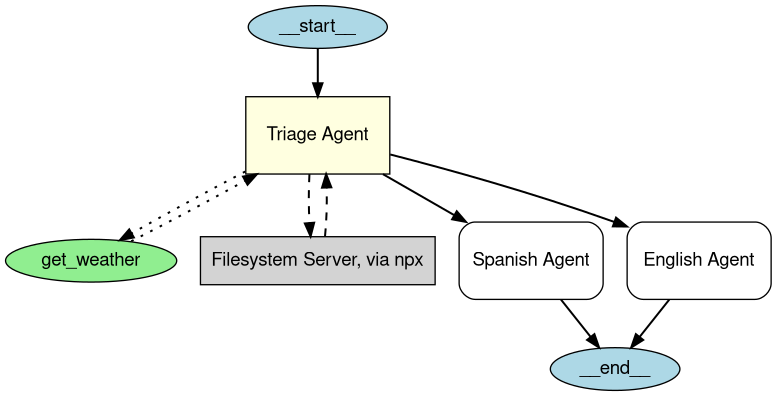

---
search:
  exclude: true
---
# エージェントの可視化

エージェントの可視化では、 **Graphviz** を使用してエージェントとその関係を構造化されたグラフィカルな表現として生成できます。これは、アプリケーション内でエージェント、ツール、ハンドオフがどのように相互作用するかを理解するのに役立ちます。

## インストール

オプションの `viz` 依存関係グループをインストールします:

```bash
pip install "openai-agents[viz]"
```

## グラフの生成

`draw_graph` 関数を使用して、エージェントの可視化を生成できます。この関数は、次のように表現される有向グラフを作成します。

- **エージェント** は黄色のボックスとして表されます。
- **MCP サーバー** は灰色のボックスとして表されます。
- **ツール** は緑色の楕円として表されます。
- **ハンドオフ** は、あるエージェントから別のエージェントへの有向エッジです。

### 使用例

```python
import os

from agents import Agent, function_tool
from agents.mcp.server import MCPServerStdio
from agents.extensions.visualization import draw_graph

@function_tool
def get_weather(city: str) -> str:
    return f"The weather in {city} is sunny."

spanish_agent = Agent(
    name="Spanish agent",
    instructions="You only speak Spanish.",
)

english_agent = Agent(
    name="English agent",
    instructions="You only speak English",
)

current_dir = os.path.dirname(os.path.abspath(__file__))
samples_dir = os.path.join(current_dir, "sample_files")
mcp_server = MCPServerStdio(
    name="Filesystem Server, via npx",
    params={
        "command": "npx",
        "args": ["-y", "@modelcontextprotocol/server-filesystem", samples_dir],
    },
)

triage_agent = Agent(
    name="Triage agent",
    instructions="Handoff to the appropriate agent based on the language of the request.",
    handoffs=[spanish_agent, english_agent],
    tools=[get_weather],
    mcp_servers=[mcp_server],
)

draw_graph(triage_agent)
```



これにより、 **トリアージエージェント** の構造と、サブエージェントおよびツールへの接続を視覚的に表すグラフが生成されます。


## 可視化の理解

生成されたグラフには次のものが含まれます。

- エントリーポイントを示す **開始ノード** （ `__start__` ）。
- 黄色で塗りつぶされた **長方形** として表されるエージェント。
- 緑色で塗りつぶされた **楕円** として表されるツール。
- 灰色で塗りつぶされた **長方形** として表される MCP サーバー。
- 相互作用を示す有向エッジ:
  - エージェント間ハンドオフを示す **実線の矢印** 。
  - ツール呼び出しを示す **点線の矢印** 。
  - MCP サーバー呼び出しを示す **破線の矢印** 。
- 実行が終了する場所を示す **終了ノード** （ `__end__` ）。

**注:** MCP サーバーは、最近のバージョンの `agents` パッケージで描画されます（ **v0.2.8** で確認済み）。可視化で MCP ボックスが表示されない場合は、最新リリースにアップグレードしてください。

## グラフのカスタマイズ

### グラフの表示
デフォルトでは、 `draw_graph` はグラフをインラインで表示します。グラフを別ウィンドウで表示するには、次のように記述します:

```python
draw_graph(triage_agent).view()
```

### グラフの保存
デフォルトでは、 `draw_graph` はグラフをインラインで表示します。ファイルとして保存するには、ファイル名を指定します:

```python
draw_graph(triage_agent, filename="agent_graph")
```

これにより、作業ディレクトリに `agent_graph.png` が生成されます。