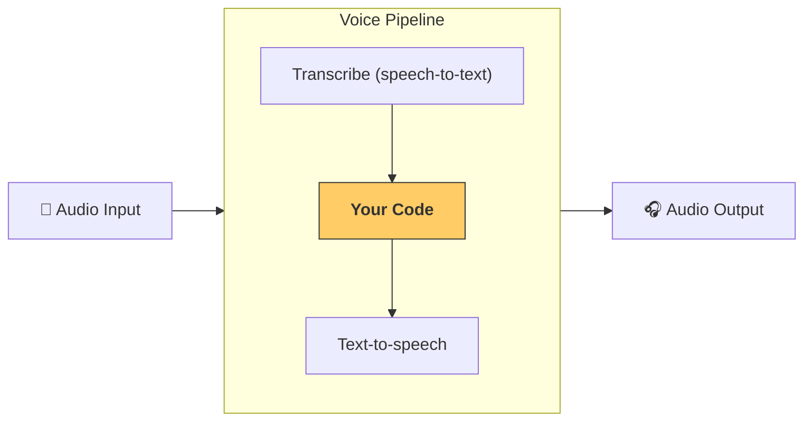

---
search:
  exclude: true
---
# パイプラインとワークフロー

[`VoicePipeline`][agents.voice.pipeline.VoicePipeline] は、エージェント型ワークフローを音声アプリに変換しやすくするクラスです。実行するワークフローを渡すと、パイプラインが入力音声の文字起こし、音声の終了検出、適切なタイミングでのワークフロー呼び出し、ワークフロー出力の音声への変換を処理します。



## パイプラインの設定

パイプラインを作成するときに、いくつかの項目を設定できます。

1. [`workflow`][agents.voice.workflow.VoiceWorkflowBase]。新しい音声が文字起こしされるたびに実行されるコードです。
2. 使用される [`speech-to-text`][agents.voice.model.STTModel] モデルと [`text-to-speech`][agents.voice.model.TTSModel] モデル
3. [`config`][agents.voice.pipeline_config.VoicePipelineConfig]。次のような項目を設定できます。
    - モデル名をモデルにマッピングできるモデルプロバイダー
    - トレーシング。トレーシングを無効にするか、音声ファイルをアップロードするか、ワークフロー名、トレース ID などを含みます。
    - TTS モデルと STT モデルの設定。プロンプト、言語、使用するデータ型などです。

## パイプラインの実行

[`run()`][agents.voice.pipeline.VoicePipeline.run] メソッドを通じてパイプラインを実行できます。このメソッドでは、音声入力を 2 つの形式で渡せます。

1. [`AudioInput`][agents.voice.input.AudioInput] は、完全な音声入力があり、それに対する実行結果だけを生成したい場合に使用します。これは、話者が話し終えたタイミングを検出する必要がない場合に便利です。たとえば、事前に録音された音声がある場合や、ユーザーが話し終えたことが明確なプッシュ・トゥ・トークアプリの場合です。
2. [`StreamedAudioInput`][agents.voice.input.StreamedAudioInput] は、ユーザーが話し終えたタイミングを検出する必要がある場合に使用します。検出された音声チャンクをプッシュでき、音声パイプラインは「アクティビティ検出」と呼ばれるプロセスを通じて、適切なタイミングでエージェントワークフローを自動的に実行します。

## 実行結果

音声パイプライン実行の実行結果は [`StreamedAudioResult`][agents.voice.result.StreamedAudioResult] です。これは、イベントが発生したときにストリーミングできるオブジェクトです。[`VoiceStreamEvent`][agents.voice.events.VoiceStreamEvent] には、次のような種類があります。

1. [`VoiceStreamEventAudio`][agents.voice.events.VoiceStreamEventAudio]。音声チャンクを含みます。
2. [`VoiceStreamEventLifecycle`][agents.voice.events.VoiceStreamEventLifecycle]。ターンの開始や終了などのライフサイクルイベントを通知します。
3. [`VoiceStreamEventError`][agents.voice.events.VoiceStreamEventError]。エラーイベントです。

```python

result = await pipeline.run(input)

async for event in result.stream():
    if event.type == "voice_stream_event_audio":
        # play audio
        pass
    elif event.type == "voice_stream_event_lifecycle":
        # lifecycle
        pass
    elif event.type == "voice_stream_event_error":
        # error
        pass
```

## ベストプラクティス

### 割り込み

Agents SDK は現在、[`StreamedAudioInput`][agents.voice.input.StreamedAudioInput] 向けの組み込みの割り込み処理を提供していません。代わりに、検出された各ターンがワークフローの個別の実行をトリガーします。アプリケーション内で割り込みを処理したい場合は、[`VoiceStreamEventLifecycle`][agents.voice.events.VoiceStreamEventLifecycle] イベントをリッスンできます。`turn_started` は、新しいターンが文字起こしされ、処理が開始されることを示します。`turn_ended` は、対応するターンのすべての音声が送出された後にトリガーされます。これらのイベントを使用して、モデルがターンを開始したときに話者のマイクをミュートし、そのターンに関連するすべての音声をフラッシュした後にミュートを解除できます。