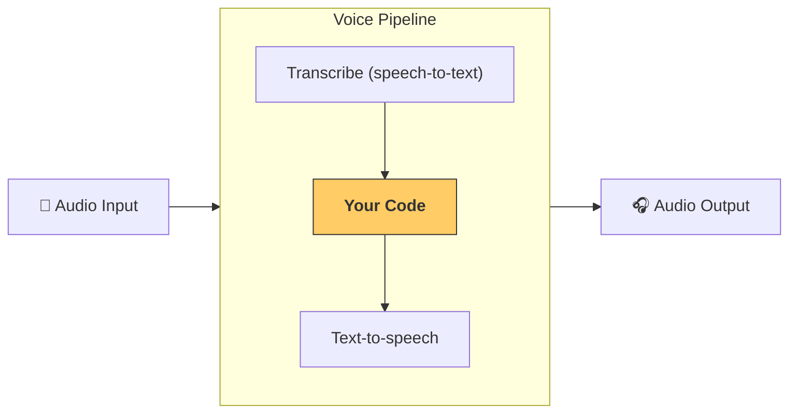

---
search:
  exclude: true
---
# クイックスタート

## 前提条件

Agents SDK の基本的な[クイックスタート手順](../quickstart.md)に従い、仮想環境をセットアップしていることを確認してください。次に、SDK のオプションの音声依存パッケージをインストールします。

```bash
pip install 'openai-agents[voice]'
```

## 基本概念

知っておくべき主要な概念は、3 ステップのプロセスである [`VoicePipeline`][agents.voice.pipeline.VoicePipeline] です。

1. 音声テキスト変換モデルを実行し、音声をテキストに変換します。
2. 通常はエージェント型ワークフローであるコードを実行し、結果を生成します。
3. テキスト音声変換モデルを実行し、結果のテキストを音声に戻します。



## エージェント

まず、いくつかのエージェントをセットアップします。この SDK でエージェントを構築した経験があれば、馴染みのある作業でしょう。ここでは、2 つのエージェント、1 つのハンドオフ、1 つのツールを用意します。

```python
import asyncio
import random

from agents import (
    Agent,
    function_tool,
)
from agents.extensions.handoff_prompt import prompt_with_handoff_instructions


@function_tool
def get_weather(city: str) -> str:
    """Get the weather for a given city."""
    print(f"[debug] get_weather called with city: {city}")
    choices = ["sunny", "cloudy", "rainy", "snowy"]
    return f"The weather in {city} is {random.choice(choices)}."


spanish_agent = Agent(
    name="Spanish",
    handoff_description="A Spanish-speaking agent.",
    instructions=prompt_with_handoff_instructions(
        "You're speaking to a human, so be polite and concise. Speak in Spanish.",
    ),
    model="gpt-5.6-sol",
)

agent = Agent(
    name="Assistant",
    instructions=prompt_with_handoff_instructions(
        "You're speaking to a human, so be polite and concise. If the user speaks in Spanish, hand off to the Spanish agent.",
    ),
    model="gpt-5.6-sol",
    handoffs=[spanish_agent],
    tools=[get_weather],
)
```

## 音声パイプライン

ワークフローとして [`SingleAgentVoiceWorkflow`][agents.voice.workflow.SingleAgentVoiceWorkflow] を使用し、シンプルな音声パイプラインをセットアップします。

```python
from agents.voice import SingleAgentVoiceWorkflow, VoicePipeline
pipeline = VoicePipeline(workflow=SingleAgentVoiceWorkflow(agent))
```

## パイプラインの実行

```python
import numpy as np
import sounddevice as sd
from agents.voice import AudioInput

# For simplicity, we'll just create 3 seconds of silence
# In reality, you'd get microphone data
buffer = np.zeros(24000 * 3, dtype=np.int16)
audio_input = AudioInput(buffer=buffer)

result = await pipeline.run(audio_input)

# Create an audio player using `sounddevice`
player = sd.OutputStream(samplerate=24000, channels=1, dtype=np.int16)
player.start()

# Play the audio stream as it comes in
async for event in result.stream():
    if event.type == "voice_stream_event_audio":
        player.write(event.data)

```

## 全体の統合

```python
import asyncio
import random

import numpy as np
import sounddevice as sd

from agents import (
    Agent,
    function_tool,
    set_tracing_disabled,
)
from agents.voice import (
    AudioInput,
    SingleAgentVoiceWorkflow,
    VoicePipeline,
)
from agents.extensions.handoff_prompt import prompt_with_handoff_instructions


@function_tool
def get_weather(city: str) -> str:
    """Get the weather for a given city."""
    print(f"[debug] get_weather called with city: {city}")
    choices = ["sunny", "cloudy", "rainy", "snowy"]
    return f"The weather in {city} is {random.choice(choices)}."


spanish_agent = Agent(
    name="Spanish",
    handoff_description="A Spanish-speaking agent.",
    instructions=prompt_with_handoff_instructions(
        "You're speaking to a human, so be polite and concise. Speak in Spanish.",
    ),
    model="gpt-5.6-sol",
)

agent = Agent(
    name="Assistant",
    instructions=prompt_with_handoff_instructions(
        "You're speaking to a human, so be polite and concise. If the user speaks in Spanish, hand off to the Spanish agent.",
    ),
    model="gpt-5.6-sol",
    handoffs=[spanish_agent],
    tools=[get_weather],
)


async def main():
    pipeline = VoicePipeline(workflow=SingleAgentVoiceWorkflow(agent))
    buffer = np.zeros(24000 * 3, dtype=np.int16)
    audio_input = AudioInput(buffer=buffer)

    result = await pipeline.run(audio_input)

    # Create an audio player using `sounddevice`
    player = sd.OutputStream(samplerate=24000, channels=1, dtype=np.int16)
    player.start()

    # Play the audio stream as it comes in
    async for event in result.stream():
        if event.type == "voice_stream_event_audio":
            player.write(event.data)


if __name__ == "__main__":
    asyncio.run(main())
```

この例を実行すると、エージェントが話しかけてきます！自分でエージェントに話しかけられるデモについては、[examples/voice/static](https://github.com/openai/openai-agents-python/tree/main/examples/voice/static) の例をご覧ください。