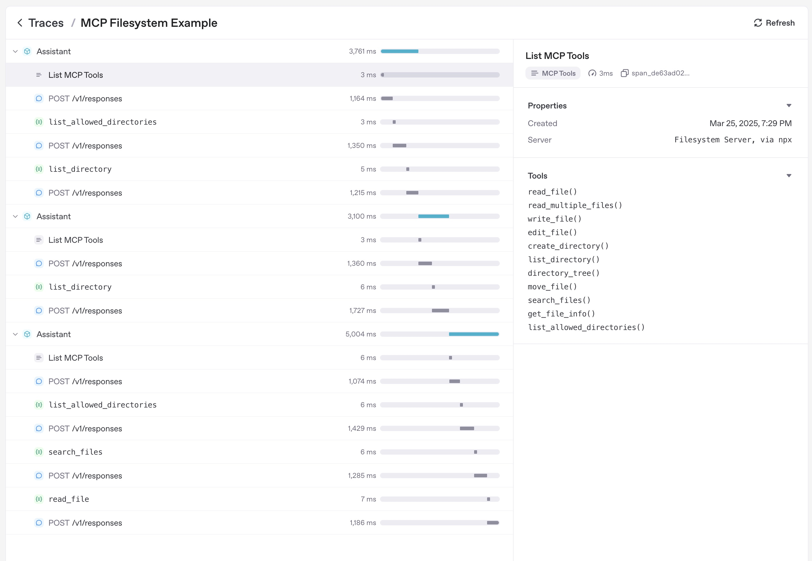

---
search:
  exclude: true
---
# Model context protocol (MCP)

[Model context protocol](https://modelcontextprotocol.io/introduction) (MCP)는 애플리케이션이 도구와
컨텍스트를 언어 모델에 노출하는 방식을 표준화합니다. 공식 문서에 따르면 다음과 같습니다.

> MCP는 애플리케이션이 LLMs에 컨텍스트를 제공하는 방식을 표준화하는 개방형 프로토콜입니다. MCP를 AI
> 애플리케이션을 위한 USB-C 포트처럼 생각해 보세요. USB-C가 기기를 다양한 주변 장치와 액세서리에 연결하는 표준화된 방식을 제공하듯이, MCP는
> AI 모델을 다양한 데이터 소스와 도구에 연결하는 표준화된 방식을 제공합니다.

Agents Python SDK는 여러 MCP 전송 방식을 지원합니다. 이를 통해 기존 MCP 서버를 재사용하거나, 파일 시스템, HTTP 또는 커넥터 기반 도구를 에이전트에 노출하도록 직접 빌드할 수 있습니다.

## MCP 통합 선택

MCP 서버를 에이전트에 연결하기 전에 도구 호출을 어디서 실행해야 하는지, 어떤 전송 방식에 접근할 수 있는지 결정하세요. 아래 표는 Python SDK가 지원하는 옵션을 요약합니다.

| 필요한 사항                                                                        | 권장 옵션                                    |
| ------------------------------------------------------------------------------------ | ----------------------------------------------------- |
| OpenAI의 Responses API가 모델을 대신해 공개적으로 접근 가능한 MCP 서버를 호출하도록 하기| [`HostedMCPTool`][agents.tool.HostedMCPTool]을 통한 **호스티드 MCP 서버 도구** |
| 로컬 또는 원격에서 실행하는 Streamable HTTP 서버에 연결하기                  | [`MCPServerStreamableHttp`][agents.mcp.server.MCPServerStreamableHttp]를 통한 **Streamable HTTP MCP 서버** |
| Server-Sent Events가 포함된 HTTP를 구현하는 서버와 통신하기                          | [`MCPServerSse`][agents.mcp.server.MCPServerSse]를 통한 **HTTP with SSE MCP 서버** |
| 로컬 프로세스를 시작하고 stdin/stdout을 통해 통신하기                             | [`MCPServerStdio`][agents.mcp.server.MCPServerStdio]를 통한 **stdio MCP 서버** |

아래 섹션에서는 각 옵션, 구성 방법, 그리고 어떤 경우에 한 전송 방식을 다른 전송 방식보다 선호해야 하는지 살펴봅니다.

## 에이전트 수준 MCP 구성

전송 방식을 선택하는 것 외에도 `Agent.mcp_config`를 설정하여 MCP 도구가 준비되는 방식을 조정할 수 있습니다.

```python
from agents import Agent

agent = Agent(
    name="Assistant",
    mcp_servers=[server],
    mcp_config={
        # Try to convert MCP tool schemas to strict JSON schema.
        "convert_schemas_to_strict": True,
        # If None, MCP tool failures are raised as exceptions instead of
        # returning model-visible error text.
        "failure_error_function": None,
        # Prefix local MCP tool names with their server name.
        "include_server_in_tool_names": True,
    },
)
```

참고:

- `convert_schemas_to_strict`는 최선 노력 방식입니다. 스키마를 변환할 수 없으면 원래 스키마가 사용됩니다.
- `failure_error_function`은 MCP 도구 호출 실패가 모델에 어떻게 표시되는지 제어합니다.
- `failure_error_function`이 설정되지 않은 경우 SDK는 기본 도구 오류 포매터를 사용합니다.
- 서버 수준의 `failure_error_function`은 해당 서버에 대해 `Agent.mcp_config["failure_error_function"]`을 재정의합니다.
- `include_server_in_tool_names`는 옵트인 방식입니다. 활성화하면 각 로컬 MCP 도구가 결정적인 서버 접두사 이름으로 모델에 노출되어, 여러 MCP 서버가 같은 이름의 도구를 게시할 때 충돌을 피하는 데 도움이 됩니다. 생성된 이름은 ASCII-safe이고, 함수 도구 이름 길이 제한 내에 있으며, 동일한 에이전트에 있는 기존 로컬 함수 도구 이름 및 활성화된 핸드오프 이름과 충돌하지 않습니다. SDK는 여전히 원래 서버에서 원래 MCP 도구 이름을 호출합니다.

## 전송 방식 전반의 공통 패턴

전송 방식을 선택한 뒤에는 대부분의 통합에서 다음과 같은 후속 결정이 필요합니다.

- 도구의 일부만 노출하는 방법([도구 필터링](#tool-filtering)).
- 서버가 재사용 가능한 프롬프트도 제공하는지 여부([프롬프트](#prompts)).
- `list_tools()`를 캐시해야 하는지 여부([캐싱](#caching)).
- MCP 활동이 트레이스에 표시되는 방식([트레이싱](#tracing)).

로컬 MCP 서버(`MCPServerStdio`, `MCPServerSse`, `MCPServerStreamableHttp`)의 경우 승인 정책과 호출별 `_meta` 페이로드도 공통 개념입니다. Streamable HTTP 섹션은 가장 완전한 예를 보여주며, 동일한 패턴이 다른 로컬 전송 방식에도 적용됩니다.

## 1. 호스티드 MCP 서버 도구

호스티드 툴은 전체 도구 왕복 과정을 OpenAI 인프라로 보냅니다. 코드가 도구를 나열하고 호출하는 대신, [`HostedMCPTool`][agents.tool.HostedMCPTool]은 서버 레이블(및 선택적 커넥터 메타데이터)을 Responses API로 전달합니다. 모델은 Python 프로세스에 대한 추가 콜백 없이 원격 서버의 도구를 나열하고 호출합니다. 현재 호스티드 툴은 Responses API의 호스티드 MCP 통합을 지원하는 OpenAI 모델에서 작동합니다.

### 기본 호스티드 MCP 도구

에이전트의 `tools` 목록에 [`HostedMCPTool`][agents.tool.HostedMCPTool]을 추가하여 호스티드 툴을 만듭니다. `tool_config`
dict는 REST API로 보낼 JSON과 동일한 구조입니다.

```python
import asyncio

from agents import Agent, HostedMCPTool, Runner

async def main() -> None:
    agent = Agent(
        name="Assistant",
        instructions="Use the DeepWiki hosted MCP server to inspect openai/openai-agents-python.",
        tools=[
            HostedMCPTool(
                tool_config={
                    "type": "mcp",
                    "server_label": "deepwiki",
                    "server_url": "https://mcp.deepwiki.com/mcp",
                    "require_approval": "never",
                }
            )
        ],
    )

    result = await Runner.run(
        agent,
        "Which language is the repository openai/openai-agents-python written in?",
    )
    print(result.final_output)

asyncio.run(main())
```

호스티드 서버는 자체 도구를 자동으로 노출하므로, 이를 `mcp_servers`에 추가하지 않습니다.

호스티드 툴 검색이 호스티드 MCP 서버를 지연 로드하도록 하려면 `tool_config["defer_loading"] = True`를 설정하고 [`ToolSearchTool`][agents.tool.ToolSearchTool]을 에이전트에 추가하세요. 이는 OpenAI Responses 모델에서만 지원됩니다. 전체 도구 검색 설정 및 제약 사항은 [도구](tools.md#hosted-tool-search)를 참조하세요.

### 호스티드 MCP 결과 스트리밍

호스티드 툴은 함수 도구와 정확히 같은 방식으로 스트리밍 결과를 지원합니다. 모델이 계속 작업하는 동안
증분 MCP 출력을 소비하려면 `Runner.run_streamed`를 사용하세요.

```python
result = Runner.run_streamed(agent, "Summarise this repository's top languages")
async for event in result.stream_events():
    if event.type == "run_item_stream_event":
        print(f"Received: {event.item}")
print(result.final_output)
```

### 선택적 승인 흐름

서버가 민감한 작업을 수행할 수 있다면 각 도구 실행 전에 사람 또는 프로그램 방식의 승인을 요구할 수 있습니다. `tool_config`에서 `require_approval`을 단일 정책(`"always"`, `"never"`) 또는 도구 이름을 정책에 매핑하는 dict로 구성하세요. Python 내부에서 결정을 내리려면 `on_approval_request` 콜백을 제공하세요.

```python
from agents import MCPToolApprovalFunctionResult, MCPToolApprovalRequest

SAFE_TOOLS = {"read_wiki_structure", "read_wiki_contents", "ask_question"}

def approve_tool(request: MCPToolApprovalRequest) -> MCPToolApprovalFunctionResult:
    if request.data.name in SAFE_TOOLS:
        return {"approve": True}
    return {"approve": False, "reason": "Escalate to a human reviewer"}

agent = Agent(
    name="Assistant",
    tools=[
        HostedMCPTool(
            tool_config={
                "type": "mcp",
                "server_label": "deepwiki",
                "server_url": "https://mcp.deepwiki.com/mcp",
                "require_approval": "always",
            },
            on_approval_request=approve_tool,
        )
    ],
)
```

콜백은 동기 또는 비동기일 수 있으며, 모델이 계속 실행하기 위해 승인 데이터가 필요할 때마다 호출됩니다.

### 커넥터 기반 호스티드 서버

호스티드 MCP는 OpenAI 커넥터도 지원합니다. `server_url`을 지정하는 대신 `connector_id`와 액세스 토큰을 제공하세요. Responses API가 인증을 처리하고 호스티드 서버가 커넥터의 도구를 노출합니다.

```python
import os

HostedMCPTool(
    tool_config={
        "type": "mcp",
        "server_label": "google_calendar",
        "connector_id": "connector_googlecalendar",
        "authorization": os.environ["GOOGLE_CALENDAR_AUTHORIZATION"],
        "require_approval": "never",
    }
)
```

스트리밍, 승인, 커넥터를 포함해 완전히 동작하는 호스티드 툴 샘플은 [`examples/hosted_mcp`](https://github.com/openai/openai-agents-python/tree/main/examples/hosted_mcp)에 있습니다.

## 2. Streamable HTTP MCP 서버

네트워크 연결을 직접 관리하려면 [`MCPServerStreamableHttp`][agents.mcp.server.MCPServerStreamableHttp]를 사용하세요. Streamable HTTP 서버는 전송 방식을 제어하거나, 지연 시간을 낮게 유지하면서 자체 인프라 내부에서 서버를 실행하려는 경우에 적합합니다.

```python
import asyncio
import os

from agents import Agent, Runner
from agents.mcp import MCPServerStreamableHttp
from agents.model_settings import ModelSettings

async def main() -> None:
    token = os.environ["MCP_SERVER_TOKEN"]
    async with MCPServerStreamableHttp(
        name="Streamable HTTP Python Server",
        params={
            "url": "http://localhost:8000/mcp",
            "headers": {"Authorization": f"Bearer {token}"},
            "timeout": 10,
        },
        cache_tools_list=True,
        max_retry_attempts=3,
    ) as server:
        agent = Agent(
            name="Assistant",
            instructions="Use the MCP tools to answer the questions.",
            mcp_servers=[server],
            model_settings=ModelSettings(tool_choice="required"),
        )

        result = await Runner.run(agent, "Add 7 and 22.")
        print(result.final_output)

asyncio.run(main())
```

생성자는 추가 옵션을 받습니다.

- `client_session_timeout_seconds`는 HTTP 읽기 타임아웃을 제어합니다.
- `use_structured_content`는 텍스트 출력보다 `tool_result.structured_content`를 선호할지 여부를 전환합니다.
- `max_retry_attempts`와 `retry_backoff_seconds_base`는 `list_tools()` 및 `call_tool()`에 대한 자동 재시도를 추가합니다.
- `tool_filter`를 사용하면 도구의 일부만 노출할 수 있습니다([도구 필터링](#tool-filtering) 참조).
- `require_approval`은 로컬 MCP 도구에서 휴먼인더루프 (HITL) 승인 정책을 활성화합니다.
- `failure_error_function`은 모델에 표시되는 MCP 도구 실패 메시지를 사용자 지정합니다. 오류를 대신 발생시키려면 이를 `None`으로 설정하세요.
- `tool_meta_resolver`는 `call_tool()` 전에 호출별 MCP `_meta` 페이로드를 주입합니다.

### 로컬 MCP 서버의 승인 정책

`MCPServerStdio`, `MCPServerSse`, `MCPServerStreamableHttp`는 모두 `require_approval`을 받습니다.

지원되는 형식:

- 모든 도구에 대해 `"always"` 또는 `"never"`
- `True` / `False`(`always`/`never`와 동일)
- 도구별 맵, 예: `{"delete_file": "always", "read_file": "never"}`
- 그룹화된 객체: `{"always": {"tool_names": [...]}, "never": {"tool_names": [...]}}`

```python
async with MCPServerStreamableHttp(
    name="Filesystem MCP",
    params={"url": "http://localhost:8000/mcp"},
    require_approval={"always": {"tool_names": ["delete_file"]}},
) as server:
    ...
```

전체 일시 중지/재개 흐름은 [휴먼인더루프 (HITL)](human_in_the_loop.md)와 `examples/mcp/get_all_mcp_tools_example/main.py`를 참조하세요.

### 호출별 메타데이터와 `tool_meta_resolver`

MCP 서버가 `_meta`에서 요청 메타데이터(예: 테넌트 ID 또는 트레이스 컨텍스트)를 기대하는 경우 `tool_meta_resolver`를 사용하세요. 아래 예시는 `Runner.run(...)`에 `context`로 `dict`를 전달한다고 가정합니다.

```python
from agents.mcp import MCPServerStreamableHttp, MCPToolMetaContext


def resolve_meta(context: MCPToolMetaContext) -> dict[str, str] | None:
    run_context_data = context.run_context.context or {}
    tenant_id = run_context_data.get("tenant_id")
    if tenant_id is None:
        return None
    return {"tenant_id": str(tenant_id), "source": "agents-sdk"}


server = MCPServerStreamableHttp(
    name="Metadata-aware MCP",
    params={"url": "http://localhost:8000/mcp"},
    tool_meta_resolver=resolve_meta,
)
```

실행 컨텍스트가 Pydantic 모델, dataclass 또는 사용자 지정 클래스라면 속성 접근으로 테넌트 ID를 읽으세요.

### MCP 도구 출력: 텍스트와 이미지

MCP 도구가 이미지 콘텐츠를 반환하면 SDK는 이를 이미지 도구 출력 항목으로 자동 매핑합니다. 텍스트/이미지 혼합 응답은 출력 항목 목록으로 전달되므로, 에이전트는 일반 함수 도구의 이미지 출력을 소비하는 것과 같은 방식으로 MCP 이미지 결과를 소비할 수 있습니다.

## 3. HTTP with SSE MCP 서버

!!! warning

    MCP 프로젝트는 Server-Sent Events 전송 방식을 deprecated 처리했습니다. 새 통합에는 Streamable HTTP 또는 stdio를 선호하고 SSE는 레거시 서버에만 유지하세요.

MCP 서버가 HTTP with SSE 전송 방식을 구현하는 경우 [`MCPServerSse`][agents.mcp.server.MCPServerSse]를 인스턴스화하세요. 전송 방식을 제외하면 API는 Streamable HTTP 서버와 동일합니다.

```python

from agents import Agent, Runner
from agents.model_settings import ModelSettings
from agents.mcp import MCPServerSse

workspace_id = "demo-workspace"

async with MCPServerSse(
    name="SSE Python Server",
    params={
        "url": "http://localhost:8000/sse",
        "headers": {"X-Workspace": workspace_id},
    },
    cache_tools_list=True,
) as server:
    agent = Agent(
        name="Assistant",
        mcp_servers=[server],
        model_settings=ModelSettings(tool_choice="required"),
    )
    result = await Runner.run(agent, "What's the weather in Tokyo?")
    print(result.final_output)
```

## 4. stdio MCP 서버

로컬 하위 프로세스로 실행되는 MCP 서버에는 [`MCPServerStdio`][agents.mcp.server.MCPServerStdio]를 사용하세요. SDK는 프로세스를 생성하고 파이프를 열린 상태로 유지하며, 컨텍스트 관리자가 종료될 때 자동으로 닫습니다. 이 옵션은 빠른 개념 증명이나 서버가 명령줄 엔트리 포인트만 노출하는 경우에 유용합니다.

```python
from pathlib import Path
from agents import Agent, Runner
from agents.mcp import MCPServerStdio

current_dir = Path(__file__).parent
samples_dir = current_dir / "sample_files"

async with MCPServerStdio(
    name="Filesystem Server via npx",
    params={
        "command": "npx",
        "args": ["-y", "@modelcontextprotocol/server-filesystem", str(samples_dir)],
    },
) as server:
    agent = Agent(
        name="Assistant",
        instructions="Use the files in the sample directory to answer questions.",
        mcp_servers=[server],
    )
    result = await Runner.run(agent, "List the files available to you.")
    print(result.final_output)
```

## 5. MCP 서버 관리자

MCP 서버가 여러 개 있다면 `MCPServerManager`를 사용해 미리 연결하고 연결된 하위 집합을 에이전트에 노출하세요. 생성자 옵션 및 재연결 동작은 [MCPServerManager API 참조](ref/mcp/manager.md)를 참조하세요.

```python
from agents import Agent, Runner
from agents.mcp import MCPServerManager, MCPServerStreamableHttp

servers = [
    MCPServerStreamableHttp(name="calendar", params={"url": "http://localhost:8000/mcp"}),
    MCPServerStreamableHttp(name="docs", params={"url": "http://localhost:8001/mcp"}),
]

async with MCPServerManager(servers) as manager:
    agent = Agent(
        name="Assistant",
        instructions="Use MCP tools when they help.",
        mcp_servers=manager.active_servers,
    )
    result = await Runner.run(agent, "Which MCP tools are available?")
    print(result.final_output)
```

주요 동작:

- `drop_failed_servers=True`(기본값)인 경우 `active_servers`에는 성공적으로 연결된 서버만 포함됩니다.
- 실패는 `failed_servers`와 `errors`에 추적됩니다.
- 첫 번째 연결 실패 시 오류를 발생시키려면 `strict=True`를 설정하세요.
- 실패한 서버를 다시 시도하려면 `reconnect(failed_only=True)`를 호출하고, 모든 서버를 다시 시작하려면 `reconnect(failed_only=False)`를 호출하세요.
- 수명 주기 동작을 조정하려면 `connect_timeout_seconds`, `cleanup_timeout_seconds`, `connect_in_parallel`을 사용하세요.

## 공통 서버 기능

아래 섹션은 MCP 서버 전송 방식 전반에 적용됩니다(정확한 API 범위는 서버 클래스에 따라 달라짐).

## 도구 필터링

각 MCP 서버는 도구 필터를 지원하므로 에이전트에 필요한 함수만 노출할 수 있습니다. 필터링은 생성 시점에 수행하거나 실행별로 동적으로 수행할 수 있습니다.

### 정적 도구 필터링

간단한 허용/차단 목록을 구성하려면 [`create_static_tool_filter`][agents.mcp.create_static_tool_filter]를 사용하세요.

```python
from pathlib import Path

from agents.mcp import MCPServerStdio, create_static_tool_filter

samples_dir = Path("/path/to/files")

filesystem_server = MCPServerStdio(
    params={
        "command": "npx",
        "args": ["-y", "@modelcontextprotocol/server-filesystem", str(samples_dir)],
    },
    tool_filter=create_static_tool_filter(allowed_tool_names=["read_file", "write_file"]),
)
```

`allowed_tool_names`와 `blocked_tool_names`가 모두 제공되면 SDK는 허용 목록을 먼저 적용한 뒤 남은 집합에서 차단된 도구를 제거합니다.

### 동적 도구 필터링

더 복잡한 로직의 경우 [`ToolFilterContext`][agents.mcp.ToolFilterContext]를 받는 호출 가능 객체를 전달하세요. 호출 가능 객체는 동기 또는 비동기일 수 있으며, 도구를 노출해야 할 때 `True`를 반환합니다.

```python
from pathlib import Path

from agents.mcp import MCPServerStdio, ToolFilterContext

samples_dir = Path("/path/to/files")

async def context_aware_filter(context: ToolFilterContext, tool) -> bool:
    if context.agent.name == "Code Reviewer" and tool.name.startswith("danger_"):
        return False
    return True

async with MCPServerStdio(
    params={
        "command": "npx",
        "args": ["-y", "@modelcontextprotocol/server-filesystem", str(samples_dir)],
    },
    tool_filter=context_aware_filter,
) as server:
    ...
```

필터 컨텍스트는 활성 `run_context`, 도구를 요청하는 `agent`, 그리고 `server_name`을 노출합니다.

## 프롬프트

MCP 서버는 에이전트 지침을 동적으로 생성하는 프롬프트도 제공할 수 있습니다. 프롬프트를 지원하는 서버는 두 가지
메서드를 노출합니다.

- `list_prompts()`는 사용 가능한 프롬프트 템플릿을 열거합니다.
- `get_prompt(name, arguments)`는 매개변수를 선택적으로 포함하여 구체적인 프롬프트를 가져옵니다.

```python
from agents import Agent

prompt_result = await server.get_prompt(
    "generate_code_review_instructions",
    {"focus": "security vulnerabilities", "language": "python"},
)
instructions = prompt_result.messages[0].content.text

agent = Agent(
    name="Code Reviewer",
    instructions=instructions,
    mcp_servers=[server],
)
```

## 캐싱

각 에이전트 실행은 모든 MCP 서버에서 `list_tools()`를 호출합니다. 원격 서버는 눈에 띄는 지연 시간을 유발할 수 있으므로, 모든 MCP 서버 클래스는 `cache_tools_list` 옵션을 노출합니다. 도구 정의가 자주 변경되지 않는다고 확신하는 경우에만 이를 `True`로 설정하세요. 나중에 최신 목록을 강제로 가져오려면 서버 인스턴스에서 `invalidate_tools_cache()`를 호출하세요.

## 트레이싱

[트레이싱](./tracing.md)은 다음을 포함한 MCP 활동을 자동으로 캡처합니다.

1. 도구 목록을 나열하기 위한 MCP 서버 호출
2. 도구 호출의 MCP 관련 정보



## 추가 자료

- [Model Context Protocol](https://modelcontextprotocol.io/) – 사양 및 설계 가이드
- [examples/mcp](https://github.com/openai/openai-agents-python/tree/main/examples/mcp) – 실행 가능한 stdio, SSE 및 Streamable HTTP 샘플
- [examples/hosted_mcp](https://github.com/openai/openai-agents-python/tree/main/examples/hosted_mcp) – 승인 및 커넥터를 포함한 완전한 호스티드 MCP 데모