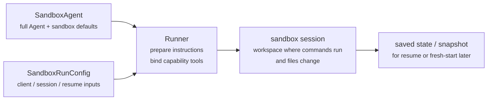
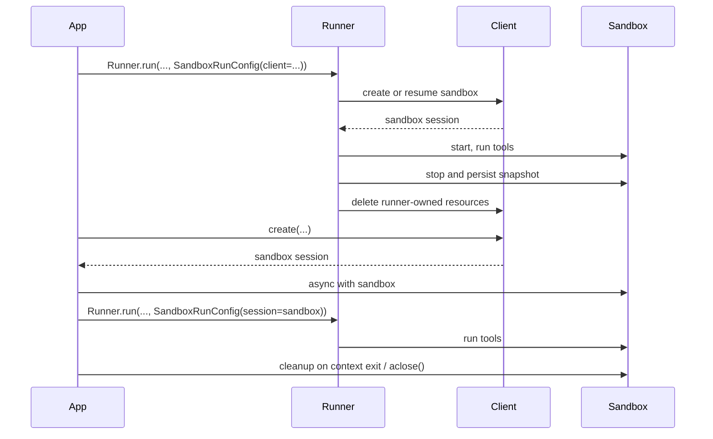

---
search:
  exclude: true
---
# 개념

!!! warning "베타 기능"

    샌드박스 에이전트는 베타 버전입니다. 정식 출시 전까지 API 세부 정보, 기본값, 지원 기능이 변경될 수 있으며, 향후 더 고급 기능이 추가될 수 있습니다.

최신 에이전트는 파일 시스템의 실제 파일을 다룰 수 있을 때 가장 효과적으로 작동합니다. **샌드박스 에이전트**는 특화된 도구와 셸 명령을 사용하여 대규모 문서 집합을 검색하고 조작하며, 파일을 편집하고, 아티팩트를 생성하고, 명령을 실행할 수 있습니다. 샌드박스는 에이전트가 사용자를 대신해 작업할 수 있는 영구 워크스페이스를 모델에 제공합니다. Agents SDK의 샌드박스 에이전트를 사용하면 에이전트를 샌드박스 환경과 연결하여 손쉽게 실행할 수 있으며, 적절한 파일을 파일 시스템에 배치하고 샌드박스를 오케스트레이션하여 대규모 작업을 쉽게 시작, 중지, 재개할 수 있습니다.

에이전트에 필요한 데이터를 중심으로 워크스페이스를 정의합니다. 워크스페이스는 GitHub 저장소, 로컬 파일과 디렉터리, 합성 작업 파일, S3 또는 Azure Blob Storage 같은 원격 파일 시스템, 그리고 사용자가 제공하는 기타 샌드박스 입력으로 시작할 수 있습니다.

<div class="sandbox-harness-image" markdown="1">


</div>

`SandboxAgent`도 여전히 `Agent`입니다. `instructions`, `prompt`, `tools`, `handoffs`, `mcp_servers`, `model_settings`, `output_type`, 가드레일, 훅과 같은 일반적인 에이전트 인터페이스를 그대로 유지하며, 일반적인 `Runner` API를 통해 실행됩니다. 달라지는 부분은 실행 경계입니다.

- `SandboxAgent`는 에이전트 자체를 정의합니다. 일반적인 에이전트 구성에 더해 `default_manifest`, `base_instructions`, `run_as` 같은 샌드박스 전용 기본값과 파일 시스템 도구, 셸 액세스, 스킬, 메모리 또는 압축 같은 기능을 포함합니다.
- `Manifest`는 파일, 저장소, 마운트, 환경을 포함하여 새 샌드박스 워크스페이스에 필요한 초기 콘텐츠와 레이아웃을 선언합니다.
- 샌드박스 세션은 명령이 실행되고 파일이 변경되는 실제 격리 환경입니다.
- [`SandboxRunConfig`][agents.run_config.SandboxRunConfig]는 샌드박스 세션을 직접 주입하거나, 직렬화된 샌드박스 세션 상태로 다시 연결하거나, 샌드박스 클라이언트를 통해 새 샌드박스 세션을 생성하는 등 실행에서 샌드박스 세션을 가져오는 방식을 결정합니다.
- 저장된 샌드박스 상태와 스냅샷을 사용하면 이후 실행에서 이전 작업에 다시 연결하거나, 저장된 콘텐츠를 바탕으로 새 샌드박스 세션을 초기화할 수 있습니다.

`Manifest`는 새 세션의 워크스페이스 계약이며, 모든 실제 샌드박스에 관한 완전한 정보의 원천은 아닙니다. 실행의 유효 워크스페이스는 재사용된 샌드박스 세션, 직렬화된 샌드박스 세션 상태 또는 실행 시 선택한 스냅샷에서 가져올 수도 있습니다.

이 페이지에서 "샌드박스 세션"은 샌드박스 클라이언트가 관리하는 실제 실행 환경을 의미합니다. 이는 [세션](../sessions/index.md)에서 설명하는 SDK의 대화형 [`Session`][agents.memory.session.Session] 인터페이스와 다릅니다.

외부 런타임은 계속해서 승인, 트레이싱, 핸드오프, 재개 관련 기록을 담당합니다. 샌드박스 세션은 명령, 파일 변경, 환경 격리를 담당합니다. 이러한 역할 분리는 모델의 핵심 요소입니다.

### 구성 요소 간 연계

샌드박스 실행은 에이전트 정의와 실행별 샌드박스 구성을 결합합니다. 러너는 에이전트를 준비하고 실제 샌드박스 세션에 바인딩하며, 이후 실행을 위해 상태를 저장할 수 있습니다.



샌드박스 전용 기본값은 `SandboxAgent`에 둡니다. 실행별 샌드박스 세션 선택 사항은 `SandboxRunConfig`에 둡니다.

수명 주기는 다음 세 단계로 생각할 수 있습니다.

1. `SandboxAgent`, `Manifest`, 기능을 사용하여 에이전트와 새 워크스페이스 계약을 정의합니다.
2. 샌드박스 세션을 주입, 재개 또는 생성하는 `SandboxRunConfig`를 `Runner`에 제공하여 실행합니다.
3. 러너가 관리하는 `RunState`, 명시적인 샌드박스 `session_state` 또는 저장된 워크스페이스 스냅샷에서 나중에 작업을 이어갑니다.

셸 액세스가 가끔 사용하는 도구 중 하나일 뿐이라면 [도구 가이드](../tools.md)의 호스티드 셸부터 사용하세요. 워크스페이스 격리, 샌드박스 클라이언트 선택 또는 샌드박스 세션 재개 동작이 설계의 일부라면 샌드박스 에이전트를 사용하세요.

## 사용 시점

샌드박스 에이전트는 다음과 같은 워크스페이스 중심 워크플로에 적합합니다.

- 코딩과 디버깅(예: GitHub 저장소의 이슈 보고서에 대한 자동 수정 작업을 오케스트레이션하고 특정 테스트 실행)
- 문서 처리와 편집(예: 사용자의 재무 문서에서 정보를 추출하고 작성된 세금 양식 초안 생성)
- 파일에 기반한 검토 또는 분석(예: 답변하기 전에 온보딩 패킷, 생성된 보고서 또는 아티팩트 번들 확인)
- 격리된 멀티 에이전트 패턴(예: 각 검토자나 코딩 하위 에이전트에 자체 워크스페이스 제공)
- 여러 단계로 구성된 워크스페이스 작업(예: 한 실행에서 버그를 수정하고 나중에 회귀 테스트를 추가하거나, 스냅샷 또는 샌드박스 세션 상태에서 재개)

파일이나 지속적으로 변경되는 파일 시스템에 액세스할 필요가 없다면 `Agent`를 계속 사용하세요. 셸 액세스가 가끔 필요한 기능일 뿐이라면 호스티드 셸을 추가하고, 워크스페이스 경계 자체가 기능의 일부라면 샌드박스 에이전트를 사용하세요.

## 샌드박스 클라이언트 선택

로컬 개발에는 `UnixLocalSandboxClient`부터 사용하세요. 컨테이너 격리 또는 이미지 일관성이 필요하면 `DockerSandboxClient`로 전환하세요. 공급자가 관리하는 실행이 필요하면 호스티드 공급자로 전환하세요.

대부분의 경우 [`SandboxRunConfig`][agents.run_config.SandboxRunConfig]에서 샌드박스 클라이언트와 해당 옵션만 변경하면 `SandboxAgent` 정의는 그대로 유지됩니다. 로컬, Docker, 호스티드, 원격 마운트 옵션은 [샌드박스 클라이언트](clients.md)를 참고하세요.

## 핵심 구성 요소

<div class="sandbox-nowrap-first-column-table" markdown="1">

| 계층 | 주요 SDK 구성 요소 | 답하는 질문 |
| --- | --- | --- |
| 에이전트 정의 | `SandboxAgent`, `Manifest`, 기능 | 어떤 에이전트를 실행하며, 어떤 새 세션 워크스페이스 계약에서 시작해야 합니까? |
| 샌드박스 실행 | `SandboxRunConfig`, 샌드박스 클라이언트, 실제 샌드박스 세션 | 이 실행은 실제 샌드박스 세션을 어떻게 가져오며, 작업은 어디에서 실행됩니까? |
| 저장된 샌드박스 상태 | `RunState` 샌드박스 페이로드, `session_state`, 스냅샷 | 이 워크플로는 이전 샌드박스 작업에 어떻게 다시 연결하거나 저장된 콘텐츠에서 새 샌드박스 세션을 초기화합니까? |

</div>

주요 SDK 구성 요소는 다음과 같이 각 계층에 대응합니다.

<div class="sandbox-nowrap-first-column-table" markdown="1">

| 구성 요소 | 담당 범위 | 확인할 질문 |
| --- | --- | --- |
| [`SandboxAgent`][agents.sandbox.sandbox_agent.SandboxAgent] | 에이전트 정의 | 이 에이전트는 무엇을 해야 하며, 어떤 기본값을 함께 유지해야 합니까? |
| [`Manifest`][agents.sandbox.manifest.Manifest] | 새 세션의 워크스페이스 파일과 폴더 | 실행이 시작될 때 파일 시스템에 어떤 파일과 폴더가 있어야 합니까? |
| [`Capability`][agents.sandbox.capabilities.capability.Capability] | 샌드박스 네이티브 동작 | 이 에이전트에 어떤 도구, 지침 조각 또는 런타임 동작을 연결해야 합니까? |
| [`SandboxRunConfig`][agents.run_config.SandboxRunConfig] | 실행별 샌드박스 클라이언트와 샌드박스 세션 소스 | 이 실행은 샌드박스 세션을 주입, 재개 또는 생성해야 합니까? |
| [`RunState`][agents.run_state.RunState] | 러너가 관리하는 저장된 샌드박스 상태 | 러너가 관리하던 이전 워크플로를 재개하면서 해당 샌드박스 상태를 자동으로 이어가고 있습니까? |
| [`SandboxRunConfig.session_state`][agents.run_config.SandboxRunConfig.session_state] | 명시적으로 직렬화된 샌드박스 세션 상태 | `RunState` 외부에서 이미 직렬화한 샌드박스 상태로부터 재개하려고 합니까? |
| [`SandboxRunConfig.snapshot`][agents.run_config.SandboxRunConfig.snapshot] | 새 샌드박스 세션을 위한 저장된 워크스페이스 콘텐츠 | 새 샌드박스 세션을 저장된 파일과 아티팩트에서 시작해야 합니까? |

</div>

실용적인 설계 순서는 다음과 같습니다.

1. `Manifest`로 새 세션의 워크스페이스 계약을 정의합니다.
2. `SandboxAgent`로 에이전트를 정의합니다.
3. 기본 제공 또는 사용자 정의 기능을 추가합니다.
4. `RunConfig(sandbox=SandboxRunConfig(...))`에서 각 실행이 샌드박스 세션을 가져오는 방식을 결정합니다.

## 샌드박스 실행 준비 과정

실행 시 러너는 해당 정의를 구체적인 샌드박스 기반 실행으로 변환합니다.

1. `SandboxRunConfig`에서 샌드박스 세션을 확인합니다. `session=...`을 전달하면 해당 실제 샌드박스 세션을 재사용합니다. 그렇지 않으면 `client=...`를 사용하여 세션을 생성하거나 재개합니다.
2. 실행에 사용할 유효 워크스페이스 입력을 결정합니다. 실행에서 샌드박스 세션을 주입하거나 재개하면 기존 샌드박스 상태가 우선합니다. 그렇지 않으면 러너는 일회성 매니페스트 재정의 또는 `agent.default_manifest`에서 시작합니다. 따라서 `Manifest`만으로 모든 실행의 최종 실제 워크스페이스가 정의되지는 않습니다.
3. 기능이 결과 매니페스트를 처리하도록 합니다. 이를 통해 최종 에이전트를 준비하기 전에 기능이 파일, 마운트 또는 기타 워크스페이스 범위 동작을 추가할 수 있습니다.
4. 고정된 순서로 최종 지침을 구성합니다. 먼저 SDK의 기본 샌드박스 프롬프트 또는 명시적으로 재정의한 경우 `base_instructions`를 사용하고, 이어서 `instructions`, 기능 지침 조각, 원격 마운트 정책 텍스트, 렌더링된 파일 시스템 트리를 추가합니다.
5. 기능 도구를 실제 샌드박스 세션에 바인딩하고 일반적인 `Runner` API를 통해 준비된 에이전트를 실행합니다.

샌드박스 사용은 턴의 의미를 바꾸지 않습니다. 턴은 여전히 단일 셸 명령이나 샌드박스 작업이 아니라 모델 단계입니다. 샌드박스 측 작업과 턴 사이에는 고정된 1:1 대응 관계가 없습니다. 일부 작업은 샌드박스 실행 계층 내부에서 처리될 수 있지만, 다른 작업은 추가 모델 단계가 필요한 도구 결과, 승인 또는 기타 상태를 반환합니다. 실용적인 원칙으로는 샌드박스 작업이 발생한 후 에이전트 런타임에서 추가 모델 응답이 필요할 때만 턴이 하나 더 사용됩니다.

이러한 준비 단계 때문에 `default_manifest`, `instructions`, `base_instructions`, `capabilities`, `run_as`가 `SandboxAgent`를 설계할 때 고려해야 할 주요 샌드박스 전용 옵션입니다.

## `SandboxAgent` 옵션

일반적인 `Agent` 필드에 추가되는 샌드박스 전용 옵션은 다음과 같습니다.

<div class="sandbox-nowrap-first-column-table" markdown="1">

| 옵션 | 적합한 용도 |
| --- | --- |
| `default_manifest` | 러너가 생성하는 새 샌드박스 세션의 기본 워크스페이스 |
| `instructions` | SDK 샌드박스 프롬프트 뒤에 추가되는 역할, 워크플로, 성공 기준 |
| `base_instructions` | SDK 샌드박스 프롬프트를 대체하는 고급 우회 수단 |
| `capabilities` | 이 에이전트와 함께 유지되어야 하는 샌드박스 네이티브 도구와 동작 |
| `run_as` | 셸 명령, 파일 읽기, 패치 등 모델에 노출되는 샌드박스 도구의 사용자 ID |

</div>

샌드박스 클라이언트 선택, 샌드박스 세션 재사용, 매니페스트 재정의, 스냅샷 선택은 에이전트가 아니라 [`SandboxRunConfig`][agents.run_config.SandboxRunConfig]에 속합니다.

### `default_manifest`

`default_manifest`는 러너가 이 에이전트의 새 샌드박스 세션을 생성할 때 사용하는 기본 [`Manifest`][agents.sandbox.manifest.Manifest]입니다. 에이전트가 일반적으로 시작할 때 갖추어야 할 파일, 저장소, 보조 자료, 출력 디렉터리, 마운트에 사용합니다.

이는 기본값일 뿐입니다. 실행에서 `SandboxRunConfig(manifest=...)`로 재정의할 수 있으며, 재사용하거나 재개한 샌드박스 세션은 기존 워크스페이스 상태를 유지합니다.

### `instructions`와 `base_instructions`

여러 프롬프트에서도 유지되어야 하는 짧은 규칙에는 `instructions`를 사용하세요. `SandboxAgent`에서는 이러한 지침이 SDK의 샌드박스 기본 프롬프트 뒤에 추가되므로, 기본 제공 샌드박스 지침을 유지하면서 자체 역할, 워크플로, 성공 기준을 추가할 수 있습니다.

SDK 샌드박스 기본 프롬프트를 대체하려는 경우에만 `base_instructions`를 사용하세요. 대부분의 에이전트에서는 설정하지 않는 것이 좋습니다.

<div class="sandbox-nowrap-first-column-table" markdown="1">

| 배치 위치 | 용도 | 예시 |
| --- | --- | --- |
| `instructions` | 에이전트의 일관된 역할, 워크플로 규칙, 성공 기준 | "온보딩 문서를 검사한 다음 핸드오프하세요.", "최종 파일을 `output/`에 작성하세요." |
| `base_instructions` | SDK 샌드박스 기본 프롬프트의 전체 대체 | 사용자 정의 저수준 샌드박스 래퍼 프롬프트 |
| 사용자 프롬프트 | 이 실행을 위한 일회성 요청 | "이 워크스페이스를 요약하세요." |
| 매니페스트의 워크스페이스 파일 | 더 긴 작업 명세, 저장소 로컬 지침 또는 범위가 한정된 참조 자료 | `repo/task.md`, 문서 번들, 샘플 패킷 |

</div>

`instructions`를 효과적으로 사용하는 예시는 다음과 같습니다.

- [examples/sandbox/unix_local_pty.py](https://github.com/openai/openai-agents-python/blob/main/examples/sandbox/unix_local_pty.py)는 PTY 상태가 중요한 경우 에이전트가 하나의 대화형 프로세스에서 작업하도록 합니다.
- [examples/sandbox/handoffs.py](https://github.com/openai/openai-agents-python/blob/main/examples/sandbox/handoffs.py)는 샌드박스 검토자가 검사 후 사용자에게 직접 답변하지 못하도록 합니다.
- [examples/sandbox/tax_prep.py](https://github.com/openai/openai-agents-python/blob/main/examples/sandbox/tax_prep.py)는 최종 작성 파일이 실제로 `output/`에 저장되도록 요구합니다.
- [examples/sandbox/docs/coding_task.py](https://github.com/openai/openai-agents-python/blob/main/examples/sandbox/docs/coding_task.py)는 정확한 검증 명령을 지정하고 워크스페이스 루트 기준 패치 경로를 명확히 설명합니다.

사용자의 일회성 작업을 `instructions`에 복사하거나, 매니페스트에 속하는 긴 참조 자료를 포함하거나, 기본 제공 기능이 이미 주입하는 도구 문서를 반복하거나, 모델이 실행 시 필요로 하지 않는 로컬 설치 참고 사항을 섞지 마세요.

`instructions`를 생략해도 SDK는 기본 샌드박스 프롬프트를 포함합니다. 저수준 래퍼에는 이것으로 충분하지만, 대부분의 사용자 대상 에이전트는 명시적인 `instructions`도 제공해야 합니다.

### `capabilities`

기능은 샌드박스 네이티브 동작을 `SandboxAgent`에 연결합니다. 실행이 시작되기 전에 워크스페이스를 구성하고, 샌드박스 전용 지침을 추가하며, 실제 샌드박스 세션에 바인딩되는 도구를 노출하고, 해당 에이전트의 모델 동작이나 입력 처리를 조정할 수 있습니다.

기본 제공 기능은 다음과 같습니다.

<div class="sandbox-nowrap-first-column-table" markdown="1">

| 기능 | 추가 시점 | 참고 |
| --- | --- | --- |
| `Shell` | 에이전트에 셸 액세스가 필요할 때 | `exec_command`를 추가하며, 샌드박스 클라이언트가 PTY 상호작용을 지원하면 `write_stdin`도 추가합니다. |
| `Filesystem` | 에이전트가 파일을 편집하거나 로컬 이미지를 검사해야 할 때 | `apply_patch`와 `view_image`를 추가하며, 패치 경로는 워크스페이스 루트 기준입니다. |
| `Skills` | 샌드박스에서 스킬 검색과 구체화를 사용하려고 할 때 | `.agents` 또는 `.agents/skills`를 수동으로 마운트하는 대신 이를 사용하는 것이 좋습니다. `Skills`가 스킬의 인덱스를 생성하고 샌드박스에 구체화합니다. |
| `Memory` | 후속 실행에서 메모리 아티팩트를 읽거나 생성해야 할 때 | `Shell`이 필요하며, 실시간 업데이트에는 `Filesystem`도 필요합니다. |
| `Compaction` | 장기 실행 흐름에서 압축 항목 이후 컨텍스트 축소가 필요할 때 | 모델 샘플링과 입력 처리를 조정합니다. |

</div>

기본적으로 `SandboxAgent.capabilities`는 `Filesystem()`, `Shell()`, `Compaction()`을 포함하는 `Capabilities.default()`를 사용합니다. `capabilities=[...]`를 전달하면 해당 목록이 기본값을 대체하므로, 계속 사용하려는 기본 기능을 모두 포함하세요.

스킬은 원하는 구체화 방식에 따라 소스를 선택하세요.

- `Skills(lazy_from=LocalDirLazySkillSource(...))`는 모델이 먼저 인덱스를 검색하고 필요한 항목만 로드할 수 있으므로 규모가 큰 로컬 스킬 디렉터리에 적합한 기본 선택입니다.
- `LocalDirLazySkillSource(source=LocalDir(src=...))`는 SDK 프로세스가 실행 중인 파일 시스템에서 읽습니다. 샌드박스 이미지나 워크스페이스 내부에만 존재하는 경로가 아니라 원래 호스트 측 스킬 디렉터리를 전달하세요.
- `Skills(from_=LocalDir(src=...))`는 사전에 스테이징하려는 소규모 로컬 번들에 더 적합합니다.
- `Skills(from_=GitRepo(repo=..., ref=...))`는 스킬 자체를 저장소에서 가져와야 할 때 적합합니다.

`LocalDir.src`는 SDK 호스트의 소스 경로입니다. `skills_path`는 `load_skill`을 호출할 때 스킬이 스테이징되는 샌드박스 워크스페이스 내부의 상대 대상 경로입니다.

스킬이 이미 `.agents/skills/<name>/SKILL.md` 같은 경로의 디스크에 있다면 `LocalDir(...)`가 해당 소스 루트를 가리키도록 하고, 계속 `Skills(...)`를 사용하여 노출하세요. 다른 샌드박스 내부 레이아웃에 의존하는 기존 워크스페이스 계약이 없다면 기본값인 `skills_path=".agents"`를 유지하세요.

적합한 기본 제공 기능이 있으면 이를 우선 사용하세요. 기본 제공 기능이 다루지 않는 샌드박스 전용 도구나 지침 인터페이스가 필요한 경우에만 사용자 정의 기능을 작성하세요.

## 개념

### 매니페스트

[`Manifest`][agents.sandbox.manifest.Manifest]는 새 샌드박스 세션의 워크스페이스를 설명합니다. 워크스페이스 `root`를 설정하고, 파일과 디렉터리를 선언하며, 로컬 파일을 복사하고, Git 저장소를 복제하고, 원격 스토리지 마운트를 연결하고, 환경 변수를 설정하고, 사용자나 그룹을 정의하며, 워크스페이스 외부의 특정 절대 경로에 대한 액세스를 허용할 수 있습니다.

매니페스트 항목의 경로는 워크스페이스 기준 상대 경로입니다. 절대 경로를 사용하거나 `..`로 워크스페이스를 벗어날 수 없으므로, 로컬, Docker, 호스티드 클라이언트 간에 워크스페이스 계약의 이식성을 유지할 수 있습니다.

작업을 시작하기 전에 에이전트에 필요한 자료에는 매니페스트 항목을 사용하세요.

<div class="sandbox-nowrap-first-column-table" markdown="1">

| 매니페스트 항목 | 용도 |
| --- | --- |
| `File`, `Dir` | 소규모 합성 입력, 보조 파일 또는 출력 디렉터리 |
| `LocalFile`, `LocalDir` | 샌드박스에 구체화해야 하는 호스트 파일 또는 디렉터리 |
| `GitRepo` | 워크스페이스로 가져와야 하는 저장소 |
| `S3Mount`, `GCSMount`, `R2Mount`, `AzureBlobMount`, `BoxMount`, `S3FilesMount` 같은 마운트 | 샌드박스 내부에 표시되어야 하는 외부 스토리지 |

</div>

`Dir`은 합성 자식 항목으로 샌드박스 워크스페이스 내부에 디렉터리를 생성하거나 출력 위치를 만듭니다. 호스트 파일 시스템에서는 읽지 않습니다. 기존 호스트 디렉터리를 샌드박스 워크스페이스로 복사해야 할 때는 `LocalDir`을 사용하세요.

기본적으로 `LocalFile.src`와 `LocalDir.src`는 SDK 프로세스 작업 디렉터리를 기준으로 확인됩니다. `extra_path_grants`에 포함되지 않는 한 소스는 해당 기본 디렉터리 아래에 있어야 합니다. 이를 통해 로컬 소스 구체화가 나머지 샌드박스 매니페스트와 동일한 호스트 경로 신뢰 경계 안에 유지됩니다.

마운트 항목은 노출할 스토리지를 설명하고, 마운트 전략은 샌드박스 백엔드가 해당 스토리지를 연결하는 방식을 설명합니다. 마운트 옵션과 공급자 지원은 [샌드박스 클라이언트](clients.md#mounts-and-remote-storage)를 참고하세요.

좋은 매니페스트 설계는 일반적으로 워크스페이스 계약의 범위를 좁게 유지하고, 긴 작업 절차는 `repo/task.md` 같은 워크스페이스 파일에 배치하며, 지침에서는 `repo/task.md` 또는 `output/report.md`처럼 워크스페이스 기준 상대 경로를 사용하는 것입니다. 에이전트가 `Filesystem` 기능의 `apply_patch` 도구로 파일을 편집하는 경우, 패치 경로는 셸 `workdir`이 아니라 샌드박스 워크스페이스 루트를 기준으로 한다는 점을 기억하세요.

에이전트에 워크스페이스 외부의 구체적인 절대 경로가 필요하거나, 매니페스트가 SDK 프로세스 작업 디렉터리 외부의 신뢰할 수 있는 로컬 소스를 복사해야 하는 경우에만 `extra_path_grants`를 사용하세요. 예를 들어 임시 도구 출력을 위한 `/tmp`, 읽기 전용 런타임을 위한 `/opt/toolchain`, 샌드박스에 구체화해야 하는 생성된 스킬 디렉터리 등이 있습니다. 백엔드에서 파일 시스템 정책을 적용할 수 있는 경우 권한 부여는 로컬 소스 구체화, SDK 파일 API, 셸 실행에 적용됩니다.

```python
from agents.sandbox import Manifest, SandboxPathGrant

manifest = Manifest(
    extra_path_grants=(
        SandboxPathGrant(path="/tmp"),
        SandboxPathGrant(path="/opt/toolchain", read_only=True),
    ),
)
```

`extra_path_grants`가 포함된 매니페스트는 신뢰할 수 있는 구성으로 취급하세요. 애플리케이션이 해당 호스트 경로를 이미 승인한 경우가 아니라면 모델 출력이나 기타 신뢰할 수 없는 페이로드에서 권한 부여를 로드하지 마세요.

스냅샷과 `persist_workspace()`에는 여전히 워크스페이스 루트만 포함됩니다. 추가로 권한이 부여된 경로는 런타임 액세스이며, 영구 워크스페이스 상태가 아닙니다.

### 권한

`Permissions`는 매니페스트 항목의 파일 시스템 권한을 제어합니다. 이는 샌드박스에서 구체화하는 파일에 관한 것이며, 모델 권한, 승인 정책 또는 API 자격 증명과는 관련이 없습니다.

기본적으로 매니페스트 항목은 소유자가 읽고 쓰고 실행할 수 있으며, 그룹과 기타 사용자는 읽고 실행할 수 있습니다. 스테이징된 파일을 비공개, 읽기 전용 또는 실행 가능 상태로 지정해야 한다면 이를 재정의하세요.

```python
from agents.sandbox import FileMode, Permissions
from agents.sandbox.entries import File

private_notes = File(
    content=b"internal notes",
    permissions=Permissions(
        owner=FileMode.READ | FileMode.WRITE,
        group=FileMode.NONE,
        other=FileMode.NONE,
    ),
)
```

`Permissions`는 항목이 디렉터리인지 여부와 함께 소유자, 그룹, 기타 사용자의 비트를 각각 저장합니다. 직접 구성하거나, `Permissions.from_str(...)`로 모드 문자열에서 파싱하거나, `Permissions.from_mode(...)`로 OS 모드에서 파생할 수 있습니다.

사용자는 샌드박스에서 작업을 실행할 수 있는 ID입니다. 샌드박스에 특정 ID가 존재해야 한다면 매니페스트에 `User`를 추가하고, 셸 명령, 파일 읽기, 패치 같은 모델에 노출되는 샌드박스 도구가 해당 사용자로 실행되어야 한다면 `SandboxAgent.run_as`를 설정하세요. `run_as`가 매니페스트에 아직 없는 사용자를 가리키면 러너가 해당 사용자를 유효 매니페스트에 자동으로 추가합니다.

```python
from agents import Runner
from agents.run import RunConfig
from agents.sandbox import FileMode, Manifest, Permissions, SandboxAgent, SandboxRunConfig, User
from agents.sandbox.entries import Dir, LocalDir
from agents.sandbox.sandboxes.unix_local import UnixLocalSandboxClient

analyst = User(name="analyst")

agent = SandboxAgent(
    name="Dataroom analyst",
    instructions="Review the files in `dataroom/` and write findings to `output/`.",
    default_manifest=Manifest(
        # Declare the sandbox user so manifest entries can grant access to it.
        users=[analyst],
        entries={
            "dataroom": LocalDir(
                src="./dataroom",
                # Let the analyst traverse and read the mounted dataroom, but not edit it.
                group=analyst,
                permissions=Permissions(
                    owner=FileMode.READ | FileMode.EXEC,
                    group=FileMode.READ | FileMode.EXEC,
                    other=FileMode.NONE,
                ),
            ),
            "output": Dir(
                # Give the analyst a writable scratch/output directory for artifacts.
                group=analyst,
                permissions=Permissions(
                    owner=FileMode.ALL,
                    group=FileMode.ALL,
                    other=FileMode.NONE,
                ),
            ),
        },
    ),
    # Run model-facing sandbox actions as this user, so those permissions apply.
    run_as=analyst,
)

result = await Runner.run(
    agent,
    "Summarize the contracts and call out renewal dates.",
    run_config=RunConfig(
        sandbox=SandboxRunConfig(client=UnixLocalSandboxClient()),
    ),
)
```

파일 수준 공유 규칙도 필요하다면 사용자를 매니페스트 그룹 및 항목의 `group` 메타데이터와 결합하세요. `run_as` 사용자는 샌드박스 네이티브 작업을 실행하는 주체를 제어하며, `Permissions`는 샌드박스가 워크스페이스를 구체화한 후 해당 사용자가 어떤 파일을 읽고, 쓰고, 실행할 수 있는지 제어합니다.

### SnapshotSpec

`SnapshotSpec`은 새 샌드박스 세션에서 저장된 워크스페이스 콘텐츠를 복원할 위치와 다시 영구 저장할 위치를 지정합니다. 이는 샌드박스 워크스페이스의 스냅샷 정책이며, `session_state`는 특정 샌드박스 백엔드를 재개하기 위한 직렬화된 연결 상태입니다.

로컬 영구 스냅샷에는 `LocalSnapshotSpec`을 사용하고, 앱에서 원격 스냅샷 클라이언트를 제공하는 경우 `RemoteSnapshotSpec`을 사용하세요. 로컬 스냅샷 설정을 사용할 수 없으면 대체 수단으로 아무 작업도 하지 않는 스냅샷이 사용되며, 워크스페이스 스냅샷 영속성을 원하지 않는 고급 호출자는 이를 명시적으로 사용할 수도 있습니다.

```python
from pathlib import Path

from agents.run import RunConfig
from agents.sandbox import LocalSnapshotSpec, SandboxRunConfig
from agents.sandbox.sandboxes.unix_local import UnixLocalSandboxClient

run_config = RunConfig(
    sandbox=SandboxRunConfig(
        client=UnixLocalSandboxClient(),
        snapshot=LocalSnapshotSpec(base_path=Path("/tmp/my-sandbox-snapshots")),
    )
)
```

러너가 새 샌드박스 세션을 생성하면 샌드박스 클라이언트가 해당 세션의 스냅샷 인스턴스를 구성합니다. 시작 시 스냅샷을 복원할 수 있다면 실행이 계속되기 전에 샌드박스가 저장된 워크스페이스 콘텐츠를 복원합니다. 정리 시 러너가 소유한 샌드박스 세션은 워크스페이스를 아카이브하고 스냅샷을 통해 다시 영구 저장합니다.

`snapshot`을 생략하면 런타임은 가능한 경우 기본 로컬 스냅샷 위치를 사용하려고 합니다. 설정할 수 없다면 아무 작업도 하지 않는 스냅샷을 대신 사용합니다. 마운트된 경로와 임시 경로는 영구 워크스페이스 콘텐츠로 스냅샷에 복사되지 않습니다.

### 샌드박스 수명 주기

수명 주기에는 **SDK 소유**와 **개발자 소유**라는 두 가지 모드가 있습니다.

<div class="sandbox-lifecycle-diagram" markdown="1">



</div>

샌드박스가 한 번의 실행 동안만 유지되어도 된다면 SDK 소유 수명 주기를 사용하세요. `client`, 선택적 `manifest`, 선택적 `snapshot`, 클라이언트 `options`를 전달하면 러너가 샌드박스를 생성하거나 재개하고, 시작하고, 에이전트를 실행하고, 스냅샷 기반 워크스페이스 상태를 영구 저장하고, 샌드박스를 종료한 다음, 클라이언트가 러너 소유 리소스를 정리하도록 합니다.

```python
result = await Runner.run(
    agent,
    "Inspect the workspace and summarize what changed.",
    run_config=RunConfig(
        sandbox=SandboxRunConfig(client=UnixLocalSandboxClient()),
    ),
)
```

샌드박스를 미리 생성하거나, 여러 실행에서 하나의 실제 샌드박스를 재사용하거나, 실행 후 파일을 검사하거나, 직접 생성한 샌드박스를 통해 스트리밍하거나, 정리 시점을 정확히 결정하려면 개발자 소유 수명 주기를 사용하세요. `session=...`을 전달하면 러너가 해당 실제 샌드박스를 사용하지만 대신 닫지는 않습니다.

```python
sandbox = await client.create(manifest=agent.default_manifest)

async with sandbox:
    run_config = RunConfig(sandbox=SandboxRunConfig(session=sandbox))
    await Runner.run(agent, "Analyze the files.", run_config=run_config)
    await Runner.run(agent, "Write the final report.", run_config=run_config)
```

일반적으로 컨텍스트 관리자를 사용합니다. 진입 시 샌드박스를 시작하고 종료 시 세션 정리 수명 주기를 실행합니다. 앱에서 컨텍스트 관리자를 사용할 수 없다면 수명 주기 메서드를 직접 호출하세요.

```python
sandbox = await client.create(
    manifest=agent.default_manifest,
    snapshot=LocalSnapshotSpec(base_path=Path("/tmp/my-sandbox-snapshots")),
)
try:
    await sandbox.start()
    await Runner.run(
        agent,
        "Analyze the files.",
        run_config=RunConfig(sandbox=SandboxRunConfig(session=sandbox)),
    )
    # Persist a checkpoint of the live workspace before doing more work.
    # `aclose()` also calls `stop()`, so this is only needed for an explicit mid-lifecycle save.
    await sandbox.stop()
finally:
    await sandbox.aclose()
```

`stop()`은 스냅샷 기반 워크스페이스 콘텐츠만 영구 저장하며 샌드박스를 해제하지 않습니다. `aclose()`는 전체 세션 정리 경로입니다. 중지 전 훅을 실행하고, `stop()`을 호출하고, 샌드박스 리소스를 종료하고, 세션 범위 종속성을 닫습니다.

## `SandboxRunConfig` 옵션

[`SandboxRunConfig`][agents.run_config.SandboxRunConfig]는 샌드박스 세션을 가져오는 위치와 새 세션을 초기화하는 방식을 결정하는 실행별 옵션을 보유합니다.

### 샌드박스 소스

다음 옵션은 러너가 샌드박스 세션을 재사용, 재개 또는 생성할지 결정합니다.

<div class="sandbox-nowrap-first-column-table" markdown="1">

| 옵션 | 사용 시점 | 참고 |
| --- | --- | --- |
| `client` | 러너가 샌드박스 세션을 생성, 재개, 정리하도록 하려는 경우 | 실제 샌드박스 `session`을 제공하지 않는 한 필수입니다. |
| `session` | 실제 샌드박스 세션을 이미 직접 생성한 경우 | 호출자가 수명 주기를 소유하며, 러너는 해당 실제 샌드박스 세션을 재사용합니다. |
| `session_state` | 직렬화된 샌드박스 세션 상태는 있지만 실제 샌드박스 세션 객체는 없는 경우 | `client`가 필요하며, 러너는 해당 명시적 상태에서 소유 세션으로 재개합니다. |

</div>

실제로 러너는 다음 순서로 샌드박스 세션을 결정합니다.

1. `run_config.sandbox.session`을 주입하면 해당 실제 샌드박스 세션을 직접 재사용합니다.
2. 그렇지 않고 `RunState`에서 실행을 재개하는 경우 저장된 샌드박스 세션 상태를 재개합니다.
3. 그렇지 않고 `run_config.sandbox.session_state`를 전달하면 해당 명시적인 직렬화된 샌드박스 세션 상태에서 재개합니다.
4. 그렇지 않으면 러너가 새 샌드박스 세션을 생성합니다. 새 세션에서는 제공된 경우 `run_config.sandbox.manifest`를 사용하고, 그렇지 않으면 `agent.default_manifest`를 사용합니다.

### 새 세션 입력

다음 옵션은 러너가 새 샌드박스 세션을 생성할 때만 적용됩니다.

<div class="sandbox-nowrap-first-column-table" markdown="1">

| 옵션 | 사용 시점 | 참고 |
| --- | --- | --- |
| `manifest` | 일회성 새 세션 워크스페이스 재정의가 필요한 경우 | 생략하면 `agent.default_manifest`를 사용합니다. |
| `snapshot` | 새 샌드박스 세션을 스냅샷에서 초기화해야 하는 경우 | 재개와 유사한 흐름이나 원격 스냅샷 클라이언트에 유용합니다. |
| `options` | 샌드박스 클라이언트에 생성 시점 옵션이 필요한 경우 | Docker 이미지, Modal 앱 이름, E2B 템플릿, 타임아웃 및 유사한 클라이언트별 설정에 자주 사용됩니다. |

</div>

### 구체화 제어

`concurrency_limits`는 동시에 실행할 수 있는 샌드박스 구체화 작업량을 제어합니다. 대규모 매니페스트나 로컬 디렉터리 복사에 더 엄격한 리소스 제어가 필요하다면 `SandboxConcurrencyLimits(manifest_entries=..., local_dir_files=...)`를 사용하세요. 특정 제한을 비활성화하려면 해당 값을 `None`으로 설정하세요.

`archive_limits`는 아카이브 추출에 대한 SDK 측 리소스 검사를 제어합니다. SDK 기본 임곗값을 활성화하려면 `archive_limits=SandboxArchiveLimits()`를 설정하고, 아카이브에 더 엄격한 리소스 제어가 필요하면 `SandboxArchiveLimits(max_input_bytes=..., max_extracted_bytes=..., max_members=...)` 같은 명시적 값을 전달하세요. SDK 아카이브 리소스 제한이 없는 기본 동작을 유지하려면 `archive_limits=None`으로 두고, 특정 제한만 비활성화하려면 개별 필드를 `None`으로 설정하세요.

다음과 같은 사항에 유의해야 합니다.

- 새 세션: `manifest=`와 `snapshot=`은 러너가 새 샌드박스 세션을 생성할 때만 적용됩니다.
- 재개와 스냅샷의 차이: `session_state=`는 이전에 직렬화된 샌드박스 상태에 다시 연결하지만, `snapshot=`은 저장된 워크스페이스 콘텐츠에서 새 샌드박스 세션을 초기화합니다.
- 클라이언트별 옵션: `options=`는 샌드박스 클라이언트에 따라 달라지며, Docker와 다수의 호스티드 클라이언트에서 필수입니다.
- 주입된 실제 세션: 실행 중인 샌드박스 `session`을 전달하면 기능이 주도하는 매니페스트 업데이트로 호환되는 비마운트 항목을 추가할 수 있습니다. 그러나 `manifest.root`, `manifest.environment`, `manifest.users`, `manifest.groups`를 변경하거나, 기존 항목을 제거하거나, 항목 유형을 대체하거나, 마운트 항목을 추가 또는 변경할 수는 없습니다.
- 러너 API: `SandboxAgent` 실행도 일반적인 `Runner.run()`, `Runner.run_sync()`, `Runner.run_streamed()` API를 사용합니다.

## 전체 예제: 코딩 작업

다음 코딩 스타일 예제는 기본 출발점으로 적합합니다.

```python
import asyncio
from pathlib import Path

from agents import ModelSettings, Runner
from agents.run import RunConfig
from agents.sandbox import Manifest, SandboxAgent, SandboxRunConfig
from agents.sandbox.capabilities import (
    Capabilities,
    LocalDirLazySkillSource,
    Skills,
)
from agents.sandbox.entries import LocalDir
from agents.sandbox.sandboxes.unix_local import UnixLocalSandboxClient

EXAMPLE_DIR = Path(__file__).resolve().parent
HOST_REPO_DIR = EXAMPLE_DIR / "repo"
HOST_SKILLS_DIR = EXAMPLE_DIR / "skills"
TARGET_TEST_CMD = "sh tests/test_credit_note.sh"


def build_agent(model: str) -> SandboxAgent[None]:
    return SandboxAgent(
        name="Sandbox engineer",
        model=model,
        instructions=(
            "Inspect the repo, make the smallest correct change, run the most relevant checks, "
            "and summarize the file changes and risks. "
            "Read `repo/task.md` before editing files. Stay grounded in the repository, preserve "
            "existing behavior, and mention the exact verification command you ran. "
            "Use the `$credit-note-fixer` skill before editing files. If the repo lives under "
            "`repo/`, remember that `apply_patch` paths stay relative to the sandbox workspace "
            "root, so edits still target `repo/...`."
        ),
        # Put repos and task files in the manifest.
        default_manifest=Manifest(
            entries={
                "repo": LocalDir(src=HOST_REPO_DIR),
            }
        ),
        capabilities=Capabilities.default() + [
            Skills(
                lazy_from=LocalDirLazySkillSource(
                    # This is a host path read by the SDK process.
                    # Requested skills are copied into `skills_path` in the sandbox.
                    source=LocalDir(src=HOST_SKILLS_DIR),
                )
            ),
        ],
        model_settings=ModelSettings(tool_choice="required"),
    )


async def main(model: str, prompt: str) -> None:
    result = await Runner.run(
        build_agent(model),
        prompt,
        run_config=RunConfig(
            sandbox=SandboxRunConfig(client=UnixLocalSandboxClient()),
            workflow_name="Sandbox coding example",
        ),
    )
    print(result.final_output)


if __name__ == "__main__":
    asyncio.run(
        main(
            model="gpt-5.6-sol",
            prompt=(
                "Open `repo/task.md`, use the `$credit-note-fixer` skill, fix the bug, "
                f"run `{TARGET_TEST_CMD}`, and summarize the change."
            ),
        )
    )
```

[examples/sandbox/docs/coding_task.py](https://github.com/openai/openai-agents-python/blob/main/examples/sandbox/docs/coding_task.py)를 참고하세요. 이 예제는 Unix 로컬 실행 전반에서 결정론적으로 검증할 수 있도록 소규모 셸 기반 저장소를 사용합니다. 실제 작업 저장소는 물론 Python, JavaScript 또는 기타 어떤 언어로 작성되어도 됩니다.

## 일반적인 패턴

위의 전체 예제에서 시작하세요. 대부분의 경우 동일한 `SandboxAgent`를 그대로 유지하면서 샌드박스 클라이언트, 샌드박스 세션 소스 또는 워크스페이스 소스만 변경할 수 있습니다.

### 샌드박스 클라이언트 전환

에이전트 정의는 그대로 유지하고 실행 구성만 변경하세요. 컨테이너 격리나 이미지 일관성이 필요하면 Docker를 사용하고, 공급자가 관리하는 실행이 필요하면 호스티드 공급자를 사용하세요. 예제와 공급자 옵션은 [샌드박스 클라이언트](clients.md)를 참고하세요.

### 워크스페이스 재정의

에이전트 정의는 그대로 유지하고 새 세션 매니페스트만 교체하세요.

```python
from agents.run import RunConfig
from agents.sandbox import Manifest, SandboxRunConfig
from agents.sandbox.entries import GitRepo
from agents.sandbox.sandboxes.unix_local import UnixLocalSandboxClient

run_config = RunConfig(
    sandbox=SandboxRunConfig(
        client=UnixLocalSandboxClient(),
        manifest=Manifest(
            entries={
                "repo": GitRepo(repo="openai/openai-agents-python", ref="main"),
            }
        ),
    ),
)
```

에이전트를 다시 구성하지 않고 동일한 에이전트 역할을 서로 다른 저장소, 패킷 또는 작업 번들에 적용하려면 이 방식을 사용하세요. 위에서 검증한 코딩 예제는 일회성 재정의 대신 `default_manifest`를 사용하여 동일한 패턴을 보여줍니다.

### 샌드박스 세션 주입

수명 주기를 명시적으로 제어하거나, 실행 후 검사하거나, 출력을 복사해야 한다면 실제 샌드박스 세션을 주입하세요.

```python
from agents import Runner
from agents.run import RunConfig
from agents.sandbox import SandboxRunConfig
from agents.sandbox.sandboxes.unix_local import UnixLocalSandboxClient

client = UnixLocalSandboxClient()
sandbox = await client.create(manifest=agent.default_manifest)

async with sandbox:
    result = await Runner.run(
        agent,
        prompt,
        run_config=RunConfig(
            sandbox=SandboxRunConfig(session=sandbox),
        ),
    )
```

실행 후 워크스페이스를 검사하거나 이미 시작된 샌드박스 세션을 통해 스트리밍하려면 이 방식을 사용하세요. [examples/sandbox/docs/coding_task.py](https://github.com/openai/openai-agents-python/blob/main/examples/sandbox/docs/coding_task.py)와 [examples/sandbox/docker/docker_runner.py](https://github.com/openai/openai-agents-python/blob/main/examples/sandbox/docker/docker_runner.py)를 참고하세요.

### 세션 상태에서 재개

`RunState` 외부에서 샌드박스 상태를 이미 직렬화했다면 러너가 해당 상태에 다시 연결하도록 하세요.

```python
from agents.run import RunConfig
from agents.sandbox import SandboxRunConfig

serialized = load_saved_payload()
restored_state = client.deserialize_session_state(serialized)

run_config = RunConfig(
    sandbox=SandboxRunConfig(
        client=client,
        session_state=restored_state,
    ),
)
```

샌드박스 상태를 자체 스토리지나 작업 시스템에 저장하고 있으며 `Runner`가 해당 상태에서 직접 재개하도록 하려면 이 방식을 사용하세요. 직렬화/역직렬화 흐름은 [examples/sandbox/extensions/blaxel_runner.py](https://github.com/openai/openai-agents-python/blob/main/examples/sandbox/extensions/blaxel_runner.py)를 참고하세요.

### 스냅샷에서 시작

저장된 파일과 아티팩트로 새 샌드박스를 초기화합니다.

```python
from pathlib import Path

from agents.run import RunConfig
from agents.sandbox import LocalSnapshotSpec, SandboxRunConfig
from agents.sandbox.sandboxes.unix_local import UnixLocalSandboxClient

run_config = RunConfig(
    sandbox=SandboxRunConfig(
        client=UnixLocalSandboxClient(),
        snapshot=LocalSnapshotSpec(base_path=Path("/tmp/my-sandbox-snapshot")),
    ),
)
```

새 실행이 `agent.default_manifest`만 사용하는 대신 저장된 워크스페이스 콘텐츠에서 시작해야 한다면 이 방식을 사용하세요. 로컬 스냅샷 흐름은 [examples/sandbox/memory.py](https://github.com/openai/openai-agents-python/blob/main/examples/sandbox/memory.py)를, 원격 스냅샷 클라이언트는 [examples/sandbox/sandbox_agent_with_remote_snapshot.py](https://github.com/openai/openai-agents-python/blob/main/examples/sandbox/sandbox_agent_with_remote_snapshot.py)를 참고하세요.

### Git에서 스킬 로드

로컬 스킬 소스를 저장소 기반 소스로 교체합니다.

```python
from agents.sandbox.capabilities import Capabilities, Skills
from agents.sandbox.entries import GitRepo

capabilities = Capabilities.default() + [
    Skills(from_=GitRepo(repo="sdcoffey/tax-prep-skills", ref="main")),
]
```

스킬 번들에 자체 릴리스 주기가 있거나 여러 샌드박스에서 공유해야 한다면 이 방식을 사용하세요. [examples/sandbox/tax_prep.py](https://github.com/openai/openai-agents-python/blob/main/examples/sandbox/tax_prep.py)를 참고하세요.

### 도구로 노출

도구 에이전트는 자체 샌드박스 경계를 사용하거나 상위 실행의 실제 샌드박스를 재사용할 수 있습니다. 빠른 읽기 전용 탐색기 에이전트에는 재사용 방식이 유용합니다. 다른 샌드박스를 생성하고, 초기 콘텐츠를 채우고, 스냅샷을 만드는 비용 없이 상위 에이전트가 사용하는 정확한 워크스페이스를 검사할 수 있습니다.

```python
from agents import Runner
from agents.run import RunConfig
from agents.sandbox import FileMode, Manifest, Permissions, SandboxAgent, SandboxRunConfig, User
from agents.sandbox.entries import Dir, File
from agents.sandbox.sandboxes.unix_local import UnixLocalSandboxClient

coordinator = User(name="coordinator")
explorer = User(name="explorer")

manifest = Manifest(
    users=[coordinator, explorer],
    entries={
        "pricing_packet": Dir(
            group=coordinator,
            permissions=Permissions(
                owner=FileMode.ALL,
                group=FileMode.ALL,
                other=FileMode.READ | FileMode.EXEC,
                directory=True,
            ),
            children={
                "pricing.md": File(
                    content=b"Pricing packet contents...",
                    group=coordinator,
                    permissions=Permissions(
                        owner=FileMode.ALL,
                        group=FileMode.ALL,
                        other=FileMode.READ,
                    ),
                ),
            },
        ),
        "work": Dir(
            group=coordinator,
            permissions=Permissions(
                owner=FileMode.ALL,
                group=FileMode.ALL,
                other=FileMode.NONE,
                directory=True,
            ),
        ),
    },
)

pricing_explorer = SandboxAgent(
    name="Pricing Explorer",
    instructions="Read `pricing_packet/` and summarize commercial risk. Do not edit files.",
    run_as=explorer,
)

client = UnixLocalSandboxClient()
sandbox = await client.create(manifest=manifest)

async with sandbox:
    shared_run_config = RunConfig(
        sandbox=SandboxRunConfig(session=sandbox),
    )

    orchestrator = SandboxAgent(
        name="Revenue Operations Coordinator",
        instructions="Coordinate the review and write final notes to `work/`.",
        run_as=coordinator,
        tools=[
            pricing_explorer.as_tool(
                tool_name="review_pricing_packet",
                tool_description="Inspect the pricing packet and summarize commercial risk.",
                run_config=shared_run_config,
                max_turns=2,
            ),
        ],
    )

    result = await Runner.run(
        orchestrator,
        "Review the pricing packet, then write final notes to `work/summary.md`.",
        run_config=shared_run_config,
    )
```

여기에서 상위 에이전트는 `coordinator`로 실행되고, 탐색기 도구 에이전트는 동일한 실제 샌드박스 세션 내에서 `explorer`로 실행됩니다. `pricing_packet/` 항목은 `other` 사용자가 읽을 수 있으므로 탐색기가 빠르게 검사할 수 있지만 쓰기 비트는 없습니다. `work/` 디렉터리는 코디네이터의 사용자/그룹만 사용할 수 있으므로, 상위 에이전트는 최종 아티팩트를 작성할 수 있고 탐색기는 읽기 전용으로 유지됩니다.

도구 에이전트에 실제 격리가 필요하다면 자체 샌드박스 `RunConfig`를 제공하세요.

```python
from docker import from_env as docker_from_env

from agents.run import RunConfig
from agents.sandbox import SandboxAgent, SandboxRunConfig
from agents.sandbox.sandboxes.docker import DockerSandboxClient, DockerSandboxClientOptions

rollout_agent = SandboxAgent(
    name="Rollout Reviewer",
    instructions="Inspect the rollout packet and summarize implementation risk.",
)

rollout_agent.as_tool(
    tool_name="review_rollout_risk",
    tool_description="Inspect the rollout packet and summarize implementation risk.",
    run_config=RunConfig(
        sandbox=SandboxRunConfig(
            client=DockerSandboxClient(docker_from_env()),
            options=DockerSandboxClientOptions(image="python:3.14-slim"),
        ),
    ),
)
```

도구 에이전트가 자유롭게 변경하거나, 신뢰할 수 없는 명령을 실행하거나, 다른 백엔드/이미지를 사용해야 한다면 별도의 샌드박스를 사용하세요. [examples/sandbox/sandbox_agents_as_tools.py](https://github.com/openai/openai-agents-python/blob/main/examples/sandbox/sandbox_agents_as_tools.py)를 참고하세요.

### 로컬 도구 및 MCP와 결합

샌드박스 워크스페이스를 유지하면서 동일한 에이전트에서 일반 도구도 사용할 수 있습니다.

```python
from agents.sandbox import SandboxAgent
from agents.sandbox.capabilities import Shell

agent = SandboxAgent(
    name="Workspace reviewer",
    instructions="Inspect the workspace and call host tools when needed.",
    tools=[get_discount_approval_path],
    mcp_servers=[server],
    capabilities=[Shell()],
)
```

워크스페이스 검사가 에이전트 작업의 일부일 뿐이라면 이 방식을 사용하세요. [examples/sandbox/sandbox_agent_with_tools.py](https://github.com/openai/openai-agents-python/blob/main/examples/sandbox/sandbox_agent_with_tools.py)를 참고하세요.

## 메모리

향후 샌드박스 에이전트 실행이 이전 실행에서 학습해야 한다면 `Memory` 기능을 사용하세요. 메모리는 SDK의 대화형 `Session` 메모리와 별개입니다. 학습한 내용을 샌드박스 워크스페이스 내부의 파일로 정제하고, 이후 실행에서 해당 파일을 읽을 수 있도록 합니다.

설정, 읽기/생성 동작, 멀티턴 대화, 레이아웃 격리는 [에이전트 메모리](memory.md)를 참고하세요.

## 구성 패턴

단일 에이전트 패턴을 이해한 다음에는 더 큰 시스템에서 샌드박스 경계를 어디에 둘지 결정해야 합니다.

샌드박스 에이전트는 SDK의 나머지 기능과 계속 함께 구성할 수 있습니다.

- [핸드오프](../handoffs.md): 샌드박스를 사용하지 않는 접수 에이전트에서 문서 중심 작업을 샌드박스 검토자에게 전달합니다.
- [Agents as tools](../tools.md#agents-as-tools): 여러 샌드박스 에이전트를 도구로 노출합니다. 일반적으로 각 `Agent.as_tool(...)` 호출에 `run_config=RunConfig(sandbox=SandboxRunConfig(...))`를 전달하여 각 도구에 자체 샌드박스 경계를 제공합니다.
- [MCP](../mcp.md)와 일반 함수 도구: 샌드박스 기능은 `mcp_servers` 및 일반 Python 도구와 함께 사용할 수 있습니다.
- [에이전트 실행](../running_agents.md): 샌드박스 실행도 일반적인 `Runner` API를 사용합니다.

특히 일반적인 두 가지 패턴은 다음과 같습니다.

- 샌드박스를 사용하지 않는 에이전트가 워크스페이스 격리가 필요한 워크플로 부분만 샌드박스 에이전트에 핸드오프
- 오케스트레이터가 여러 샌드박스 에이전트를 도구로 노출하고, 일반적으로 각 `Agent.as_tool(...)` 호출에 별도의 샌드박스 `RunConfig`를 사용하여 각 도구에 자체 격리 워크스페이스 제공

### 턴과 샌드박스 실행

핸드오프와 에이전트 도구 호출은 별도로 설명하는 것이 이해에 도움이 됩니다.

핸드오프에서는 여전히 하나의 최상위 실행과 하나의 최상위 턴 루프가 유지됩니다. 활성 에이전트는 변경되지만 실행이 중첩되지는 않습니다. 샌드박스를 사용하지 않는 접수 에이전트가 샌드박스 검토자에게 핸드오프하면, 동일한 실행의 다음 모델 호출이 샌드박스 에이전트용으로 준비되며 해당 샌드박스 에이전트가 다음 턴을 수행합니다. 즉, 핸드오프는 동일한 실행의 다음 턴을 담당하는 에이전트를 변경합니다. [examples/sandbox/handoffs.py](https://github.com/openai/openai-agents-python/blob/main/examples/sandbox/handoffs.py)를 참고하세요.

`Agent.as_tool(...)`에서는 관계가 다릅니다. 외부 오케스트레이터는 외부 턴 하나를 사용하여 도구 호출을 결정하고, 해당 도구 호출은 샌드박스 에이전트의 중첩 실행을 시작합니다. 중첩 실행에는 자체 턴 루프, `max_turns`, 승인, 일반적으로 자체 샌드박스 `RunConfig`가 있습니다. 중첩 턴 하나로 완료될 수도 있고 여러 턴이 걸릴 수도 있습니다. 외부 오케스트레이터의 관점에서는 이 모든 작업이 하나의 도구 호출 뒤에서 이루어지므로, 중첩 턴은 외부 실행의 턴 카운터를 증가시키지 않습니다. [examples/sandbox/sandbox_agents_as_tools.py](https://github.com/openai/openai-agents-python/blob/main/examples/sandbox/sandbox_agents_as_tools.py)를 참고하세요.

승인 동작도 동일한 구분을 따릅니다.

- 핸드오프에서는 샌드박스 에이전트가 해당 실행의 활성 에이전트가 되므로 승인이 동일한 최상위 실행에 유지됩니다.
- `Agent.as_tool(...)`에서는 샌드박스 도구 에이전트 내부에서 발생한 승인도 외부 실행에 표시되지만, 저장된 중첩 실행 상태에서 가져오며 외부 실행이 재개될 때 중첩 샌드박스 실행을 재개합니다.

## 추가 자료

- [빠른 시작](../sandbox_agents.md): 샌드박스 에이전트 하나를 실행합니다.
- [샌드박스 클라이언트](clients.md): 로컬, Docker, 호스티드, 마운트 옵션을 선택합니다.
- [에이전트 메모리](memory.md): 이전 샌드박스 실행에서 얻은 학습 내용을 보존하고 재사용합니다.
- [examples/sandbox/](https://github.com/openai/openai-agents-python/tree/main/examples/sandbox): 실행 가능한 로컬, 코딩, 메모리, 핸드오프, 에이전트 구성 패턴입니다.