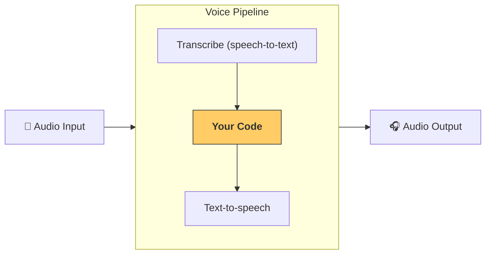

---
search:
  exclude: true
---
# 파이프라인과 워크플로

[`VoicePipeline`][agents.voice.pipeline.VoicePipeline]은 에이전트 기반 워크플로를 음성 앱으로 쉽게 전환할 수 있게 해 주는 클래스입니다. 실행할 워크플로를 전달하면, 파이프라인이 입력 오디오 전사, 오디오 종료 감지, 적절한 시점에 워크플로 호출, 워크플로 출력을 다시 오디오로 변환하는 작업을 처리합니다.



## 파이프라인 구성

파이프라인을 만들 때 몇 가지를 설정할 수 있습니다.

1. [`workflow`][agents.voice.workflow.VoiceWorkflowBase]: 새 오디오가 전사될 때마다 실행되는 코드입니다.
2. 사용되는 [`speech-to-text`][agents.voice.model.STTModel] 및 [`text-to-speech`][agents.voice.model.TTSModel] 모델
3. [`config`][agents.voice.pipeline_config.VoicePipelineConfig]: 다음과 같은 항목을 구성할 수 있습니다.
    - 모델 이름을 모델에 매핑할 수 있는 모델 제공자
    - 트레이싱 비활성화 여부, 오디오 파일 업로드 여부, 워크플로 이름, 트레이스 ID 등을 포함한 트레이싱
    - 프롬프트, 언어, 사용되는 데이터 타입 등 TTS 및 STT 모델 설정

## 파이프라인 실행

[`run()`][agents.voice.pipeline.VoicePipeline.run] 메서드를 통해 파이프라인을 실행할 수 있으며, 이 메서드는 두 가지 형태의 오디오 입력을 전달할 수 있게 해 줍니다.

1. [`AudioInput`][agents.voice.input.AudioInput]은 완전한 오디오 입력이 있고 그에 대한 결과만 생성하려는 경우에 사용합니다. 화자가 말하기를 끝낸 시점을 감지할 필요가 없는 경우에 유용합니다. 예를 들어 사전 녹음된 오디오가 있거나, 사용자가 말하기를 끝낸 시점이 명확한 push-to-talk 앱에서 사용할 수 있습니다.
2. [`StreamedAudioInput`][agents.voice.input.StreamedAudioInput]은 사용자가 말하기를 끝낸 시점을 감지해야 할 수 있는 경우에 사용합니다. 감지되는 대로 오디오 청크를 푸시할 수 있으며, 음성 파이프라인은 "활동 감지"라는 프로세스를 통해 적절한 시점에 에이전트 워크플로를 자동으로 실행합니다.

## 결과

음성 파이프라인 실행 결과는 [`StreamedAudioResult`][agents.voice.result.StreamedAudioResult]입니다. 이는 이벤트가 발생할 때 이를 스트리밍할 수 있게 해 주는 객체입니다. [`VoiceStreamEvent`][agents.voice.events.VoiceStreamEvent]에는 다음을 포함해 몇 가지 종류가 있습니다.

1. [`VoiceStreamEventAudio`][agents.voice.events.VoiceStreamEventAudio]: 오디오 청크를 포함합니다.
2. [`VoiceStreamEventLifecycle`][agents.voice.events.VoiceStreamEventLifecycle]: 턴 시작 또는 종료와 같은 수명 주기 이벤트를 알려 줍니다.
3. [`VoiceStreamEventError`][agents.voice.events.VoiceStreamEventError]: 오류 이벤트입니다.

```python

result = await pipeline.run(input)

async for event in result.stream():
    if event.type == "voice_stream_event_audio":
        # play audio
        pass
    elif event.type == "voice_stream_event_lifecycle":
        # lifecycle
        pass
    elif event.type == "voice_stream_event_error":
        # error
        pass
```

## 모범 사례

### 인터럽션(중단 처리)

Agents SDK는 현재 [`StreamedAudioInput`][agents.voice.input.StreamedAudioInput]에 대한 내장 인터럽션(중단 처리) 처리를 제공하지 않습니다. 대신 감지된 각 턴은 워크플로의 별도 실행을 트리거합니다. 애플리케이션 내부에서 인터럽션(중단 처리)을 처리하려면 [`VoiceStreamEventLifecycle`][agents.voice.events.VoiceStreamEventLifecycle] 이벤트를 수신할 수 있습니다. `turn_started`는 새 턴이 전사되었고 처리가 시작됨을 나타냅니다. `turn_ended`는 해당 턴에 대한 모든 오디오가 디스패치된 후 트리거됩니다. 이러한 이벤트를 사용해 모델이 턴을 시작할 때 화자의 마이크를 음소거하고, 턴과 관련된 모든 오디오를 플러시한 후 음소거를 해제할 수 있습니다.