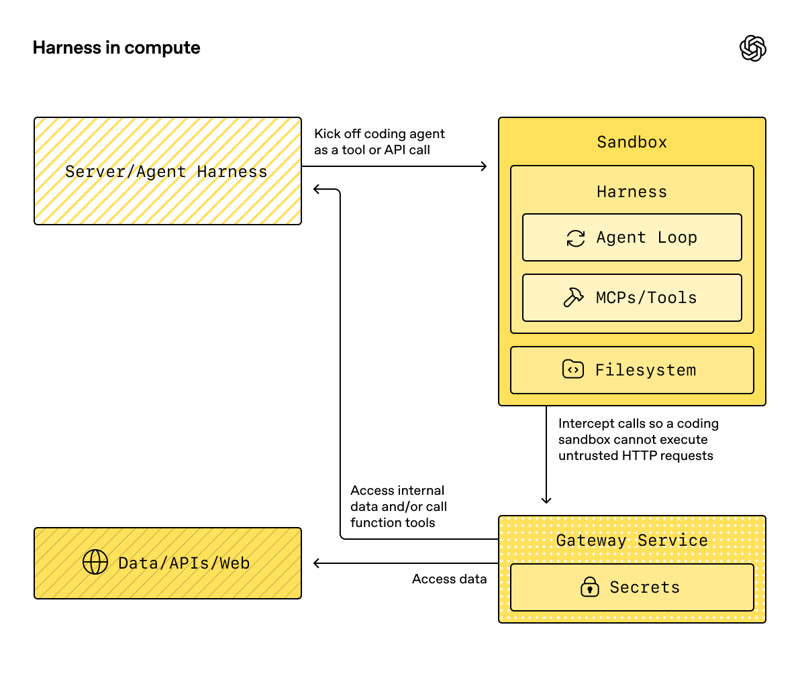
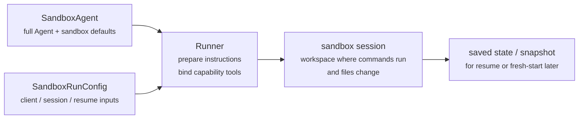
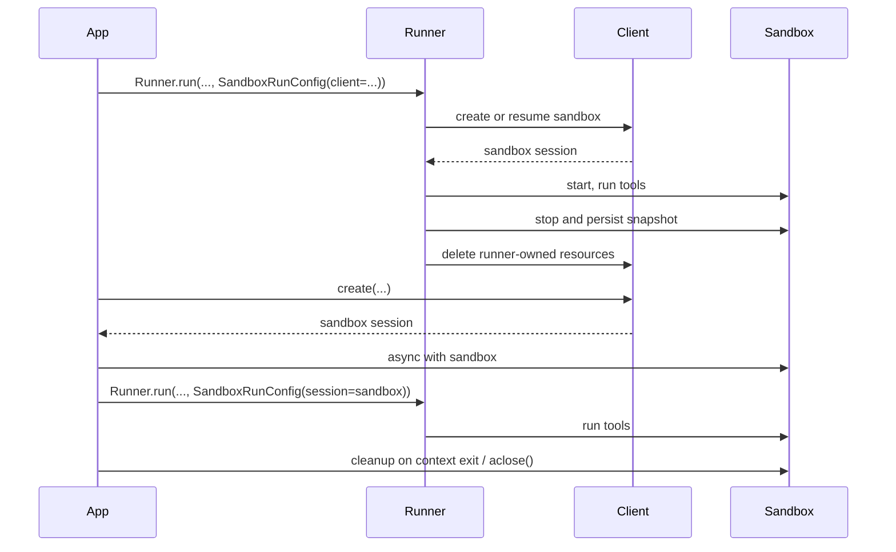

# Concepts

!!! warning "Beta feature"

    Sandbox agents are in beta. Expect details of the API, defaults, and supported capabilities to change before general availability, and expect more advanced features over time.

Modern agents work best when they can operate on real files in a filesystem. **Sandbox Agents** can make use of specialized tools and shell commands to search over and manipulate large document sets, edit files, generate artifacts, and run commands. The sandbox provides the model with a persistent workspace that the agent can use to do work on your behalf. Sandbox Agents in the Agents SDK help you easily run agents paired with a sandbox environment, making it easy to get the right files on the filesystem and orchestrate the sandboxes to make it easy to start, stop, and resume tasks at scale.

You define the workspace around the data the agent needs. It can start from GitHub repos, local files and directories, synthetic task files, remote filesystems such as S3 or Azure Blob Storage, and other sandbox inputs you provide.

<div class="sandbox-harness-image" markdown="1">



</div>

`SandboxAgent` is still an `Agent`. It keeps the usual agent surface such as `instructions`, `prompt`, `tools`, `handoffs`, `mcp_servers`, `model_settings`, `output_type`, guardrails, and hooks, and it still runs through the normal `Runner` APIs. What changes is the execution boundary:

- `SandboxAgent` defines the agent itself: the usual agent configuration plus sandbox-specific defaults like `default_manifest`, `base_instructions`, `run_as`, and capabilities such as filesystem tools, shell access, skills, memory, or compaction.
- `Manifest` declares the desired starting contents and layout for a fresh sandbox workspace, including files, repos, mounts, and environment.
- A sandbox session is the live isolated environment where commands run and files change.
- [`SandboxRunConfig`][agents.run_config.SandboxRunConfig] decides how the run gets that sandbox session, for example by injecting one directly, reconnecting from serialized sandbox session state, or creating a fresh sandbox session through a sandbox client.
- Saved sandbox state and snapshots let later runs reconnect to prior work or seed a fresh sandbox session from saved contents.

`Manifest` is the fresh-session workspace contract, not the full source of truth for every live sandbox. The effective workspace for a run can instead come from a reused sandbox session, serialized sandbox session state, or a snapshot chosen at run time.

Throughout this page, "sandbox session" means the live execution environment managed by a sandbox client. It is different from the SDK's conversational [`Session`][agents.memory.session.Session] interfaces described in [Sessions](../sessions/index.md).

The outer runtime still owns approvals, tracing, handoffs, and resume bookkeeping. The sandbox session owns commands, file changes, and environment isolation. That split is a core part of the model.

### How the pieces fit together

A sandbox run combines an agent definition with per-run sandbox configuration. The runner prepares the agent, binds it to a live sandbox session, and can save state for later runs.



Sandbox-specific defaults stay on `SandboxAgent`. Per-run sandbox-session choices stay in `SandboxRunConfig`.

Think about the lifecycle in three phases:

1. Define the agent and the fresh-workspace contract with `SandboxAgent`, `Manifest`, and capabilities.
2. Execute a run by giving `Runner` a `SandboxRunConfig` that injects, resumes, or creates the sandbox session.
3. Continue later from runner-managed `RunState`, explicit sandbox `session_state`, or a saved workspace snapshot.

If shell access is only one occasional tool, start with hosted shell in the [tools guide](../tools.md). Reach for sandbox agents when workspace isolation, sandbox client choice, or sandbox-session resume behavior are part of the design.

## When to use them

Sandbox agents are a good fit for workspace-centric workflows, for example:

- coding and debugging, for example orchestrating automated fixes for issue reports in a GitHub repo and running targeted tests
- document processing and editing, for example extracting information from a user's financial documents and creating a completed tax-form draft
- file-grounded review or analysis, for example checking onboarding packets, generated reports, or artifact bundles before answering
- isolated multi-agent patterns, for example giving each reviewer or coding sub-agent its own workspace
- multi-step workspace tasks, for example fixing a bug in one run and adding a regression test later, or resuming from snapshot or sandbox session state

If you do not need access to files or a living filesystem, keep using `Agent`. If shell access is just one occasional capability, add hosted shell; if the workspace boundary itself is part of the feature, use sandbox agents.

## Choose a sandbox client

Start with `UnixLocalSandboxClient` for local development. Move to `DockerSandboxClient` when you need container isolation or image parity. Move to a hosted provider when you need provider-managed execution.

In most cases, the `SandboxAgent` definition stays the same while the sandbox client and its options change in [`SandboxRunConfig`][agents.run_config.SandboxRunConfig]. See [Sandbox clients](clients.md) for local, Docker, hosted, and remote-mount options.

## Core pieces

<div class="sandbox-nowrap-first-column-table" markdown="1">

| Layer | Main SDK pieces | What it answers |
| --- | --- | --- |
| Agent definition | `SandboxAgent`, `Manifest`, capabilities | What agent will run, and what fresh-session workspace contract should it start from? |
| Sandbox execution | `SandboxRunConfig`, the sandbox client, and the live sandbox session | How does this run get a live sandbox session, and where does the work execute? |
| Saved sandbox state | `RunState` sandbox payload, `session_state`, and snapshots | How does this workflow reconnect to prior sandbox work or seed a fresh sandbox session from saved contents? |

</div>

The main SDK pieces map onto those layers like this:

<div class="sandbox-nowrap-first-column-table" markdown="1">

| Piece | What it owns | Ask this question |
| --- | --- | --- |
| [`SandboxAgent`][agents.sandbox.sandbox_agent.SandboxAgent] | The agent definition | What should this agent do, and which defaults should travel with it? |
| [`Manifest`][agents.sandbox.manifest.Manifest] | Fresh-session workspace files and folders | What files and folders should be present on the filesystem when the run starts? |
| [`Capability`][agents.sandbox.capabilities.capability.Capability] | Sandbox-native behavior | Which tools, instruction fragments, or runtime behavior should attach to this agent? |
| [`SandboxRunConfig`][agents.run_config.SandboxRunConfig] | Per-run sandbox client and sandbox-session source | Should this run inject, resume, or create a sandbox session? |
| [`RunState`][agents.run_state.RunState] | Runner-managed saved sandbox state | Am I resuming a prior runner-managed workflow and carrying its sandbox state forward automatically? |
| [`SandboxRunConfig.session_state`][agents.run_config.SandboxRunConfig.session_state] | Explicit serialized sandbox session state | Do I want to resume from sandbox state I already serialized outside `RunState`? |
| [`SandboxRunConfig.snapshot`][agents.run_config.SandboxRunConfig.snapshot] | Saved workspace contents for fresh sandbox sessions | Should a new sandbox session start from saved files and artifacts? |

</div>

A practical design order is:

1. Define the fresh-session workspace contract with `Manifest`.
2. Define the agent with `SandboxAgent`.
3. Add built-in or custom capabilities.
4. Decide how each run should obtain its sandbox session in `RunConfig(sandbox=SandboxRunConfig(...))`.

## How a sandbox run is prepared

At run time, the runner turns that definition into a concrete sandbox-backed run:

1. It resolves the sandbox session from `SandboxRunConfig`. If you pass `session=...`, it reuses that live sandbox session. Otherwise it uses `client=...` to create or resume one.
2. It determines the effective workspace inputs for the run. If the run injects or resumes a sandbox session, that existing sandbox state wins. Otherwise the runner starts from a one-off manifest override or `agent.default_manifest`. This is why `Manifest` alone does not define the final live workspace for every run.
3. It lets capabilities process the resulting manifest. This is how capabilities can add files, mounts, or other workspace-scoped behavior before the final agent is prepared.
4. It builds the final instructions in a fixed order: the SDK's default sandbox prompt, or `base_instructions` if you explicitly override it, then `instructions`, then capability instruction fragments, then any remote-mount policy text, then a rendered filesystem tree.
5. It binds capability tools to the live sandbox session and runs the prepared agent through the normal `Runner` APIs.

Sandboxing does not change what a turn means. A turn is still a model step, not a single shell command or sandbox action. There is no fixed 1:1 mapping between sandbox-side operations and turns: some work may stay inside the sandbox execution layer, while other actions return tool results, approvals, or other state that requires another model step. As a practical rule, another turn is consumed only when the agent runtime needs another model response after sandbox work has happened.

Those preparation steps are why `default_manifest`, `instructions`, `base_instructions`, `capabilities`, and `run_as` are the main sandbox-specific options to think about when designing a `SandboxAgent`.

## `SandboxAgent` options

These are the sandbox-specific options on top of the usual `Agent` fields:

<div class="sandbox-nowrap-first-column-table" markdown="1">

| Option | Best use |
| --- | --- |
| `default_manifest` | The default workspace for fresh sandbox sessions created by the runner. |
| `instructions` | Additional role, workflow, and success criteria appended after the SDK sandbox prompt. |
| `base_instructions` | Advanced escape hatch that replaces the SDK sandbox prompt. |
| `capabilities` | Sandbox-native tools and behavior that should travel with this agent. |
| `run_as` | User identity for model-facing sandbox tools such as shell commands, file reads, and patches. |

</div>

Sandbox client choice, sandbox-session reuse, manifest override, and snapshot selection belong in [`SandboxRunConfig`][agents.run_config.SandboxRunConfig], not on the agent.

### `default_manifest`

`default_manifest` is the default [`Manifest`][agents.sandbox.manifest.Manifest] used when the runner creates a fresh sandbox session for this agent. Use it for the files, repos, helper material, output directories, and mounts the agent should usually start with.

This is only the default. A run can override it with `SandboxRunConfig(manifest=...)`, and a reused or resumed sandbox session keeps its existing workspace state.

### `instructions` and `base_instructions`

Use `instructions` for short rules that should survive different prompts. In a `SandboxAgent`, these instructions are appended after the SDK's sandbox base prompt, so you keep the built-in sandbox guidance and add your own role, workflow, and success criteria.

Use `base_instructions` only when you want to replace the SDK sandbox base prompt. Most agents should not set it.

<div class="sandbox-nowrap-first-column-table" markdown="1">

| Put it in... | Use it for | Examples |
| --- | --- | --- |
| `instructions` | Stable role, workflow rules, and success criteria for the agent. | "Inspect onboarding documents, then hand off.", "Write final files into `output/`." |
| `base_instructions` | A full replacement for the SDK sandbox base prompt. | Custom low-level sandbox wrapper prompts. |
| the user prompt | The one-off request for this run. | "Summarize this workspace." |
| workspace files in the manifest | Longer task specs, repo-local instructions, or bounded reference material. | `repo/task.md`, document bundles, sample packets. |

</div>

Good uses for `instructions` include:

- [examples/sandbox/unix_local_pty.py](https://github.com/openai/openai-agents-python/blob/main/examples/sandbox/unix_local_pty.py) keeps the agent in one interactive process when PTY state matters.
- [examples/sandbox/handoffs.py](https://github.com/openai/openai-agents-python/blob/main/examples/sandbox/handoffs.py) forbids the sandbox reviewer from answering the user directly after inspection.
- [examples/sandbox/tax_prep.py](https://github.com/openai/openai-agents-python/blob/main/examples/sandbox/tax_prep.py) requires the final filled files to actually land in `output/`.
- [examples/sandbox/docs/coding_task.py](https://github.com/openai/openai-agents-python/blob/main/examples/sandbox/docs/coding_task.py) pins the exact verification command and clarifies workspace-root-relative patch paths.

Avoid copying the user's one-off task into `instructions`, embedding long reference material that belongs in the manifest, restating tool docs that built-in capabilities already inject, or mixing in local installation notes the model does not need at run time.

If you omit `instructions`, the SDK still includes the default sandbox prompt. That is enough for low-level wrappers, but most user-facing agents should still provide explicit `instructions`.

### `capabilities`

Capabilities attach sandbox-native behavior to a `SandboxAgent`. They can shape the workspace before a run starts, append sandbox-specific instructions, expose tools that bind to the live sandbox session, and adjust model behavior or input handling for that agent.

Built-in capabilities include:

<div class="sandbox-nowrap-first-column-table" markdown="1">

| Capability | Add it when | Notes |
| --- | --- | --- |
| `Shell` | The agent needs shell access. | Adds `exec_command`, plus `write_stdin` when the sandbox client supports PTY interaction. |
| `Filesystem` | The agent needs to edit files or inspect local images. | Adds `apply_patch` and `view_image`; patch paths are workspace-root-relative. |
| `Skills` | You want skill discovery and materialization in the sandbox. | Prefer this over manually mounting `.agents` or `.agents/skills`; `Skills` indexes and materializes skills into the sandbox for you. |
| `Memory` | Follow-on runs should read or generate memory artifacts. | Requires `Shell`; live updates also require `Filesystem`. |
| `Compaction` | Long-running flows need context trimming after compaction items. | Adjusts model sampling and input handling. |

</div>

By default, `SandboxAgent.capabilities` uses `Capabilities.default()`, which includes `Filesystem()`, `Shell()`, and `Compaction()`. If you pass `capabilities=[...]`, that list replaces the default, so include any default capabilities you still want.

For skills, choose the source based on how you want them materialized:

- `Skills(lazy_from=LocalDirLazySkillSource(...))` is a good default for larger local skill directories because the model can discover the index first and load only what it needs.
- `LocalDirLazySkillSource(source=LocalDir(src=...))` reads from the filesystem where the SDK process is running. Pass the original host-side skills directory, not a path that only exists inside the sandbox image or workspace.
- `Skills(from_=LocalDir(src=...))` is better for a small local bundle you want staged up front.
- `Skills(from_=GitRepo(repo=..., ref=...))` is the right fit when the skills themselves should come from a repository.

`LocalDir.src` is the source path on the SDK host. `skills_path` is the relative destination path inside the sandbox workspace where skills are staged when `load_skill` is called.

If your skills already live on disk under something like `.agents/skills/<name>/SKILL.md`, point `LocalDir(...)` at that source root and still use `Skills(...)` to expose them. Keep the default `skills_path=".agents"` unless you have an existing workspace contract that depends on a different in-sandbox layout.

Prefer built-in capabilities when they fit. Write a custom capability only when you need a sandbox-specific tool or instruction surface that the built-ins do not cover.

## Concepts

### Manifest

A [`Manifest`][agents.sandbox.manifest.Manifest] describes the workspace for a fresh sandbox session. It can set the workspace `root`, declare files and directories, copy in local files, clone Git repos, attach remote storage mounts, set environment variables, define users or groups, and grant access to specific absolute paths outside the workspace.

Manifest entry paths are workspace-relative. They cannot be absolute paths or escape the workspace with `..`, which keeps the workspace contract portable across local, Docker, and hosted clients.

Use manifest entries for the material the agent needs before work begins:

<div class="sandbox-nowrap-first-column-table" markdown="1">

| Manifest entry | Use it for |
| --- | --- |
| `File`, `Dir` | Small synthetic inputs, helper files, or output directories. |
| `LocalFile`, `LocalDir` | Host files or directories that should be materialized into the sandbox. |
| `GitRepo` | A repository that should be fetched into the workspace. |
| mounts such as `S3Mount`, `GCSMount`, `R2Mount`, `AzureBlobMount`, `BoxMount`, `S3FilesMount` | External storage that should appear inside the sandbox. |

</div>

`Dir` creates a directory inside the sandbox workspace from synthetic children or as an output location; it does not read from the host filesystem. Use `LocalDir` when an existing host directory should be copied into the sandbox workspace.

`LocalFile.src` and `LocalDir.src` are resolved against the SDK process working directory by default. The source must stay under that base directory unless it is covered by `extra_path_grants`. This keeps local source materialization inside the same host-path trust boundary as the rest of the sandbox manifest.

Mount entries describe what storage to expose; mount strategies describe how a sandbox backend attaches that storage. See [Sandbox clients](clients.md#mounts-and-remote-storage) for mount options and provider support.

Good manifest design usually means keeping the workspace contract narrow, putting long task recipes in workspace files such as `repo/task.md`, and using relative workspace paths in instructions, for example `repo/task.md` or `output/report.md`. If the agent edits files with the `Filesystem` capability's `apply_patch` tool, remember that patch paths are relative to the sandbox workspace root, not the shell `workdir`.

Use `extra_path_grants` only when the agent needs a concrete absolute path outside the workspace or the manifest needs to copy a trusted local source outside the SDK process working directory. Examples include `/tmp` for temporary tool output, `/opt/toolchain` for a read-only runtime, or a generated skills directory that should be materialized into the sandbox. A grant applies to local source materialization, SDK file APIs, and shell execution where the backend can enforce filesystem policy:

```python
from agents.sandbox import Manifest, SandboxPathGrant

manifest = Manifest(
    extra_path_grants=(
        SandboxPathGrant(path="/tmp"),
        SandboxPathGrant(path="/opt/toolchain", read_only=True),
    ),
)
```

Treat manifests that contain `extra_path_grants` as trusted configuration. Do not load grants from model output or other untrusted payloads unless your application has already approved those host paths.

Snapshots and `persist_workspace()` still include only the workspace root. Extra granted paths are runtime access, not durable workspace state.

### Permissions

`Permissions` controls filesystem permissions for manifest entries. It is about the files the sandbox materializes, not model permissions, approval policy, or API credentials.

By default, manifest entries are owner-readable/writable/executable and readable/executable by group and others. Override this when staged files should be private, read-only, or executable:

```python
from agents.sandbox import FileMode, Permissions
from agents.sandbox.entries import File

private_notes = File(
    content=b"internal notes",
    permissions=Permissions(
        owner=FileMode.READ | FileMode.WRITE,
        group=FileMode.NONE,
        other=FileMode.NONE,
    ),
)
```

`Permissions` stores separate owner, group, and other bits, plus whether the entry is a directory. You can build it directly, parse it from a mode string with `Permissions.from_str(...)`, or derive it from an OS mode with `Permissions.from_mode(...)`.

Users are the sandbox identities that can execute work. Add a `User` to the manifest when you want that identity to exist in the sandbox, then set `SandboxAgent.run_as` when model-facing sandbox tools such as shell commands, file reads, and patches should run as that user. If `run_as` points at a user that is not already in the manifest, the runner adds it to the effective manifest for you.

```python
from agents import Runner
from agents.run import RunConfig
from agents.sandbox import FileMode, Manifest, Permissions, SandboxAgent, SandboxRunConfig, User
from agents.sandbox.entries import Dir, LocalDir
from agents.sandbox.sandboxes.unix_local import UnixLocalSandboxClient

analyst = User(name="analyst")

agent = SandboxAgent(
    name="Dataroom analyst",
    instructions="Review the files in `dataroom/` and write findings to `output/`.",
    default_manifest=Manifest(
        # Declare the sandbox user so manifest entries can grant access to it.
        users=[analyst],
        entries={
            "dataroom": LocalDir(
                src="./dataroom",
                # Let the analyst traverse and read the mounted dataroom, but not edit it.
                group=analyst,
                permissions=Permissions(
                    owner=FileMode.READ | FileMode.EXEC,
                    group=FileMode.READ | FileMode.EXEC,
                    other=FileMode.NONE,
                ),
            ),
            "output": Dir(
                # Give the analyst a writable scratch/output directory for artifacts.
                group=analyst,
                permissions=Permissions(
                    owner=FileMode.ALL,
                    group=FileMode.ALL,
                    other=FileMode.NONE,
                ),
            ),
        },
    ),
    # Run model-facing sandbox actions as this user, so those permissions apply.
    run_as=analyst,
)

result = await Runner.run(
    agent,
    "Summarize the contracts and call out renewal dates.",
    run_config=RunConfig(
        sandbox=SandboxRunConfig(client=UnixLocalSandboxClient()),
    ),
)
```

If you also need file-level sharing rules, combine users with manifest groups and entry `group` metadata. The `run_as` user controls who executes sandbox-native actions; `Permissions` controls which files that user can read, write, or execute once the sandbox has materialized the workspace.

### SnapshotSpec

`SnapshotSpec` tells a fresh sandbox session where saved workspace contents should be restored from and persisted back to. It is the snapshot policy for the sandbox workspace, while `session_state` is the serialized connection state for resuming a specific sandbox backend.

Use `LocalSnapshotSpec` for local durable snapshots and `RemoteSnapshotSpec` when your app provides a remote snapshot client. A no-op snapshot is used as a fallback when local snapshot setup is unavailable, and advanced callers can use one explicitly when they do not want workspace snapshot persistence.

```python
from pathlib import Path

from agents.run import RunConfig
from agents.sandbox import LocalSnapshotSpec, SandboxRunConfig
from agents.sandbox.sandboxes.unix_local import UnixLocalSandboxClient

run_config = RunConfig(
    sandbox=SandboxRunConfig(
        client=UnixLocalSandboxClient(),
        snapshot=LocalSnapshotSpec(base_path=Path("/tmp/my-sandbox-snapshots")),
    )
)
```

When the runner creates a fresh sandbox session, the sandbox client builds a snapshot instance for that session. On start, if the snapshot is restorable, the sandbox restores saved workspace contents before the run continues. On cleanup, runner-owned sandbox sessions archive the workspace and persist it back through the snapshot.

If you omit `snapshot`, the runtime tries to use a default local snapshot location when it can. If that cannot be set up, it falls back to a no-op snapshot. Mounted and ephemeral paths are not copied into snapshots as durable workspace contents.

### Sandbox lifecycle

There are two lifecycle modes: **SDK-owned** and **developer-owned**.

<div class="sandbox-lifecycle-diagram" markdown="1">



</div>

Use SDK-owned lifecycle when the sandbox only needs to live for one run. Pass a `client`, optional `manifest`, optional `snapshot`, and client `options`; the runner creates or resumes the sandbox, starts it, runs the agent, persists snapshot-backed workspace state, shuts the sandbox down, and lets the client clean up runner-owned resources.

```python
result = await Runner.run(
    agent,
    "Inspect the workspace and summarize what changed.",
    run_config=RunConfig(
        sandbox=SandboxRunConfig(client=UnixLocalSandboxClient()),
    ),
)
```

Use developer-owned lifecycle when you want to eagerly create a sandbox, reuse one live sandbox across multiple runs, inspect files after a run, stream over a sandbox you created yourself, or decide exactly when cleanup happens. Passing `session=...` tells the runner to use that live sandbox, but not to close it for you.

```python
sandbox = await client.create(manifest=agent.default_manifest)

async with sandbox:
    run_config = RunConfig(sandbox=SandboxRunConfig(session=sandbox))
    await Runner.run(agent, "Analyze the files.", run_config=run_config)
    await Runner.run(agent, "Write the final report.", run_config=run_config)
```

The context manager is the usual shape: it starts the sandbox on entry and runs the session cleanup lifecycle on exit. If your app cannot use a context manager, call the lifecycle methods directly:

```python
sandbox = await client.create(
    manifest=agent.default_manifest,
    snapshot=LocalSnapshotSpec(base_path=Path("/tmp/my-sandbox-snapshots")),
)
try:
    await sandbox.start()
    await Runner.run(
        agent,
        "Analyze the files.",
        run_config=RunConfig(sandbox=SandboxRunConfig(session=sandbox)),
    )
    # Persist a checkpoint of the live workspace before doing more work.
    # `aclose()` also calls `stop()`, so this is only needed for an explicit mid-lifecycle save.
    await sandbox.stop()
finally:
    await sandbox.aclose()
```

`stop()` only persists snapshot-backed workspace contents; it does not tear down the sandbox. `aclose()` is the full session cleanup path: it runs pre-stop hooks, calls `stop()`, shuts down sandbox resources, and closes session-scoped dependencies.

## `SandboxRunConfig` options

[`SandboxRunConfig`][agents.run_config.SandboxRunConfig] holds the per-run options that decide where the sandbox session comes from and how a fresh session should be initialized.

### Sandbox source

These options decide whether the runner should reuse, resume, or create the sandbox session:

<div class="sandbox-nowrap-first-column-table" markdown="1">

| Option | Use it when | Notes |
| --- | --- | --- |
| `client` | You want the runner to create, resume, and clean up sandbox sessions for you. | Required unless you provide a live sandbox `session`. |
| `session` | You already created a live sandbox session yourself. | The caller owns lifecycle; the runner reuses that live sandbox session. |
| `session_state` | You have serialized sandbox session state but not a live sandbox session object. | Requires `client`; the runner resumes from that explicit state as an owning session. |

</div>

In practice, the runner resolves the sandbox session in this order:

1. If you inject `run_config.sandbox.session`, that live sandbox session is reused directly.
2. Otherwise, if the run is resuming from `RunState`, the stored sandbox session state is resumed.
3. Otherwise, if you pass `run_config.sandbox.session_state`, the runner resumes from that explicit serialized sandbox session state.
4. Otherwise, the runner creates a fresh sandbox session. For that fresh session, it uses `run_config.sandbox.manifest` when provided, or `agent.default_manifest` if not.

### Fresh-session inputs

These options only matter when the runner is creating a fresh sandbox session:

<div class="sandbox-nowrap-first-column-table" markdown="1">

| Option | Use it when | Notes |
| --- | --- | --- |
| `manifest` | You want a one-off fresh-session workspace override. | Falls back to `agent.default_manifest` when omitted. |
| `snapshot` | A fresh sandbox session should be seeded from a snapshot. | Useful for resume-like flows or remote snapshot clients. |
| `options` | The sandbox client needs creation-time options. | Common for Docker images, Modal app names, E2B templates, timeouts, and similar client-specific settings. |

</div>

### Materialization controls

`concurrency_limits` controls how much sandbox materialization work can run in parallel. Use `SandboxConcurrencyLimits(manifest_entries=..., local_dir_files=...)` when large manifests or local directory copies need tighter resource control. Set either value to `None` to disable that specific limit.

`archive_limits` controls SDK-side resource checks for archive extraction. Set `archive_limits=SandboxArchiveLimits()` to enable the SDK default thresholds, or pass explicit values such as `SandboxArchiveLimits(max_input_bytes=..., max_extracted_bytes=..., max_members=...)` when archives need tighter resource control. Leave `archive_limits=None` to keep the default behavior with no SDK archive resource limits, or set an individual field to `None` to disable only that limit.

A few implications are worth keeping in mind:

- Fresh sessions: `manifest=` and `snapshot=` only apply when the runner is creating a fresh sandbox session.
- Resume vs snapshot: `session_state=` reconnects to previously serialized sandbox state, whereas `snapshot=` seeds a new sandbox session from saved workspace contents.
- Client-specific options: `options=` depends on the sandbox client; Docker and many hosted clients require it.
- Injected live sessions: if you pass a running sandbox `session`, capability-driven manifest updates can add compatible non-mount entries. They cannot change `manifest.root`, `manifest.environment`, `manifest.users`, or `manifest.groups`; remove existing entries; replace entry types; or add or change mount entries.
- Runner API: `SandboxAgent` execution still uses the normal `Runner.run()`, `Runner.run_sync()`, and `Runner.run_streamed()` APIs.

## Full example: coding task

This coding-style example is a good default starting point:

```python
import asyncio
from pathlib import Path

from agents import ModelSettings, Runner
from agents.run import RunConfig
from agents.sandbox import Manifest, SandboxAgent, SandboxRunConfig
from agents.sandbox.capabilities import (
    Capabilities,
    LocalDirLazySkillSource,
    Skills,
)
from agents.sandbox.entries import LocalDir
from agents.sandbox.sandboxes.unix_local import UnixLocalSandboxClient

EXAMPLE_DIR = Path(__file__).resolve().parent
HOST_REPO_DIR = EXAMPLE_DIR / "repo"
HOST_SKILLS_DIR = EXAMPLE_DIR / "skills"
TARGET_TEST_CMD = "sh tests/test_credit_note.sh"


def build_agent(model: str) -> SandboxAgent[None]:
    return SandboxAgent(
        name="Sandbox engineer",
        model=model,
        instructions=(
            "Inspect the repo, make the smallest correct change, run the most relevant checks, "
            "and summarize the file changes and risks. "
            "Read `repo/task.md` before editing files. Stay grounded in the repository, preserve "
            "existing behavior, and mention the exact verification command you ran. "
            "Use the `$credit-note-fixer` skill before editing files. If the repo lives under "
            "`repo/`, remember that `apply_patch` paths stay relative to the sandbox workspace "
            "root, so edits still target `repo/...`."
        ),
        # Put repos and task files in the manifest.
        default_manifest=Manifest(
            entries={
                "repo": LocalDir(src=HOST_REPO_DIR),
            }
        ),
        capabilities=Capabilities.default() + [
            Skills(
                lazy_from=LocalDirLazySkillSource(
                    # This is a host path read by the SDK process.
                    # Requested skills are copied into `skills_path` in the sandbox.
                    source=LocalDir(src=HOST_SKILLS_DIR),
                )
            ),
        ],
        model_settings=ModelSettings(tool_choice="required"),
    )


async def main(model: str, prompt: str) -> None:
    result = await Runner.run(
        build_agent(model),
        prompt,
        run_config=RunConfig(
            sandbox=SandboxRunConfig(client=UnixLocalSandboxClient()),
            workflow_name="Sandbox coding example",
        ),
    )
    print(result.final_output)


if __name__ == "__main__":
    asyncio.run(
        main(
            model="gpt-5.6-sol",
            prompt=(
                "Open `repo/task.md`, use the `$credit-note-fixer` skill, fix the bug, "
                f"run `{TARGET_TEST_CMD}`, and summarize the change."
            ),
        )
    )
```

See [examples/sandbox/docs/coding_task.py](https://github.com/openai/openai-agents-python/blob/main/examples/sandbox/docs/coding_task.py). It uses a tiny shell-based repo so the example can be verified deterministically across Unix-local runs. Your real task repo can of course be Python, JavaScript, or anything else.

## Common patterns

Start from the full example above. In many cases, the same `SandboxAgent` can stay intact while only the sandbox client, sandbox-session source, or workspace source changes.

### Switch sandbox clients

Keep the agent definition the same and change only the run config. Use Docker when you want container isolation or image parity, or a hosted provider when you want provider-managed execution. See [Sandbox clients](clients.md) for examples and provider options.

### Override the workspace

Keep the agent definition the same and swap only the fresh-session manifest:

```python
from agents.run import RunConfig
from agents.sandbox import Manifest, SandboxRunConfig
from agents.sandbox.entries import GitRepo
from agents.sandbox.sandboxes.unix_local import UnixLocalSandboxClient

run_config = RunConfig(
    sandbox=SandboxRunConfig(
        client=UnixLocalSandboxClient(),
        manifest=Manifest(
            entries={
                "repo": GitRepo(repo="openai/openai-agents-python", ref="main"),
            }
        ),
    ),
)
```

Use this when the same agent role should run against different repos, packets, or task bundles without rebuilding the agent. The validated coding example above shows the same pattern with `default_manifest` instead of a one-off override.

### Inject a sandbox session

Inject a live sandbox session when you need explicit lifecycle control, post-run inspection, or output copying:

```python
from agents import Runner
from agents.run import RunConfig
from agents.sandbox import SandboxRunConfig
from agents.sandbox.sandboxes.unix_local import UnixLocalSandboxClient

client = UnixLocalSandboxClient()
sandbox = await client.create(manifest=agent.default_manifest)

async with sandbox:
    result = await Runner.run(
        agent,
        prompt,
        run_config=RunConfig(
            sandbox=SandboxRunConfig(session=sandbox),
        ),
    )
```

Use this when you want to inspect the workspace after the run or stream over an already-started sandbox session. See [examples/sandbox/docs/coding_task.py](https://github.com/openai/openai-agents-python/blob/main/examples/sandbox/docs/coding_task.py) and [examples/sandbox/docker/docker_runner.py](https://github.com/openai/openai-agents-python/blob/main/examples/sandbox/docker/docker_runner.py).

### Resume from session state

If you already serialized sandbox state outside `RunState`, let the runner reconnect from that state:

```python
from agents.run import RunConfig
from agents.sandbox import SandboxRunConfig

serialized = load_saved_payload()
restored_state = client.deserialize_session_state(serialized)

run_config = RunConfig(
    sandbox=SandboxRunConfig(
        client=client,
        session_state=restored_state,
    ),
)
```

Use this when sandbox state lives in your own storage or job system and you want `Runner` to resume from it directly. See [examples/sandbox/extensions/blaxel_runner.py](https://github.com/openai/openai-agents-python/blob/main/examples/sandbox/extensions/blaxel_runner.py) for the serialize/deserialize flow.

### Start from a snapshot

Seed a new sandbox from saved files and artifacts:

```python
from pathlib import Path

from agents.run import RunConfig
from agents.sandbox import LocalSnapshotSpec, SandboxRunConfig
from agents.sandbox.sandboxes.unix_local import UnixLocalSandboxClient

run_config = RunConfig(
    sandbox=SandboxRunConfig(
        client=UnixLocalSandboxClient(),
        snapshot=LocalSnapshotSpec(base_path=Path("/tmp/my-sandbox-snapshot")),
    ),
)
```

Use this when a fresh run should start from saved workspace contents rather than only `agent.default_manifest`. See [examples/sandbox/memory.py](https://github.com/openai/openai-agents-python/blob/main/examples/sandbox/memory.py) for a local snapshot flow and [examples/sandbox/sandbox_agent_with_remote_snapshot.py](https://github.com/openai/openai-agents-python/blob/main/examples/sandbox/sandbox_agent_with_remote_snapshot.py) for a remote snapshot client.

### Load skills from Git

Swap the local skill source for a repository-backed one:

```python
from agents.sandbox.capabilities import Capabilities, Skills
from agents.sandbox.entries import GitRepo

capabilities = Capabilities.default() + [
    Skills(from_=GitRepo(repo="sdcoffey/tax-prep-skills", ref="main")),
]
```

Use this when the skills bundle has its own release cadence or should be shared across sandboxes. See [examples/sandbox/tax_prep.py](https://github.com/openai/openai-agents-python/blob/main/examples/sandbox/tax_prep.py).

### Expose as tools

Tool-agents can either get their own sandbox boundary or reuse a live sandbox from the parent run. Reuse is useful for a fast read-only explorer agent: it can inspect the exact workspace the parent is using without paying to create, hydrate, or snapshot another sandbox.

```python
from agents import Runner
from agents.run import RunConfig
from agents.sandbox import FileMode, Manifest, Permissions, SandboxAgent, SandboxRunConfig, User
from agents.sandbox.entries import Dir, File
from agents.sandbox.sandboxes.unix_local import UnixLocalSandboxClient

coordinator = User(name="coordinator")
explorer = User(name="explorer")

manifest = Manifest(
    users=[coordinator, explorer],
    entries={
        "pricing_packet": Dir(
            group=coordinator,
            permissions=Permissions(
                owner=FileMode.ALL,
                group=FileMode.ALL,
                other=FileMode.READ | FileMode.EXEC,
                directory=True,
            ),
            children={
                "pricing.md": File(
                    content=b"Pricing packet contents...",
                    group=coordinator,
                    permissions=Permissions(
                        owner=FileMode.ALL,
                        group=FileMode.ALL,
                        other=FileMode.READ,
                    ),
                ),
            },
        ),
        "work": Dir(
            group=coordinator,
            permissions=Permissions(
                owner=FileMode.ALL,
                group=FileMode.ALL,
                other=FileMode.NONE,
                directory=True,
            ),
        ),
    },
)

pricing_explorer = SandboxAgent(
    name="Pricing Explorer",
    instructions="Read `pricing_packet/` and summarize commercial risk. Do not edit files.",
    run_as=explorer,
)

client = UnixLocalSandboxClient()
sandbox = await client.create(manifest=manifest)

async with sandbox:
    shared_run_config = RunConfig(
        sandbox=SandboxRunConfig(session=sandbox),
    )

    orchestrator = SandboxAgent(
        name="Revenue Operations Coordinator",
        instructions="Coordinate the review and write final notes to `work/`.",
        run_as=coordinator,
        tools=[
            pricing_explorer.as_tool(
                tool_name="review_pricing_packet",
                tool_description="Inspect the pricing packet and summarize commercial risk.",
                run_config=shared_run_config,
                max_turns=2,
            ),
        ],
    )

    result = await Runner.run(
        orchestrator,
        "Review the pricing packet, then write final notes to `work/summary.md`.",
        run_config=shared_run_config,
    )
```

Here the parent agent runs as `coordinator`, and the explorer tool-agent runs as `explorer` inside the same live sandbox session. The `pricing_packet/` entries are readable by `other` users, so the explorer can inspect them quickly, but it does not have write bits. The `work/` directory is only available to the coordinator's user/group, so the parent can write the final artifact while the explorer stays read-only.

When a tool-agent needs real isolation instead, give it its own sandbox `RunConfig`:

```python
from docker import from_env as docker_from_env

from agents.run import RunConfig
from agents.sandbox import SandboxAgent, SandboxRunConfig
from agents.sandbox.sandboxes.docker import DockerSandboxClient, DockerSandboxClientOptions

rollout_agent = SandboxAgent(
    name="Rollout Reviewer",
    instructions="Inspect the rollout packet and summarize implementation risk.",
)

rollout_agent.as_tool(
    tool_name="review_rollout_risk",
    tool_description="Inspect the rollout packet and summarize implementation risk.",
    run_config=RunConfig(
        sandbox=SandboxRunConfig(
            client=DockerSandboxClient(docker_from_env()),
            options=DockerSandboxClientOptions(image="python:3.14-slim"),
        ),
    ),
)
```

Use a separate sandbox when the tool-agent should mutate freely, run untrusted commands, or use a different backend/image. See [examples/sandbox/sandbox_agents_as_tools.py](https://github.com/openai/openai-agents-python/blob/main/examples/sandbox/sandbox_agents_as_tools.py).

### Combine with local tools and MCP

Keep the sandbox workspace while still using ordinary tools on the same agent:

```python
from agents.sandbox import SandboxAgent
from agents.sandbox.capabilities import Shell

agent = SandboxAgent(
    name="Workspace reviewer",
    instructions="Inspect the workspace and call host tools when needed.",
    tools=[get_discount_approval_path],
    mcp_servers=[server],
    capabilities=[Shell()],
)
```

Use this when workspace inspection is only one part of the agent's job. See [examples/sandbox/sandbox_agent_with_tools.py](https://github.com/openai/openai-agents-python/blob/main/examples/sandbox/sandbox_agent_with_tools.py).

## Memory

Use the `Memory` capability when future sandbox-agent runs should learn from prior runs. Memory is separate from the SDK's conversational `Session` memory: it distills lessons into files inside the sandbox workspace, then later runs can read those files.

See [Agent memory](memory.md) for setup, read/generate behavior, multi-turn conversations, and layout isolation.

## Composition patterns

Once the single-agent pattern is clear, the next design question is where the sandbox boundary belongs in a larger system.

Sandbox agents still compose with the rest of the SDK:

- [Handoffs](../handoffs.md): hand document-heavy work from a non-sandbox intake agent into a sandbox reviewer.
- [Agents as tools](../tools.md#agents-as-tools): expose multiple sandbox agents as tools, usually by passing `run_config=RunConfig(sandbox=SandboxRunConfig(...))` on each `Agent.as_tool(...)` call so each tool gets its own sandbox boundary.
- [MCP](../mcp.md) and normal function tools: sandbox capabilities can coexist with `mcp_servers` and ordinary Python tools.
- [Running agents](../running_agents.md): sandbox runs still use the normal `Runner` APIs.

Two patterns are especially common:

- a non-sandbox agent hands off into a sandbox agent only for the part of the workflow that needs workspace isolation
- an orchestrator exposes multiple sandbox agents as tools, usually with a separate sandbox `RunConfig` per `Agent.as_tool(...)` call so each tool gets its own isolated workspace

### Turns and sandbox runs

It helps to explain handoffs and agent-as-tool calls separately.

With a handoff, there is still one top-level run and one top-level turn loop. The active agent changes, but the run does not become nested. If a non-sandbox intake agent hands off to a sandbox reviewer, the next model call in that same run is prepared for the sandbox agent, and that sandbox agent becomes the one taking the next turn. In other words, handoffs change which agent owns the next turn of the same run. See [examples/sandbox/handoffs.py](https://github.com/openai/openai-agents-python/blob/main/examples/sandbox/handoffs.py).

With `Agent.as_tool(...)`, the relationship is different. The outer orchestrator uses one outer turn to decide to call the tool, and that tool call starts a nested run for the sandbox agent. The nested run has its own turn loop, `max_turns`, approvals, and usually its own sandbox `RunConfig`. It may finish in one nested turn or take several. From the outer orchestrator's point of view, all of that work still sits behind one tool invocation, so the nested turns do not increment the outer run's turn counter. See [examples/sandbox/sandbox_agents_as_tools.py](https://github.com/openai/openai-agents-python/blob/main/examples/sandbox/sandbox_agents_as_tools.py).

Approval behavior follows the same split:

- with handoffs, approvals stay on the same top-level run because the sandbox agent is now the active agent in that run
- with `Agent.as_tool(...)`, approvals raised inside the sandbox tool-agent still surface on the outer run, but they come from stored nested run state and resume the nested sandbox run when the outer run resumes

## Further reading

- [Quickstart](../sandbox_agents.md): get one sandbox agent running.
- [Sandbox clients](clients.md): choose local, Docker, hosted, and mount options.
- [Agent memory](memory.md): preserve and reuse lessons from prior sandbox runs.
- [examples/sandbox/](https://github.com/openai/openai-agents-python/tree/main/examples/sandbox): runnable local, coding, memory, handoff, and agent-composition patterns.
