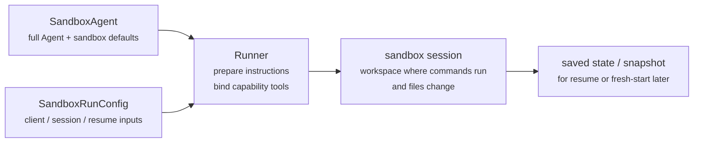
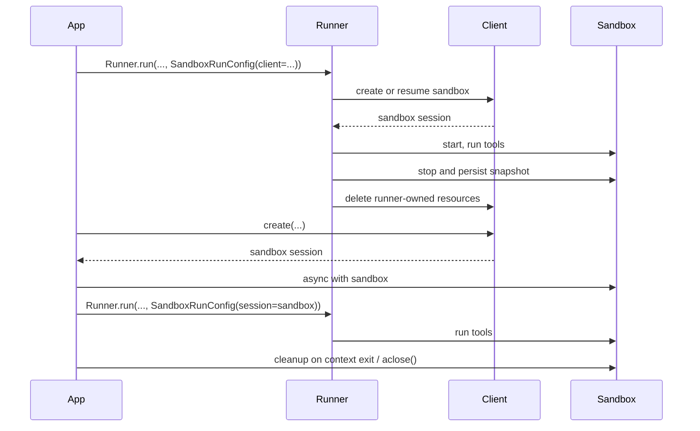

---
search:
  exclude: true
---
# 概念

!!! warning "Beta 功能"

    沙盒智能体目前处于 Beta 阶段。在正式发布前，API 细节、默认值和支持的功能可能会发生变化，未来也将提供更多高级功能。

现代智能体在能够操作文件系统中的真实文件时效果最佳。**沙盒智能体**可以使用专用工具和 shell 命令搜索及处理大型文档集、编辑文件、生成产物并运行命令。沙盒为模型提供了一个持久工作区，智能体可以在其中代您完成工作。Agents SDK 中的沙盒智能体可帮助您轻松运行与沙盒环境配套的智能体，便于将正确的文件放入文件系统并编排沙盒，从而轻松地大规模启动、停止和恢复任务。

您可以围绕智能体所需的数据定义工作区。工作区可以从 GitHub 仓库、本地文件和目录、合成任务文件、S3 或 Azure Blob Storage 等远程文件系统，以及您提供的其他沙盒输入开始构建。

<div class="sandbox-harness-image" markdown="1">


</div>

`SandboxAgent` 仍然是一个 `Agent`。它保留了常规的智能体接口，例如 `instructions`、`prompt`、`tools`、`handoffs`、`mcp_servers`、`model_settings`、`output_type`、安全防护措施和钩子，并且仍通过常规的 `Runner` API 运行。变化之处在于执行边界：

- `SandboxAgent` 定义智能体本身：包括常规智能体配置，以及 `default_manifest`、`base_instructions`、`run_as` 等沙盒专用默认值，还有文件系统工具、shell 访问、技能、记忆或压缩等能力。
- `Manifest` 声明全新沙盒工作区所需的初始内容和布局，包括文件、仓库、挂载和环境。
- 沙盒会话是命令运行和文件发生变化的实时隔离环境。
- [`SandboxRunConfig`][agents.run_config.SandboxRunConfig] 决定一次运行如何获得该沙盒会话，例如直接注入会话、根据序列化的沙盒会话状态重新连接，或通过沙盒客户端创建全新的沙盒会话。
- 保存的沙盒状态和快照允许后续运行重新连接到之前的工作，或使用保存的内容初始化全新的沙盒会话。

`Manifest` 是全新会话的工作区契约，而不是每个实时沙盒全部状态的唯一事实来源。一次运行的有效工作区也可能来自复用的沙盒会话、序列化的沙盒会话状态，或运行时选择的快照。

在本页中，“沙盒会话”是指由沙盒客户端管理的实时执行环境。它不同于[会话](../sessions/index.md)中介绍的 SDK 对话式 [`Session`][agents.memory.session.Session] 接口。

外层运行时仍负责审批、追踪、任务转移和恢复记录。沙盒会话负责命令、文件变更和环境隔离。这种职责划分是该模型的核心组成部分。

### 组件协作方式

一次沙盒运行会将智能体定义与每次运行的沙盒配置结合起来。运行器会准备智能体，将其绑定到实时沙盒会话，并可保存状态供后续运行使用。



沙盒专用默认值保留在 `SandboxAgent` 上。每次运行的沙盒会话选项则保留在 `SandboxRunConfig` 中。

可以将生命周期分为三个阶段：

1. 使用 `SandboxAgent`、`Manifest` 和能力定义智能体及全新工作区契约。
2. 通过向 `Runner` 提供可注入、恢复或创建沙盒会话的 `SandboxRunConfig` 来执行一次运行。
3. 稍后从运行器管理的 `RunState`、显式沙盒 `session_state` 或保存的工作区快照继续运行。

如果 shell 访问只是偶尔使用的工具，请从[工具指南](../tools.md)中的托管 shell 开始。当工作区隔离、沙盒客户端选择或沙盒会话恢复行为属于整体设计的一部分时，再使用沙盒智能体。

## 适用场景

沙盒智能体非常适合以工作区为中心的工作流，例如：

- 编码和调试，例如针对 GitHub 仓库中的问题报告编排自动修复并运行针对性测试
- 文档处理和编辑，例如从用户的财务文档中提取信息并创建填写完成的税务表单草稿
- 基于文件的审查或分析，例如在回答前检查入职资料包、生成的报告或产物包
- 隔离式多智能体模式，例如为每个审查智能体或编码子智能体提供独立工作区
- 多步骤工作区任务，例如在一次运行中修复错误，稍后再添加回归测试，或从快照或沙盒会话状态恢复

如果不需要访问文件或持续存在的文件系统，请继续使用 `Agent`。如果 shell 访问只是偶尔使用的能力，请添加托管 shell；如果工作区边界本身就是功能的一部分，请使用沙盒智能体。

## 沙盒客户端的选择

本地开发可从 `UnixLocalSandboxClient` 开始。当需要容器隔离或镜像一致性时，请改用 `DockerSandboxClient`。当需要由提供商管理执行时，请改用托管提供商。

大多数情况下，`SandboxAgent` 定义保持不变，只需在 [`SandboxRunConfig`][agents.run_config.SandboxRunConfig] 中更改沙盒客户端及其选项。有关本地、Docker、托管和远程挂载选项，请参阅[沙盒客户端](clients.md)。

## 核心组件

<div class="sandbox-nowrap-first-column-table" markdown="1">

| 层级 | 主要 SDK 组件 | 解答的问题 |
| --- | --- | --- |
| 智能体定义 | `SandboxAgent`、`Manifest`、能力 | 将运行哪个智能体，以及它应从什么样的全新会话工作区契约开始？ |
| 沙盒执行 | `SandboxRunConfig`、沙盒客户端和实时沙盒会话 | 此次运行如何获得实时沙盒会话，以及工作在哪里执行？ |
| 保存的沙盒状态 | `RunState` 沙盒有效负载、`session_state` 和快照 | 此工作流如何重新连接到之前的沙盒工作，或根据保存的内容初始化全新的沙盒会话？ |

</div>

主要 SDK 组件与这些层级的对应关系如下：

<div class="sandbox-nowrap-first-column-table" markdown="1">

| 组件 | 负责的内容 | 应提出的问题 |
| --- | --- | --- |
| [`SandboxAgent`][agents.sandbox.sandbox_agent.SandboxAgent] | 智能体定义 | 此智能体应执行什么任务，以及哪些默认值应随其一同使用？ |
| [`Manifest`][agents.sandbox.manifest.Manifest] | 全新会话的工作区文件和文件夹 | 运行开始时，文件系统中应存在哪些文件和文件夹？ |
| [`Capability`][agents.sandbox.capabilities.capability.Capability] | 沙盒原生行为 | 哪些工具、指令片段或运行时行为应附加到此智能体？ |
| [`SandboxRunConfig`][agents.run_config.SandboxRunConfig] | 每次运行的沙盒客户端和沙盒会话来源 | 此次运行应注入、恢复还是创建沙盒会话？ |
| [`RunState`][agents.run_state.RunState] | 由运行器管理的已保存沙盒状态 | 我是否正在恢复之前由运行器管理的工作流，并自动延续其沙盒状态？ |
| [`SandboxRunConfig.session_state`][agents.run_config.SandboxRunConfig.session_state] | 显式序列化的沙盒会话状态 | 我是否希望从已在 `RunState` 外部序列化的沙盒状态恢复？ |
| [`SandboxRunConfig.snapshot`][agents.run_config.SandboxRunConfig.snapshot] | 用于全新沙盒会话的已保存工作区内容 | 新的沙盒会话是否应从保存的文件和产物开始？ |

</div>

实用的设计顺序如下：

1. 使用 `Manifest` 定义全新会话工作区契约。
2. 使用 `SandboxAgent` 定义智能体。
3. 添加内置或自定义能力。
4. 在 `RunConfig(sandbox=SandboxRunConfig(...))` 中决定每次运行应如何获取沙盒会话。

## 沙盒运行的准备过程

运行时，运行器会将该定义转换为由具体沙盒支持的运行：

1. 它会从 `SandboxRunConfig` 解析沙盒会话。如果传入 `session=...`，则复用该实时沙盒会话。否则，它会使用 `client=...` 创建或恢复会话。
2. 它会确定此次运行的有效工作区输入。如果此次运行注入或恢复了沙盒会话，则以现有沙盒状态为准。否则，运行器将从一次性清单覆盖项或 `agent.default_manifest` 开始。这正是仅凭 `Manifest` 无法定义每次运行最终实时工作区的原因。
3. 它会让各项能力处理生成的清单。通过这种方式，能力可以在最终智能体准备完成前添加文件、挂载或其他工作区范围的行为。
4. 它会按固定顺序构建最终指令：SDK 的默认沙盒提示词；如果显式覆盖，则使用 `base_instructions`；随后依次加入 `instructions`、能力指令片段、所有远程挂载策略文本，最后加入渲染后的文件系统树。
5. 它会将能力工具绑定到实时沙盒会话，并通过常规 `Runner` API 运行准备好的智能体。

沙盒不会改变一轮交互的含义。一轮仍然是一个模型步骤，而不是一条 shell 命令或一次沙盒操作。沙盒侧操作与轮次之间没有固定的 1:1 对应关系：有些工作可能始终位于沙盒执行层内，而其他操作会返回工具结果、审批或其他需要额外模型步骤的状态。作为实用原则，只有在沙盒工作完成后，智能体运行时需要模型再次响应时，才会消耗新的一轮。

这些准备步骤说明了为什么在设计 `SandboxAgent` 时，`default_manifest`、`instructions`、`base_instructions`、`capabilities` 和 `run_as` 是需要重点考虑的沙盒专用选项。

## `SandboxAgent` 选项

除常规 `Agent` 字段外，还提供以下沙盒专用选项：

<div class="sandbox-nowrap-first-column-table" markdown="1">

| 选项 | 最佳用途 |
| --- | --- |
| `default_manifest` | 由运行器创建的全新沙盒会话所使用的默认工作区。 |
| `instructions` | 追加在 SDK 沙盒提示词后的额外角色、工作流和成功标准。 |
| `base_instructions` | 用于替换 SDK 沙盒提示词的高级逃生舱机制。 |
| `capabilities` | 应随此智能体一同使用的沙盒原生工具和行为。 |
| `run_as` | 面向模型的沙盒工具所使用的用户身份，例如 shell 命令、文件读取和补丁操作。 |

</div>

沙盒客户端选择、沙盒会话复用、清单覆盖和快照选择应放在 [`SandboxRunConfig`][agents.run_config.SandboxRunConfig] 中，而不是智能体上。

### `default_manifest`

`default_manifest` 是运行器为此智能体创建全新沙盒会话时使用的默认 [`Manifest`][agents.sandbox.manifest.Manifest]。它适用于智能体通常应以其为起点的文件、仓库、辅助材料、输出目录和挂载。

这只是默认值。一次运行可以使用 `SandboxRunConfig(manifest=...)` 覆盖它，而复用或恢复的沙盒会话会保留其现有工作区状态。

### `instructions` 和 `base_instructions`

使用 `instructions` 设置应在不同提示词之间保持不变的简短规则。在 `SandboxAgent` 中，这些指令会追加到 SDK 的沙盒基础提示词之后，因此您可以保留内置沙盒指导，并添加自己的角色、工作流和成功标准。

仅当希望替换 SDK 的沙盒基础提示词时，才使用 `base_instructions`。大多数智能体不应设置它。

<div class="sandbox-nowrap-first-column-table" markdown="1">

| 放置位置 | 用途 | 示例 |
| --- | --- | --- |
| `instructions` | 智能体的稳定角色、工作流规则和成功标准。 | “检查入职文档，然后进行任务转移。”、“将最终文件写入 `output/`。” |
| `base_instructions` | 完整替换 SDK 的沙盒基础提示词。 | 自定义底层沙盒包装器提示词。 |
| 用户提示词 | 此次运行的一次性请求。 | “总结此工作区。” |
| 清单中的工作区文件 | 更长的任务规范、仓库本地指令或范围受限的参考材料。 | `repo/task.md`、文档包、样本资料包。 |

</div>

`instructions` 的良好用法包括：

- [examples/sandbox/unix_local_pty.py](https://github.com/openai/openai-agents-python/blob/main/examples/sandbox/unix_local_pty.py) 会在 PTY 状态很重要时，让智能体始终在同一个交互式进程中运行。
- [examples/sandbox/handoffs.py](https://github.com/openai/openai-agents-python/blob/main/examples/sandbox/handoffs.py) 禁止沙盒审查智能体在检查后直接回答用户。
- [examples/sandbox/tax_prep.py](https://github.com/openai/openai-agents-python/blob/main/examples/sandbox/tax_prep.py) 要求最终填写完成的文件必须实际写入 `output/`。
- [examples/sandbox/docs/coding_task.py](https://github.com/openai/openai-agents-python/blob/main/examples/sandbox/docs/coding_task.py) 固定确切的验证命令，并明确补丁路径相对于工作区根目录。

应避免将用户的一次性任务复制到 `instructions`，避免嵌入应放在清单中的长篇参考材料，避免重复内置能力已注入的工具文档，也不要混入模型在运行时不需要的本地安装说明。

如果省略 `instructions`，SDK 仍会包含默认沙盒提示词。这对于底层包装器已经足够，但大多数面向用户的智能体仍应提供明确的 `instructions`。

### `capabilities`

能力会将沙盒原生行为附加到 `SandboxAgent`。它们可以在运行开始前调整工作区、追加沙盒专用指令、公开绑定到实时沙盒会话的工具，以及调整该智能体的模型行为或输入处理。

内置能力包括：

<div class="sandbox-nowrap-first-column-table" markdown="1">

| 能力 | 添加时机 | 说明 |
| --- | --- | --- |
| `Shell` | 智能体需要 shell 访问。 | 添加 `exec_command`；当沙盒客户端支持 PTY 交互时，还会添加 `write_stdin`。 |
| `Filesystem` | 智能体需要编辑文件或检查本地图像。 | 添加 `apply_patch` 和 `view_image`；补丁路径相对于工作区根目录。 |
| `Skills` | 希望在沙盒中发现并具现化技能。 | 应优先使用此能力，而不是手动挂载 `.agents` 或 `.agents/skills`；`Skills` 会为您索引技能并将其具现化到沙盒中。 |
| `Memory` | 后续运行应读取或生成记忆产物。 | 需要 `Shell`；实时更新还需要 `Filesystem`。 |
| `Compaction` | 长时间运行的流程需要在压缩项后裁剪上下文。 | 调整模型采样和输入处理。 |

</div>

默认情况下，`SandboxAgent.capabilities` 使用 `Capabilities.default()`，其中包括 `Filesystem()`、`Shell()` 和 `Compaction()`。如果传入 `capabilities=[...]`，该列表会替换默认值，因此请将仍需使用的默认能力包含在内。

对于技能，请根据所需的具现化方式选择来源：

- `Skills(lazy_from=LocalDirLazySkillSource(...))` 是较大本地技能目录的良好默认选择，因为模型可以先发现索引，然后仅加载所需内容。
- `LocalDirLazySkillSource(source=LocalDir(src=...))` 从 SDK 进程运行所在的文件系统读取内容。请传入原始主机侧技能目录，而不是仅存在于沙盒镜像或工作区内的路径。
- `Skills(from_=LocalDir(src=...))` 更适合希望预先暂存的小型本地技能包。
- 当技能本身应来自仓库时，`Skills(from_=GitRepo(repo=..., ref=...))` 更合适。

`LocalDir.src` 是 SDK 主机上的源路径。`skills_path` 是沙盒工作区内的相对目标路径，在调用 `load_skill` 时，技能会被暂存到该位置。

如果技能已位于磁盘上的 `.agents/skills/<name>/SKILL.md` 等路径下，请将 `LocalDir(...)` 指向该源根目录，并仍使用 `Skills(...)` 将其公开。除非现有工作区契约依赖其他沙盒内布局，否则请保留默认的 `skills_path=".agents"`。

当内置能力能够满足需求时，应优先使用内置能力。仅当需要内置能力未涵盖的沙盒专用工具或指令接口时，才编写自定义能力。

## 概念

### 清单

[`Manifest`][agents.sandbox.manifest.Manifest] 描述全新沙盒会话的工作区。它可以设置工作区 `root`、声明文件和目录、复制本地文件、克隆 Git 仓库、附加远程存储挂载、设置环境变量、定义用户或组，以及授予对工作区外特定绝对路径的访问权限。

清单条目路径相对于工作区。它们不能是绝对路径，也不能使用 `..` 逃逸工作区，因此工作区契约可以在本地、Docker 和托管客户端之间保持可移植性。

使用清单条目提供智能体开始工作前所需的材料：

<div class="sandbox-nowrap-first-column-table" markdown="1">

| 清单条目 | 用途 |
| --- | --- |
| `File`、`Dir` | 小型合成输入、辅助文件或输出目录。 |
| `LocalFile`、`LocalDir` | 应具现化到沙盒中的主机文件或目录。 |
| `GitRepo` | 应提取到工作区中的仓库。 |
| `S3Mount`、`GCSMount`、`R2Mount`、`AzureBlobMount`、`BoxMount`、`S3FilesMount` 等挂载 | 应显示在沙盒内的外部存储。 |

</div>

`Dir` 会根据合成子项在沙盒工作区内创建目录，或创建一个输出位置；它不会从主机文件系统读取内容。如果需要将现有主机目录复制到沙盒工作区，请使用 `LocalDir`。

默认情况下，`LocalFile.src` 和 `LocalDir.src` 相对于 SDK 进程的工作目录进行解析。除非源路径已包含在 `extra_path_grants` 中，否则它必须位于该基础目录下。这样可以让本地源材料的具现化与沙盒清单的其他部分保持在同一个主机路径信任边界内。

挂载条目描述要公开哪些存储；挂载策略则描述沙盒后端如何附加这些存储。有关挂载选项和提供商支持，请参阅[沙盒客户端](clients.md#mounts-and-remote-storage)。

良好的清单设计通常意味着保持工作区契约精简，将较长的任务步骤放入 `repo/task.md` 等工作区文件，并在指令中使用工作区相对路径，例如 `repo/task.md` 或 `output/report.md`。如果智能体使用 `Filesystem` 能力的 `apply_patch` 工具编辑文件，请记住，补丁路径相对于沙盒工作区根目录，而不是 shell 的 `workdir`。

仅当智能体需要工作区外的具体绝对路径，或清单需要复制 SDK 进程工作目录外的可信本地源时，才使用 `extra_path_grants`。示例包括：用于临时工具输出的 `/tmp`、用作只读运行时的 `/opt/toolchain`，或应具现化到沙盒中的已生成技能目录。授权适用于本地源具现化、SDK 文件 API，以及后端可以执行文件系统策略的 shell 执行：

```python
from agents.sandbox import Manifest, SandboxPathGrant

manifest = Manifest(
    extra_path_grants=(
        SandboxPathGrant(path="/tmp"),
        SandboxPathGrant(path="/opt/toolchain", read_only=True),
    ),
)
```

应将包含 `extra_path_grants` 的清单视为可信配置。除非应用已经批准这些主机路径，否则不要从模型输出或其他不可信有效负载中加载授权。

快照和 `persist_workspace()` 仍然只包含工作区根目录。额外授权的路径属于运行时访问权限，而不是持久工作区状态。

### 权限

`Permissions` 控制清单条目的文件系统权限。它作用于沙盒具现化的文件，而不是模型权限、审批策略或 API 凭据。

默认情况下，清单条目的所有者拥有读取、写入和执行权限，组和其他用户拥有读取和执行权限。当暂存文件应为私有、只读或可执行时，请覆盖此设置：

```python
from agents.sandbox import FileMode, Permissions
from agents.sandbox.entries import File

private_notes = File(
    content=b"internal notes",
    permissions=Permissions(
        owner=FileMode.READ | FileMode.WRITE,
        group=FileMode.NONE,
        other=FileMode.NONE,
    ),
)
```

`Permissions` 会分别存储所有者、组和其他用户的权限位，以及该条目是否为目录。您可以直接构建它，使用 `Permissions.from_str(...)` 从模式字符串解析，或使用 `Permissions.from_mode(...)` 从操作系统模式派生。

用户是可以在沙盒中执行工作的身份。当希望某个身份存在于沙盒中时，请向清单添加 `User`；当 shell 命令、文件读取和补丁等面向模型的沙盒工具应以该用户身份运行时，请设置 `SandboxAgent.run_as`。如果 `run_as` 指向清单中尚不存在的用户，运行器会自动将其添加到有效清单中。

```python
from agents import Runner
from agents.run import RunConfig
from agents.sandbox import FileMode, Manifest, Permissions, SandboxAgent, SandboxRunConfig, User
from agents.sandbox.entries import Dir, LocalDir
from agents.sandbox.sandboxes.unix_local import UnixLocalSandboxClient

analyst = User(name="analyst")

agent = SandboxAgent(
    name="Dataroom analyst",
    instructions="Review the files in `dataroom/` and write findings to `output/`.",
    default_manifest=Manifest(
        # Declare the sandbox user so manifest entries can grant access to it.
        users=[analyst],
        entries={
            "dataroom": LocalDir(
                src="./dataroom",
                # Let the analyst traverse and read the mounted dataroom, but not edit it.
                group=analyst,
                permissions=Permissions(
                    owner=FileMode.READ | FileMode.EXEC,
                    group=FileMode.READ | FileMode.EXEC,
                    other=FileMode.NONE,
                ),
            ),
            "output": Dir(
                # Give the analyst a writable scratch/output directory for artifacts.
                group=analyst,
                permissions=Permissions(
                    owner=FileMode.ALL,
                    group=FileMode.ALL,
                    other=FileMode.NONE,
                ),
            ),
        },
    ),
    # Run model-facing sandbox actions as this user, so those permissions apply.
    run_as=analyst,
)

result = await Runner.run(
    agent,
    "Summarize the contracts and call out renewal dates.",
    run_config=RunConfig(
        sandbox=SandboxRunConfig(client=UnixLocalSandboxClient()),
    ),
)
```

如果还需要文件级共享规则，请将用户与清单组及条目的 `group` 元数据结合使用。`run_as` 用户控制由谁执行沙盒原生操作；`Permissions` 则控制沙盒完成工作区具现化后，该用户可以读取、写入或执行哪些文件。

### SnapshotSpec

`SnapshotSpec` 指定全新沙盒会话应从何处恢复保存的工作区内容，以及应将内容持久化回何处。它是沙盒工作区的快照策略，而 `session_state` 是用于恢复特定沙盒后端的序列化连接状态。

对于本地持久快照，请使用 `LocalSnapshotSpec`；当应用提供远程快照客户端时，请使用 `RemoteSnapshotSpec`。当无法设置本地快照时，会使用空操作快照作为后备；当高级调用方不需要工作区快照持久化时，也可以显式使用空操作快照。

```python
from pathlib import Path

from agents.run import RunConfig
from agents.sandbox import LocalSnapshotSpec, SandboxRunConfig
from agents.sandbox.sandboxes.unix_local import UnixLocalSandboxClient

run_config = RunConfig(
    sandbox=SandboxRunConfig(
        client=UnixLocalSandboxClient(),
        snapshot=LocalSnapshotSpec(base_path=Path("/tmp/my-sandbox-snapshots")),
    )
)
```

当运行器创建全新沙盒会话时，沙盒客户端会为该会话构建一个快照实例。启动时，如果快照可恢复，沙盒会在运行继续前恢复保存的工作区内容。清理时，由运行器拥有的沙盒会话会归档工作区，并通过快照将其持久化回去。

如果省略 `snapshot`，运行时会在可行时尝试使用默认本地快照位置。如果无法设置，则回退到空操作快照。挂载路径和临时路径不会作为持久工作区内容复制到快照中。

### 沙盒生命周期

生命周期有两种模式：**SDK 所有**和**开发者所有**。

<div class="sandbox-lifecycle-diagram" markdown="1">



</div>

当沙盒只需在一次运行期间存在时，请使用 SDK 所有的生命周期。传入 `client`、可选的 `manifest`、可选的 `snapshot` 和客户端 `options`；运行器会创建或恢复沙盒、启动沙盒、运行智能体、持久化由快照支持的工作区状态、关闭沙盒，并让客户端清理由运行器拥有的资源。

```python
result = await Runner.run(
    agent,
    "Inspect the workspace and summarize what changed.",
    run_config=RunConfig(
        sandbox=SandboxRunConfig(client=UnixLocalSandboxClient()),
    ),
)
```

当您希望提前创建沙盒、在多次运行间复用同一个实时沙盒、在运行后检查文件、通过自己创建的沙盒进行流式传输，或精确决定清理时机时，请使用开发者所有的生命周期。传入 `session=...` 会让运行器使用该实时沙盒，但不会代您关闭它。

```python
sandbox = await client.create(manifest=agent.default_manifest)

async with sandbox:
    run_config = RunConfig(sandbox=SandboxRunConfig(session=sandbox))
    await Runner.run(agent, "Analyze the files.", run_config=run_config)
    await Runner.run(agent, "Write the final report.", run_config=run_config)
```

通常应使用上下文管理器：它在进入时启动沙盒，并在退出时运行会话清理生命周期。如果应用无法使用上下文管理器，请直接调用生命周期方法：

```python
sandbox = await client.create(
    manifest=agent.default_manifest,
    snapshot=LocalSnapshotSpec(base_path=Path("/tmp/my-sandbox-snapshots")),
)
try:
    await sandbox.start()
    await Runner.run(
        agent,
        "Analyze the files.",
        run_config=RunConfig(sandbox=SandboxRunConfig(session=sandbox)),
    )
    # Persist a checkpoint of the live workspace before doing more work.
    # `aclose()` also calls `stop()`, so this is only needed for an explicit mid-lifecycle save.
    await sandbox.stop()
finally:
    await sandbox.aclose()
```

`stop()` 只会持久化由快照支持的工作区内容；它不会销毁沙盒。`aclose()` 是完整的会话清理路径：它会运行停止前钩子、调用 `stop()`、关闭沙盒资源并关闭会话范围的依赖项。

## `SandboxRunConfig` 选项

[`SandboxRunConfig`][agents.run_config.SandboxRunConfig] 保存每次运行的选项，用于决定沙盒会话的来源，以及应如何初始化全新会话。

### 沙盒来源

以下选项决定运行器应复用、恢复还是创建沙盒会话：

<div class="sandbox-nowrap-first-column-table" markdown="1">

| 选项 | 使用时机 | 说明 |
| --- | --- | --- |
| `client` | 希望运行器代您创建、恢复和清理沙盒会话。 | 除非提供实时沙盒 `session`，否则为必需项。 |
| `session` | 已经自行创建了实时沙盒会话。 | 调用方拥有生命周期；运行器复用该实时沙盒会话。 |
| `session_state` | 拥有序列化的沙盒会话状态，但没有实时沙盒会话对象。 | 需要 `client`；运行器将根据该显式状态，以拥有会话的方式进行恢复。 |

</div>

实际使用中，运行器会按以下顺序解析沙盒会话：

1. 如果注入 `run_config.sandbox.session`，则直接复用该实时沙盒会话。
2. 否则，如果此次运行正在从 `RunState` 恢复，则恢复其中存储的沙盒会话状态。
3. 否则，如果传入 `run_config.sandbox.session_state`，运行器将根据该显式序列化的沙盒会话状态进行恢复。
4. 否则，运行器会创建全新的沙盒会话。对于该全新会话，如果提供了 `run_config.sandbox.manifest`，则使用它；否则使用 `agent.default_manifest`。

### 全新会话输入

以下选项仅在运行器创建全新沙盒会话时有效：

<div class="sandbox-nowrap-first-column-table" markdown="1">

| 选项 | 使用时机 | 说明 |
| --- | --- | --- |
| `manifest` | 希望一次性覆盖全新会话的工作区。 | 省略时回退到 `agent.default_manifest`。 |
| `snapshot` | 全新沙盒会话应由快照初始化。 | 适用于类似恢复的流程或远程快照客户端。 |
| `options` | 沙盒客户端需要创建时选项。 | 常用于 Docker 镜像、Modal 应用名称、E2B 模板、超时和类似的客户端专用设置。 |

</div>

### 具现化控制

`concurrency_limits` 控制可并行运行的沙盒具现化工作量。当大型清单或本地目录复制需要更严格的资源控制时，请使用 `SandboxConcurrencyLimits(manifest_entries=..., local_dir_files=...)`。将任一值设置为 `None` 可禁用对应限制。

`archive_limits` 控制 SDK 侧对归档提取的资源检查。设置 `archive_limits=SandboxArchiveLimits()` 可启用 SDK 默认阈值；当归档需要更严格的资源控制时，也可以传入 `SandboxArchiveLimits(max_input_bytes=..., max_extracted_bytes=..., max_members=...)` 等显式值。保留 `archive_limits=None` 可维持默认行为，即不设置 SDK 归档资源限制；也可以将单个字段设置为 `None`，仅禁用对应限制。

需要注意以下几点：

- 全新会话：`manifest=` 和 `snapshot=` 仅在运行器创建全新沙盒会话时生效。
- 恢复与快照：`session_state=` 会重新连接到之前序列化的沙盒状态，而 `snapshot=` 会根据保存的工作区内容初始化新的沙盒会话。
- 客户端专用选项：`options=` 取决于沙盒客户端；Docker 和许多托管客户端都需要该选项。
- 注入的实时会话：如果传入正在运行的沙盒 `session`，由能力驱动的清单更新可以添加兼容的非挂载条目。但它们不能更改 `manifest.root`、`manifest.environment`、`manifest.users` 或 `manifest.groups`；不能移除现有条目；不能替换条目类型；也不能添加或更改挂载条目。
- 运行器 API：`SandboxAgent` 仍使用常规的 `Runner.run()`、`Runner.run_sync()` 和 `Runner.run_streamed()` API 执行。

## 完整示例：编码任务

以下编码风格示例是一个良好的默认起点：

```python
import asyncio
from pathlib import Path

from agents import ModelSettings, Runner
from agents.run import RunConfig
from agents.sandbox import Manifest, SandboxAgent, SandboxRunConfig
from agents.sandbox.capabilities import (
    Capabilities,
    LocalDirLazySkillSource,
    Skills,
)
from agents.sandbox.entries import LocalDir
from agents.sandbox.sandboxes.unix_local import UnixLocalSandboxClient

EXAMPLE_DIR = Path(__file__).resolve().parent
HOST_REPO_DIR = EXAMPLE_DIR / "repo"
HOST_SKILLS_DIR = EXAMPLE_DIR / "skills"
TARGET_TEST_CMD = "sh tests/test_credit_note.sh"


def build_agent(model: str) -> SandboxAgent[None]:
    return SandboxAgent(
        name="Sandbox engineer",
        model=model,
        instructions=(
            "Inspect the repo, make the smallest correct change, run the most relevant checks, "
            "and summarize the file changes and risks. "
            "Read `repo/task.md` before editing files. Stay grounded in the repository, preserve "
            "existing behavior, and mention the exact verification command you ran. "
            "Use the `$credit-note-fixer` skill before editing files. If the repo lives under "
            "`repo/`, remember that `apply_patch` paths stay relative to the sandbox workspace "
            "root, so edits still target `repo/...`."
        ),
        # Put repos and task files in the manifest.
        default_manifest=Manifest(
            entries={
                "repo": LocalDir(src=HOST_REPO_DIR),
            }
        ),
        capabilities=Capabilities.default() + [
            Skills(
                lazy_from=LocalDirLazySkillSource(
                    # This is a host path read by the SDK process.
                    # Requested skills are copied into `skills_path` in the sandbox.
                    source=LocalDir(src=HOST_SKILLS_DIR),
                )
            ),
        ],
        model_settings=ModelSettings(tool_choice="required"),
    )


async def main(model: str, prompt: str) -> None:
    result = await Runner.run(
        build_agent(model),
        prompt,
        run_config=RunConfig(
            sandbox=SandboxRunConfig(client=UnixLocalSandboxClient()),
            workflow_name="Sandbox coding example",
        ),
    )
    print(result.final_output)


if __name__ == "__main__":
    asyncio.run(
        main(
            model="gpt-5.6-sol",
            prompt=(
                "Open `repo/task.md`, use the `$credit-note-fixer` skill, fix the bug, "
                f"run `{TARGET_TEST_CMD}`, and summarize the change."
            ),
        )
    )
```

请参阅 [examples/sandbox/docs/coding_task.py](https://github.com/openai/openai-agents-python/blob/main/examples/sandbox/docs/coding_task.py)。它使用一个基于 shell 的微型仓库，因此可以在 Unix 本地运行中以确定性方式验证该示例。您的实际任务仓库当然可以使用 Python、JavaScript 或任何其他语言。

## 常见模式

请从上面的完整示例开始。很多情况下，您可以保持同一个 `SandboxAgent` 不变，只更改沙盒客户端、沙盒会话来源或工作区来源。

### 沙盒客户端切换

保持智能体定义不变，仅更改运行配置。当需要容器隔离或镜像一致性时，请使用 Docker；当需要由提供商管理执行时，请使用托管提供商。有关代码示例和提供商选项，请参阅[沙盒客户端](clients.md)。

### 工作区覆盖

保持智能体定义不变，仅替换全新会话清单：

```python
from agents.run import RunConfig
from agents.sandbox import Manifest, SandboxRunConfig
from agents.sandbox.entries import GitRepo
from agents.sandbox.sandboxes.unix_local import UnixLocalSandboxClient

run_config = RunConfig(
    sandbox=SandboxRunConfig(
        client=UnixLocalSandboxClient(),
        manifest=Manifest(
            entries={
                "repo": GitRepo(repo="openai/openai-agents-python", ref="main"),
            }
        ),
    ),
)
```

当同一个智能体角色需要针对不同仓库、资料包或任务包运行，而无需重新构建智能体时，请使用此模式。上面经过验证的编码示例使用 `default_manifest` 而非一次性覆盖，但展示了相同模式。

### 沙盒会话注入

当需要显式生命周期控制、运行后检查或输出复制时，请注入实时沙盒会话：

```python
from agents import Runner
from agents.run import RunConfig
from agents.sandbox import SandboxRunConfig
from agents.sandbox.sandboxes.unix_local import UnixLocalSandboxClient

client = UnixLocalSandboxClient()
sandbox = await client.create(manifest=agent.default_manifest)

async with sandbox:
    result = await Runner.run(
        agent,
        prompt,
        run_config=RunConfig(
            sandbox=SandboxRunConfig(session=sandbox),
        ),
    )
```

当希望在运行后检查工作区，或通过已启动的沙盒会话进行流式传输时，请使用此模式。请参阅 [examples/sandbox/docs/coding_task.py](https://github.com/openai/openai-agents-python/blob/main/examples/sandbox/docs/coding_task.py) 和 [examples/sandbox/docker/docker_runner.py](https://github.com/openai/openai-agents-python/blob/main/examples/sandbox/docker/docker_runner.py)。

### 会话状态恢复

如果已在 `RunState` 外部序列化沙盒状态，可以让运行器根据该状态重新连接：

```python
from agents.run import RunConfig
from agents.sandbox import SandboxRunConfig

serialized = load_saved_payload()
restored_state = client.deserialize_session_state(serialized)

run_config = RunConfig(
    sandbox=SandboxRunConfig(
        client=client,
        session_state=restored_state,
    ),
)
```

当沙盒状态存储在您自己的存储系统或作业系统中，并希望 `Runner` 直接从中恢复时，请使用此模式。有关序列化和反序列化流程，请参阅 [examples/sandbox/extensions/blaxel_runner.py](https://github.com/openai/openai-agents-python/blob/main/examples/sandbox/extensions/blaxel_runner.py)。

### 快照初始化

使用保存的文件和产物初始化新沙盒：

```python
from pathlib import Path

from agents.run import RunConfig
from agents.sandbox import LocalSnapshotSpec, SandboxRunConfig
from agents.sandbox.sandboxes.unix_local import UnixLocalSandboxClient

run_config = RunConfig(
    sandbox=SandboxRunConfig(
        client=UnixLocalSandboxClient(),
        snapshot=LocalSnapshotSpec(base_path=Path("/tmp/my-sandbox-snapshot")),
    ),
)
```

当全新运行应从保存的工作区内容开始，而不是仅从 `agent.default_manifest` 开始时，请使用此模式。有关本地快照流程，请参阅 [examples/sandbox/memory.py](https://github.com/openai/openai-agents-python/blob/main/examples/sandbox/memory.py)；有关远程快照客户端，请参阅 [examples/sandbox/sandbox_agent_with_remote_snapshot.py](https://github.com/openai/openai-agents-python/blob/main/examples/sandbox/sandbox_agent_with_remote_snapshot.py)。

### Git 技能加载

将本地技能源替换为由仓库支持的技能源：

```python
from agents.sandbox.capabilities import Capabilities, Skills
from agents.sandbox.entries import GitRepo

capabilities = Capabilities.default() + [
    Skills(from_=GitRepo(repo="sdcoffey/tax-prep-skills", ref="main")),
]
```

当技能包有自己的发布周期，或应在多个沙盒间共享时，请使用此模式。请参阅 [examples/sandbox/tax_prep.py](https://github.com/openai/openai-agents-python/blob/main/examples/sandbox/tax_prep.py)。

### 工具公开

工具智能体既可以获得自己的沙盒边界，也可以复用父级运行中的实时沙盒。复用适合快速、只读的探索智能体：它可以检查父智能体正在使用的确切工作区，而无需承担创建、填充或快照另一个沙盒的开销。

```python
from agents import Runner
from agents.run import RunConfig
from agents.sandbox import FileMode, Manifest, Permissions, SandboxAgent, SandboxRunConfig, User
from agents.sandbox.entries import Dir, File
from agents.sandbox.sandboxes.unix_local import UnixLocalSandboxClient

coordinator = User(name="coordinator")
explorer = User(name="explorer")

manifest = Manifest(
    users=[coordinator, explorer],
    entries={
        "pricing_packet": Dir(
            group=coordinator,
            permissions=Permissions(
                owner=FileMode.ALL,
                group=FileMode.ALL,
                other=FileMode.READ | FileMode.EXEC,
                directory=True,
            ),
            children={
                "pricing.md": File(
                    content=b"Pricing packet contents...",
                    group=coordinator,
                    permissions=Permissions(
                        owner=FileMode.ALL,
                        group=FileMode.ALL,
                        other=FileMode.READ,
                    ),
                ),
            },
        ),
        "work": Dir(
            group=coordinator,
            permissions=Permissions(
                owner=FileMode.ALL,
                group=FileMode.ALL,
                other=FileMode.NONE,
                directory=True,
            ),
        ),
    },
)

pricing_explorer = SandboxAgent(
    name="Pricing Explorer",
    instructions="Read `pricing_packet/` and summarize commercial risk. Do not edit files.",
    run_as=explorer,
)

client = UnixLocalSandboxClient()
sandbox = await client.create(manifest=manifest)

async with sandbox:
    shared_run_config = RunConfig(
        sandbox=SandboxRunConfig(session=sandbox),
    )

    orchestrator = SandboxAgent(
        name="Revenue Operations Coordinator",
        instructions="Coordinate the review and write final notes to `work/`.",
        run_as=coordinator,
        tools=[
            pricing_explorer.as_tool(
                tool_name="review_pricing_packet",
                tool_description="Inspect the pricing packet and summarize commercial risk.",
                run_config=shared_run_config,
                max_turns=2,
            ),
        ],
    )

    result = await Runner.run(
        orchestrator,
        "Review the pricing packet, then write final notes to `work/summary.md`.",
        run_config=shared_run_config,
    )
```

此处，父智能体以 `coordinator` 身份运行，探索工具智能体则在同一个实时沙盒会话中以 `explorer` 身份运行。`pricing_packet/` 条目允许 `other` 用户读取，因此探索智能体可以快速检查这些条目，但没有写入权限位。`work/` 目录仅对协调智能体的用户和组可用，因此父智能体可以写入最终产物，而探索智能体保持只读状态。

当工具智能体需要真正隔离时，请为其提供独立的沙盒 `RunConfig`：

```python
from docker import from_env as docker_from_env

from agents.run import RunConfig
from agents.sandbox import SandboxAgent, SandboxRunConfig
from agents.sandbox.sandboxes.docker import DockerSandboxClient, DockerSandboxClientOptions

rollout_agent = SandboxAgent(
    name="Rollout Reviewer",
    instructions="Inspect the rollout packet and summarize implementation risk.",
)

rollout_agent.as_tool(
    tool_name="review_rollout_risk",
    tool_description="Inspect the rollout packet and summarize implementation risk.",
    run_config=RunConfig(
        sandbox=SandboxRunConfig(
            client=DockerSandboxClient(docker_from_env()),
            options=DockerSandboxClientOptions(image="python:3.14-slim"),
        ),
    ),
)
```

当工具智能体应自由修改内容、运行不可信命令或使用不同的后端或镜像时，请使用独立沙盒。请参阅 [examples/sandbox/sandbox_agents_as_tools.py](https://github.com/openai/openai-agents-python/blob/main/examples/sandbox/sandbox_agents_as_tools.py)。

### 本地工具与 MCP 组合

在保留沙盒工作区的同时，仍可在同一个智能体上使用普通工具：

```python
from agents.sandbox import SandboxAgent
from agents.sandbox.capabilities import Shell

agent = SandboxAgent(
    name="Workspace reviewer",
    instructions="Inspect the workspace and call host tools when needed.",
    tools=[get_discount_approval_path],
    mcp_servers=[server],
    capabilities=[Shell()],
)
```

当工作区检查只是智能体工作的一部分时，请使用此模式。请参阅 [examples/sandbox/sandbox_agent_with_tools.py](https://github.com/openai/openai-agents-python/blob/main/examples/sandbox/sandbox_agent_with_tools.py)。

## 记忆

当未来的沙盒智能体运行应从之前的运行中学习时，请使用 `Memory` 能力。记忆不同于 SDK 的对话式 `Session` 记忆：它会将经验提炼为沙盒工作区中的文件，后续运行便可读取这些文件。

有关设置、读取和生成行为、多轮对话及布局隔离，请参阅[智能体记忆](memory.md)。

## 组合模式

明确单智能体模式后，下一个设计问题是沙盒边界在更大系统中应处于什么位置。

沙盒智能体仍可与 SDK 的其他部分组合：

- [任务转移](../handoffs.md)：将文档密集型工作从非沙盒接收智能体转移给沙盒审查智能体。
- [Agents as tools](../tools.md#agents-as-tools)：将多个沙盒智能体公开为工具，通常通过在每次 `Agent.as_tool(...)` 调用中传入 `run_config=RunConfig(sandbox=SandboxRunConfig(...))`，使每个工具拥有自己的沙盒边界。
- [MCP](../mcp.md) 和普通工具调用：沙盒能力可以与 `mcp_servers` 和普通 Python 工具共存。
- [运行智能体](../running_agents.md)：沙盒运行仍使用常规 `Runner` API。

以下两种模式尤其常见：

- 非沙盒智能体只在工作流中需要工作区隔离的部分，将任务转移给沙盒智能体
- 编排智能体将多个沙盒智能体公开为工具，通常为每次 `Agent.as_tool(...)` 调用分别提供沙盒 `RunConfig`，使每个工具拥有独立的隔离工作区

### 轮次与沙盒运行

分别说明任务转移和智能体工具调用会更清晰。

使用任务转移时，仍然只有一个顶层运行和一个顶层轮次循环。活动智能体会发生变化，但运行不会变为嵌套运行。如果非沙盒接收智能体将任务转移给沙盒审查智能体，则同一次运行中的下一次模型调用会为沙盒智能体进行准备，并由该沙盒智能体执行下一轮。换言之，任务转移会改变同一次运行中下一轮的负责智能体。请参阅 [examples/sandbox/handoffs.py](https://github.com/openai/openai-agents-python/blob/main/examples/sandbox/handoffs.py)。

使用 `Agent.as_tool(...)` 时，关系有所不同。外层编排智能体使用外层运行的一轮来决定调用工具，而该工具调用会为沙盒智能体启动嵌套运行。嵌套运行拥有自己的轮次循环、`max_turns`、审批，通常也拥有自己的沙盒 `RunConfig`。它可能在一个嵌套轮次内完成，也可能需要多个轮次。从外层编排智能体的角度看，所有这些工作仍位于一次工具调用之后，因此嵌套轮次不会增加外层运行的轮次计数器。请参阅 [examples/sandbox/sandbox_agents_as_tools.py](https://github.com/openai/openai-agents-python/blob/main/examples/sandbox/sandbox_agents_as_tools.py)。

审批行为遵循相同的职责划分：

- 使用任务转移时，审批仍位于同一个顶层运行中，因为沙盒智能体现在是该运行中的活动智能体
- 使用 `Agent.as_tool(...)` 时，沙盒工具智能体内部触发的审批仍会显示在外层运行中，但它们来自保存的嵌套运行状态，并在外层运行恢复时恢复嵌套沙盒运行

## 延伸阅读

- [快速入门](../sandbox_agents.md)：运行第一个沙盒智能体。
- [沙盒客户端](clients.md)：选择本地、Docker、托管和挂载选项。
- [智能体记忆](memory.md)：保留并复用之前沙盒运行中的经验。
- [examples/sandbox/](https://github.com/openai/openai-agents-python/tree/main/examples/sandbox)：可运行的本地、编码、记忆、任务转移和智能体组合模式。