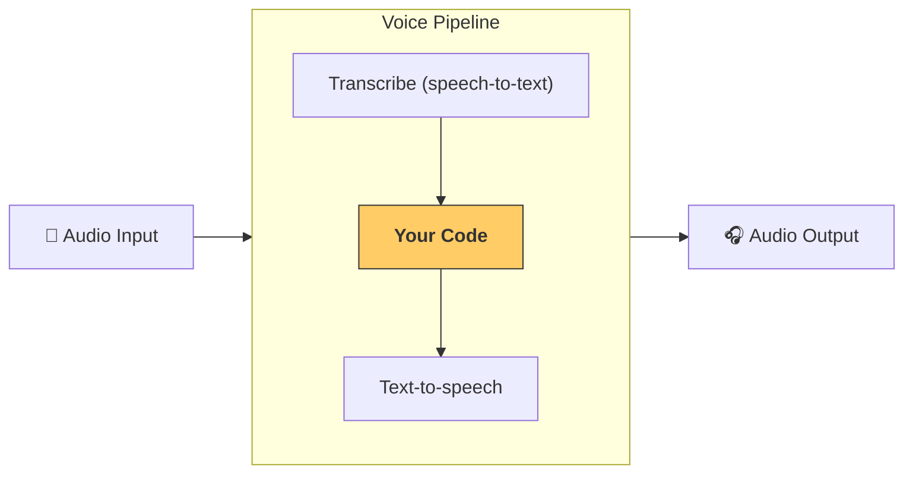

---
search:
  exclude: true
---
# 管道和工作流

[`VoicePipeline`][agents.voice.pipeline.VoicePipeline] 是一个类，可让你轻松将智能体式工作流转换为语音应用。你传入要运行的工作流，管道会负责转写输入音频、检测音频何时结束、在合适的时机调用你的工作流，并将工作流输出转换回音频。



## 管道配置

创建管道时，你可以设置以下几项：

1. [`workflow`][agents.voice.workflow.VoiceWorkflowBase]，即每当有新的音频被转写时运行的代码。
2. 使用的 [`speech-to-text`][agents.voice.model.STTModel] 和 [`text-to-speech`][agents.voice.model.TTSModel] 模型
3. [`config`][agents.voice.pipeline_config.VoicePipelineConfig]，可用于配置以下内容：
    - 模型提供方，可将模型名称映射到模型
    - 追踪，包括是否禁用追踪、是否上传音频文件、工作流名称、追踪 ID 等。
    - TTS 和 STT 模型的设置，例如提示词、语言以及使用的数据类型。

## 管道运行

你可以通过 [`run()`][agents.voice.pipeline.VoicePipeline.run] 方法运行管道，该方法允许你以两种形式传入音频输入：

1. 当你已有完整的音频输入，并且只想为其生成结果时，可以使用 [`AudioInput`][agents.voice.input.AudioInput]。这适用于不需要检测说话者何时说完的场景；例如，你有预录音频，或者在按键通话应用中，用户何时说完是明确的。
2. 当你可能需要检测用户何时说完时，可以使用 [`StreamedAudioInput`][agents.voice.input.StreamedAudioInput]。它允许你在检测到音频片段时将其推送进去，语音管道会通过一个称为“活动检测”的过程，在合适的时机自动运行智能体工作流。

## 结果

语音管道运行的结果是 [`StreamedAudioResult`][agents.voice.result.StreamedAudioResult]。这是一个对象，可让你在事件发生时以流式方式传输这些事件。[`VoiceStreamEvent`][agents.voice.events.VoiceStreamEvent] 有几种类型，包括：

1. [`VoiceStreamEventAudio`][agents.voice.events.VoiceStreamEventAudio]，其中包含一个音频片段。
2. [`VoiceStreamEventLifecycle`][agents.voice.events.VoiceStreamEventLifecycle]，用于告知你轮次开始或结束等生命周期事件。
3. [`VoiceStreamEventError`][agents.voice.events.VoiceStreamEventError]，这是一种错误事件。

```python

result = await pipeline.run(input)

async for event in result.stream():
    if event.type == "voice_stream_event_audio":
        # play audio
        pass
    elif event.type == "voice_stream_event_lifecycle":
        # lifecycle
        pass
    elif event.type == "voice_stream_event_error":
        # error
        pass
```

## 最佳实践

### 中断

Agents SDK 目前没有为 [`StreamedAudioInput`][agents.voice.input.StreamedAudioInput] 提供任何内置的中断处理。相反，每个检测到的轮次都会触发你的工作流单独运行一次。如果你想在应用内处理中断，可以监听 [`VoiceStreamEventLifecycle`][agents.voice.events.VoiceStreamEventLifecycle] 事件。`turn_started` 表示已转写出新的轮次，且处理即将开始。`turn_ended` 会在相应轮次的所有音频都分发完毕后触发。你可以使用这些事件，在模型开始一个轮次时将说话者的麦克风静音，并在该轮次的所有相关音频都刷新完后取消静音。