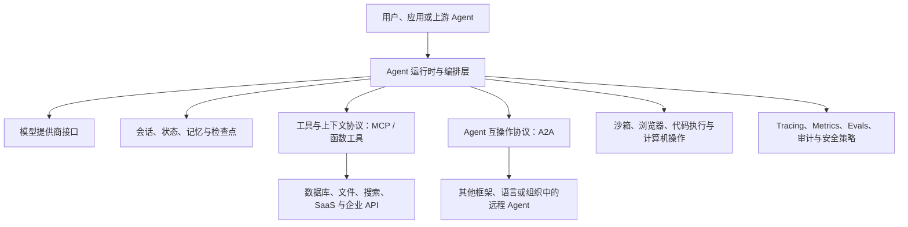

# 主流 AI Agent 底层核心技术：官方开源项目与技术栈全景（2026-07-13）

> 研究目标：尽可能详细地理解当前主流 Agent 的底层支撑技术，而不是评选“最好用的框架”。  
> 准入标准：协议治理组织、原始发布机构或官方维护团队直接发布的仓库、规范、SDK 与文档。  
> 社区材料用途：只补充采用反馈、接口摩擦与争议，不承担官方技术事实。  
> 本地深度冷存：OpenAI Agents SDK、MCP 规范、A2A 规范。  
> 证据边界：LangGraph、Microsoft Agent Framework、Google ADK 与 OpenTelemetry 本轮使用官方在线仓库/发布资料，尚未全部冷存。

## 一、先建立正确的底层技术分层

“Agent 框架”不是一个单一软件类别。一个能长期运行、调用外部系统、与其他 Agent 协作且可被治理的 Agent，至少由七层组成：模型接口、运行循环、上下文与状态、工具边界、Agent 间通信、执行环境、可观测与治理。不同开源项目通常只覆盖其中几层。

这张图里最容易混淆的是 MCP、A2A 和运行时框架的关系。MCP 主要标准化“一个 AI 应用怎样获得工具、资源、提示与客户端能力”；A2A 主要标准化“两个彼此独立、内部可能完全不透明的 Agent 系统怎样发现能力、委派任务、流式更新和交换产物”；OpenAI Agents SDK、Google ADK、Microsoft Agent Framework、LangGraph 则负责在应用内部真正执行循环、维护状态、决定路由并调用模型。三类技术互补，而不是简单替代。

## 二、权威项目版图

### 第一类：协议与跨系统标准

1. **Model Context Protocol**：官方规范仓库 [`modelcontextprotocol/modelcontextprotocol`](https://github.com/modelcontextprotocol/modelcontextprotocol)。仓库直接包含规范、TypeScript 源模式、JSON Schema、正式文档、治理与安全材料；官方仓库说明这些正是其三类核心内容。[MCP 官方仓库](https://github.com/modelcontextprotocol/modelcontextprotocol)
2. **Agent2Agent Protocol**：官方规范仓库 [`a2aproject/A2A`](https://github.com/a2aproject/A2A)，目前由 Linux Foundation 下的 A2A Project 治理，原始贡献来自 Google。规范的目标是让不同框架、语言和供应商构建的独立 Agent 在不暴露内部状态、记忆或工具的情况下协作。[A2A 官方组织](https://github.com/a2aproject)、[A2A 1.0 规范](https://github.com/a2aproject/A2A/blob/main/docs/specification.md)
3. **OpenTelemetry GenAI Semantic Conventions**：官方仓库 [`open-telemetry/semantic-conventions`](https://github.com/open-telemetry/semantic-conventions)。它不执行 Agent，而是定义跨运行时一致的 span、event、metric 和属性语言，例如 `invoke_agent`、`execute_tool`、tool call 参数/结果、Agent 版本和评估事件。当前 GenAI 约定仍有 development/experimental 部分，版本迁移必须谨慎。[OpenTelemetry GenAI 指标规范](https://github.com/open-telemetry/semantic-conventions/blob/main/docs/gen-ai/gen-ai-metrics.md)

### 第二类：官方 Agent 运行时与编排框架

1. **OpenAI Agents SDK**：[`openai/openai-agents-python`](https://github.com/openai/openai-agents-python)。核心抽象包括 Agent、Runner、工具、handoff、guardrail、session、tracing、realtime 与 sandbox agent。官方仓库将它定义为轻量但完整的多 Agent 工作流框架，并公开 Python 源码、测试和文档。[OpenAI Agents SDK 官方仓库](https://github.com/openai/openai-agents-python)
2. **Google Agent Development Kit 2.0**：[`google/adk-python`](https://github.com/google/adk-python)。官方 2.0 版本将 `Agent` 与 `Workflow` 分开，新增图执行引擎和结构化 Task API，支持 routing、fan-out/fan-in、loop、retry、state、dynamic nodes、human-in-the-loop 和嵌套工作流；官方同时明确 2.0 对 Agent API、事件模型和 session schema 有破坏性变化。[Google ADK 官方仓库](https://github.com/google/adk-python)
3. **Microsoft Agent Framework**：[`microsoft/agent-framework`](https://github.com/microsoft/agent-framework)。官方定位是 Python 与 .NET 双语言的生产级 Agent/多 Agent 工作流框架，重点覆盖 middleware、图工作流、checkpoint、streaming、human-in-the-loop、time-travel、OpenTelemetry 与声明式 Agent。[Microsoft Agent Framework 官方仓库](https://github.com/microsoft/agent-framework)
4. **LangGraph**：[`langchain-ai/langgraph`](https://github.com/langchain-ai/langgraph)。它强调长时间、带状态工作流的低层基础设施，核心能力是 durable execution、任意状态点的人类介入、短期/长期记忆和执行路径可视化。官方说明其思想受 Pregel 与 Apache Beam 启发，接口也借鉴 NetworkX。[LangGraph 官方仓库](https://github.com/langchain-ai/langgraph)

### 第三类：专项执行与实现 SDK

1. **A2A 官方多语言 SDK**：`a2a-python`、`a2a-js`、`a2a-java`、`a2a-go`、`a2a-dotnet`、`a2a-rust`。其中 Python SDK 已声明实现 A2A 1.0，并覆盖 JSON-RPC、HTTP+JSON/REST 与 gRPC 的客户端和服务端，另有 OpenTelemetry、SQL 后端和加密扩展。[A2A Python SDK](https://github.com/a2aproject/a2a-python)
2. **OpenHands Software Agent SDK**：[`OpenHands/software-agent-sdk`](https://github.com/OpenHands/software-agent-sdk)。它更聚焦软件工程 Agent 的工作区、命令执行、代码修改与远程运行接口，属于执行环境和 coding-agent runtime 的专项底座，而不是通用互操作标准。[OpenHands SDK](https://github.com/OpenHands/software-agent-sdk)

## 三、MCP：工具与上下文边界到底标准化了什么

### 1. MCP 的参与者不是“两个 Agent”

MCP 的核心拓扑是 Host、Client、Server。Host 是最终 AI 应用，例如桌面助手、IDE 或 Agent Runtime；Host 内部为每个 Server 建立一个 Client 连接；Server 暴露工具、资源、提示或其他能力。Host 掌握用户界面、权限决策和上下文组合，Server 不应天然获得其他 Server 的信息。

这种结构带来重要安全含义：MCP Server 是被接入的能力提供方，不是拥有整个 Agent 状态的中央控制器。一个 Host 可以同时连接多个 Server，但应由 Host 负责隔离与授权。官方规范把可组合性、能力协商、明确的安全边界和渐进增强作为设计原则，具体定义位于本地冷存的 `docs/specification/2025-11-25/architecture/index.mdx`。

### 2. 初始化、版本协商与能力协商

连接建立后，Client 先发送 `initialize`，声明自己支持的协议版本、能力与实现信息；Server 返回选定版本、自身能力和实现信息；Client 再发 `notifications/initialized`。在这一步完成前，不应进入普通操作阶段。

版本与 capability 是两套不同机制。版本决定双方理解的协议语义；capability 决定某个可选功能是否实际可用。例如 Server 可以声明 tools、resources、prompts、logging，Client 可以声明 roots、sampling、elicitation 或任务相关能力。实现不能仅凭版本号假定某个可选能力存在。

这使 MCP 的扩展不是“大家都发送自己想发的 JSON”，而是先声明、再调用。规范还要求对未知能力、错误版本、超时和关闭流程进行明确处理。生命周期、版本协商与关闭语义见 `basic/lifecycle.mdx`。

### 3. 消息与传输

MCP 使用 JSON-RPC 2.0 风格的 request、response 和 notification。Request 有 ID 并要求结果或错误响应；notification 没有 ID，不产生响应。协议定义 `_meta` 等通用扩展字段，并以 JSON Schema 约束结构。

官方标准传输主要包括 `stdio` 与 Streamable HTTP。`stdio` 适用于 Host 启动本地子进程：标准输入输出承载协议消息，标准错误可用于日志。Streamable HTTP 面向远程 Server，Client 通过 HTTP POST 发送消息，Server 可以用普通 JSON 响应或 SSE 流返回消息；Client 可通过 GET 建立监听流。

Streamable HTTP 还定义 session、`MCP-Protocol-Version` 请求头、重连、事件 ID、可恢复投递和多连接问题。规范的安全警告要求验证 `Origin` 以防 DNS rebinding、本地服务尽可能绑定 loopback，并对所有连接做适当认证。这里可以看出，MCP 只定义协议安全要求，不会替部署者自动完成网络隔离和凭证治理。

### 4. Server 暴露的三种主要能力

**Tools** 是模型可调用的动作。Server 通过 `tools/list` 提供名称、描述和输入 schema，Host/Client 通过 `tools/call` 发起调用。工具结果可以包含文本、图像、音频、资源链接或结构化内容。Tool annotations 只能被视为提示，不应作为来自不可信 Server 的安全保证。

**Resources** 是应用可读取的上下文对象，用 URI 标识。Server 可以列出 resources 和 resource templates，Client 用 `resources/read` 获取内容，也可以订阅变化。资源更接近“可寻址数据”，工具更接近“执行动作”；二者不能只按返回内容区分。

**Prompts** 是 Server 提供的参数化消息模板。它们通常由用户显式选择，而 tools 更常由模型决定调用。Prompts 的存在说明 MCP 不只是 function calling 协议，还覆盖可复用的交互入口与上下文准备。

### 5. Client 向 Server 提供的反向能力

MCP 不是单向的“Server 给工具”。Client 也可暴露能力。

**Roots** 让 Client 告诉 Server 哪些文件系统根目录处于工作范围。它是范围提示与协作边界，不应被误认为强制沙箱；真正的文件权限仍需操作系统或容器执行。

**Sampling** 允许 Server 请求 Host 代表它调用模型。这样 Server 不必自己持有模型 API key，也能参与多步推理。规范支持模型偏好、文本/图像/音频消息、tool use、tool result、并行工具与多轮 tool loop。Host 仍应保留用户控制、模型选择和安全策略。

**Elicitation** 允许 Server 请求更多用户信息。Form mode 适合普通结构化输入；URL mode 可把敏感信息收集或 OAuth 流程移到安全网页。规范专门讨论 phishing、安全 URL、用户识别和敏感数据，说明“让 Server 向用户追问”本身是高风险能力。

### 6. 任务、取消、进度与长运行操作

2025-11-25 规范中的 tasks utility 为长运行操作引入 task ID、status、result retrieval、list、cancel、TTL、通知和 input-required 状态。它可以增强 tool call 或 sampling request，使一次调用不必占住单个同步请求直到完成。

这里与 A2A Task 有表面相似，但作用域不同：MCP task 扩展发生在 Client–Server 能力调用边界；A2A Task 是独立 Agent 服务之间的核心协作对象。实现时必须区分两种 task ID 的所有权、生命周期与权限域，不能因为名字相同就直接映射。

### 7. MCP 授权模型

MCP HTTP 授权建立在 OAuth 2.1、Protected Resource Metadata、Authorization Server Metadata、PKCE 等标准之上。Server 作为受保护资源，Client 发现授权服务器与 scope，取得 audience 绑定的 access token，再访问 MCP endpoint。

规范特别强调 token audience、token theft、开放重定向、localhost redirect、client metadata 文档滥用、confused deputy 与 least privilege。最关键的实践边界是：MCP Server 必须验证 token 确实是发给自己的，不能接收为别的资源签发的 token；Client 也不能把一个 Server 的 token 转发给另一个 Server。

因此，MCP 解决的是标准化授权流程接口，不是 Agent 领域的完整身份治理。企业仍需决定谁批准 Server、哪些工具能被哪个 Agent 使用、参数级策略如何执行、敏感输出如何脱敏，以及调用证据保存多久。

## 四、A2A：独立 Agent 之间的任务协议

### 1. 为什么不能只用 MCP 连接 Agent

把远程 Agent 包装成一个 MCP tool 可以工作，但会丢失许多 Agent 级语义：远程 Agent 有自己的身份、能力声明、任务状态、多轮上下文、流式中间状态、异步通知与产物。A2A 将这些提升为协议的一等对象。

A2A 1.0 的目标包括能力发现、文本/文件/结构化数据模态协商、协作任务管理、流式响应、长任务 push notification，以及在不知道对方内部状态、记忆或工具的情况下进行委派。[A2A 规范目标](https://github.com/a2aproject/A2A/blob/main/docs/specification.md)

### 2. Agent Card：远程 Agent 的能力与接口声明

Agent 通过 Agent Card 声明 provider、capabilities、skills、interfaces 和 security schemes。公共发现的标准位置是 `/.well-known/agent-card.json`。Card 可以声明多个接口，例如 JSON-RPC、gRPC 或 HTTP+JSON/REST，并告诉 Client 哪个协议版本与 transport 可用。

Agent Card 与工具 schema 不同。工具 schema 描述一个动作的输入；Agent Card 描述一个自治服务能完成的技能、交互模态、认证方式和协议入口。规范还定义 JWS 签名对象以及 canonicalization/verification 流程，用来帮助 Client 验证 Card 未被篡改。对敏感能力，可通过认证端点取得 Extended Agent Card，而不是把所有信息公开在 well-known 文档里。

### 3. Message、Part、Artifact 与 Task

**Message** 表示一次 Agent 或用户角色的通信，内容由一个或多个 **Part** 组成。Part 可以承载文本、文件或结构化数据。**Artifact** 是 Agent 生成的结果对象，同样由 Part 组成，但语义上是任务产物，而不是普通对话消息。

**Task** 是 A2A 的核心长生命周期对象，包含唯一 ID、context ID、当前 status、history 与 artifacts。TaskState 描述 submitted、working、input-required、auth-required、completed、failed、canceled、rejected 等状态。Client 可以通过 task ID 查询、取消或订阅；context ID 则把多次消息/任务归入同一多轮上下文。

这种分离避免把所有东西都塞进 chat history：消息是沟通，任务是工作状态，产物是可交付结果，上下文是关联范围。对数据库设计与审计而言，这四类对象应分别建模。

### 4. 同步、流式与异步三种交互方式

`SendMessage` 适合普通请求/响应；`SendStreamingMessage` 通过流持续返回 `Message`、`TaskStatusUpdateEvent` 或 `TaskArtifactUpdateEvent`；对于断开连接后仍继续的长任务，Client 可以配置 push notification webhook，或者稍后 `GetTask`、`ListTasks`、`SubscribeToTask`。

流式事件中的 artifact update 支持 append 与 last-chunk 语义，使大型产物可以增量传递。Push notification 需要单独验证回调 URL 与认证信息，Server 不应盲目向任意 URL 投递，因为这会形成 SSRF、数据泄漏和 webhook 冒充风险。

### 5. 多轮交互与输入/授权等待

当远程 Agent 需要更多信息时，Task 可以进入 `input-required`；Client 再用相同 task/context 发送后续 Message。需要额外授权时可进入 `auth-required`，但凭证获取通常应通过协议外的标准授权流程完成，而不是把敏感凭证直接放进普通消息。

这类状态是 Agent 互操作区别于简单 RPC 的关键：一次委派不是函数立即返回或报错，而可能暂停、等待人类、等待权限、恢复、产生多个中间产物。

### 6. 版本与多 binding

A2A 1.0 将抽象操作与具体 binding 分离。官方定义 JSON-RPC、gRPC、HTTP+JSON/REST 三种 binding，并要求它们在操作、数据模型和错误语义上功能等价。协议版本使用 major.minor 参与协商；patch 不应影响兼容性。Client 若需要新能力，不应静默回退到旧版本而丢失语义。

自定义 binding 必须映射核心操作、数据类型、错误、streaming、安全与 Agent Card 声明。官方 Python SDK 的兼容表显示 1.0 与 0.3 compatibility mode 覆盖三种主要 transport，但不同语言 SDK 的版本进度可能不同，采用时必须逐个查看兼容表，不能只看“A2A SDK”名称。

### 7. A2A 安全边界

A2A 的 security scheme 支持 API key、HTTP auth、OAuth2、OpenID Connect 与 mutual TLS 等声明。Server 必须执行认证与资源级授权；Client 必须验证 Server 身份。Agent Card 只描述认证方法，不替实现保存或签发凭证。

跨 Agent 系统还有更高层风险：一个 Agent 是否有权把用户任务继续委派；下游产物是否可携带原始敏感数据；多个 Agent 共同造成错误时谁负责；Task history 与 artifacts 如何做租户隔离；Card 中的 skill 描述是否真实。A2A 规范覆盖传输、身份声明和操作安全，但组织治理、责任归属与策略证明仍需上层系统实现。

## 五、OpenAI Agents SDK：运行循环内部怎样工作

### 1. Agent 与 Runner 的分工

`Agent` 是声明性配置：instructions、model、tools、handoffs、guardrails、output type、hooks 等。`Runner` 才是真正执行循环的入口。本地源码的 `src/agents/run.py`、`run_internal/`、`run_state.py` 和 `items.py` 共同承担运行步骤、状态、输入输出 item 与恢复。

一个典型循环是：把当前 Agent、输入历史和可用工具交给模型；解析模型输出；若得到最终输出则结束；若得到 tool call 则执行工具并把结果加入下一轮输入；若得到 handoff 则切换活跃 Agent；若出现 approval request 则暂停并生成可恢复状态；同时生成 tracing spans 与 usage 统计。

### 2. Tool 的多层形态

SDK 不只支持 Python function tool。官方源码与文档包含 function schema、hosted tools、computer、MCP、Agent-as-tool、sandbox 相关工具与 tool guardrails。函数通常由类型签名生成 JSON Schema，模型产生参数后由 SDK 验证并调用。

Agent-as-tool 与 handoff 的差异很重要。前者把子 Agent 当成一个工具调用，执行结束后控制权回到原 Agent；handoff 则改变当前负责对话的 Agent。多 Agent 架构不能只看“调用了几个 Agent”，而要看控制权和上下文所有权是否转移。

### 3. Handoff 与上下文过滤

Handoff 可以指定目标 Agent、工具名/描述、输入类型、回调与 input filter。input filter 决定目标 Agent 能看到哪些历史与中间项。若没有过滤，敏感上下文、无关工具结果和前序推理可能被整个转交。

这说明多 Agent 安全不仅是目标 Agent 是否可信，还包括“交接包”包含什么。生产系统应把 handoff 视为权限边界，显式定义最小上下文，而不是把完整 transcript 作为默认共享内存。

### 4. Guardrail 的执行位置

SDK 区分 input guardrail、output guardrail 和 tool guardrail。Input guardrail 检查初始输入；output guardrail 检查最终输出；tool guardrail 围绕工具调用。它们可触发 tripwire 中止运行。

Guardrail 并不是统一安全证明。它的覆盖范围取决于执行位置、是否并行、是否对每个 Agent 生效，以及失败时状态如何处理。尤其在 handoff、Agent-as-tool 与 streaming 情况下，需要确认 guardrail 绑定的是入口 Agent、当前 Agent 还是具体工具。

### 5. Session、RunContext 与模型上下文

SDK 将本地 application context 与发送给模型的对话上下文分开。`RunContextWrapper` 可携带依赖、用户对象或服务句柄，供 tools/hooks 使用，但不会自动发送给模型；真正进入模型的是 input items、instructions 和工具定义。

Sessions 用来跨 runs 保存 conversation history。实现可使用内置或扩展 session backend。这里仍需区分短期会话历史与长期语义记忆：保存全部 messages 不等于实现检索、总结、冲突处理和遗忘策略。

### 6. Human-in-the-loop 与可恢复状态

工具可要求 approval。运行遇到中断时返回 state，应用收集批准/拒绝决定后恢复。真正可靠的 HITL 需要序列化足够状态，使恢复不会重复执行已经完成的副作用工具，也不会因为进程重启丢失 pending approval。

SDK 还提供 `RunState` 等持久化能力。分析任何 Agent runtime 时，应重点检查暂停点是否持久、工具调用是否有稳定 ID、恢复是否幂等、模型输出是否会被重复应用，而不只是界面上有没有“Approve”按钮。

### 7. Tracing

SDK 自带 tracing，围绕 agent run、model generation、function tool、handoff、guardrail 等形成 span。Tracing 可以帮助重建路径、延迟和错误，但输入输出内容可能包含敏感数据，生产环境必须控制采集、导出与保留。

与 OpenTelemetry 的关系是：SDK tracing 是具体运行时实现，OpenTelemetry GenAI semantic conventions 试图提供跨框架可比较的字段语言。若组织同时使用多个 Agent runtime，最好将内部 trace 映射到统一的 OpenTelemetry schema，而不是让每个框架形成孤立观测岛。

### 8. Sandbox Agent

当前官方仓库把 SandboxAgent 作为长时工作能力：它可以为 Agent 准备容器/工作区 manifest，使其查看文件、运行命令、打补丁并保持工作区状态。核心风险从“工具参数是否正确”升级为“执行环境是否隔离”：网络、文件挂载、凭证注入、资源额度、进程树、产物导出和销毁策略都必须明确。

## 六、其他官方运行时的底层差异

### Google ADK 2.0

ADK 2.0 明确把 Agent 与 Workflow 作为两种主类。Agent 封装模型驱动行为；Workflow 提供确定性图执行。其新 runtime 支持 routing、fan-out/fan-in、loops、retry、state、dynamic nodes、HITL 和 nested workflows，说明 Google 正把“概率性 Agent”与“确定性过程编排”放进同一底座。Task API 又提供 Agent 间结构化委派，既可多轮，也可作为 workflow node。[Google ADK 2.0 官方说明](https://github.com/google/adk-python)

技术上最需关注的是 2.0 event model 与 session schema 的破坏性变化。Agent 系统的事件与 session 是持久化和回放基础，一旦 schema 变化，旧会话兼容、事件消费者、评测基线和观测管道都会受影响。官方说明新 session 可被 1.28+ 读取但与更早版本不兼容，因此版本升级必须做真实状态迁移验证。

### Microsoft Agent Framework

Microsoft Agent Framework 的底层特色是双语言一致性、middleware 与生产工作流。Middleware 可包围 request/response、异常和自定义 pipeline；workflow 支持顺序、并发、handoff、group collaboration、checkpoint、streaming、HITL 与 time-travel；OpenTelemetry 是内置观测方向。[Microsoft Agent Framework 官方说明](https://github.com/microsoft/agent-framework)

它适合观察“Agent runtime 怎样进入企业应用框架”：依赖注入、middleware、声明式 YAML、跨语言 schema、托管与本地运行需要保持概念一致。与轻量 SDK 相比，它承担更多部署和治理职责，也意味着抽象面与迁移成本更大。

### LangGraph

LangGraph 的底层思想更接近状态图计算。节点读取/写入共享 state，边决定下一步，checkpointer 保存每个执行位置，使 workflow 可在失败或人工中断后恢复。官方将 durable execution、HITL、短期/长期记忆作为低层支撑，而把更高层 planning/subagent/file-system Agent 放到 Deep Agents。[LangGraph 官方说明](https://github.com/langchain-ai/langgraph)

它受 Pregel 启发这一点很关键：复杂 Agent 可以被看作多步状态传播，而不是无限 while-loop。图模型提高路径可见性和恢复能力，但动态程度极高的 Agent 可能需要 conditional edges、subgraphs 与 command，最终仍会形成复杂状态机。

## 七、可观测性与评测为什么属于底层

Agent 的一次“请求”内部可能包含多个模型调用、工具、handoff、审批、重试和远程 Agent 任务。传统 HTTP latency 无法说明失败发生在哪里。OpenTelemetry GenAI 约定正在定义 `invoke_agent`、`execute_tool`、tool definitions、tool call arguments/results、evaluation event、reasoning token、首 chunk 延迟等统一字段。[OpenTelemetry 语义约定发布记录](https://github.com/open-telemetry/semantic-conventions/releases)

但官方也明确提示 GenAI 约定仍在演进，旧 instrumentation 不应未经 opt-in 自动切换到最新实验版本。底层平台应把 telemetry schema version 与 Agent/runtime version 一起记录，否则升级后同名指标可能不可比较。

评测也不能只看最终答案。Agent 需要同时评价 outcome、trajectory、工具选择、参数正确性、权限遵守、成本、延迟、恢复与副作用。OpenAI SDK tracing、ADK evaluation、LangSmith/LangGraph tracing、Microsoft OpenTelemetry 各有实现，但跨框架基线仍需要统一事件模型和自有评分数据。

## 八、官方材料与社区观察要分开看

官方材料能够回答“协议要求什么、SDK实现什么、版本支持什么”。社区材料更适合发现接口摩擦。例如 LangChain 论坛关于 A2A 原生支持的讨论指出，MCP adapter 已较成熟，但在开源 LangGraph 中把一个 node 委派给远程 Agent 并非天然简单；这反映 runtime graph 与远程 task protocol 的映射仍需设计，而不是证明 A2A 不可用。[LangChain 社区讨论](https://forum.langchain.com/t/native-support-for-a2a-protocol/1302)

若干 AI 工程社区讨论把 MCP 概括为 tool boundary、A2A 概括为 agent boundary，并继续追问跨框架 runtime integration、identity 与 governance。这一概括与官方作用域大体一致，但社区帖子样本小、实现背景不同，不能据此判断采用率或性能优劣。尤其 Reddit 等内容应视为问题线索，不应成为技术规范来源。

目前可以客观确认的社区共性问题是：协议互通不等于语义互通。两个 Agent 即使能交换 Message，也可能对任务完成、错误重试、权限、成本、置信度和 artifact schema 有不同理解。真正互操作需要协议一致、SDK版本一致、领域 schema 一致和治理策略一致。

## 九、把这些技术拼成生产 Agent 底座

一个相对完整的组合可以这样理解：应用内部使用 OpenAI Agents SDK、ADK、Microsoft Agent Framework 或 LangGraph 之一执行 Agent loop；使用 MCP 接入工具和资源；需要跨组织/框架委派时使用 A2A；代码与浏览器操作放入受控 sandbox；所有 model/tool/handoff/task 事件映射到 OpenTelemetry；session/checkpoint 与业务数据库分离；policy engine 在工具调用、handoff 和远程任务边界执行授权；离线 eval 复放真实 trajectory。

关键数据标识至少包括：用户/租户、conversation/session、run、trace/span、agent name/version、tool call、handoff、remote task/context、artifact、approval、policy decision、model response 与 idempotency key。没有这些关联键，发生跨 Agent 错误时无法重建因果链。

安全上应采用能力最小化：MCP Server 只暴露必要工具；tool schema 限制输入；危险工具要求审批；handoff 过滤上下文；A2A Agent Card 与 endpoint 验证身份；remote task 使用最小 scope；sandbox 默认无敏感网络与宿主文件；trace 默认不记录完整敏感内容；所有副作用操作具有幂等键与审计记录。

可靠性上要处理至少六类恢复：模型超时重试、工具已执行但结果丢失、stream 中断重连、Agent handoff 后进程崩溃、远程 A2A task 长时间无更新、人工审批跨进程恢复。一个框架宣称“支持 retry”并不意味着六类都安全，必须逐项检查状态保存点和副作用边界。

## 十、当前最值得继续深挖的官方源码路径

### OpenAI Agents SDK（已冷存）

- `src/agents/run.py`、`src/agents/run_internal/`：运行循环与模型/工具步骤。
- `src/agents/run_state.py`、`src/agents/items.py`：可恢复状态和事件项。
- `src/agents/tool.py`、`src/agents/function_schema.py`、`src/agents/tool_guardrails.py`：工具定义、schema 与防护。
- `src/agents/handoffs/`：Agent 控制权转移与输入过滤。
- `src/agents/mcp/`：MCP server manager、工具发现与调用集成。
- `src/agents/tracing/`：span、processor 与 export。
- `src/agents/sandbox/`：长时工作区与 sandbox Agent。
- `docs/running_agents.md`、`docs/human_in_the_loop.md`、`docs/mcp.md`、`docs/tracing.md`：官方运行语义。

### MCP（已冷存）

- `docs/specification/2025-11-25/architecture/index.mdx`：Host/Client/Server 与设计原则。
- `basic/lifecycle.mdx`、`basic/transports.mdx`：初始化、版本、stdio、Streamable HTTP、恢复。
- `basic/authorization.mdx`：OAuth、资源发现、scope、token audience 与 confused deputy。
- `server/tools.mdx`、`server/resources.mdx`、`server/prompts.mdx`：Server 能力。
- `client/sampling.mdx`、`client/elicitation.mdx`、`client/roots.mdx`：Client 反向能力。
- `basic/utilities/tasks.mdx`：长任务状态与安全。
- `schema/`：TypeScript 源 schema 与 JSON Schema 产物。

### A2A（源码已取得，bundle 部分失败）

- `docs/specification.md`：1.0 完整规范。
- `docs/specification.md` 与其绑定章节：JSON/REST 与 JSON-RPC 数据模型及映射。
- `specification/a2a.proto`：gRPC service 与 message 的规范源文件。
- `adrs/`：协议关键架构决定。
- `GOVERNANCE.md`、`MAINTAINERS.md`、`SECURITY.md`：治理和安全渠道。
- 官方实现应继续结合 `a2aproject/a2a-python` 的 client/server、task store、event queue、telemetry 与 compatibility code 阅读。

## 十一、结论

当前 Agent 底层正在形成三种相对清晰的标准化中心：运行时框架标准化应用内部循环与状态；MCP 标准化 Agent/模型应用到工具与上下文的能力边界；A2A 标准化独立 Agent 服务之间的发现与任务协作；OpenTelemetry 尝试标准化跨框架的可观测语言。

真正尚未被单一开源项目完全解决的是跨层治理：身份如何贯穿 Host、MCP Server、runtime Agent 与远程 A2A Agent；授权如何从“能连上”细化到参数和数据级；副作用怎样幂等恢复；不同框架的 task/session/trace 怎样关联；评测怎样跨版本保持可比。理解这些空白，比只比较哪个框架 API 更简洁，更接近 Agent 基础设施的核心。

如果继续做下一轮源码级研究，合理顺序是：先完整拆解 OpenAI Agents SDK 的 Runner 状态机；再把其 MCP 集成映射到 MCP 生命周期与授权；随后用 A2A Python SDK 构建一个远程任务，追踪 Agent Card、SendMessage、Task、stream/push 与 OpenTelemetry；最后拿 LangGraph/ADK/MAF 对同一任务建模，比较 checkpoint、HITL、handoff、task 与 trace 的语义差异。

## 十二、官方来源索引

- [OpenAI Agents SDK 官方仓库](https://github.com/openai/openai-agents-python)
- [MCP 官方规范仓库](https://github.com/modelcontextprotocol/modelcontextprotocol)
- [MCP 2025-11-25 规范变更](https://github.com/modelcontextprotocol/modelcontextprotocol/blob/main/docs/specification/2025-11-25/changelog.mdx)
- [A2A 官方组织](https://github.com/a2aproject)
- [A2A 1.0 官方规范](https://github.com/a2aproject/A2A/blob/main/docs/specification.md)
- [A2A 官方 Python SDK](https://github.com/a2aproject/a2a-python)
- [Google ADK 官方仓库](https://github.com/google/adk-python)
- [Microsoft Agent Framework 官方仓库](https://github.com/microsoft/agent-framework)
- [LangGraph 官方仓库](https://github.com/langchain-ai/langgraph)
- [OpenTelemetry Semantic Conventions](https://github.com/open-telemetry/semantic-conventions)
- [OpenTelemetry GenAI Metrics](https://github.com/open-telemetry/semantic-conventions/blob/main/docs/gen-ai/gen-ai-metrics.md)
- [OpenHands Software Agent SDK](https://github.com/OpenHands/software-agent-sdk)
