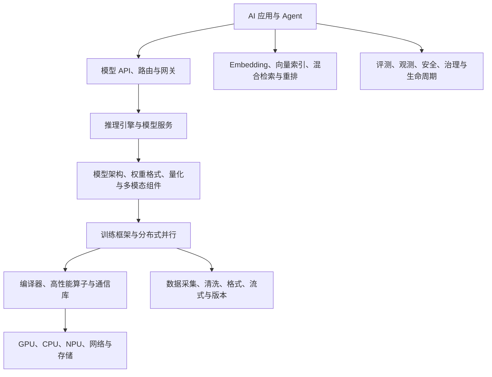

# Agent 之外的 AI 底层核心技术与官方开源项目全景

> 日期：2026-07-13  
> 目标：整理支撑现代 AI 系统、但不属于 Agent 编排本身的底层技术。  
> 材料标准：优先采用基金会、原始研究团队、基础设施厂商或项目官方组织维护的仓库和文档。  
> 内容结构：先解释技术层，再列代表性官方开源项目；不以 star 数作为技术重要性的证明。  
> 边界：本报告是官方项目版图，不等于对所有项目完成源码级审计。

## 一、完整 AI 技术栈应该怎样分层

Agent 位于模型能力之上。它下面至少还有九层：硬件与通信、张量与自动微分、编译器与算子、分布式训练、模型与权重生态、数据工程、推理引擎、检索存储、部署与生命周期，以及横跨全栈的评测、安全和可观测性。

这九层之间并不是严格的一对一依赖。例如 vLLM 同时包含推理调度、KV cache 管理、分布式执行和 API 服务；PyTorch 同时覆盖张量、自动微分、分布式与编译；MLflow 同时覆盖实验、模型注册、评测、Tracing 和部署。但分层有助于判断一个项目究竟解决的是哪类底层问题。

## 二、张量、自动微分与基础深度学习运行时

### 1. PyTorch

官方仓库：[`pytorch/pytorch`](https://github.com/pytorch/pytorch)

PyTorch 是当前开源 AI 生态最重要的张量与自动微分底座之一。底层职责包括张量表示、算子调度、动态图自动微分、设备后端、分布式通信接口、模型序列化和编译优化。上层的 Transformers、Diffusers、DeepSpeed、Megatron Core、vLLM、SGLang 等大量项目都依赖其 tensor 与 CUDA 生态。

理解 PyTorch 不能只停留在 `nn.Module`。其关键底层包括 dispatcher、ATen 算子、autograd graph、CUDA stream、DistributedDataParallel、FSDP、DTensor、TorchDynamo、AOTAutograd 和 Inductor。训练时它需要保存反向传播所需激活；推理时则可关闭梯度、融合算子并编译图。

### 2. JAX

官方仓库：[`jax-ml/jax`](https://github.com/jax-ml/jax)

JAX 以函数变换为核心：`grad` 做自动微分，`jit` 做 XLA 编译，`vmap` 做自动向量化，`pmap`/sharding 处理并行。它强调纯函数、可组合变换和编译器驱动执行，在 Google 研究、TPU 和大模型训练系统中占重要位置。

与 PyTorch 的命令式体验相比，JAX 更要求程序满足可追踪与函数式约束。其优势是变换可组合和编译优化空间大；代价是动态 Python 行为、调试和状态管理需要不同思维。

### 3. TensorFlow/XLA 与 ONNX Runtime

官方仓库：[`tensorflow/tensorflow`](https://github.com/tensorflow/tensorflow)、[`microsoft/onnxruntime`](https://github.com/microsoft/onnxruntime)

TensorFlow 仍是完整训练、数据和部署生态的重要底层。XLA 将高层张量图编译为面向 CPU/GPU/TPU 的优化程序。ONNX Runtime 则强调跨框架模型图执行，通过 Execution Provider 适配 CUDA、TensorRT、DirectML、OpenVINO 等后端。

ONNX 的核心价值不是定义所有新模型，而是提供相对稳定的交换图和运行接口。遇到新型 attention、动态控制流或自定义算子时，仍可能需要扩展 operator 或回退到原框架。

## 三、GPU 编译器、高性能算子与通信

### 1. Triton Language

官方仓库：[`triton-lang/triton`](https://github.com/triton-lang/triton)

Triton 是面向并行 GPU kernel 的编程语言与编译器。它让开发者以比 CUDA 更高层的 block/tensor 方式描述数据加载、计算和存储，再由编译器映射线程、共享内存、流水线和设备指令。PyTorch Inductor、Flash 类算子和大量推理引擎用它快速实现定制 kernel。

其核心不是“Python 写 GPU”，而是编译器获得了 tile、布局、内存访问和并行结构信息，可以进行融合、向量化、流水与代码生成。官方发布记录持续涉及 backend、alias analysis、buffer region、TMA、tensor memory 和 stream pipeline 等底层能力。[Triton 官方发布](https://github.com/triton-lang/triton/releases)

### 2. CUTLASS、FlashAttention 与 xFormers

官方仓库：[`NVIDIA/cutlass`](https://github.com/NVIDIA/cutlass)、[`Dao-AILab/flash-attention`](https://github.com/Dao-AILab/flash-attention)、[`facebookresearch/xformers`](https://github.com/facebookresearch/xformers)

CUTLASS 提供 NVIDIA GPU 上 GEMM、卷积和相关张量运算的 C++ 模板与优化实现。它更贴近硬件矩阵单元、数据布局、warp 与 shared memory。

FlashAttention 的关键思想是 IO-aware attention：不显式把完整 attention matrix 写回高带宽显存，而通过分块、在线 softmax 与 kernel 融合减少 HBM 访问。它改变的主要是内存复杂度与实际速度，而不是近似 attention 数学。

xFormers 聚合 memory-efficient attention、稀疏/块结构等组件，并根据设备与条件选择后端。官方 changelog 甚至会因为正确性或性能问题移除某个 Triton operator，这提醒我们：算子“可运行”不代表在所有形状、dtype 和 GPU 上正确且最优。[xFormers 官方变更记录](https://github.com/facebookresearch/xformers/blob/main/CHANGELOG.md)

### 3. NCCL 与分布式通信

官方仓库：[`NVIDIA/nccl`](https://github.com/NVIDIA/nccl)

训练和分布式推理的底层瓶颈常常不是单卡算力，而是 all-reduce、all-gather、reduce-scatter、all-to-all 与点对点通信。NCCL 为 NVIDIA GPU 拓扑提供集合通信原语，并利用 NVLink、PCIe、InfiniBand/RDMA 等路径。

数据并行梯度同步依赖 all-reduce；FSDP/ZeRO 依赖参数与梯度分片通信；MoE expert parallel 常依赖 all-to-all；tensor parallel 频繁执行层内集合通信。通信计算重叠、bucket 大小、拓扑感知和 straggler 会直接决定扩展效率。

## 四、大模型训练与分布式并行

### 1. Megatron-LM / Megatron Core

官方仓库：[`NVIDIA/Megatron-LM`](https://github.com/NVIDIA/Megatron-LM)

Megatron Core 提供 GPU 优化的 Transformer 构件和多维并行。官方列出的核心并行包括 tensor parallel、pipeline parallel、data parallel、expert parallel 和 context parallel，并支持 FP16、BF16、FP8、FP4 等精度。[Megatron-LM 官方仓库](https://github.com/NVIDIA/Megatron-LM)

Tensor parallel 把单层矩阵运算拆到多卡；pipeline parallel 把不同层放到不同 stage，并用 micro-batch 填充流水线；data parallel 复制模型、切分数据；expert parallel 分布 MoE experts；context parallel 切分长序列维度。实际系统往往组合为多维设备网格。

### 2. DeepSpeed

官方仓库：[`deepspeedai/DeepSpeed`](https://github.com/deepspeedai/DeepSpeed)

DeepSpeed 的代表性底层是 ZeRO：把 optimizer state、gradient、parameter 按阶段分片，降低每张卡的内存占用。它还包含 offload、pipeline、MoE、通信优化和 inference 组件。PyTorch 官方项目页将其概括为降低分布式训练与推理成本和复杂度的优化系统。[PyTorch DeepSpeed 项目页](https://pytorch.org/projects/deepspeed/)

理解 ZeRO 时要区分“内存节约”和“通信代价”。分片越彻底，单卡常驻状态越少，但计算前后的 all-gather/reduce-scatter 更多；CPU/NVMe offload 又引入 PCIe 与存储带宽瓶颈。

### 3. TorchTitan

官方仓库：[`pytorch/torchtitan`](https://github.com/pytorch/torchtitan)

TorchTitan 是 PyTorch 原生的生成式 AI 大规模训练平台，试图把 FSDP、tensor/pipeline/context parallel、activation checkpointing、distributed checkpoint 和 `torch.compile` 等能力放在统一、现代的 PyTorch 实现中。[TorchTitan 官方仓库](https://github.com/pytorch/torchtitan)

它值得作为理解“框架原生大模型训练”与 Megatron/DeepSpeed 专用栈差异的入口：前者更紧密跟随 PyTorch 抽象，后者积累了大量专用 kernel 与训练策略。

### 4. Ray Train

官方仓库：[`ray-project/ray`](https://github.com/ray-project/ray)

Ray 用分布式 task、actor 和 object store 提供通用计算底座，Ray Train、Data、Serve 分别覆盖训练、数据与服务。它不替代 PyTorch/JAX，而是调度 worker、资源、失败恢复和集群执行。

## 五、模型架构、权重与多模态组件生态

### 1. Hugging Face Transformers

官方仓库：[`huggingface/transformers`](https://github.com/huggingface/transformers)

Transformers 提供统一的 configuration、tokenizer、model、generation 与 checkpoint loading 抽象，使文本、视觉、语音和多模态架构能共享 `from_pretrained` 生态。其底层价值在于模型实现与权重/配置约定，而不是一个单独模型。

模型兼容性涉及 config 字段、tokenizer vocabulary 与 special tokens、position encoding、attention variant、generation config、chat template 和权重命名。许多“模型在某推理引擎表现异常”并非矩阵计算错误，而是这些外围语义不一致。

### 2. Diffusers

官方仓库：[`huggingface/diffusers`](https://github.com/huggingface/diffusers)

Diffusers 面向图像、视频和音频扩散/flow matching 模型。典型 pipeline 由 text encoder、denoiser/DiT、scheduler、VAE 和 safety/postprocess 组件构成。Scheduler 决定采样时间步与数值更新；VAE 在像素/波形和 latent 之间转换；DiT/UNet 在 latent 空间预测噪声、速度或 flow。

它说明多模态生成基础设施与 LLM 并不完全同构：推理不是逐 token decode，而是多步数值积分/去噪，缓存、并行和延迟优化方式也不同。[Diffusers 官方仓库](https://github.com/huggingface/diffusers)

### 3. Whisper、OpenCLIP、Segment Anything

官方仓库：[`openai/whisper`](https://github.com/openai/whisper)、[`mlfoundations/open_clip`](https://github.com/mlfoundations/open_clip)、[`facebookresearch/segment-anything`](https://github.com/facebookresearch/segment-anything)

Whisper 展示语音识别、翻译、语言识别与时间戳预测的 seq2seq Transformer；OpenCLIP 提供图文对比学习与 embedding；Segment Anything 展示图像 encoder、prompt encoder 和 mask decoder 的可提示视觉分割。这些模型经常作为 Agent 感知层或检索 embedding 来源，但其推理/数据机制应独立理解。[Whisper 官方仓库](https://github.com/openai/whisper)

## 六、模型格式、量化与本地推理

### 1. llama.cpp、GGML 与 GGUF

官方仓库：[`ggml-org/llama.cpp`](https://github.com/ggml-org/llama.cpp)

llama.cpp 的目标是在广泛硬件上以较少依赖运行 LLM。它支持 CPU SIMD、Metal、CUDA、HIP、Vulkan、SYCL 等后端，支持从约1.5 bit到8 bit的多种量化，以及 CPU+GPU 混合推理。[llama.cpp 官方仓库](https://github.com/ggml-org/llama.cpp)

GGUF 不只是权重数组容器，还携带模型架构、tokenizer 和量化元数据。量化把权重用更少位宽表示，以降低内存与带宽，但会引入解量化 kernel、量化误差和不同层敏感性问题。衡量量化不能只看模型文件大小，还要看质量、prefill/decode 性能、设备支持与 KV cache 精度。

### 2. ONNX、SafeTensors 与跨工具链格式

官方仓库：[`onnx/onnx`](https://github.com/onnx/onnx)、[`huggingface/safetensors`](https://github.com/huggingface/safetensors)

ONNX 表示算子图和张量，适合跨框架/运行时部署；SafeTensors 重点是安全、可快速映射的权重文件，避免 pickle 类任意代码执行风险。两者处于不同层：一个描述计算图，一个主要存储张量。

## 七、大模型推理引擎与服务

### 1. vLLM

官方仓库：[`vllm-project/vllm`](https://github.com/vllm-project/vllm)

vLLM 是高吞吐、内存高效的 LLM 推理与服务引擎。核心技术包括 PagedAttention/KV cache 分页管理、continuous batching、prefix caching、quantization、speculative decoding，以及 tensor/pipeline/data/expert/context parallel。它还集成多种优化 attention kernel。[vLLM 官方仓库](https://github.com/vllm-project/vLLM)

LLM 服务分为 prefill 和 decode 两种工作负载。Prefill 对整段 prompt 做并行计算，偏计算密集；decode 每步生成少量 token，频繁读取巨大 KV cache，偏内存带宽与调度。Continuous batching 允许请求在不同 decode 步动态进入/退出批次，提高 GPU 利用率。

### 2. SGLang

官方仓库：[`sgl-project/sglang`](https://github.com/sgl-project/sglang)

SGLang 同时提供前端编程接口与高性能 serving runtime。其代表性机制包括 RadixAttention/prefix reuse、structured generation、并行与分布式服务。官方 benchmark 工具测量 throughput、TTFT、inter-token latency 和端到端延迟，并可对 vLLM、TensorRT-LLM 等后端使用统一请求方式。[SGLang 官方 benchmark 文档](https://github.com/sgl-project/sglang/blob/main/docs/developer_guide/bench_serving.md)

### 3. TensorRT-LLM 与 Triton Inference Server

官方仓库：[`NVIDIA/TensorRT-LLM`](https://github.com/NVIDIA/TensorRT-LLM)、[`triton-inference-server/server`](https://github.com/triton-inference-server/server)

TensorRT-LLM 聚焦 NVIDIA GPU 上的 LLM 图优化、kernel、量化、KV cache、in-flight batching 和多 GPU/多节点执行。Triton Inference Server 是更通用的模型服务层，负责 model repository、dynamic batching、ensemble、版本、并发实例和 metrics，可挂载 TensorRT、PyTorch、ONNX Runtime、Python 与 TensorRT-LLM backend。

两者名字都含 Triton，但不能与 Triton Language 混淆：Triton Language 是 GPU kernel 语言/编译器；Triton Inference Server 是 NVIDIA 模型服务系统。

### 4. llama.cpp server 与边缘推理

llama.cpp 也提供 OpenAI-compatible HTTP server、并行 decoding、speculative decoding、embedding、reranking 与 grammar-constrained output。它的核心优势是设备覆盖与本地/边缘运行，而不是最大规模 GPU 集群吞吐。

## 八、AI 数据工程与数据治理

### 1. Apache Arrow 与 Parquet

官方仓库：[`apache/arrow`](https://github.com/apache/arrow)、[`apache/parquet-format`](https://github.com/apache/parquet-format)

Arrow 定义跨语言的列式内存布局，支持零拷贝或低复制交换；Parquet 是列式磁盘格式，适合压缩与选择性读取。Hugging Face Datasets 使用 Arrow cache 和 memory mapping，让大数据集不必全部载入内存。[Hugging Face Datasets 与 Arrow](https://huggingface.co/docs/datasets/main/about_arrow)

### 2. Hugging Face Datasets

官方仓库：[`huggingface/datasets`](https://github.com/huggingface/datasets)

Datasets 提供 dataset builder、split、feature schema、map/filter、streaming、cache fingerprint 和 Hub 集成。底层重点是数据变换可复现、缓存失效、流式读取和格式互操作，而不只是“下载数据集”。[Datasets 官方仓库](https://github.com/huggingface/datasets)

### 3. NVIDIA NeMo Curator

官方仓库：[`NVIDIA-NeMo/Curator`](https://github.com/NVIDIA-NeMo/Curator)

NeMo Curator 面向训练数据的抓取、语言/质量分类、去重、PII处理、毒性过滤、合成数据和多模态处理。官方近期版本使用 Ray-based pipeline 覆盖文本、图像、视频与音频。[NeMo Curator 官方仓库](https://github.com/NVIDIA-NeMo/Curator)

训练数据底层通常包括 exact/fuzzy dedup、MinHash/LSH、document quality classifier、language ID、PII redaction、版权/许可记录、污染检测和数据 lineage。模型训练质量很大程度上由这层决定。

### 4. DVC、lakeFS 与数据版本

官方仓库：[`iterative/dvc`](https://github.com/iterative/dvc)、[`treeverse/lakeFS`](https://github.com/treeverse/lakeFS)

DVC 用 Git 指针与外部对象存储管理大文件、pipeline 和 experiment；lakeFS 为对象存储提供 Git-like branch/commit/merge。它们解决的是数据与模型产物可追踪，而不是数据清洗算法本身。

## 九、Embedding、向量索引、混合检索与重排

### 1. FAISS

官方仓库：[`facebookresearch/faiss`](https://github.com/facebookresearch/faiss)

FAISS 是向量相似搜索与聚类库，包含 exact flat index、IVF、Product Quantization、HNSW 和 GPU 实现。它更接近索引算法库，不是完整数据库。IVF 先做 coarse partition，再只搜索部分 inverted lists；PQ 把向量子空间量化为短码，降低内存并用近似距离搜索。

### 2. Milvus、Qdrant 与 pgvector

官方仓库：[`milvus-io/milvus`](https://github.com/milvus-io/milvus)、[`qdrant/qdrant`](https://github.com/qdrant/qdrant)、[`pgvector/pgvector`](https://github.com/pgvector/pgvector)

Milvus 是云原生分布式向量数据库，强调大规模 ANN、存储计算分离与多索引；Qdrant 是 Rust 实现的向量搜索与数据库，强调 payload filtering、HNSW、分片/复制和 API；pgvector 把 vector 类型和 HNSW/IVFFlat 索引带入 PostgreSQL，优势是事务与既有 SQL 数据共同管理。[Milvus 官方仓库](https://github.com/milvus-io/milvus)、[Qdrant 官方仓库](https://github.com/qdrant/qdrant)

选择向量库不能只比较裸 ANN QPS。要同时考虑 metadata filter、hybrid sparse+dense、update/delete、consistency、tenant isolation、backup、索引构建时间、内存与磁盘、reranker 接入和可解释性。

### 3. Elasticsearch/OpenSearch 与混合检索

官方仓库：[`elastic/elasticsearch`](https://github.com/elastic/elasticsearch)、[`opensearch-project/OpenSearch`](https://github.com/opensearch-project/OpenSearch)

传统倒排索引的 BM25 仍然是关键词、专有名词和精确匹配的重要底层。现代 RAG 常组合 BM25、dense vector、sparse neural retrieval、metadata filter 和 cross-encoder reranking。向量搜索不是对关键词搜索的完全替代。

## 十、模型评测、实验追踪与可观测性

### 1. LM Evaluation Harness 与 HELM

官方仓库：[`EleutherAI/lm-evaluation-harness`](https://github.com/EleutherAI/lm-evaluation-harness)、[`stanford-crfm/helm`](https://github.com/stanford-crfm/helm)

LM Evaluation Harness 用统一 task/model 接口运行大量语言模型 benchmark，并被开源 leaderboard 和研究组织使用。[LM Evaluation Harness 官方仓库](https://github.com/EleutherAI/lm-evaluation-harness)

HELM 强调场景、适配、指标和透明报告。底层评测难点包括 prompt/template 差异、few-shot sampling、tokenizer、generation setting、污染、随机性、judge bias 和版本不可比。

### 2. OpenAI Evals

官方仓库：[`openai/evals`](https://github.com/openai/evals)

OpenAI Evals 提供 eval registry、sample、model-graded eval 等机制。LLM-as-judge 能扩展开放性任务，但必须校准位置偏差、长度偏差、同模型家族偏差与评分稳定性，不能把 judge 输出直接当真值。

### 3. MLflow

官方仓库：[`mlflow/mlflow`](https://github.com/mlflow/mlflow)

MLflow 现在覆盖传统 ML 与 LLM/Agent 工程：experiment tracking、artifact、model registry、deployment、prompt/eval 与 tracing。其底层价值是把参数、代码版本、数据/模型产物、指标和发布版本关联起来。[MLflow 官方仓库](https://github.com/mlflow/mlflow)

### 4. OpenTelemetry

官方仓库：[`open-telemetry/opentelemetry-specification`](https://github.com/open-telemetry/opentelemetry-specification)、[`open-telemetry/semantic-conventions`](https://github.com/open-telemetry/semantic-conventions)

OpenTelemetry 提供 traces、metrics、logs、context propagation 与 collector。GenAI 约定正在标准化模型请求、token usage、time-to-first-chunk、execute_tool、invoke_agent 和 evaluation event，但仍有实验性字段，必须记录 schema version。

## 十一、AI 安全、红队与隐私

### 1. NVIDIA garak

官方仓库：[`NVIDIA/garak`](https://github.com/NVIDIA/garak)

garak 是生成式 AI 漏洞扫描与红队框架，用 probe、generator、detector 和 harness 测试 prompt injection、data leakage、hallucination、misinformation、toxicity、jailbreak 等失效模式，并保存 JSONL 运行记录。[NVIDIA garak 官方仓库](https://github.com/NVIDIA/garak)

### 2. Microsoft PyRIT

官方仓库：[`Azure/PyRIT`](https://github.com/Azure/PyRIT)

PyRIT 面向可自动化、多轮和自适应的生成式 AI 风险识别，包含 target、converter、scorer、orchestrator、memory 与 scenario。它可集成 garak 场景，也可构建 Crescendo、PAIR、TAP 等攻击流程。[PyRIT 官方文档](https://microsoft.github.io/PyRIT/)

红队框架发现的是特定 target、模型版本、system prompt、工具和防护组合下的失败，不应外推为模型的永久属性。有效安全回归必须固定配置、数据和评分器，并保存原始证据。

### 3. Opacus 与隐私训练

官方仓库：[`pytorch/opacus`](https://github.com/pytorch/opacus)

Opacus 为 PyTorch 提供差分隐私训练，核心是 per-sample gradient、clipping、noise addition 与 privacy accountant。它用可量化隐私预算换取训练效用和计算成本。

### 4. 内容安全与策略执行

模型安全还包括输入输出 classifier、PII 检测、policy engine、secret scanning、sandbox 和访问控制。仅在模型前加一个 moderation API 并不能覆盖工具副作用、RAG 数据投毒、跨租户泄漏和供应链风险。

## 十二、Kubernetes AI 平台与模型生命周期

### 1. KServe

官方仓库：[`kserve/kserve`](https://github.com/kserve/kserve)

KServe 是 CNCF incubating 项目，在 Kubernetes 上用自定义资源管理模型推理，覆盖 autoscaling、load balancing、canary、monitoring 和多种 serving runtime。[KServe 官方介绍](https://kserve.github.io/website/docs/intro)

它处理的是“怎样可靠部署和扩缩模型服务”，而 vLLM/TensorRT-LLM 处理“单个或分布式模型实例怎样高效执行”。KServe 可以把后者作为 runtime/backend 管理。

### 2. Kubeflow

官方组织：[`kubeflow`](https://github.com/kubeflow)

Kubeflow 组合 notebook、training operator、pipelines、Katib、KServe 等 Kubernetes 原生组件。它更像 AI 平台参考架构，而不是单一库。[Kubeflow manifests](https://github.com/kubeflow/manifests)

### 3. Ray Serve

Ray Serve 在 Ray actor 之上构建可组合 deployment graph、batching、autoscaling 与 replica 管理，适合 Python-native 模型 pipeline 和多模型服务。它可以与 vLLM 集成，也可以服务传统 Python 模型。

### 4. Argo Workflows、Airflow 与 Flyte

官方仓库：[`argoproj/argo-workflows`](https://github.com/argoproj/argo-workflows)、[`apache/airflow`](https://github.com/apache/airflow)、[`flyteorg/flyte`](https://github.com/flyteorg/flyte)

这些项目负责离线训练、数据处理、评测与发布 DAG。它们与在线 Agent runtime 不同：重点是批任务依赖、重试、缓存、artifact、调度与可复现执行。

## 十三、AI 网关、模型路由与 API 兼容层

代表项目包括 [`BerriAI/litellm`](https://github.com/BerriAI/litellm)、[`EnvoyProxy/ai-gateway`](https://github.com/envoyproxy/ai-gateway) 等。它们处理多供应商 API 归一、认证、限流、预算、fallback、load balancing、观测和策略。

模型网关不能只做字段翻译。不同供应商的 tool call、stream event、reasoning content、cache、batch、structured output 和 safety semantics 并不完全等价。过度归一可能丢失能力或把错误语义错误映射。

## 十四、这些底层技术怎样共同支撑 Agent

一个 coding Agent 可能使用 PyTorch/vLLM 托管自有模型，或调用云模型；用 gateway 做路由；通过 MCP 接入 Git、终端与文档；用向量库检索代码；通过 sandbox 执行命令；用 OpenTelemetry 记录 model/tool spans；用 MLflow/eval harness 跑离线回归；用 garak/PyRIT 做对抗测试；最终用 KServe/Ray/Kubernetes 部署部分服务。

因此 Agent 的真实质量上限受下面各层共同影响：

- 模型与 tokenizer 是否正确匹配；
- 量化是否破坏工具调用和长上下文能力；
- 推理引擎是否正确处理 KV cache、停止 token 与 structured output；
- 检索是否有高召回、过滤和 reranking；
- 工具执行是否隔离且幂等；
- tracing 是否能跨模型、工具和远程任务关联；
- eval 是否包含真实 trajectory 和副作用；
- 部署是否能恢复、扩缩和回滚；
- 数据与权重是否有来源、版本和许可记录。

只优化 Agent prompt，而忽略这些层，会把系统问题误判为“模型不够聪明”。

## 十五、建议的后续源码研究顺序

如果目标是系统掌握 AI 底层，而不是只知道项目名，建议按依赖关系展开：

1. PyTorch tensor、autograd、dispatcher、DDP/FSDP 与 `torch.compile`。
2. Transformer attention、KV cache、tokenizer、generation loop 与权重格式。
3. Triton/CUTLASS/FlashAttention 的内存层次与 kernel 融合。
4. Megatron/TorchTitan/DeepSpeed 的五维并行和 checkpoint。
5. vLLM/SGLang/TensorRT-LLM 的 prefill/decode、continuous batching 和缓存调度。
6. Arrow/Datasets/Curator 的流式数据、去重和 lineage。
7. FAISS/Milvus/Qdrant/pgvector 的 ANN、filter 与 hybrid retrieval。
8. LM Eval Harness/HELM/MLflow/OpenTelemetry 的可复现实验与生产观测。
9. garak/PyRIT/Opacus 的红队、攻击面和隐私预算。
10. KServe/Ray/Kubeflow 的模型部署、扩缩、回滚和平台治理。

## 十六、官方项目索引

### 框架、训练与编译

- [PyTorch](https://github.com/pytorch/pytorch)
- [JAX](https://github.com/jax-ml/jax)
- [TensorFlow](https://github.com/tensorflow/tensorflow)
- [Triton Language](https://github.com/triton-lang/triton)
- [CUTLASS](https://github.com/NVIDIA/cutlass)
- [FlashAttention](https://github.com/Dao-AILab/flash-attention)
- [NCCL](https://github.com/NVIDIA/nccl)
- [Megatron-LM](https://github.com/NVIDIA/Megatron-LM)
- [DeepSpeed](https://github.com/deepspeedai/DeepSpeed)
- [TorchTitan](https://github.com/pytorch/torchtitan)

### 模型与推理

- [Transformers](https://github.com/huggingface/transformers)
- [Diffusers](https://github.com/huggingface/diffusers)
- [llama.cpp](https://github.com/ggml-org/llama.cpp)
- [vLLM](https://github.com/vllm-project/vllm)
- [SGLang](https://github.com/sgl-project/sglang)
- [TensorRT-LLM](https://github.com/NVIDIA/TensorRT-LLM)
- [Triton Inference Server](https://github.com/triton-inference-server/server)
- [ONNX Runtime](https://github.com/microsoft/onnxruntime)

### 数据与检索

- [Apache Arrow](https://github.com/apache/arrow)
- [Hugging Face Datasets](https://github.com/huggingface/datasets)
- [NeMo Curator](https://github.com/NVIDIA-NeMo/Curator)
- [FAISS](https://github.com/facebookresearch/faiss)
- [Milvus](https://github.com/milvus-io/milvus)
- [Qdrant](https://github.com/qdrant/qdrant)
- [pgvector](https://github.com/pgvector/pgvector)

### 评测、安全与平台

- [LM Evaluation Harness](https://github.com/EleutherAI/lm-evaluation-harness)
- [HELM](https://github.com/stanford-crfm/helm)
- [OpenAI Evals](https://github.com/openai/evals)
- [MLflow](https://github.com/mlflow/mlflow)
- [OpenTelemetry](https://github.com/open-telemetry)
- [NVIDIA garak](https://github.com/NVIDIA/garak)
- [Microsoft PyRIT](https://github.com/Azure/PyRIT)
- [KServe](https://github.com/kserve/kserve)
- [Kubeflow](https://github.com/kubeflow)
- [Ray](https://github.com/ray-project/ray)

