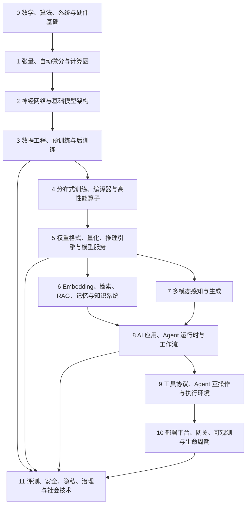

# 完整 AI 技术路线图 v1

> 项目专属要求：本路线图是 `github-project-radar` 的长期核心资产，不是一次性学习清单。  
> 版本：v1  
> 日期：2026-07-13  
> 作用：确定 AI 技术之间的依赖关系、官方开源项目坐标、当前研究覆盖状态和后续深挖顺序。  
> 状态标记：`◆ 已源码级深挖`、`◐ 已完成官方版图`、`○ 待系统研究`。

## 一、路线图总览

路线图不把“会调用模型 API”视为掌握 AI 技术。一个完整理解路径需要回答五类问题：模型为什么能工作；模型怎样被训练；模型怎样高效运行；模型怎样接入数据与工具形成系统；系统怎样被评测、治理和长期维护。

## 二、路线0：数学、算法、系统与硬件基础 ○

### 数学基础

- 线性代数：向量空间、矩阵乘法、特征值、SVD、张量与 Einstein notation。
- 概率统计：条件概率、最大似然、贝叶斯、期望、方差、信息论、采样与估计。
- 微积分与优化：链式法则、梯度、Jacobian/Hessian、SGD、Adam、约束优化。
- 数值计算：浮点数、误差传播、稳定 softmax、归一化、混合精度与随机舍入。

### 计算机系统

- CPU cache、SIMD、NUMA、内存映射、虚拟内存和文件系统。
- GPU SM、warp、thread block、shared memory、register、HBM 与 kernel launch。
- 网络：TCP/HTTP、RDMA、InfiniBand、collective communication 与 tail latency。
- 分布式系统：一致性、幂等、日志、checkpoint、leader、重试、背压与故障域。

### 代表性官方项目

- `numpy/numpy`、`scipy/scipy`：数值与科学计算。
- `llvm/llvm-project`：编译器基础设施。
- `NVIDIA/cuda-samples`、`NVIDIA/nccl`：GPU 与通信。
- `apache/arrow`：跨语言列式内存。

### 完成标准

能从矩阵乘法解释 Transformer 主要计算量；能区分算力、显存容量、显存带宽和网络带宽瓶颈；能说明为什么数值精度、数据布局和通信拓扑会改变训练/推理结果。

## 三、路线1：张量、自动微分与计算图 ◐

### 核心技术

- Tensor shape、stride、view、contiguous 与 broadcasting。
- eager execution、static graph、tracing 与 graph capture。
- reverse-mode autodiff、saved tensors、gradient accumulation。
- operator dispatch、device backend、custom op 与 extension。
- graph rewrite、operator fusion、ahead-of-time 与 JIT compilation。

### 官方项目坐标

- `pytorch/pytorch`：动态图、ATen、autograd、dispatcher、distributed、Inductor。
- `jax-ml/jax`：函数变换、XLA、JIT、grad、vmap 与 sharding。
- `tensorflow/tensorflow`：图执行、XLA、SavedModel 与生产生态。
- `microsoft/onnxruntime`：跨框架计算图与 Execution Provider。

### 后续深挖任务

1. 追踪一次 PyTorch forward/backward 从 Python API 到 ATen/CUDA kernel。
2. 比较 TorchDynamo/Inductor、JAX/XLA 和 ONNX Runtime 的图边界。
3. 实验动态 shape、graph break 和 custom op 对编译效果的影响。

## 四、路线2：神经网络与基础模型架构 ◐

### 基础结构

- MLP、CNN、RNN/LSTM、normalization、residual connection。
- Transformer：token embedding、position encoding、attention、MLP、residual stream。
- Encoder、decoder、encoder-decoder 与 multimodal fusion。
- Dense、Mixture-of-Experts、state-space model、linear attention。
- Autoregressive、masked modeling、contrastive learning、diffusion 与 flow matching。

### LLM 必须理解的细节

- tokenizer 与 vocabulary；BPE/SentencePiece；special token 与 chat template。
- RoPE/ALiBi 等位置机制与长上下文扩展。
- MHA、MQA、GQA、KV cache 与 speculative decoding。
- Dense FFN、SwiGLU、MoE router、expert capacity 与负载均衡。
- sampling：greedy、temperature、top-k、top-p、typical、grammar constrained decoding。

### 官方项目坐标

- `huggingface/transformers`：模型实现与 checkpoint/config/tokenizer 生态。
- `huggingface/pytorch-image-models`：视觉 backbone。
- `huggingface/diffusers`：扩散与 flow matching pipeline。
- `openai/whisper`、`mlfoundations/open_clip`、`facebookresearch/segment-anything`：语音、图文与视觉分割。

### 完成标准

能从输入 token 追踪到 logits；能解释训练与自回归推理计算差异；能判断一个新模型发布需要推理引擎适配哪些 config、tokenizer、kernel 和停止条件。

## 五、路线3：数据工程、预训练与后训练 ◐

### 数据生命周期

1. 来源与许可：网页、代码、书籍、论文、合成数据、多模态数据。
2. 抽取与规范化：格式解析、语言识别、编码、文档边界。
3. 质量与安全：分类、PII、毒性、版权、污染、恶意内容。
4. 去重：exact hash、MinHash、LSH、embedding-based dedup。
5. 混合与采样：domain weights、curriculum、sequence packing。
6. 版本与 lineage：数据快照、处理代码、过滤规则与审计。

### 训练阶段

- Pretraining：next-token、masked、contrastive 或 diffusion objective。
- Supervised fine-tuning：instruction、dialogue、tool use 与格式遵循。
- Preference optimization：RLHF、RLAIF、DPO/IPO/ORPO 类方法。
- Reinforcement learning：reward model、verifiable reward、rollout 与 policy update。
- Distillation：logit、sequence、feature 与 synthetic trajectory distillation。

### 官方项目坐标

- `apache/arrow`、`apache/parquet-format`：内存与磁盘格式。
- `huggingface/datasets`：数据加载、缓存、流式与处理。
- `NVIDIA-NeMo/Curator`：大规模清洗、去重与多模态管线。
- `iterative/dvc`、`treeverse/lakeFS`：数据与产物版本。
- `huggingface/trl`：Transformer reinforcement learning/post-training。

### 后续深挖任务

- 冷存并拆解 NeMo Curator 的 Ray pipeline、去重和分类模块。
- 建立数据来源—过滤—版本—训练 checkpoint 的可追踪样例。
- 对比 SFT、DPO 与 RL 的数据结构和优化目标。

## 六、路线4：分布式训练、编译器与高性能算子 ◐

### 多维并行

- Data Parallel / DDP：模型复制，梯度同步。
- FSDP / ZeRO：参数、梯度、optimizer state 分片。
- Tensor Parallel：层内矩阵切分。
- Pipeline Parallel：层间 stage 与 micro-batch。
- Expert Parallel：MoE experts 分布与 all-to-all。
- Context/Sequence Parallel：长序列维度切分。

### 性能技术

- activation checkpointing、gradient accumulation、mixed precision。
- fused optimizer、fused norm/MLP/attention。
- overlap communication and computation。
- distributed checkpoint、elastic restart、straggler detection。
- MFU、通信比例、bubble、memory fragmentation 与 profiler。

### 官方项目坐标

- `NVIDIA/Megatron-LM`：多维并行与 Megatron Core。
- `deepspeedai/DeepSpeed`：ZeRO、offload、MoE 和训练优化。
- `pytorch/torchtitan`：PyTorch 原生大模型训练。
- `triton-lang/triton`：GPU kernel 语言与编译器。
- `NVIDIA/cutlass`、`Dao-AILab/flash-attention`、`facebookresearch/xformers`：高性能算子。
- `NVIDIA/nccl`：GPU 集合通信。

### 完成标准

能为给定模型规模、序列长度和集群拓扑选择并行组合；能估算参数、梯度、optimizer、activation 和 KV cache 内存；能用 profiler 判断瓶颈在 kernel、HBM、通信还是 pipeline bubble。

## 七、路线5：权重格式、量化、推理引擎与模型服务 ◐

### 权重与量化

- SafeTensors、GGUF、ONNX、TensorRT engine 与原生 framework checkpoint。
- FP32/TF32/FP16/BF16/FP8/FP4、INT8/INT4 与更低位权重量化。
- PTQ、QAT、GPTQ、AWQ、SmoothQuant、KV cache quantization。
- Calibration、group size、scale/zero point 与 outlier handling。

### 推理执行

- Prefill 与 decode 分离。
- KV cache 分配、分页、共享与回收。
- Continuous batching、chunked prefill 与 request scheduling。
- Prefix caching、speculative decoding、structured generation。
- Tensor/pipeline/data/expert parallel inference。
- TTFT、TPOT/ITL、throughput、P50/P95/P99 与 cost/token。

### 官方项目坐标

- `vllm-project/vllm`：PagedAttention、continuous batching 与大规模 LLM serving。
- `sgl-project/sglang`：RadixAttention、structured generation 与 serving runtime。
- `NVIDIA/TensorRT-LLM`：NVIDIA GPU 图与 kernel 优化。
- `triton-inference-server/server`：通用模型服务与 backend。
- `ggml-org/llama.cpp`：GGUF、量化和跨硬件本地推理。
- `microsoft/onnxruntime`：多 Execution Provider 图运行。

### 后续深挖任务

1. 冷存 vLLM、SGLang、TensorRT-LLM、llama.cpp。
2. 用同一模型/硬件/请求分布比较 TTFT、ITL、吞吐、显存和质量。
3. 追踪一次请求从 HTTP parser 到 scheduler、batch、kernel、stream response。

## 八、路线6：Embedding、检索、RAG、记忆与知识系统 ◐

### 核心链路

文档解析 → chunking → metadata → embedding → index → query transformation → candidate retrieval → filter → hybrid fusion → rerank → context packing → generation → citation/evidence。

### 索引技术

- Exact flat search。
- IVF、Product Quantization、HNSW、DiskANN。
- Dense、sparse、BM25 与 learned sparse retrieval。
- Cross-encoder/late-interaction reranking。
- metadata filtering、multi-tenancy、update/delete 与 consistency。

### 官方项目坐标

- `facebookresearch/faiss`：ANN 算法库。
- `milvus-io/milvus`：云原生分布式向量数据库。
- `qdrant/qdrant`：Rust 向量数据库与 payload filtering。
- `pgvector/pgvector`：PostgreSQL 向量类型与索引。
- `elastic/elasticsearch`、`opensearch-project/OpenSearch`：倒排、向量与混合检索。

### 记忆系统分层

- Working memory：当前 prompt/context。
- Episodic memory：事件、会话与轨迹。
- Semantic memory：抽取后的稳定知识。
- Procedural memory：技能、工具和策略。
- Profile/preference：用户明确偏好与授权边界。

### 完成标准

能用 recall@k、MRR、nDCG、faithfulness 和 answer correctness 分离评估 retrieval 与 generation；能说明向量库不等于完整记忆系统。

## 九、路线7：多模态感知与生成 ◐

### 技术分支

- Vision encoder、image tokenizer、ViT 与 object/region feature。
- Speech recognition、TTS、audio codec 与 streaming audio。
- Vision-language model、cross-attention 与 multimodal projector。
- Diffusion/DiT、VAE、scheduler、flow matching。
- Video temporal modeling、3D/4D representation 与 world model。
- Robotics/VLA：视觉—语言—动作序列和控制闭环。

### 官方项目坐标

- `openai/whisper`：多语种语音识别与翻译。
- `facebookresearch/segment-anything`：可提示分割。
- `mlfoundations/open_clip`：图文 embedding。
- `huggingface/diffusers`：图像、视频、音频生成 pipeline。
- `facebookresearch/audiocraft`：音频生成与 codec 研究。
- `OpenDriveLab/UniAD` 等研究项目：自动驾驶/世界模型方向，仅在对应原始团队材料下纳入。

### 后续深挖任务

分别建立文本、图像、音频、视频的“数据—模型—推理—评测”子路线，不把多模态简化为把图片塞进聊天 API。

## 十、路线8：AI 应用、Agent 运行时与工作流 ◆/◐

### 已完成深挖

- ◆ `openai/openai-agents-python`：Agent、Runner、tools、handoff、guardrail、session、tracing、sandbox。
- ◐ `google/adk-python`：Agent/Workflow、Task API、图运行时。
- ◐ `microsoft/agent-framework`：双语言 runtime、middleware、workflow、checkpoint、OpenTelemetry。
- ◐ `langchain-ai/langgraph`：state graph、durable execution、HITL 与 memory。

### 核心研究问题

- loop termination、max turns 与 error recovery。
- tool schema、tool choice、parallel tool use 与副作用幂等。
- handoff、Agent-as-tool、supervisor 与 decentralized coordination。
- session、checkpoint、event log 与长期 memory。
- human approval、interrupt/resume 与跨进程恢复。
- trajectory evaluation、cost、latency 与 observability。

## 十一、路线9：工具协议、Agent 互操作与执行环境 ◆

### 已完成深挖

- ◆ `modelcontextprotocol/modelcontextprotocol`：Host/Client/Server、tools/resources/prompts、sampling、roots、elicitation、tasks、OAuth 与 transports。
- ◆ `a2aproject/A2A`：Agent Card、Message、Part、Artifact、Task、stream/push、多 binding、认证与发现。

### 执行环境

- sandbox/container/microVM、filesystem overlay、network policy。
- browser automation、computer use、terminal 与 code execution。
- credential broker、secret injection、resource quota 与 artifact export。
- supply-chain、MCP server trust 与 remote agent identity。

### 官方项目坐标

- `OpenHands/software-agent-sdk`：software-agent runtime。
- `firecracker-microvm/firecracker`：microVM 隔离。
- `containers/gvisor`：用户态 kernel sandbox。
- `microsoft/playwright`：浏览器自动化。

## 十二、路线10：部署平台、网关、可观测与生命周期 ◐

### 服务化

- Kubernetes、container、service discovery、autoscaling 与 scheduling。
- model runtime、GPU allocation、multi-node gang scheduling。
- rolling/canary/shadow deployment 与 rollback。
- cache、queue、backpressure、rate limit 与 circuit breaker。

### 官方项目坐标

- `kserve/kserve`：Kubernetes 模型推理 CRD 与 autoscaling。
- `kubeflow/*`：训练、pipeline、serving 与平台组件。
- `ray-project/ray`：分布式 task/actor、Train、Data、Serve。
- `mlflow/mlflow`：实验、artifact、registry、eval、tracing 与部署。
- `open-telemetry/*`：trace、metric、log 与 collector。
- `BerriAI/litellm`、`EnvoyProxy/ai-gateway`：模型网关与策略入口。

### 核心 SLO

- Availability、TTFT、ITL、end-to-end latency。
- token throughput、GPU utilization、queue delay。
- cost per request/token/task。
- error、retry、fallback、cache hit。
- quality regression、safety violation 与 drift。

## 十三、路线11：评测、安全、隐私、治理与社会技术 ◐

### 模型评测

- capability benchmark、calibration、robustness、bias、multilingual。
- contamination、prompt sensitivity、sampling variance。
- static benchmark 与 dynamic/interactive benchmark。

### 系统与 Agent 评测

- outcome、trajectory、tool choice、argument、side effect。
- retrieval、citation、faithfulness 与 knowledge freshness。
- latency、cost、recovery、approval burden 与 user trust。

### 安全

- prompt injection、jailbreak、data exfiltration、model extraction。
- RAG poisoning、tool abuse、confused deputy、cross-agent trust。
- sandbox escape、secret leakage、dependency/supply-chain。
- adversarial examples、backdoor 与 model/data provenance。

### 隐私与治理

- differential privacy、federated learning、secure aggregation。
- data minimization、retention、consent、deletion 与 audit。
- model card、system card、risk register、incident response。
- licensing、copyright、export control 与 sector regulation。

### 官方项目坐标

- `EleutherAI/lm-evaluation-harness`、`stanford-crfm/helm`、`openai/evals`。
- `NVIDIA/garak`、`Azure/PyRIT`。
- `pytorch/opacus`、`google-parfait/tensorflow-privacy`。
- `open-telemetry/semantic-conventions`。

## 十四、四条并行研究主线

为了避免路线图变成只能从头走到尾的清单，本项目后续按四条主线并行维护。

### A. 模型与训练线

PyTorch/JAX → Transformer/多模态 → 数据 → 后训练 → 分布式训练 → checkpoint/评测。

### B. 推理与系统线

GPU/编译器 → kernel → 量化/格式 → inference runtime → serving → Kubernetes/网关/观测。

### C. 知识与应用线

Embedding → vector/hybrid retrieval → RAG → memory → Agent runtime → MCP/A2A → sandbox。

### D. 可信 AI 线

数据治理 → benchmark → tracing → red team → privacy → authorization → incident/审计。

每个新发现项目必须归入至少一个主线和一个明确层级；无法归类的项目默认不进入核心路线，先放探索区。

## 十五、项目雷达的路线图归档字段

以后评分卡和每日记录应逐步增加：

- `technology_layers`：所属层级，可多选。
- `research_track`：模型训练、推理系统、知识应用、可信AI。
- `upstream_dependencies`：直接依赖的关键项目/标准。
- `downstream_consumers`：主要被哪些系统使用。
- `core_mechanisms`：最多五个底层机制。
- `official_authority`：基金会、公司、原始研究团队或社区治理。
- `maturity`：实验、开发、稳定、生产广泛使用、维护/迁移。
- `roadmap_status`：已深挖、已建图、待研究。
- `next_research_question`：下一步必须回答的问题。

## 十六、未来六个研究批次

### 批次1：推理系统

深挖 vLLM、SGLang、TensorRT-LLM、llama.cpp；统一测试 prefill/decode、缓存、量化和调度。

### 批次2：训练系统

深挖 TorchTitan、Megatron Core、DeepSpeed；建立多维并行和显存模型。

### 批次3：数据系统

深挖 Arrow、Datasets、NeMo Curator；建立来源、去重、过滤和 lineage 样例。

### 批次4：检索系统

深挖 FAISS、Milvus、Qdrant、pgvector 与 Elasticsearch；统一 ANN、filter、hybrid、rerank 评测。

### 批次5：AI 平台

深挖 Ray、KServe、Kubeflow、MLflow、OpenTelemetry；绘制训练—发布—服务—观测链。

### 批次6：可信 AI

深挖 lm-eval、HELM、OpenAI Evals、garak、PyRIT、Opacus；建立质量、安全和隐私的分层测试矩阵。

## 十七、路线图维护规则

1. 任何“当前主流”判断都必须有日期和官方来源。
2. 项目停止维护、迁移组织或被替代时不删除，标记生命周期与替代路径。
3. 规范、SDK 和第三方实现分开记录。
4. 模型 benchmark、系统 benchmark 和社区体验分开记录。
5. 未冷存的项目只能标记“已建图”，不能标记“源码级深挖”。
6. 每次重大更新创建新版本，保留版本说明，不覆盖历史路线图。
7. 每月汇总新增节点、状态变化、淘汰项目和未解决问题。

